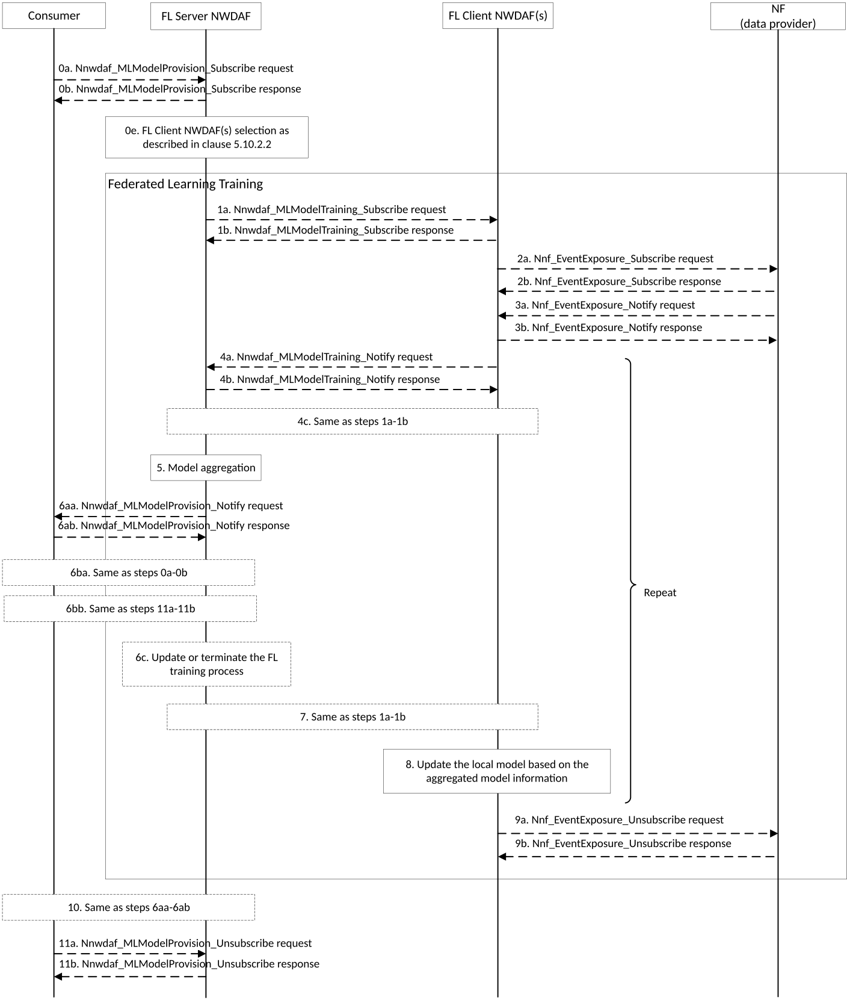
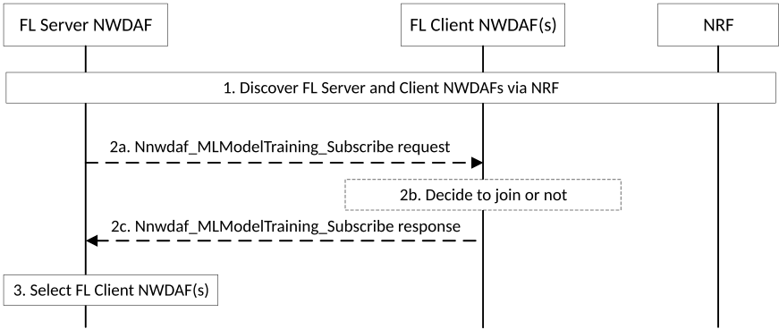
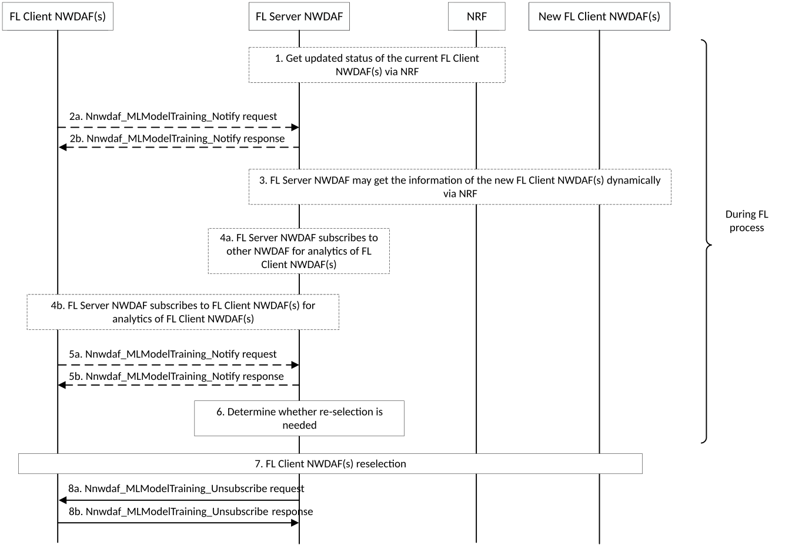

# 5.10 Federated Learning among Multiple NWDAFs

## 5.10.1 General

The NWDAF containing MTLF can leverage Federated Learning (FL) technique to train an ML model. To apply FL technique for ML model training, there is no need for input data transfer (e.g. centralized into one NWDAF) but only need for cooperation among multiple NWDAFs (MTLF) distributed in different areas, i.e. sharing of ML model(s) and of the learning results among multiple NWDAFs (MTLF).

The NWDAF containing MTLF determines to train an ML model either based on local configuration or when it receives the request from NWDAF containing AnLF as described in clause 5.3 of 3GPP TS 23.288 \[17\]. If the NWDAF containing MTLF can act as an FL server for the ML model training, then FL procedure is initiated by the NWDAF containing MTLF as FL server NWDAF directly, otherwise, the NWDAF containing MTLF should discover an FL server NWDAF as described in clause 5.3.2.2 of 3GPP TS 29.510 \[26\] and request the FL server NWDAF to provide the trained ML model as described in clause 5.10.2.1.

## 5.10.2 Procedures related to Federated Learning

### 5.10.2.1 General Procedure for Federated Learning among Multiple NWDAF Instances

This procedure is used by the NWDAF containing MTLF (FL Server NWDAF) to trigger FL among multiple NWDAF instances, by the multiple NWDAF containing MTLF (the FL Server NWDAF and FL Client NWDAF(s)) to execute Federated Learning in FL execution phase.

Figure 5.10.2.1-1: General procedure for FL among Multiple NWDAF

0a-0b. To send a request for ML model analytics events subscription to the NWDAF containing MTLF (the FL Server NWDAF), the NWDAF service consumer (NWDAF containing AnLF or NWDAF containing MTLF) invokes the Nnwdaf_MLModelProvision_Subscribe service operation by sending an HTTP POST request targeting the resource "NWDAF ML Model Provision Subscriptions".

The FL Server NWDAF responses to the Nnwdaf_MLModelProvision_Subscribe service operation. Upon receipt of the HTTP POST request, if the subscription is accepted to be created, the FL Server NWDAF responds to the NWDAF service consumer with "201 Created", and the URI of the created subscription is included in the Location header field. Details are described in clause 4.5.2.2 of 3GPP TS 29.520 \[5\].

NOTE 1: The ML model accuracy threshold can be used to indicate the target ML Model Accuracy of the training process, and the FL Server NWDAF may stop the training process when the ML model accuracy threshold is achieved during the training process.

If the consumer (i.e. the NWDAF containing AnLF or NWDAF containing MTLF) provides the Time when the ML model is needed, the FL Server NWDAF can take this information into account to decide the maximum response time for its FL Client NWDAFs.

0e. The FL Server NWDAF selects NWDAF(s) containing MTLF (FL Client NWDAF(s)) as described in clause 5.10.2.2.

1a-1b. To request the selected NWDAF containing MTLF (the FL Client NWDAF) to perform the local model training, the FL Server NWDAF may invoke Nnwdaf_MLModelTraining_Subscribe service operation by sending an HTTP POST request targeting the resource "NWDAF ML Model Training Subscriptions". The FL Client NWDAF responses to the Nnwdaf_MLModelTraining_Subscribe service operation with an HTTP "201 Created" status code to the FL Server NWDAF, as defined in clause 4.6.2.2 of 3GPP TS 29.520 \[5\].

2a-2b. To subscribe to notification (or to modify subscriptions to notifications) of data events from the data source NF, each FL Client NWDAF may invoke the Nnf_EventExposure_Subscribe service operation by sending an HTTP POST (or PUT, for modification) request targeting the resource representing event exposure subscriptions of that NF.

The data source NF responds to the Nnf_EventExposure_Subscribe service operation. Upon receipt of the HTTP POST request, if the subscription is accepted to be created, the NF responds to the FL Client NWDAF with "201 Created", and the URI of the created subscription is included in the Location header field.

3a-3b. If the data source NF observes the subscribed event(s), the NF invokes the Nnf_EventExposure_Notify service operation to report the event(s) by sending an HTTP POST request.

On success, the FL Client NWDAF sends an HTTP "204 No Content" response to the NF.

4\. During FL training process, each FL Client NWDAF further trains the retrieved ML model from the FL Server NWDAF based on its own/collected data, and reports interim local ML model information to the FL Server NWDAF before the maximum response time elapses. Each FL Client NWDAF also computes local model metric and reports it to the FL Server NWDAF. The ML model information are exchanged between the FL Client NWDAF(s) and the FL Server NWDAF during the FL training process.

4a-4b. To report the ML model training information, the FL Client NWDAF may invoke Nnwdaf_MLModelTraining_Notify service operation as defined in clause 4.6.2.4 of 3GPP TS 29.520 \[5\]. The FL Server NWDAF stores the notification and responds to the Nnwdaf_MLModelTraining_Notify service operation with an HTTP "204 No Content" status code to the FL Client NWDAF.

4c. \[Optional\] If FL Server NWDAF receives notification that the FL Client NWDAF is not able to complete the training within the maximum response time, the FL Server NWDAF may send to the FL Client NWDAF an new maximum response time by invoking Nnwdaf_MLModelTraining_Subscribe, before which the FL Client NWDAF shall report the interim local ML model information to the FL Server NWDAF. Otherwise, the FL Server NWDAF may indicate FL Client NWDAF to skip reporting for this iteration.

5\. The FL Server NWDAF aggregates all the local ML model information retrieved at step 4, to update the global ML model. The FL Server NWDAF may also compute the global model metric.

\- If the FL Server NWDAF provides the maximum response time for the FL Client NWDAFs to provide the interim local ML model information in step 1 or the new maximum response time in step 4, the FL Server NWDAF decides either to wait for the FL Client NWDAFs which have not yet provided their interim local ML model within the new maximum response time or to aggregate only the retrieved local ML model information instances to update global ML model. The FL Server NWDAF makes this decision, considering the notification from the FL Client NWDAF or, if the notification is not received, based on local configuration.

6a. \[Optional\] Based on the NWDAF service consumer request, the FL Server NWDAF updates the global ML model metric to the NWDAF service consumer periodically or dynamically when some pre-determined status (e.g. ML model accuracy threshold) is achieved.

6aa-6ab. To report the ML model training information, the FL Server NWDAF invokes Nnwdaf_MLModelProvision_Notify service operation as defined in clause 4.5.2.4 of 3GPP TS 29.520 \[5\]. The NWDAF service consumer stores the notification and responds to the Nnwdaf_MLModelProvision_Notify service operation with an HTTP "204 No Content" status code to the FL Server NWDAF.

6b. \[Optional\] The NWDAF service consumer decides whether the current model can fulfil the requirement. The NWDAF service consumer modifies subscription (stops or continues the training process) according to the NWDAF service consumer decision.

6ba. To modify the existing subscription, the NWDAF service consumer invokes Nnwdaf_MLModelProvision_Subscribe service operation by sending an HTTP PUT request with Resource URI of the resource "Individual NWDAF ML Model Provision Subscription". The FL Server NWDAF responds to the NWDAF service consumer with an HTTP "200 OK" or "204 No Content" status code, as defined in clause 4.5.2.2.3 of 3GPP TS 29.520 \[5\].

6bb. To unsubscribe the ML model, the NWDAF service consumer invokes Nnwdaf_MLModelProvision_Unsubscribe service operation by sending an HTTP DELETE request which targets the resource "Individual NWDAF ML Model Provision Subscription", to the FL Server NWDAF, as defined in clause 4.5.2.3 of 3GPP TS 29.520 \[5\]. If the request is accepted, the FL Server NWDAF deletes the subscription and responds to the NWDAF service consumer with an HTTP "204 No Content" message.

6c. \[Optional\] According to the request from the NWDAF service consumer, the FL Server NWDAF updates or terminates the current FL training process. If it terminates the current FL training process, steps 7 and 8 are skipped.

7\. If the FL procedure continues, the FL Server NWDAF sends the aggregated ML model information to each FL Client NWDAF for next round model training.

To modify the existing subscription, the FL Server NWDAF invokes Nnwdaf_MLModelTraining_Subscribe service operation by sending an HTTP PUT request or an HTTP PATCH request with Resource URI of the resource "Individual NWDAF ML Model Training Subscription". The FL Client NWDAF responds to the FL Server NWDAF an HTTP "200 OK" or "204 No Content" status code, as defined in clauses 4.6.2.2.3 and 4.6.2.2.4 of 3GPP TS 29.520 \[5\].

8\. Each FL Client NWDAF updates its own ML model based on the aggregated ML model information distributed by the FL Server NWDAF at step 7.

NOTE 2: The steps 4-8 should be repeated until the training termination condition (e.g. maximum number of iterations, or the result of loss function is lower than a threshold) is reached.

9a-9b. To unsubscribe to the notifications of data events from the data source NF, the FL Client NWDAF invokes the Nnf_EventExposure_Unsubscribe service operation by sending an HTTP DELETE request targeting the resource that represents the previously created individual event exposure subscription.

The data source NF responds to the Nnf_EventExposure_Unsubscribe service operation. If the subscription deletion is accepted, the NF responds with "204 No Content".

10\. If the FL Server NWDAF determines that the subscribed ML model information is available, the FL Server NWDAF may invoke the Nnwdaf_MLModelProvision_Notify service operation or the Nnwdaf_MLModelTraining_Notify service operation to report the ML model information by sending an HTTP POST request to the NWDAF service consumer identified by the notification URI received during the creation/modification of the subscriptions. The NWDAF service consumer responds to the FL Server NWDAF with an HTTP "204 No Content" message.

11a-11b. To unsubscribe from the notification(s) of the ML model information, the NWDAF service consumer invokes the Nnwdaf_MLModelProvision_Unsubscribe service operation by sending an HTTP DELETE request, which targets the resource "Individual NWDAF ML Model Provision Subscription", to the FL Server NWDAF, as defined in clause 4.5.2.3 of 3GPP TS 29.520 \[5\].

If the request is accepted, the FL Server NWDAF deletes the subscription and responds to the NWDAF service consumer with an HTTP "204 No Content" message.

### 5.10.2.2 Preparation Procedure for Federated Learning

This procedure is used by the NWDAF containing MTLF (as FL Server NWDAF or FL Client NWDAF(s)) to register into NRF, discover the FL Server NWDAF and select FL Client NWDAF(s) for Federated Learning (FL).

Figure 5.10.2.2-1: Preparation procedure for Federated Learning

The NWDAF containing MTLF as FL Server NWDAF or FL Client NWDAF(s) registered to NRF its NF profiles. Details are described in clause 5.2.2.2 of 3GPP TS 29.510 \[26\].

1\. The FL Server NWDAF and FL Client NWDAF(s) are discovered via NRF. Details are described in clause 5.3.2.2 of 3GPP TS 29.510 \[26\].

2\. The Nnwdaf_MLModelTraining service may be used for the preparation information exchange between the FL Server NWDAF and the FL Client NWDAF(s).

2a. The FL Server NWDAF invokes Nnwdaf_MLModelTraining_Subscribe service operation by sending an HTTP POST request targeting the resource "NWDAF ML Model Training Subscriptions", The request shall include the "mLPreFlag" attribute and set to "true". Details are described in clause 4.6.2.2 of 3GPP TS 29.520 \[5\].

2b. The FL Client NWDAF(s) checks if it meets the ML model training requirement as described in clause 5.5.6.2.2 of 3GPP TS 29.520 \[5\] and/or can successfully download the model if the model information is provided in the request, and decides whether to join the FL process based on operator policy (e.g. pre-configured list of ML models) and/or implementation.

2c. The FL Client NWDAF responses or notifies to the Nnwdaf_MLModelTraining_Subscribe request to indicate its decision. Upon receipt of the HTTP POST request, if the preparation request is accepted, the FL Client NWDAF responds to the FL Server NWDAF with "201 Created", otherwise, responds with "403 Forbidden" as described in 3GPP TS 29.520 \[5\].

NOTE: Step 2 can be skipped if the FL Server NWDAF can decide that the FL Client NWDAF(s) supports the FL procedure to be performed, e.g. based on information acquired from previous FL procedures or from the NRF, or based on local configuration.

3\. The FL Server NWDAF determines the final list of FL Client NWDAF(s) to be involved in the FL procedures based on the information received in step 1 and other information received in step 2 (if available).

### 5.10.2.3 Procedure for Maintenance of Federated Learning Process

This procedure is used by the NWDAF containing MTLF (the FL Server NWDAF) to maintain a FL process in FL execution phase, including: the FL Server NWDAF triggers reselection, addition, or removal of FL Client NWDAF(s), discovery of new FL Client NWDAF(s) via NRF, and FL Client NWDAF(s) joins or leaves FL process dynamically.

In FL execution phase, the FL Server NWDAF monitors the status changes of FL Client NWDAF(s), and may reselect the FL Client NWDAF(s) based on the received information of status changes.

NOTE: The FL Server NWDAF checks if there is a need to carry on the FL execution phase and then reselects FL members for the next iteration if needed.

Figure 5.10.2.3-1: Procedure for Maintenance of Federated Learning Process in FL Execution Phase

The FL Server NWDAF registered to NRF by invoking the Nnrf_NFManagement_NFRegister_request service operation about the FL process, which includes Analytics ID.

1\. The FL Server NWDAF may get the updated status of the current FL Client NWDAF(s) via NRF by using the Nnrf_NFManagement service in the FL execution phase. Details are described in clauses 5.2.2.5 and 5.2.2.6 of 3GPP TS 29.510 \[26\].

2\. The current FL Client NWDAF(s) may inform the FL Server NWDAF to leave the FL process. The FL Client NWDAF(s) invokes Nnwdaf_MLModelTraining_Notify service operation by sending an HTTP POST request to the FL Server NWDAF identified by the notification URI received during the creation/modification of the subscriptions. Details are described in clause 4.6.2.4 of 3GPP TS 29.520 \[5\]. The FL Server NWDAF responds to the Nnwdaf_MLModelTraining_Notify service operation with an HTTP "204 No Content" status code to the FL Client NWDAF(s).

3\. The FL Server NWDAF may get the information of the new FL Client NWDAF(s) dynamically via NRF. Details are described in clauses 5.2.2.5 and 5.2.2.6 of 3GPP TS 29.510 \[26\].

4\. The FL Server NWDAF may subscribe to other NWDAF (Assist NWDAF) or the FL Client NWDAF(s) for analytics of the FL Client NWDAF(s), as defined in clauses 4.2.2.2 and 4.2.2.4 of 3GPP TS 29.520 \[5\].

5\. The FL Client NWDAF(s) may send Status report of FL training and Global ML Model Accuracy Information. The FL Client NWDAF(s) invokes Nnwdaf_MLModelTraining_Notify service operation to the FL Server NWDAF. The FL Server NWDAF stores the notification and responds to the Nnwdaf_MLModelTraining_Notify service operation with an HTTP "204 No Content" status code to the FL Client NWDAF(s). Details are described in clause 4.6.2.4 of 3GPP TS 29.520 \[5\].

6\. The FL Server NWDAF checks the FL Client NWDAF(s) status based on the received information, determines whether reselection of the FL Client NWDAF(s) for the next round(s) of FL is needed. The checking and determination are made according to the updated status of the FL Client NWDAF(s) received in steps 1-5.

7\. If re-selection is needed as determined in step 6 and if step 3 is not performed, the FL Server NWDAF may discover new candidate FL Client NWDAF(s) via NRF by using the Nnrf_NFDiscovery services as described in clause 5.3.2.2 of 3GPP TS 29.510 \[26\]. The FL Server NWDAF reselects the FL Client NWDAF(s) from the current FL Client NWDAF(s) and the new candidate FL Client NWDAF(s).

8\. The FL Server NWDAF sends termination request to the FL Client NWDAF(s) which will be removed from the FL process, and optionally indicating the reason. The FL Client NWDAF(s) terminates FL operations when receives a termination request from the FL Server NWDAF and may perform further action to be qualified in participation of FL training in the next cycles.

8a-8b. To send the termination request, the FL Server NWDAF may invoke the Nnwdaf_MLModelTraining_Unsubscribe service operation by sending an HTTP DELETE request, which targets the resource "Individual NWDAF ML Model Training Subscription", to the FL Client NWDAF(s). If the request is accepted, the FL Client NWDAF deletes the subscription and responds to the FL Server NWDAF service consumer with an HTTP "204 No Content" message. Details are described in clause 4.6.2.3 of 3GPP TS 29.520 \[5\].
