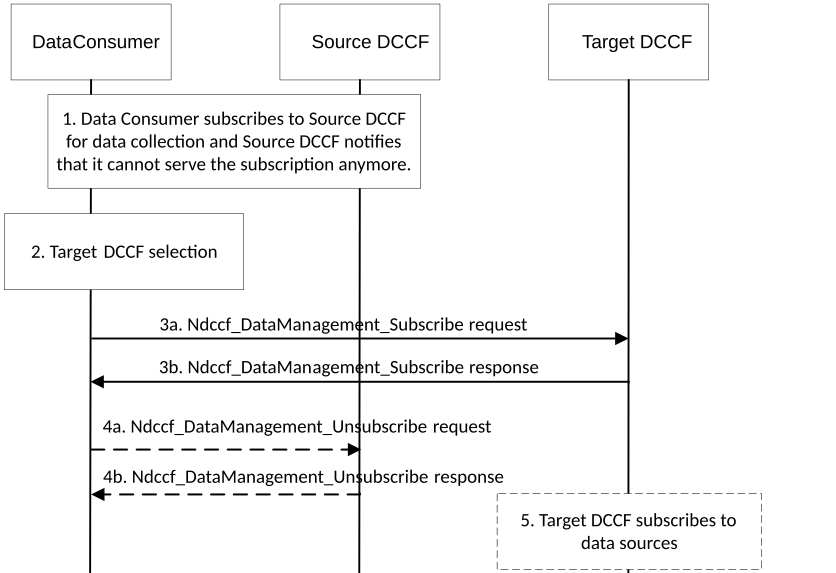

# 5.13 DCCF Change Procedures

## 5.13.1 DCCF (re-)selection initiated by the data consumer

The procedure depicted in Figure 5.13.1-1 is used by a data consumer (e.g. NWDAF or DCCF) to obtain data related to UE(s), to be notified by the DCCF when the DCCF can no longer serve the UE(s) and to then reselect the DCCF.

Figure 5.13.1-1: Procedure for DCCF relocation initiated by consumer

1\. The data consumer subscribes to the source DCCF for data collection as described in clause 5.5.3 and the data consumer may receive a Ndccf_DataManagement_Notify message from the source DCCF containing a subscription termination request as described in 3GPP TS 29.574 \[15\].

2\. The data consumer for the DCCF selects a new DCCF instance. The data consumer may perform the DCCF selection due to internal triggers, the reception of a notification of a UE mobility event, or the reception of the susbcription termination request in step 1.

3\. The data consumer subscribes to the target DCCF using Ndccf_DataManagement_Subscribe as described in 3GPP TS 29.574 \[15\].

4\. The data consumer may unsubscribe from the source DCCF using Ndccf_DataManagement_Unsubscribe as described in 3GPP TS 29.574 \[15\].

5\. Target DCCF may subscribe to relevant data source(s), if not yet subscribed, as described in step 6 and step 7 of clause 5.5.3.1.
