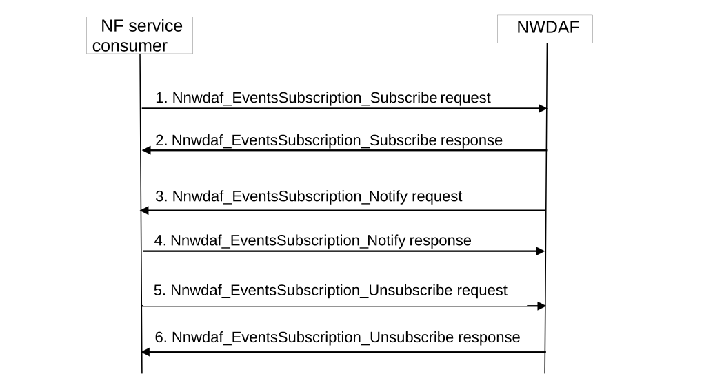
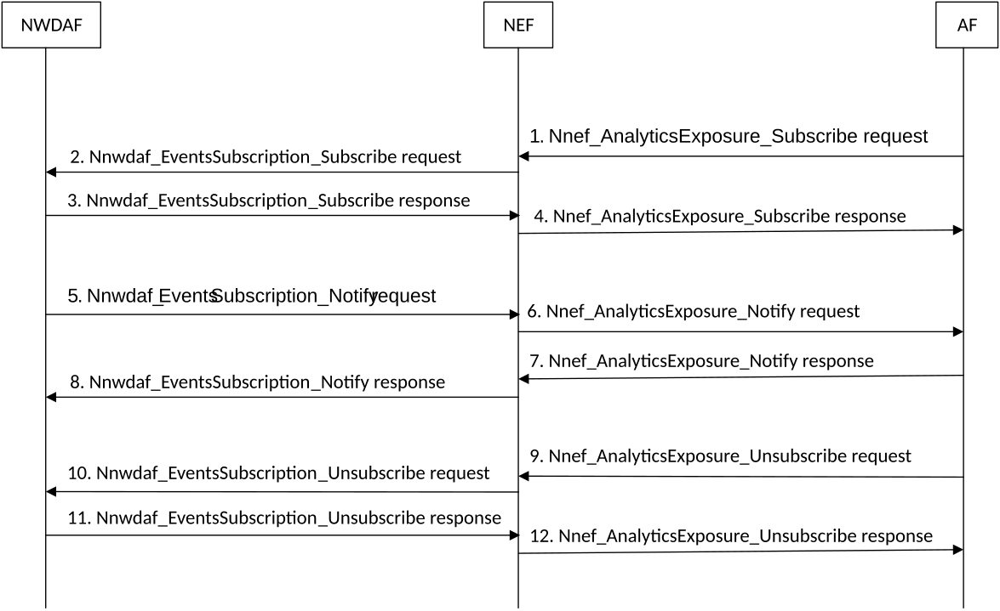

# 5.2.2 Network data analytics Subscribe/Unsubscribe/Notify

## 5.2.2.1 Analytics Subscribe/Unsubscribe/Notify initiated by 5GC NFs, OAM or AFs

This procedure is used in non-roaming case by the NF service consumers (i.e. NFs, OAM and AFs) to subscribe to/unsubscribe from analytics information directly from the NWDAF, it is also used by the NWDAF to notify the observed analytics event(s) to the NF service consumer if subscribed before.

Figure 5.2.2.1-1: Analytics Subscribe/Unsubscribe/Notify initiated by 5GC NFs, OAM or AFs

1\. In order to subscribe to notification(s) of analytics information from the NWDAF, the NF service consumer invokes Nnwdaf_EventsSubscription_Subscribe service operation by sending an HTTP POST request targeting the resource "NWDAF Events Subscriptions". The request includes the subscribed events and may include event filter information.

In order to update the existing subscription, the NF service consumer invokes Nnwdaf_EventsSubscription_Subscribe service operation by sending an HTTP PUT request with Resource URI of the resource "Individual NWDAF Event Subscription".

2\. The NWDAF responds to the Nnwdaf_EventsSubscription_Subscribe service operation. Upon receipt of the HTTP POST request, if the subscription is accepted to be created, the NWDAF responds to the NF service consumer with "201 Created", and the URI of the created subscription is included in the Location header field.

Upon receipt of the HTTP PUT request, if the subscription is accepted to be updated, the NWDAF responds to the NF service consumer with "200 OK" or "204 No Content"

3\. If the NWDAF observes the subscribed event(s), the NWDAF invokes Nnwdaf_EventsSubscription_Notify service operation to report the event(s) by sending an HTTP POST request with {notificationURI} as Notification URI.

4\. The NF service consumer sends an HTTP "204 No Content" response to the NWDAF.

5\. In order to unsubscribe to the notification(s) of analytics information from the NWDAF, the NF service consumer invokes Nnwdaf_EventsSubscription_Unsubscribe service operation by sending an HTTP DELETE request targeting the resource "Individual NWDAF Event Subscription", to the NWDAF to unsubscribe from analytics information. The request includes the event subscriptionId of the existing subscription that is to be deleted.

6\. The NWDAF responds to the Nnwdaf_EventsSubscription_Unsubscribe service operation. If the unsubscription is accepted, the NWDAF responds with "204 No Content".

NOTE: For details of Nnwdaf_EventsSubscription_Subscribe/Unsubscribe/Notify service operations refer to 3GPP TS 29.520 \[5\].

## 5.2.2.2 Analytics Subscribe/Unsubscribe/Notify initiated by AFs via the NEF

This procedure is used by the AF to subscribe to/unsubscribe from analytics information from the NWDAF via the NEF, it is also used by the NWDAF to notify the analytics event(s) to the AF via the NEF, if subscribed before.

Figure 5.2.2.2-1: Analytics Subscribe/Unsubscribe/Notify initiated by AFs via the NEF

1\. In order to subscribe to notification(s) of analytics exposure via the NEF, the AF invokes the Nnef_AnalyticsExposure_Subscribe request by sending an HTTP POST request message targeting the resource "Analytics Exposure Subscriptions" as defined in clause 4.4.14.1 of 3GPP TS 29.522 \[10\].

In order to update an existing analytics exposure subscription, the AF shall send an HTTP PUT request message to the NEF to the resource "Individual Analytics Exposure Subscription" requesting to change the subscription.

2\. Upon receipt of the HTTP request from the AF, if the AF is authorized with the requested analytics event(s) and the requested parameters comply with the inbound restriction in the analytics exposure mapping, the NEF shall invoke Nnwdaf_EventsSubscription_Subscribe service operation as described in step 1 in clause 5.2.2.1.

3\. The NWDAF responds to the Nnwdaf_EventsSubscription_Subscribe service operation as described in step 2 in clause 5.2.2.1.

4\. Upon receipt of the HTTP request response from the NWDAF, the NEF shall invoke the Nnef_AnalyticsExposure_Subscribe response message by mapping and forwarding the response to the AF.

5\. If the NWDAF observes the subscribed event(s), the NWDAF invokes Nnwdaf_EventsSubscription_Notify service operation as described in step 3 in clause 5.2.2.1 to the NEF.

6\. If the NEF receives an analytics information notification from the NWDAF indicating that the subscribed analytics event has been detected, the NEF shall invoke the Nnef_AnalyticsExposure_Notify request by sending HTTP POST request message provide a notification to the AF request including the AnalyticsEventNotification data structure at least with the detected analytics event identified by the notification URI together with the notification correlation identifier received during creation of the Individual Analytics Exposure Subscription.

7\. Upon receipt of the analytics event notification, the AF shall respond the NEF with a "204 No Content" status code to confirm the received notification in Nnef_AnalyticsExposure_Notify response message.

8\. The NEF shall forward the HTTP "204 No Content" response to the NWDAF.

9\. In order to delete an existing analytics exposure subscription, the AF shall invoke the Nnef_AnalyticsExposure_Unsubscribe request by sending an HTTP DELETE request message to the NEF to the resource "Individual Analytics Exposure Subscription".

10\. If the NEF receives an HTTP DELETE request from the AF, the NEF shall invoke the Nnwdaf_EventsSubscription_Unsubscribe service operation as described in step 5 in clause 5.2.2.1.

11\. The NWDAF responds to the Nnwdaf_EventsSubscription_Unsubscribe service operation as described in step 6 in clause 5.2.2.1.

12\. The NEF shall forward the HTTP "204 No Content" response to the AF.

NOTE: Details of AnalyticsExposure API refer to clause 4.4.14 and clause 5.6 of 3GPP TS 29.522 \[4\].
