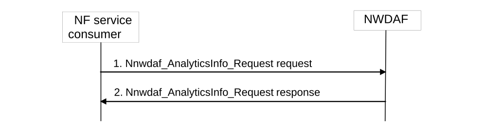
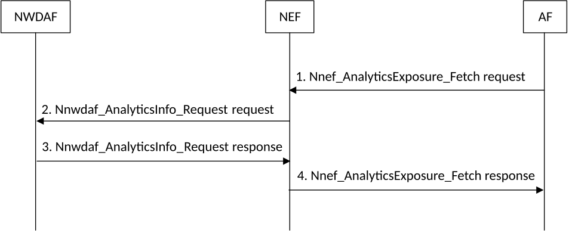

# 5.2.3 Network data analytics information request

## 5.2.3.1 Analytics information request initiated by 5GC NFs, OAM or AFs

This procedure is used in non-roaming case by the NF service consumers (i.e. 5GC NFs, OAM and AFs) to retrieve analytics information directly from the NWDAF. The analytics architecture for analytics exposure is defined in clause 4.5.

Figure 5.2.3.1-1: Network data analytics info request procedure

1\. The NF Service Consumer invokes Nnwdaf_AnalyticsInfo_Request service operation by sending an HTTP GET request targeting the resource "NWDAF Analytics", to the NWDAF to request the analytics information. The request includes analytics identifier and related event filter information.

2\. The NWDAF responds to the Nnwdaf_AnalyticsInfo_Request service operation. If the request is accepted, the response includes the requested analytics information with "200 OK".

NOTE: For details of Nnwdaf_AnalyticsInfo_Request service operation refer to 3GPP TS 29.520 \[5\].

## 5.2.3.2 Analytics information request initiated by AFs via the NEF

This procedure is used by the AFs to retrieve analytics information from the NWDAF via the NEF.

Figure 5.2.3.2-1: Analytics Request initiated by AFs via the NEF

1\. In order to fetch analytics information, the AF invoke the Nnef_AnalyticsExposure_Fetch request by sending an HTTP POST request message to the NEF to the customized operation URI "{apiRoot}/3gpp-analyticsexposure/v1/fetch" as defined in clause 4.4.14.2 of 3GPP TS 29.522 \[10\].

2\. Upon receipt of the HTTP request from the AF, if the AF is authorized with the requested analytics event(s) and the requested parameters comply with the inbound restriction in the analytics exposure mapping, the NEF shall invoke the Nnwdaf_AnalyticsInfo_Request service operation as described in step 1 in clause 5.2.3.1.

3\. The NWDAF responds with the analytics information as described in step 2 in clause 5.2.3.1 to the NEF.

4\. The NEF responds with the analytics information to the AF.

NOTE: Details of AnalyticsExposure API refer to clause 4.4.14 and clause 5.6 of 3GPP TS 29.522 \[4\].
