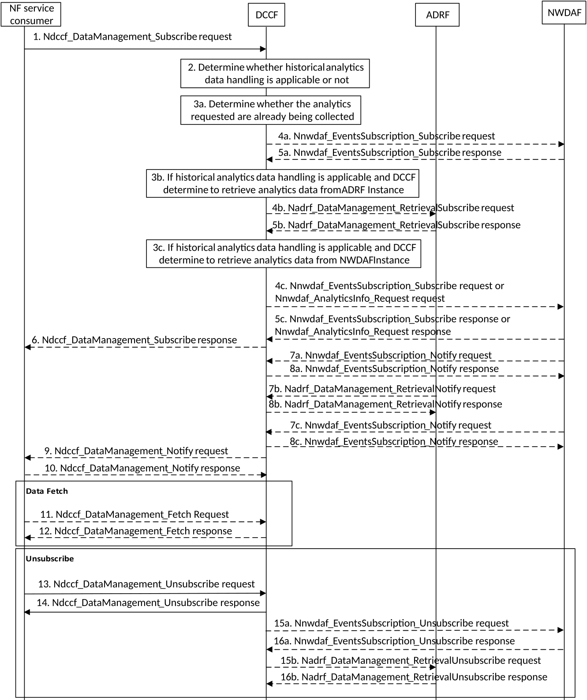

# 5.2.4 Analytics Exposure via DCCF

This procedure is used by NF service consumer(s) based on local configuration, to subscribe/unsubscribe to NWDAF analytics event(s) via the DCCF, and upon the delivery option "Delivery via DCCF" configured on the DCCF, also used by DCCF to notify the NF service consumer(s) of the analytics information via the DCCF if subscribed before.

Figure 5.2.4-1: Analytics Exposure via DCCF

1\. In order to subscribe to notification(s) of analytics exposure via the DCCF based on local configuration, the NF service consumer invokes the Ndccf_DataManagement_Subscribe service operation by sending an HTTP POST request message targeting the resource "DCCF Analytics Subscriptions", the HTTP POST message shall include the NdccfAnalyticsSubscription data structure as request body with parameters as defined in clause 5.1.6.2.2 of 3GPP TS 29.574 \[15\].

2\. The DCCF keeps track of the analytics actively being collected for the Analytics Subscription it is coordinating. The NWDAF or ADRF may register the analytics data profile (may include the analytics data related service operation, Analytics Specification, NWDAF ID or ADRF ID) with the DCCF. The DCCF may then determine whether certain historical analytics data may be available in the NWDAF or ADRF based on the analytics data profile and the request time window.

If the historical analytics data handling is not applicable or not supported, the DCCF shall proceed step 3a, skip step 3b, step 4b, step 5b, step 3c, step 4c and step 5c.

If the historical analytics data is available in an ADRF, the DCCF shall proceed step 3a and step 3b, skip step 3c, step 4c and step 5c.

If the historical analytics data is available in an NWDAF, the DCCF shall proceed step 3a and step 3c, skip step 3b, step 4b and step 5b.

3a. The DCCF shall determine whether the analytics requested are already being collected.

If the requested analytics are already being collected by an NF service consumer, the DCCF adds the new NF service consumer to the list of NF service consumers that are subscribed for these analytics.

If the DCCF cannot handle the subscription request, shall take the error handling as defined in clause 4.2.2.2.2 of 3GPP TS 29.574 \[15\]

If the DCCF determines that no subscriptions need to be created or modified (e.g. because all the data can be made available either via pre-existing subscriptions or because of the historical data handling) then step 4a and step 5a are skipped.

3aa. The DCCF may respond to the Ndccf_DataManagement_Subscribe service operation with HTTP "201 Created" status code with the message body containing a representation of the created subscription if the DCCF add the new NF service consumer to the list of NF service consumers that are subscribed, or if error case happened may respond with corresponding error information.

4a If the analytics requested at step 1 are not already available yet, the DCCF shall invoke the Nnwdaf_EventsSubscription_Subscribe service operation by sending an HTTP POST request message request to the NWDAF targeting the resource "NWDAF Events Subscriptions" to subscribe to a new analytics exposure subscription, or if the analytics subscribed in step 1 partially matches an analytics that is already being collected by the DCCF from an NWDAF, and a modification of this subscription to the NWDAF would satisfy both the existing analytics subscriptions as well as the newly requested analytics, by sending an HTTP PUT request to the resource "Individual Analytics Exposure Subscription" to replace an existing analytics exposure subscription. The request includes the subscribed event(s) and event filter information received from the NF service consumer, mapping to the parameters as defined in clause 5.1 of 3GPP TS 29.520 \[5\].

NOTE: If the NWDAF instance or NWDAF Set is not identified by the NF service consumer, the DCCF determines the NWDAF instances that can provide analytics. If the consumer requested storage of analytics in an ADRF but an ADRF ID is not provided by the NF service consumer, or the collected analytics is to be stored in an ADRF according to configuration on the DCCF, the DCCF selects an ADRF to store the collected analytics data.

5a The NWDAF responds to the Nnwdaf_EventsSubscription_Subscribe service operation.

Upon receipt of the HTTP POST request, if the subscription is accepted to be created, the NWDAF responds to the DCCF with "201 Created" status code, and the URI of the created subscription is included in the Location header field.

Upon receipt of the HTTP PUT request, if the subscription is accepted to be updated, the NWDAF responds to the DCCF with "200 OK" or "204 No Content" status code.

3b If the historical analytics data handling is applicable, and the DCCF determine to retrieve analytics data from the ADRF, the DCCF shall determine which ADRF instances might provide the analytics.

4b In order to retrieve the historical analytics data from the ADRF, the DCCF shall invoke the Nadrf_DataManagement_RetrievalSubscribe service operation by sending an HTTP POST request message targeting the resource "ADRF Data Retrieval Subscriptions", the HTTP POST message shall include the NadrfDataRetrievalSubscription data structure as request body with parameters as defined in clause 5.1.6 of 3GPP TS 29.575 \[16\].

5b The ADRF responds to the Nadrf_DataManagement_RetrievalSubscribe service operation.

Upon receipt of the HTTP POST request, if the subscription is accepted to be created, the ADRF responds to the DCCF with "201 Created" status code, and the URI of the created subscription is included in the Location header field.

3c If the historical analytics data handling is applicable, and the DCCF determine to retrieve analytics data from the NWDAF, the DCCF shall determine which NWDAF instances might provide the analytics as described and proceed step 4c.

4c In order to retrieve the historical analytics data from the NWDAF, the DCCF may invoke the Nnwdaf_EventsSubscription_Subscribe service operation by sending an HTTP POST request message targeting the resource "NWDAF Events Subscriptions", the HTTP POST message shall include the NnwdafEventsSubscription data structure as request body with parameters as defined in clause 5.1.6 of 3GPP TS 29.520 \[5\] or Nnwdaf_AnalyticsInfo_Request request by sending an HTTP GET request message targeting the resource "NWDAF Analytics" with parameters as defined in clause 5.2.3.2.3.1 of 3GPP TS 29.520 \[5\].

5c The NWDAF responds to the Nnwdaf_EventsSubscription_Subscribe or Nnwdaf_AnalyticsInfo_Request service operation.

Upon receipt of the HTTP POST request, if the subscription is accepted to be created, the NWDAF responds to the DCCF with "201 Created" status code, and the URI of the created subscription is included in the Location header field.

6\. The DCCF responds to the Ndccf_DataManagement_Subscribe service operation with HTTP "201 Created" status code with the message body containing a representation of the created subscription.

7a. (conditional)When the analytics are available, the NWDAF invokes the Nnwdaf_EventsSubscription_Notify service operation by sending an HTTP POST request message to notify the analytics information to the DCCF.

8a. The DCCF responds to the Nnwdaf_EventsSubscription_Notify service operation with HTTP "204 No Content" status code.

7b. (conditional)When the historical analytics data are available in the ADRF, the ADRF shall invoke the Nadrf_DataManagement_RetrievalNotify service operation by sending an HTTP POST request message to notify the historical analytics or Fetch Instructions to the DCCF.

8b. The DCCF responds to the Nadrf_DataManagement_RetrievalNotify service operation with HTTP "204 No Content" status code.

7c. (conditional)When the historical analytics data are available in the NWDAF, the NWDAF may invoke the Nnwdaf_EventsSubscription_Notify service operation by sending an HTTP POST request message to notify the historical analytics data to the DCCF.

8c. The DCCF responds to the Nnwdaf_EventsSubscription_Notify service operation with HTTP "204 No Content" status code.

9\. Upon the delivery option "Delivery via DCCF" configured on the DCCF. the DCCF invokes the Ndccf_DataManagement_Notify service operation by sending HTTP POST request message(s) to send the analytics data to all notification endpoints indicated in step 1. Analytics sent to notification endpoints may be processed and formatted by the DCCF so they conform to delivery requirements for each NF service consumer or notification endpoint.

NOTE: According to Formatting Instructions provided by the NF service consumer, multiple notifications from a NWDAF can be combined in a single Ndccf_DataManagement_Notify so many notifications from an NWDAF results in fewer notifications (or one notification) to the NF service consumer. Alternatively, a notification can instruct the analytics notification endpoint to fetch the analytics from the DCCF.

10\. The NF service consumer responds to the Ndccf_DataManagement_Notify service operation with HTTP "204 No Content" status code.

11\. (conditional) The NF service consumer invokes the Ndccf_DataManagement_Fetch service operation by sending an HTTP GET request message to fetch the analytics from the DCCF before an expiry time, if received the fetch instruction in NdccfDataManagement_Notify service operation in step 9.

12\. The NF service consumer responds to the Ndccf_DataManagement_Fetch service operation with HTTP "204 No Content" status code.

13\. When the NF service consumer no longer need the subscription to the analytics requested in step 1, shall invoke the Ndccf_DataManagement_Unsubscribe service operation by sending an HTTP DELETE request message with "{xxx}" as Resource URI, where "{subscriptionId}" is the event subscriptionId of the existing subscription that is to be deleted., using the Subscription Correlation Id received in response to its subscription in step 1. The DCCF removes the NF service consumer from the list of NF service consumers that are subscribed for these analytics.

14\. The DCCF responds to the Ndccf_DataManagement_Unsubscribe service operation with HTTP "204 No Content" status code, upon removed the NF service consumer from the list of NF service consumers that are subscribed for these analytics

15a. If there are no other NF service consumers subscribed to the analytics, the DCCF invokes the Nnwdaf_EventsSubscription_Unsubscribe service operation by sending an HTTP DELETE request message to the NWDAF.

16a. The NWDAF responds to the Nnwdaf_EventsSubscription_Unsubscribe service operation with HTTP "204 No Content" status code, upon the analytics event(s) subscription is removed.

15b. If DCCF determines that no other NF service consumers requiring the historical analytics data from the ADRF, the DCCF may invoke the Nadrf_DataManagement_RetrievalUnSubscribe service operation by sending an HTTP DELETE request message to the ADRF.

16b. The ADRF responds to the Nadrf_DataManagement_RetrievalUnSubscribe service operation with HTTP "204 No Content" status code, upon the analytics data retrieval subscription is removed.
