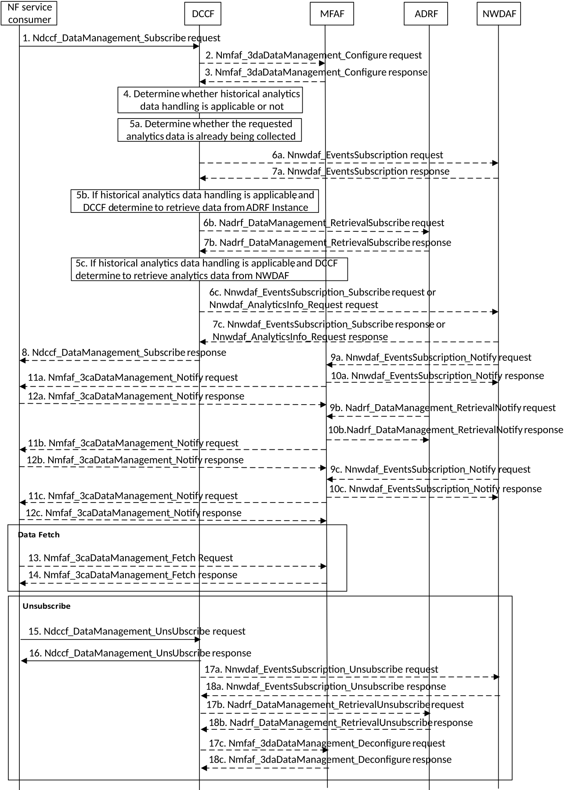

# 5.2.5 Analytics Exposure via DCCF and MFAF

This procedure is used by NF service consumer(s) based on local configuration, to subscribe/unsubscribe to NWDAF analytics event(s) via the DCCF, and upon the delivery option "Delivery via Messaging Framework " configured on the DCCF, the 3GPP DCCF Adaptor (3da) Data Management service and 3GPP Consumer Adaptor (3ca) Data Management service of the Messaging Framework Adaptor Function (MFAF) are used to interact with the 3GPP Network and the Messaging Framework for analytics information delivery to the NF service consumer(s) subscribed notification endpoint(s).

Figure 5.2.5-1: Analytics Exposure via DCCF and Messaging Framework

1\. In order to subscribe to notification(s) of analytics exposure via the DCCF based on local configuration, the NF service consumer invokes the Ndccf_DataManagement_Subscribe service operation by sending an HTTP POST request message targeting the resource "DCCF Analytics Subscriptions", the HTTP POST message shall include the NdccfAnalyticsSubscription data structure as request body with parameters as defined in clause 5.1.6.2.2 of 3GPP TS 29.574 \[15\].

2\. Upon the delivery option "Delivery via MFAF" configured on the DCCF, in order to create configuration of mapping data in the MFAF, the DCCF shall invoke the Nmfaf_3daDataManagement_Configure service operation by sending an HTTP POST request message targeting the resource "MFAF Configurations", the HTTP POST message shall include the MfafConfiguration data structure as request body with parameters as defined in clause 5.1.6 of 3GPP TS 29.576 \[17\].

3\. The MFAF responds to the Nmfaf_3daDataManagement_Configure service operation.

Upon receipt of the HTTP POST request, if the configuration is accepted to be created, the MFAF responds to the DCCF with "201 Created", and the URI of the created configuration is included in the Location header field.

4\. The DCCF keeps track of the analytics actively being collected for the Analytics Subscription it is coordinating. The NWDAF or ADRF may register the analytics data profile (may include the analytics data collection related service operation, Analytics Specification, NWDAF ID or ADRF ID) with the DCCF. The DCCF may then determine whether certain historical analytics data may be available in the NWDAF or ADRF based on the analytics data profile and the request time window.

If the historical analytics data handling is not applicable or not supported, the DCCF shall proceed step 5a, skip step 5b step 6b, step 7b, step 5c step 6c and step 7c.

If the historical analytics data is available in an ADRF, the DCCF shall proceed step 5a and step 5b, skip step 5c, step 6c and step 7c.

If the historical data is available in an NWDAF, the DCCF shall proceed step 5a and step 5c, skip step 5b, step 6b and step 7b.

5a. The DCCF shall determine whether the analytics data requested in step 1 are already being collected.

If the analytics data requested are already being collected by an NF service consumer, the DCCF adds the NF service consumer to the list of analytics consumers that are subscribed for these data.

If the DCCF cannot handle the subscription request, shall take the error handling as defined in clause 4.2.2.2.2 of 3GPP TS 29.574 \[15\]

If the DCCF determines that no subscriptions need to be created or modified (e.g. because all the data can be made available either via pre-existing subscriptions or because of the historical data handling) then step 6a and step 7a are skipped.

5aa. The DCCF may respond to the Ndccf_DataManagement_Subscribe service operation with HTTP "201 Created" status code with the message body containing a representation of the created subscription if the DCCF adds the new NF service consumer to the list of NF service consumers that are subscribed, or if error case happened may respond with corresponding error information.

6a If the requested data at step 1 are not already available yet, the DCCF shall invoke the Nnwdaf_EventsSubscription_Subscribe service operation by sending an HTTP POST request message request to the NWDAF targeting the resource "NWDAF Events Subscriptions" to subscribe to a new analytics exposure subscription, or if the analytics subscribed in step 1 partially matches an analytics that is already being collected by the DCCF from an NWDAF, and a modification of this subscription to the NWDAF would satisfy both the existing analytics subscriptions as well as the newly requested analytics, by sending an HTTP PUT request to the resource "Individual Analytics Exposure Subscription" to replace an existing analytics exposure subscription. The request includes the subscribed event(s) and event filter information received from the NF service consumer, mapping to the parameters as defined in clause 5.1 of 3GPP TS 29.520 \[5\].

NOTE 1: If the NWDAF instance or NWDAF Set is not identified by the NF service consumer, the DCCF determines the NWDAF instances that can provide analytics. If the consumer requested storage of analytics in an ADRF but an ADRF ID is not provided by the NF service consumer, or the collected analytics is to be stored in an ADRF according to configuration on the DCCF, the DCCF selects an ADRF to store the collected data.

7a The NWDAF responds to the Nnwdaf_EventsSubscription_Subscribe service operation.

Upon receipt of the HTTP POST request, if the subscription is accepted to be created, the NWDAF responds to the DCCF with "201 Created" status code, and the URI of the created subscription is included in the Location header field.

Upon receipt of the HTTP PUT request, if the subscription is accepted to be updated, the NWDAF responds to the DCCF with "200 OK" or "204 No Content" status code.

5b If the historical analytics data handling is applicable, and the DCCF determine to retrieve analytics data from the ADRF, the DCCF shall determine which ADRF instances might provide the analytics.

6b In order to retrieve the historical analytics data from the ADRF, the DCCF shall invoke the Nadrf_DataManagement_RetrievalSubscribe service operation by sending an HTTP POST request message targeting the resource "ADRF Data Retrieval Subscriptions", the HTTP POST message shall include the NadrfDataRetrievalSubscription data structure as request body with parameters as defined in clause 5.1.6 of 3GPP TS 29.575 \[16\].

7b The ADRF responds to the Nadrf_DataManagement_RetrievalSubscribe service operation.

Upon receipt of the HTTP POST request, if the subscription is accepted to be created, the ADRF responds to the DCCF with "201 Created" status code, and the URI of the created subscription is included in the Location header field.

5c If the historical data handling is applicable, and the DCCF determines to retrieve analytics data from the NWDAF, the DCCF shall determine which NWDAF instances might provide the analytics as described and proceed step 6c.

6c In order to retrieve the historical analytics data from the NWDAF, the DCCF may invoke the Nnwdaf_EventsSubscription_Subscribe service operation by sending an HTTP POST request message targeting the resource "NWDAF Events Subscriptions", the HTTP POST message shall include the NnwdafEventsSubscription data structure as request body with parameters as defined in clause 5.1.6 of 3GPP TS 29.520 \[5\] or Nnwdaf_AnalyticsInfo_Request request by sending an HTTP GET request message targeting the resource "NWDAF Analytics" with parameters as defined in clause 5.2.3.2.3.1 of 3GPP TS 29.520 \[5\].

7c The NWDAF responds to the Nnwdaf_EventsSubscription_Subscribe or Nnwdaf_AnalyticsInfo_Request service operation.

Upon receipt of the HTTP POST request, if the subscription is accepted to be created, the NWDAF responds to the DCCF with "201 Created", and the URI of the created subscription is included in the Location header field.

8\. The DCCF responds to the Ndccf_DataManagement_Subscribe service operation with HTTP "201 Created" status code with the message body containing a representation of the created subscription.

9a. (conditional)When the analytics are available, the NWDAF invokes the Nnwdaf_EventsSubscription_Notify service operation by sending an HTTP POST request message to notify the analytics information to the MFAF.

10a. The MFAF responds to the Nnwdaf_EventsSubscription_Notify service operation with HTTP "204 No Content" status code.

11a. The MFAF invokes the Nmfaf_3caDataManagement_Notify service operation by sending HTTP POST request message(s) to send the analytics data to all notification endpoints indicated in step 1. Analytics data sent to notification endpoints may be processed and formatted by the MFAF so that they conform to delivery requirements for each NF service consumer and/or notification endpoint.

NOTE 2: According to Formatting Instructions provided by the NF service consumer, multiple notifications from the NWDAF can be combined in a single Nmfaf_3caDataManagement_Notify so that many notifications from an NWDAF result in fewer notifications (or one notification) to the NF service consumer and/or the subscribed notification endpoint(s). Alternatively, a notification can instruct the analytics data notification endpoint to fetch the analytics data from the MFAF.

12a.The NF service consumer responds to the Nmfaf_3caDataManagement_Notify service operation with HTTP "204 No Content" status code.

9b. (conditional)When the historical analytics data are available in the ADRF, the ADRF shall invoke the Nadrf_DataManagement_RetrievalNotify service operation by sending an HTTP POST request message to notify the historical analytics or Fetch Instructions to the MFAF.

10b. The MFAF responds to the Nadrf_DataManagement_RetrievalNotify service operation with HTTP "204 No Content" status code.

11b. The MFAF invokes the Nmfaf_3caDataManagement_Notify service operation by sending HTTP POST request message(s) to send the analytics data to all notification endpoints indicated in step 1. Analytics data sent to notification endpoints may be processed and formatted by the MFAF so that they conform to delivery requirements for each NF service consumer or notification endpoint.

NOTE 3: According to Formatting Instructions provided by the NF service consumer, multiple notifications from an ADRF can be combined in a single Nmfaf_3caDataManagement_Notify so many notifications from an ADRF results in fewer notifications (or one notification) to the NF service consumer and/or the subscribed notification endpoint(s). Alternatively, a notification can instruct the analytics data notification endpoint to fetch the analytics data from the MFAF.

12b.The NF service consumer responds to the Nmfaf_3caDataManagement_Notify service operation with HTTP "204 No Content" status code.

9c. (conditional)When the historical analytics data are available in the NWDAF, the NWDAF may invoke the Nnwdaf_EventsSubscription_Notify service operation by sending an HTTP POST request message to notify the historical analytics data to the MFAF.

10c. The MFAF responds to the Nnwdaf_EventsSubscription_Notify service operation with HTTP "204 No Content" status code.

11c. The MFAF invokes the Nmfaf_3caDataManagement_Notify service operation by sending HTTP POST request message(s) to send the analytics data to all notification endpoints indicated in step 1. Analytics data sent to notification endpoints may be processed and formatted by the MFAF so they conform to delivery requirements for each NF service consumer or notification endpoint.

NOTE 4: According to Formatting Instructions provided by the NF service consumer, multiple notifications from a NWDAF can be combined in a single Nmfaf_3caDataManagement_Notify so many notifications from an NWDAF results in fewer notifications (or one notification) to the NF service consumer and/or the subscribed notification endpoint(s). Alternatively, a notification can instruct the analytics data notification endpoint to fetch the analytics data from the MFAF.

12c. The NF service consumer responds to the Nmfaf_3caDataManagement_Notify service operation with HTTP "204 No Content" status code.

13\. (conditional) The NF service consumer invoke the Nmfaf_3caDataManagement_Fetch service operation by sending an HTTP GET request message to fetch the data from the MFAF before an expiry time, if received the fetch instruction in Nmfaf_3caDataManagement_Notify service operation in step 11a, step 11b or step 11c.

14\. The MFAF responds to the Nmfaf_3caDataManagement_Fetch service operation with HTTP "200 OK" status code with the message body containing the NmfafResourceRecord data structure.

15\. When the NF service consumer no longer need the subscription to the requested data in step 1, shall invoke the Ndccf_DataManagement_Unsubscribe service operation by sending an HTTP DELETE request message with "{apiRoot}/nnwdaf-datamanagement/v1/subscriptions/{subscriptionId}" as Resource URI, where "{subscriptionId}" is the event subscriptionId of the existing subscription that is to be deleted., using the Subscription Correlation Id received in response to its subscription in step 1. The DCCF removes the NF service consumer from the list of NF service consumers that are subscribed for these analytics data.

16\. The DCCF responds to the Ndccf_DataManagement_Unsubscribe service operation with HTTP "204 No Content" status code, upon removed the NF service consumer from the list of NF service consumers that are subscribed for these analytics data.

17a. If there are no other NF service consumers subscribed to the analytics data, the DCCF invoke the Nnwdaf_EventsSubscription_Unsubscribe service operation by sending an HTTP DELETE request message to the NWDAF.

18a. The DWDAF responds to the Nnwdaf_EventsSubscription_Unsubscribe service operation with HTTP "204 No Content" status code, upon the analytics event(s) subscription is removed.

17b. If DCCF determines that no other NF service consumers requiring the historical analytics data from the ADRF, the DCCF may invoke the Nadrf_DataManagement_RetrievalUnSubscribe service operation by sending an HTTP DELETE request message to the ADRF.

18b. The ADRF responds to the Nadrf_DataManagement_RetrievalUnSubscribe service operation with HTTP "204 No Content" status code, upon the data retrieval subscription is removed.

17c. When DCCF determines that NF service consumer mapping has to be removed from MFAF, the DCCF may invoke the Nmfaf_3daDataManagement_Deconfigure service operation by sending an HTTP DELETE request message to the MFAF.

18c. The MFAF responds to the Nmfaf_3daDataManagement_Deconfigure service operation with HTTP "204 No Content" status code, upon removing the individual resource linked to the delete request.
