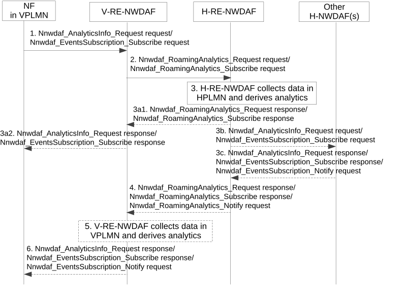
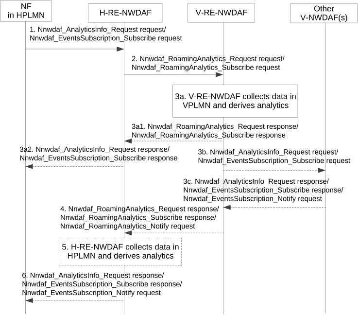

# 5.2.6 Procedure for Analytics Exposure in Roaming Case

## 5.2.6.1 Analytics Exposure from HPLMN to VPLMN for inbound roaming users

The procedure depicted in Figure 5.2.6.1-1 is used by the V-RE-NWDAF as service consumer to subscribe/unsubscribe to notifications about analytics exposure from the HPLMN for inbound roaming users.

Figure 5.2.6.1-1: Procedure for analytics exposure from HPLMN to VPLMN

1\. The consumer NF in VPLMN (e.g. AMF) discovers a V-RE-NWDAF as described in clause 5.2.8.3 and invoke Nnwdaf_AnalyticsInfo_Request or Nnwdaf_EventsSubscription_Subscribe service operation to the V-RE-NWDAF. For the inbound roaming user(s) indicated in the Target of Analytics Reporting, V-RE-NWDAF determines based on operator configuration and the requested analytics whether analytics from the HPLMN are required, or the analytics can be derived locally.

NOTE 1: It is possible that the Target of Analytics Reporting sent by the Consumer NF to the V-RE-NWDAF includes both inbound roaming user(s) and non-roaming user(s).

2\. The V-RE-NWDAF checks the roaming agreements related to analytics from HPLMN to determine if the roaming analytics request/subscribe can be accepted or must be rejected. If the request is rejected, the following steps are skipped.

The V-RE-NWDAF discovers a H-RE-NWDAF as described in clause 5.8.2.3 then invoke Nnwdaf_RoamingAnalytics_Request or Nnwdaf_RoamingAnalytics_Subscribe service operation as described in clause 4.9.2.2 and clause 4.9.2.3 of 3GPP TS 29.520 \[5\], based on the Analytics request/subscribe received from the Consumer NF in VPLMN. The Target of Analytics Reporting sent by the V-RE-NWDAF to the H-RE-NWDAF only contains the inbound roaming user(s).

NOTE 2: The inbound roaming user(s) are distinguished by the V-RE-NWDAF according to UE ID(s) (i.e. SUPI(s)).

3\. The H-RE-NWDAF checks the roaming agreements between the HPLMN and the VPLMN, and user consent for analytics if needed, to determine if the roaming analytics request/subscribe can be accepted or must be rejected. If the roaming analytics request/subscribe is rejected, the following steps are skipped.

3a If the H-RE-NWDAF supports to generate the requested analytics, it collects data from the NF(s) and/or OAM in HPLMN and derives the requested analytics, respond with Nnwdaf_RoamingAnalytics_Request response or Nnwdaf_RoamingAnalytics_Subscribe response to the V-RE-NWDAF then responds to the consumer NF; otherwise steps 3b and 3c are executed.

3b-3c. \[Optional\] If the H-RE-NWDAF does not support to generate the requested analytics, it may request/subscribe to other NWDAF(s) in the HPLMN (if available) by invoking Nnwdaf_AnalyticsInfo_Request or Nnwdaf_EventsSubscription_Subscribe service operation for the analytics and get corresponding response/notification by Nnwdaf_AnalyticsInfo_Request response, Nnwdaf_EventsSubscription_Subscribe response or Nnwdaf_EventsSubscription_Notify service operation.

4\. The H-RE-NWDAF sends the HPLMN analytics information to the V-RE-NWDAF using either Nnwdaf_RoamingAnalytics_Request response, Nnwdaf_RoamingAnalytics_Subscribe response or Nnwdaf_RoamingAnalytics_Notify request message as described in clause 4.9.2.2 and clause 4.9.2.3 of 3GPP TS 29.520 \[5\], depending on the service used in step 2. The H-RE-NWDAF may restrict the exposed analytics information based on HPLMN operator polices.

5\. If the Consumer NF also indicates request or subscription of analytics information available in the VPLMN (e.g. via Target of Analytics Reporting) in step 1, the V-RE-NWDAF collects data from the NF(s) and/or OAM in VPLMN and derives the requested analytics.

6\. The V-RE-NWDAF sends the HPLMN analytics information received in step 4, or the aggregated analytics information if step 5 are performed, to the Consumer NF in VPLMN using either Nnwdaf_AnalyticsInfo_Request response, Nnwdaf_EventsSubscription_Subscribe or Nnwdaf_EventsSubscription_Notify request message described in clause 4.2.2 of 3GPP TS 29.520 \[5\] depending on the service used in step 1.

NOTE 3: The present document describes that the RE-NWDAF may perform analytics aggregation for roaming scenario, but whether and how the RE-NWDAF performs analytics aggregation for roaming scenario are up to implementation.

NOTE 4: For details of Nnwdaf_EventsSubscription_Subscribe/Unsubscribe/Notify, Nnwdaf_AnalyticsInfo_Request and/or Nnwdaf_RoamingAnalytics_Subscribe/Unsubscribe/Notify/Request service operations refer to 3GPP TS 29.520 \[5\].

## 5.2.6.2 Analytics Exposure from VPLMN to HPLMN for outbound roaming users

The procedure depicted in Figure 5.2.6.2-1 is used by the H-RE-NWDAF as service consumer to subscribe/unsubscribe to notifications about analytics exposure from the VPLMN for outbound roaming users.

Figure 5.2.6.2-1: Procedure for analytics exposure from VPLMN to HPLMN

1\. Upon the Consumer NF is aware that the UE(s) indicated in Target of Analytics Reporting is/are roaming, Consumer NF in HPLMN (e.g. H-PCF) discovers a H-RE-NWDAF as described in clause 5.2.8.3 and invoking a Nnwdaf_AnalyticsInfo_Request or a Nnwdaf_EventsSubscription_Subscribe service operation. For the outbound roaming user(s) indicated in the Target of Analytics Reporting, the H-RE-NWDAF determines based on operator configuration and the requested analytics whether analytics or input data from the VPLMN are required, or the analytics can be derived locally.

NOTE 1: It is possible that the Target of Analytics Reporting sent by the Consumer NF to the H-RE-NWDAF includes both outbound roaming user(s) and non-roaming user(s).

NOTE 2: The H-NWDAF is not depicted in the flow.

2\. The H-RE-NWDAF checks user consent and roaming agreements between the HPLMN and the VPLMN to determine if the roaming analytics request/subscription can be accepted or must be rejected. If the request is rejected, the following steps are skipped.

The H-RE-NWDAF discovers the V-RE-NWDAF as described in clause 5.2.8.3.

The H-RE-NWDAF invoke a Nnwdaf_RoamingAnalytics_Request or a Nnwdaf_RoamingAnalytics_Subscribe service operation, based on the Analytics request/subscribe received from the Consumer NF in HPLMN. The Target of Analytics Reporting sent by the H-RE-NWDAF to the V-RE-NWDAF only contains the outbound roaming user(s).

3a. The V-RE-NWDAF checks the roaming agreements between the HPLMN and the VPLMN, to determine if the roaming analytics request/subscribe can be accepted or must be rejected. If the roaming analytics request/subscribe is rejected, the following steps are skipped.

If the V-RE-NWDAF supports to generate the requested analytics, it collects data from the NF(s) serving the roaming UE(s) and/or OAM in VPLMN and derives the analytics; otherwise steps 3b and 3c are executed.

3a1-3a2 The V-RE-NWDAF may respond with Nnwdaf_RoamingAnalytics_Request response or Nnwdaf_RoamingAnalytics_Subscribe response to the H-RE-NWDAF then responds to the consumer NF; otherwise steps 3b and 3c are executed.

3b-3c. If the V-RE-NWDAF does not support to generate the requested analytics, it may request/subscribe to other NWDAF(s) in the VPLMN (if available) for the analytics and get corresponding response/notification(s) by invoking Nnwdaf_AnalyticsInfo_Request or Nnwdaf_EventsSubscription_Subscribe service operation for the analytics and get corresponding response/notification by Nnwdaf_AnalyticsInfo_Request response, Nnwdaf_EventsSubscription_Subscribe response or Nnwdaf_EventsSubscription_Notify service operation.

4\. The V-RE-NWDAF may sends the VPLMN analytics information to the H-RE-NWDAF using either Nnwdaf_RoamingAnalytics_Request response, Nnwdaf_RoamingAnalytics_Subscribe or Nnwdaf_RoamingAnalytics_Notify request message as described in clause 4.9.2.2 and clause 4.9.2.3 of 3GPP TS 29.520 \[5\], depending on the service used in step 2. The V-RE-NWDAF may restrict the exposed analytics information based on VPLMN operator polices.

5\. If the Consumer NF also indicates request or subscription of analytics information available in the HPLMN (e.g. via Target of Analytics Reporting) in step 1, H-RE-NWDAF collects data from the NF(s) and/or OAM in HPLMN and derives the analytics. These steps can be executed in parallel with steps 3-6. The H-RE-NWDAF may perform analytics aggregation with the analytics information received from the V-RE-NWDAF and analytics information generated by itself, based on the analytics request or subscription.

6\. H-RE-NWDAF sends the VPLMN analytics information received in step 4, or the aggregated analytics information if step 5 are performed, to the Consumer NF in HPLMN using either Nnwdaf_AnalyticsInfo_Request response, Nnwdaf_EventsSubscription_Subscribe response or Nnwdaf_EventsSubscription_Notify service operation as described in clause 4.2.2 of 3GPP TS 29.520 \[5\] depending on the service used in step 1, depending on the service used in step 1.

NOTE 3: The present document describes that the RE-NWDAF may perform analytics aggregation for roaming scenario, but whether and how the RE-NWDAF performs analytics aggregation for roaming scenario are up to implementation.

NOTE 4: For details of Nnwdaf_EventsSubscription_Subscribe/Unsubscribe/Notify, Nnwdaf_AnalyticsInfo_Request and/or Nnwdaf_RoamingAnalytics_Subscribe/Unsubscribe/Notify/Request service operations refer to 3GPP TS 29.520 \[5\].
