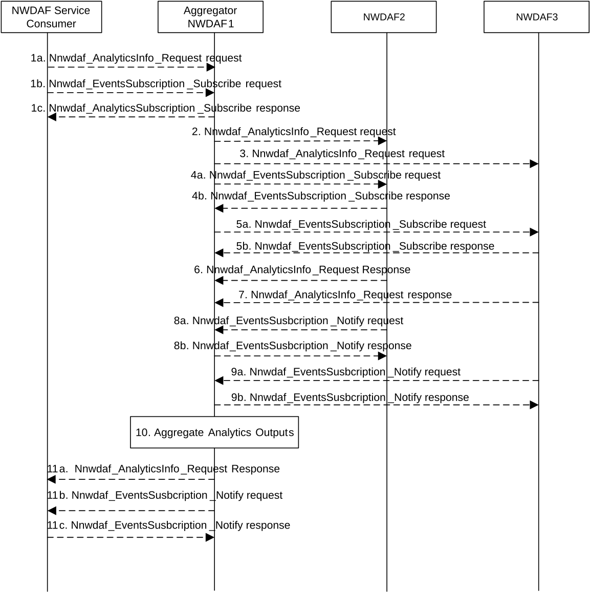
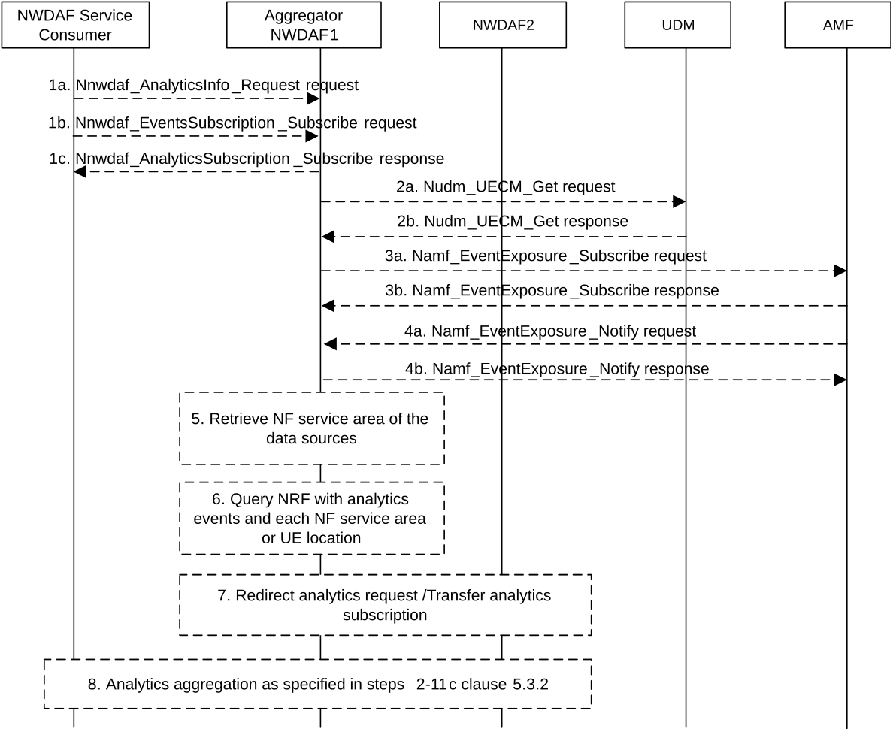

# 5.3 Analytics Aggregation from Multiple NWDAFs

## 5.3.1 General

Analytics Aggregation refers to the case in which an NWDAF with respective capabilities aggregates the analytics provided by other NWDAFs to serve a request from an NF service consumer.

If multiple NWDAFs are deployed, an NWDAF instance may be specialized to provide Analytics for one or more Analytics event(s). Each NWDAF instance may serve a certain Area of Interest or TAI(s) and multiple NWDAFs may be needed to serve a particular Analytics event collectively. An NWDAF may have the capability to aggregate the Analytics (per Analytics event) received from the other NWDAFs and/or the Analytics generated by itself. Analytics aggregation applies to scenarios where NWDAF service consumer requests or subscribes to analytics with or without provisioning of Area of Interest.

## 5.3.2 Analytics aggregation with provisioning of Area of Interest

This procedure is used by the service consumer to request Analytics event(s) for an Area of Interest, in which multiple NWDAFs are required to serve the request collectively.

Figure 5.3.2-1: Analytics aggregation with provisioning of Area of Interest

1a-1c. In order to obtain the specific network data analytics, the NF service consumer selects an NWDAF (e.g. NWDAF1) with aggregation capability according to the results returned by NRF or available information obtained by other means. The NWDAF service consumer invokes Nnwdaf_AnalyticsInfo_Request or Nnwdaf_EventsSubscription_Subscribe service operations as described in clause 5.2.3.1 and clause 5.2.2.1 to the selected NWDAF.

In the request message, the analytics event, analytics filter information including the Area of Interest (e.g. TAI-1, TAI-2, TAI-n, if available) and the Target of Analytics Reporting are provided. The NWDAF service consumer may indicate the time when the analytics is needed in "timeAnaNeeded" attribute, which needs to be equal or greater than the supported Analytics Delay per Analytics event of the Aggregator NWDAF.

2-5b. The Aggregator NWDAF selects the other NWDAF instances, which collectively can cover the area of interest indicated in the request, according to the results returned by the NRF and/or the UDM, or available information obtained by other means. The Aggregator NWDAF invokes Nnwdaf_AnalyticsInfo_Request or Nnwdaf_EventsSubscription_Subscribe service operations to each selected NWDAF (e.g. NWDAF2, NWDAF3) as described in clause 4.2.2.2 or clause 4.3.2.2 of 3GPP TS 29.520 \[5\].

6-9b. The selected NWDAFs send response or notification containing the requested analytics to the Aggregator NWDAF. If the selected NWDAFs (e.g. NWDAF 2 and/or NWDAF 3) cannot reply or notify the requested analytics before the expiry of the time that the Aggregator NWDAF has indicated, they may send an error response or error notification to the Aggregator NWDAF including a "revised waiting time" in "rvWaitTime" attribute.

10\. The Aggregator NWDAF aggregates the analytics received from the selected NWDAFs and the analytics of its own.

11a-11c. The Aggregator NWDAF sends a response or notification containing the aggregated output analytics for the requested Analytics event(s) to the NWDAF service consumer.

If the Aggregator NWDAF cannot reply or notify the requested analytics before the expiry of the time that the consumer has indicated in "timeAnaNeeded" attribute, it may sends an error response or error notification to the consumer including a "revised waiting time" in "rvWaitTime" attribute.

## 5.3.3 Analytics aggregation without provisioning of Area of Interest

This procedure is used by the service consumer to request Analytics event(s) without providing an Area of Interest, in which multiple NWDAFs are required to serve the request collectively.

Figure 5.3.3-1: Analytics aggregation without provisioning of Area of Interest

1a-1c. In order to obtain the specific network data analytics, the NF service consumer selects an NWDAF (e.g. NWDAF1) with aggregation capability according to the results returned by NRF or available information obtained by other means. The NWDAF service consumer invokes Nnwdaf_AnalyticsInfo_Request or Nnwdaf_EventsSubscription_Subscribe service operations as described in clause 5.2.3.1 and clause 5.2.2.1 to the selected NWDAF. If not, the NWDAF service consumer should select a NWDAF with large serving area from the candidate NWDAFs which supports analytics aggregation, e.g. NWDAF1.

2a-4b. If the requested analytics requires UE location information, e.g. for the Analytics events "UE_MOBILITY", "ABNORMAL_BEHAVIOUR", or "USER_DATA_CONGESTION", then:

\- 2a-2b: The Aggregator NWDAF may query UDM to discover the NWDAF serving the UE by invoking Nudm_UECM_Get service operation as described in clause 5.3.2.5.12 of 3GPP TS 29.503 \[23\], if it is supported.

\- 3a-4b: The Aggregator NWDAF may determine the AMF serving the UE, then requests UE location information from the AMF by invoking Namf_EventExposure_Subscribe service operation as described in clause 5.3.2.2.2 of 3GPP TS 29.518 \[18\]. The AMF notifies the UE location information by invoking Namf_EventExposure_Notify service operation as described in 3GPP TS 29.518 \[18\] clause 5.3.2.4.

5\. If the requested analytics does not require UE location information, e.g. for the Analytics events "SERVICE_EXPERIENCE", "NF_LOAD", or "UE_COMM", the Aggregator NWDAF can determine the NFs to be contacted for data collection.

6\. With the data obtained in step 3a-5, the Aggregator NWDAF may query the NRF for discovering the required NWDAF, by sending an NF discovery request including UE location or NF serving area as a filter to NRF, and obtains candidates target NWDAF(s) that can provide the required analytics.

7\. If a single target NWDAF (e.g. NWDAF2) can provide the requested analytics data, the Aggregator NWDAF can redirect the Nnwdaf_AnalyticsInfo_Request to that target NWDAF or request an analytics subscription transfer to that target NWDAF.

8\. If the Aggregator NWDAF decides to request analytics from one or more target NWDAFs, the steps 2-9b of the analytics aggregation procedure in clause 5.3.2 are executed.
