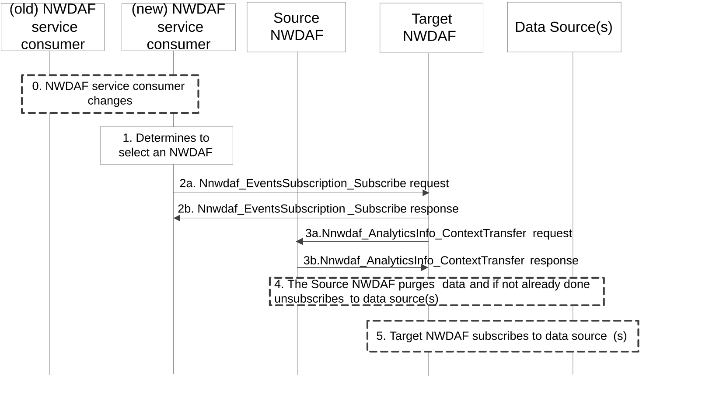
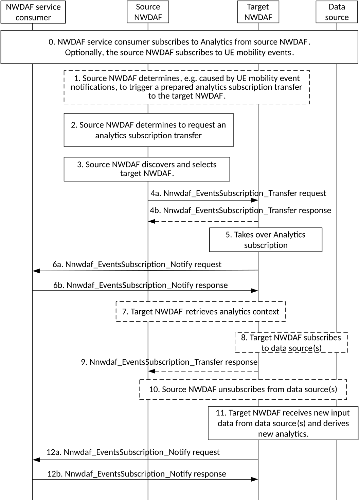
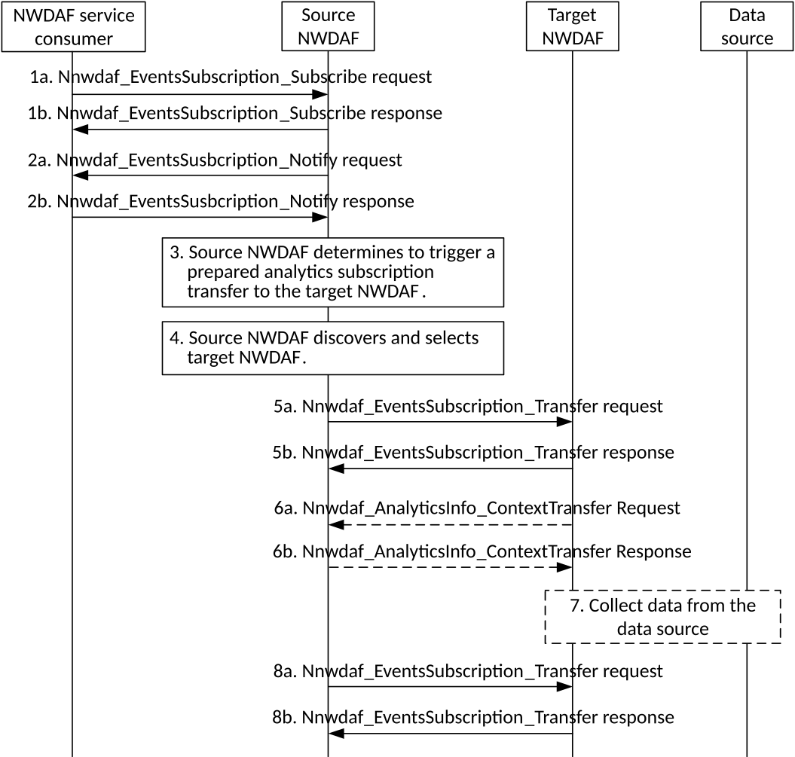

# 5.4 Procedures for Analytics Transferring

## 5.4.1 Analytics context transfer initiated by target NWDAF selected by the NWDAF service consumer

The procedure in below figure is used when an NWDAF service consumer decides to select a new NWDAF instance due to internal or external triggers, e.g. the NWDAF service consumer starts serving a UE with analytics subscription information received upon UE context transfer procedure as described in 3GPP TS 23.502 \[3\], or the NWDAF service consumer starts to request NF related analytics, or the NWDAF service consumer receives a "Termination Request" for an existing analytics subscription from an NWDAF. The NWDAF service consumer sends to the target NWDAF information about the NWDAF previously used for analytics subscription, if available, in Nnwdaf_EventsSubscription_Subscribe service operation. The target NWDAF may initiate the transfer of the analytics context, using the Nnwdaf_AnalyticsInfo_ContextTransfer.

The procedure in below figure is also used when an Aggregator NWDAF, as the NWDAF service consumer, decides to select a new NWDAF to request output analytics for analytics aggregation. For example, upon receiving a Termination Request from one of the NWDAFs that are collectively serving a request for analytics subscription, the Aggregator NWDAF queries the NRF or UDM to select a target NWDAF using information e.g. the UE location, the 5GC NFs (identified by their NF Set IDs or NF types) serving the UE or to be contacted for data collection (if Area of Interest is not provisioned for the requested analytics), or the subset of AoI (if Area of Interest is provisioned for the requested analytics). Then, the Aggregator NWDAF sends information about the NWDAF previously used for analytics subscription, if available, in Nnwdaf_EventsSubscription_Subscribe service operation towards the selected target NWDAF.

Figure 5.4.1-1: Analytics context transfer initiated by target NWDAF selected by the NWDAF service consumer

0\. When the NWDAF service consumer (e.g. AMF) changes, the new NWDAF service consumer may receive the old subscription information from the old NWDAF service consumer.

1\. The NWDAF service consumer determines to select an NWDAF instance. The NWDAF service consumer discovers and selects the target NWDAF as specified in clause 5.8.

2\. To send a request for analytics subscription to the target NWDAF, the NWDAF service consumer invokes Nnwdaf_EventsSubscription_Subscribe service operation by sending the HTTP POST request message targeting the resource "NWDAF Events Subscriptions" to the target NWDAF. The NWDAF service consumer includes information on the previous analytics subscription (e.g., NWDAF ID and Subscription ID) which relates to the requested analytics subscription, if available. If the target NWDAF accepts the analytics subscription request, it responds with HTTP "201 Created" to the NWDAF service consumer. Details are described in clause 4.2.2.2 of 3GPP TS 29.520 \[5\].

If the target NWDAF does not receive information of previous analytics subscription in step 2, for UE related Analytics, the target NWDAF may discover previously used NWDAF in UDM as specified in clause 5.8.

NOTE: If the selected target NWDAF instance is the same as the source NWDAF instance (as received from the other consumer in step 0), the new NWDAF service consumer invokes Nnwdaf_EventsSubscription_Subscribe service operation by sending the HTTP PUT request message targeting the resource "Individual NWDAF Event Subscription" to the target NWDAF, and the target NWDAF will update the existing analytics subscription to the new NWDAF service consumer. Following steps are skipped.

3\. If the target NWDAF decides to request an analytics context transfer from the previously used NWDAF, it invokes the Nnwdaf_AnalyticsInfo_ContextTransfer service operation by sending the HTTP GET request message targeting the resource "NWDAF Context" to the source NWDAF as described in clause 4.3.2.3 of 3GPP TS 29.520 \[5\].

Target NWDAF is now ready to generate analytics information by taking into account the information received in step 3.

4\. \[Optional\] Source NWDAF may purge analytics context after completion of step 3a, if performed, and if not already done, unsubscribes from the data source(s) and/or model source(s) that are no longer needed for the remaining analytics subscriptions.

5\. \[Optional\] Target NWDAF may subscribe to relevant data source(s) and/or model source(s), if it is not yet subscribed to the data source(s) and/or model source(s).

## 5.4.2 Analytics Subscription Transfer initiated by source NWDAF

The procedure in below figure is used by a source NWDAF instance to request the transfer of analytics subscription(s) to another target NWDAF instance, using the Nnwdaf_EventsSubscription_Transfer service operation.

If the source NWDAF discovers that the NWDAF service consumer may change concurrently to this procedure, the source NWDAF should not perform the procedure. In such a case, the source NWDAF may send a message to indicate to the NWDAF service consumer that it will not serve this subscription anymore.

NOTE 1: To discover the possible change of NWDAF service consumer, if the Analytics Event is UE related, the source NWDAF takes actions responding to external trigger (such as UE mobility), for example, checking if the Target of Analytics Reporting is still within the serving area of the analytics consumer, if the serving area information is available.

NOTE 2: Handling of overload situation or preparation for a graceful shutdown are preferably executed inside an NWDAF Set, when available, therefore, not requiring an analytics subscription transfer as described in this clause. Below procedure is applicable for analytics subscription transfer across NF Sets or if the NWDAF is not deployed in a Set.

Figure 5.4.2-1: Analytics subscription transfer initiated by source NWDAF

0\. The NWDAF service consumer subscribes to analytics from source NWDAF. The NWDAF service consumer may send its NF ID or serving area, enabling the source NWDAF to determine whether the following analytics subscription transfer procedure is applicable. Optionally the source NWDAF subscribes to UE mobility events.

1\. \[Optional\] Source NWDAF determines, e.g. triggered by a UE mobility event notification, to prepare an analytics subscription transfer to target NWDAF(s) as described in clause 5.4.3 with steps 0-1, 5- 6 will be followed.

2\. Source NWDAF determines, e.g. based on the UE location information received and the analytics consumer's serving area either directly received in step 0 or indirectly received via NRF, to perform an analytics subscription transfer to target NWDAF(s). Therefore, the source NWDAF determines the analytics subscription(s) to be transferred to a target NWDAF.

3\. Source NWDAF performs an NWDAF discovery and selects the target NWDAF. NWDAF discovery may be skipped if the target NWDAF had already been discovered as part of a prepared analytics subscription transfer. In the case of aggregated analytics from multiple NWDAFs, the source NWDAF may use the set of NWDAF identifiers related to aggregated analytics to preferably select a target NWDAF that is already serving the consumer.

4\. Source NWDAF requests, using Nnwdaf_EventsSubscription_Transfer service operation, a transfer of the analytics subscription(s) determined in step 2 to the target NWDAF as described in clause 4.2.2.5 of 3GPP TS 29.520 \[5\], the response message in step 4b is optional.

5\. Target NWDAF accepts the analytics subscription transfer and takes over the analytics generation based on the information received from the source NWDAF.

The ML model related information namely ModelInfo may be provided by the source NWDAF in the Nnwdaf_EventsSubscription_Transfer request message.

\- If the instance ID or set ID of NWDAF(s) containing MTLF is provided in the Nnwdaf_EventsSubscription_Transfer, target NWDAF may request or subscribe to the ML model(s) from the indicated NWDAF(s).

NOTE 3: If the provided ID(s) of NWDAF(s) containing MTLF are not part of the locally configured ID(s) of NWDAFs containing MTLF, the target NWDAF discovers the NWDAF(s) containing MTLF as described in clause 5.8.2.3.

\- When the source NWDAF itself provides the ML models, the address of ML model files may be provided, and the target NWDAF retrieves the ML model(s) from the indicated address.

Target NWDAF may use the above retrieved ML models and the ML models retrieved from the locally configured NWDAFs containing MTLF for the transferred analytics subscription.

NOTE 4: If not yet done during a prepared analytics subscription transfer, the target NWDAF allocates a new Subscription ID to the received analytics subscriptions.

NOTE 5: The target NWDAF might already have received information on some/all of the analytics subscriptions as part of the prepared analytics subscription transfer request received in step 1 and, thus, might already have started to prepare for the analytics generation, e.g. by having already subscribed to relevant event notifications.

6\. Target NWDAF informs the NWDAF service consumer about the successful analytics subscription transfer using a Nnwdaf_EventsSubscription_Notify request message. A new Subscription ID, which was assigned by the target NWDAF, is provided in the Subscription ID and the old Subscription Id, which was allocated by the source NWDAF, is provided in the Old Subscription ID parameter of this message.

NOTE 6: Notification correlation information in the Nnwdaf_EventsSubscription_Notify message allows the NWDAF service consumer to correlate the notifications to the initial subscription request made with the source NWDAF in step 0.

NOTE 7: The existing Analytics context in the source NWDAF is not deleted directly but will be purged first when it was collected by the target NWDAF.

NOTE 8: If this subscription is used as input for analytics aggregation by the NWDAF service consumer, the NWDAF service consumer may inform the other NWDAFs instance participating in this analytics aggregation that the Set of NWDAF identifiers of NWDAF instances used by the NWDAF service consumer for this analytics aggregation has changed using the Nnwdaf_EventsSubscription_Subscribe service operation as described in clause 4.2.2.2 of 3GPP TS 29.520 \[5\].

7\. \[Conditional\] If "analytics context identifier(s)" had been included in the Nnwdaf_EventsSubscription_Transfer Request received in step 4, the target NWDAF requests the "analytics context" by invoking the Nnwdaf_AnalyticsInfo_ContextTransfer service operation as described in clause 4.3.2.3 of 3GPP TS 29.520 \[5\].

8\. \[Optional\] Target NWDAF subscribes to relevant data source(s), if it is not yet subscribed to the data source(s) for the data required for the Analytics.

9\. \[Optional\] Target NWDAF confirms the analytics subscription transfer to the source NWDAF by sending Nnwdaf_EventsSubscription_Transfer response message as described in clause 4.2.2.5 of 3GPP TS 29.520 \[5\], if the response has not been sent in step 4b.

10\. \[Optional\] Source NWDAF unsubscribes with the data source(s) that are no longer needed for the remaining analytics subscriptions. In addition, Source NWDAF unsubscribes with the NWDAF(s) containing MTLF, if exist, which are no longer needed for the remaining analytics subscriptions.

NOTE 9: At this point, the analytics subscription transfer is deemed completed, i.e. the source NWDAF can delete all information related to the successfully transferred analytics subscription.

11-12. Target NWDAF at some point derives new output analytics based on new input data and notifies the NWDAF service consumer about the new analytics using a Nnwdaf_EventsSubscription_Notify message as described in clause 4.2.2.4 of 3GPP TS 29.520 \[5\].

## 5.4.3 Prepared analytics subscription transfer

The procedure in below figure is used by a NWDAF instance to request another NWDAF instance for a prepared analytics subscription transfer from the source NWDAF instance, using the Nnwdaf_EventsSubscription_Transfer service operation.

NOTE 1: The source NWDAF might determine that it needs to prepare to transfer analytics to another NWDAF instance, e.g. when the source NWDAF estimates for UE related analytics subscription that the UE might enter an area which is not covered by the source NWDAF (e.g., by subscribing to AMF event exposure service for UE mobility event notifications, by performing UE mobility analytics, or by subscribing to another NWDAF providing UE mobility analytics). If the source NWDAF discovers that the analytics consumer may change concurrently to this procedure, the source NWDAF does not perform the procedure. If the procedure makes use of predictions to determine the candidate NWDAFs, care must be taken with regards to load and signalling cost when sending data to an NWDAF that will not eventually start serving the UE.

NOTE 2: The source NWDAF might also determine that it needs to prepare to transfer analytics subscriptions to another NWDAF instance, as the source NWDAF wants to resolve an internal load situation or prepare for a graceful shutdown.

NOTE 3: Handling of overload situation or preparation for a graceful shutdown are preferably executed inside an NWDAF Set, when available.

Figure 5.4.3-1: Prepared analytics subscription transfer

1a-1b. The NWDAF service consumer subscribes to analytics from source NWDAF by invoking Nnwdaf_EventsSubscription_Subscribe service operation. The source NWDAF responses to Nnwdaf_EventsSusbcription_Subscribe service operation.

2a-2b. The source NWDAF generates the requested analytics and notify the NWDAF service consumer by invoking the Nnwdaf_EventsSusbcription_Notify service operation. The NWDAF service consumer responses to the Nnwdaf_EventsSusbcription_Notify service operation.

3\. The source NWDAF determines that it needs to prepare to transfer the analytics subscription to another NWDAF instance.

4\. The source NWDAF discovers and selects the target NWDAF as described in clause 5.8.2.3.

5a-5b. The source NWDAF invokes Nnwdaf_EventsSubscription_Transfer service operation by sending an HTTP POST request to the target NWDAF and the "transReqType" attribute in the request message is set to "PREPARE". The target NWDAF sends an HTTP "201 Created" to the source NWDAF.

6a-6b. If analytics context identifier information had been included in the Nnwdaf_EventsSubscription_Transfer request message, the target NWDAF requests the analytics context information from the source NWDAF by invoking the Nnwdaf_AnalyticsInfo_ContextTransfer service operation by sending the HTTP GET request message targeting the resource "NWDAF Context" to the source NWDAF.

7\. The target NWDAF collect the data required for the analytics from the relevant data source(s), if it is not yet collected.

8a-8b. The source NWDAF invokes the Nnwdaf_EventsSubscription_Transfer service operation by sending either an HTTP PUT request to the target NWDAF as described in 4.2.2.5.3 of 3GPP TS 29.520 \[5\] or an HTTP DELETE request to cancel the prepared analytics subscritpiton transfer as described in clause 4.2.2.5.4 of 3GPP TS 29.520 \[5\]. In the case of HTTP PUT with the "transReqType" attribute set to "TRANSFER", the analytics subscription transfer is completed as described in clause 5.4.2 from step 4 onwards. In the case of HTTP PUT with the "transReqType" attribute set to "PREPARE", steps 4-7 of this procedure are repeated. In the case of HTTP DELETE, the target NWDAF sends response to the source NWDAF and deletes the analytics data that is no longer needed. If the target NWDAF had already subscribed to entities to collect data or ML models during the analytics subscription preparation, it unsubscribes from those entities if the subscriptions are not needed for other active analytics subscriptions.
