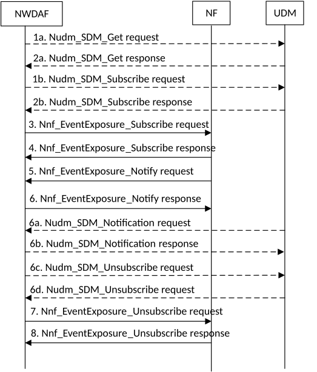

# 5.5.1 Procedure for Data Collection from NFs

## 5.5.1.1 Data Collection from NFs

The procedure in Figure 5.5.1.1-1 is used by NWDAF to subscribe/unsubscribe at NFs in order to be notified for data collection on related event(s), using Event Exposure Services as listed in Table 6.2.2.1-1 defined in TS 23.288 \[2\] clause 6.2.2.

Figure 5.5.1.1-1: Event Exposure Subscribe/Unsubscribe for NFs

1a. If data is to be collected for a user, the user consent has not been checked by the data consumer, if the local policy and regulations require to check user consent, the NWDAF shall invoke the Nudm_SDM_Get service operation by sending an HTTP GET request as described in clause 5.2.2.2.24 and clause 6.1.3.32 of 3GPP TS 29.503 \[22\]. Otherwise, the procedure begins with step 3.

2a. The UDM responds to the Nudm_SDM_Get service operation. If the request is accepted, the response includes the requested data with "200 OK". In subsequent steps, the NWDAF excludes the SUPI or GPSI from requests to collect data for users for whom the user consent is not granted.

1b. For the users for which the user consent is granted, the NWDAF subscribes to notifications of changes of the user consent by invoking the Nudm_SDM_Subscribe service operation by sending an HTTP POST request targeting the resource "SdmSubscriptions" to the UDM as described in clause 5.2.2.3 of 3GPP TS 29.503 \[22\].

2b. The UDM responds to the Nudm_SDM_Subscribe service operation. If the request is accepted, the UDM responds with "201 Created".

3\. In order to subscribe to notifications (or to modify subscriptions to notifications) of data events from the data source NF (e.g. UDM, AMF, SMF, NEF, AF), the NWDAF invokes the Nnf_EventExposure_Subscribe service operation by sending an HTTP POST (or PUT, for modification) request targeting the resource representing event exposure subscriptions of that NF, e.g. as described in clause 5.5.2.2 of 3GPP TS 29.503 \[22\] for the UDM, clause 5.3.2.2 of 3GPP TS 29.518 \[18\] for the AMF, clause 4.2.3 of 3GPP TS 29.508 \[6\] for the SMF, clause 4.2.2.2 of 3GPP TS 29.591 \[11\] for the NEF, or clause 4.2.2 of 3GPP TS 29.517 \[12\] for the AF.

4\. The NF responds to the Nnf_EventExposure_Subscribe service operation. Upon receipt of the HTTP POST request, if the subscription is accepted to be created, the NF responds to the NWDAF with "201 Created", and the URI of the created subscription is included in the Location header field.

5\. If the NF observes the subscribed event(s), the NF invokes Nnf_EventExposure_Notify service operation to report the event(s) by sending an HTTP POST request, e.g. as described in clause 5.5.2.4 of 3GPP TS 29.503 \[22\] for the UDM, clause 5.3.2.4 of 3GPP TS 29.518 \[18\] for the AMF, clause 4.2.2 of 3GPP TS 29.508 \[6\] for the SMF, clause 4.2.2.4 of 3GPP TS 29.591 \[11\] for the NEF, or clause 4.2.4 of 3GPP TS 29.517 \[12\] for the AF.

6a. If the user consent changes and the NWDAF has subscribed to UDM to notifications of user consent change for a user, the UDM invokes Nudm_SDM_Notification service operation by sending an HTTP POST request as described in clause 5.2.2.5 of 3GPP TS 29.503 \[22\].

6b. The NWDAF responds to the Nudm_SDM_Notification service operation with "204 No Content".

6c. The NWDAF may invoke Nudm_SDM_Unsubscribe service operation by sending an HTTP DELETE request as described in clause 5.2.2.4 of 3GPP TS 29.503 \[22\] to unsubscribe from UDM to be notified of user consent change for each user whose user consent is revoked.

6d. If the deletion request is accepted, the UDM responds to the Nudm_SDM_Unsubscribe service operation with "204 No Content".

7\. If the user consent is no longer granted or the data collection is no longer required, the NWDAF unsubscribes to the notifications of data events from the NF. The NWDAF invokes Nnf_EventExposure_Unsubscribe service operation by sending an HTTP DELETE request targeting the resource that represents the previously created individual event exposure subscription, e.g. as described in clause 5.5.2.3 of 3GPP TS 29.503 \[22\] for the UDM, clause 5.3.2.3 of 3GPP TS 29.518 \[18\] for the AMF, clause 4.2.4 of 3GPP TS 29.508 \[6\] for the SMF, clause 4.2.2.3 of 3GPP TS 29.591 \[11\] for the NEF, clause 4.2.3 of 3GPP TS 29.517 \[12\] for the AF. The request includes the event subscriptionId of the existing subscription that is to be deleted.

8\. The NF responds to the Nnf_EventExposure_Unsubscribe service operation. If the subscription deletion is accepted, the NF responds with "204 No Content".
