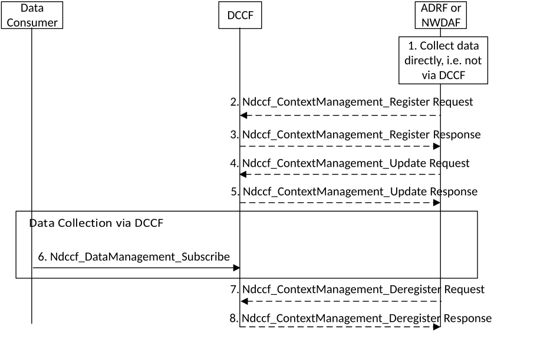

# 5.5.2 Data collection profile registration

This procedure depicted in Figure 5.5.2-1 is used by NWDAF or ADRF to register/update a data collection profile to the DCCF during/after the procedure of data collection.

Figure 5.5.2-1: Procedure for the NWDAF or ADRF to register data profile to DCCF

1\. An ADRF or NWDAF instance is collecting or has collected data directly, e.g. from collocated NF.

2\. In order to register a data collection profile, the ADRF or NWDAF invokes the Ndccf_ContextManagement_Register service operation by sending an HTTP POST request targeting the resource "DCCF Data Collection Profiles" as described in clause 4.3.2.2 of 3GPP TS 29.574 \[15\].

3\. The DCCF responds to the Ndccf_ContextManagement_Register service operation. Upon receipt of the HTTP POST request, if the data profile is accepted to be created, the DCCF responds to the ADRF or NWDAF with "201 Created", and the URI of the created profile is included in the Location header field.

4\. In order to update a data collection profile, the Data Consumer invokes the Ndccf_ContextManagement_Update service operation by sending an HTTP PUT request targeting the resource "Individual DCCF Data Collection Profile" as described in clause 4.3.2.3 of 3GPP TS 29.574 \[15\].

5\. The DCCF responds to the Ndccf_ContextManagement_Update service operation. Upon receipt of the HTTP PUT request, if the data profile is accepted to be updated, the DCCF responds to the ADRF or NWDAF with "200 OK" with a response body containing a representation of the updated data profile or "204 No Content".

6\. To obtain historical data and if the data consumer is configured to collect data via the DCCF using the Ndccf_DataManagement_Subscribe service operation, the data consumer uses the procedures described in clause 5.5.3.

7\. The ADRF or NWDAF requests to delete a registered data collection profile at the DCCF invoking the Ndccf_ContextManagement_Deregister service operation by sending a HTTP DELETE request targeting the "Individual DCCF Data Collection Profile" resource of the DCCF as described in clause 4.3.2.4 of 3GPP TS 29.574 \[15\].

8\. The DCCF responds to the Ndccf_ContextManagement_Deregister service operation with HTTP "204 No Content" status code, if the data collection profile is successfully removed.
