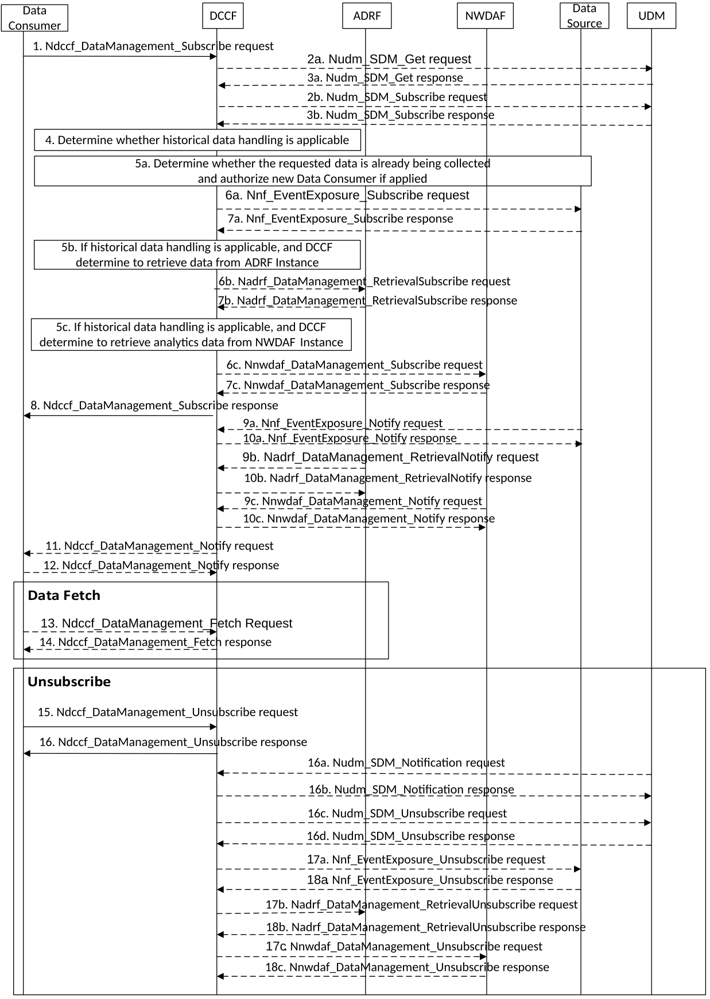

# 5.5.3.1 Data Collection via DCCF

The procedure depicted in Figure 5.5.3.1-1 is used by a data consumer (e.g. NWDAF) to obtain data and be notified of events via the DCCF using the Ndccf_DataManagement_Subscribe service operation. Whether the data consumer directly contacts the Data Source or goes via the DCCF is based on configuration of the data consumer.

Figure 5.5.3.1-1: Data Collection via DCCF

1\. In order to subscribe to notification(s) of events exposure via the DCCF based on local configuration, the Data Consumer invokes the Ndccf_DataManagement_Subscribe service operation by sending an HTTP POST request targeting the resource "DCCF Data Subscriptions" as described in clause 4.2.2.2.4 of 3GPP TS 29.574 \[15\].

2a. If data is to be collected for a user, the user consent has not been checked by the data consumer, if the local policy and regulations require to check user consent, the DCCF shall invoke the Nudm_SDM_Get service operation by sending an HTTP GET request as described in clause 5.2.2.2.24 and clause 6.1.3.32 of 3GPP TS 29.503 \[22\]. Otherwise the procedure continues with step 4.

3a. The UDM responds to the Nudm_SDM_Get service operation. If the request is accepted, the response includes the requested data with "200 OK". In subsequent steps, the DCCF excludes the SUPI or GPSI from requests to collect data for users for whom the user consent is not granted.

2b. For the users for which the user consent is granted, the DCCF subscribes to notifications of changes of the user consent by invoking the Nudm_SDM_Subscribe service operation by sending an HTTP POST request targeting the resource "SdmSubscriptions" at the UDM as described in clause 5.2.2.3 of 3GPP TS 29.503 \[22\].

3b. The UDM responds to the Nudm_SDM_Subscribe service operation. If the request is accepted, the UDM responds with "201 Created" status code.

4\. The DCCF determines the NF type(s) and/or OAM to retrieve the data based on the Service Operation requested in step 1. If the NF instance or NF Set ID is not provided by the data consumer. The DCCF determines the NF instances that can provide data as described in TS 23.288 \[2\] clause 5A.2 and clause 6.2.2.2. If the consumer requested storage of data in an ADRF but the ADRF ID is not provided by the data consumer, or the collected data is to be stored in an ADRF according to configuration on the DCCF, the DCCF selects an ADRF to store the collected data.

The DCCF keeps track of the data actively being collected from the Data Sources it is coordinating. The NWDAF or ADRF may register the data collection profile (including the data collection related Service Operation, Analytics/Data Specification, NWDAF ID or ADRF ID) with the DCCF. The DCCF may then determine whether certain historical data may be available in the NWDAF or ADRF based on the data collection profile and the request time window.

If the historical data handling is not applicable or not supported, the DCCF shall proceed with step 5a and skip step 5b, step 6b, step 7b, step 5c, step 6c, and step 7c.

If the historical data is available in an ADRF, the DCCF shall proceed with step 5a and step 5b, and skip step 5c, step 6c, and step 7c.

If the historical data is available in an NWDAF, the DCCF shall proceed with step 5a and step 5c, and skip step 5b, step 6b, and step 7b.

5a. The DCCF shall determine whether the data requested in step 1 are already being collected by an existing subscription or can be collected by modifying an existing subscription.

6a. If the data requested in step 1 can be collected neither by an existing subscription nor by modifying an existing subscription, the DCCF shall invoke the Nnf_EventExposure_Subscribe service operation by sending an HTTP POST request message request to the NF targeting the resource representing event exposure subscriptions to subscribe to a new event exposure subscription, e.g. as described in clause 5.5.2.2 of 3GPP TS 29.503 \[22\] for the UDM, clause 5.3.2.2 of 3GPP TS 29.518 \[18\] for the AMF, clause 4.2.3 of 3GPP TS 29.508 \[6\] for the SMF, clause 4.2.2.2 of 3GPP TS 29.591 \[11\] for the NEF, or clause 4.2.2 of 3GPP TS 29.517 \[12\] for the AF.

Otherwise, the DCCF shall send a request to the individual event exposure subscription resource to update an existing event exposure subscription, e.g. as described in clause 5.5.2.5 of 3GPP TS 29.503 \[22\] for the UDM, clause 5.3.2.2.3 of 3GPP TS 29.518 \[18\] for the AMF, clause 4.2.3.3 of 3GPP TS 29.508 \[6\] for the SMF, clause 4.2.2.2.3 of 3GPP TS 29.591 \[11\] for the NEF, or clause 4.2.2.3 of 3GPP TS 29.517 \[12\] for the AF.

NOTE 1: If the contents of the subscription already perfectly match the new request then the update is performed simply to authorize the new source NF as described in clause 6.7.5.2 of 3GPP TS 29.500 \[13\].

7a. The NF responds to the Nnf_EventExposure_Subscribe service operation by an existing subscription or can be collected by modifying an existing subscription.

5b. If the historical data handling is applicable, and the DCCF determines to retrieve data from the ADRF, the DCCF shall determine which ADRF instances might provide the data.

6b. In order to retrieve the historical data from the ADRF, the DCCF shall invoke the Nadrf_DataManagement_RetrievalSubscribe service operation by sending an HTTP POST request message targeting the resource "ADRF Data Retrieval Subscriptions" as described in clause 4.2.2.6 of 3GPP TS 29.575 \[16\].

7b. The ADRF responds to the Nadrf_DataManagement_RetrievalSubscribe service operation.

Upon receipt of the HTTP POST request, if the subscription is accepted to be created, the ADRF responds to the DCCF with "201 Created" status code, and the URI of the created subscription is included in the Location header field.

5c. If the historical data handling is applicable, and the DCCF determines to retrieve data from the NWDAF, the DCCF shall determine which NWDAF instances might provide the requested data.

6c. In order to retrieve the historical data from the NWDAF, the DCCF shall invoke the Nnwdaf_DataManagement_Subscribe service operation by sending an HTTP POST request message targeting the resource "NWDAF Data Management Subscriptions", as described in clause 4.4.2.2 of 3GPP TS 29.520 \[5\].

7c. The NWDAF responds to the Nnwdaf_DataManagement_Subscribe service operation.

Upon receipt of the HTTP POST request, if the subscription is accepted to be created, the NWDAF responds to the DCCF with "201 Created" status code, and the URI of the created subscription is included in the Location header field.

8\. The DCCF responds to the Ndccf_DataManagement_Subscribe service operation with HTTP "204 No Content" status code.

9a. When the data are available, the NF invokes the Nnf_EventExposure_Notify service operation by sending an HTTP POST request message to notify the data events to the DCCF, e.g. as described in clause 5.5.2.4 of 3GPP TS 29.503 \[22\] for the UDM, clause 5.3.2.4 of 3GPP TS 29.518 \[18\] for the AMF, clause 4.2.2 of 3GPP TS 29.508 \[6\] for the SMF, clause 4.2.2.4 of 3GPP TS 29.591 \[11\] for the NEF, or clause 4.2.4 of 3GPP TS 29.517 \[12\] for the AF.

10a. The DCCF responds to the Nnf_EventExposure_Notify service operation with HTTP "204 No Content" status code.

9b. When the historical data are available in the ADRF, the ADRF shall invoke the Nadrf_DataManagement_RetrievalNotify service operation by sending an HTTP POST request message to notify the historical data or Fetch Instructions to the DCCF as described in clause 4.2.2.8 of 3GPP TS 29.575 \[16\].

10b. The DCCF responds to the Nadrf_DataManagement_RetrievalNotify service operation with HTTP "204 No Content" status code.

9c. When the historical data are available in the NWDAF, the NWDAF shall invoke the Nnwdaf_DataManagement_Notify service operation by sending an HTTP POST request message to notify the historical data to the DCCF as described in clause 4.4.2.4 of 3GPP TS 29.520 \[5\].

10c. The DCCF responds to the Nnwdaf_DataManagement_Notify service operation with HTTP "204 No Content" status code.

11\. If the DCCF is configured to deliver the data itself (and not via the MFAF), the DCCF invokes the Ndccf_DataManagement_Notify service operation by sending HTTP POST request message(s) to send the data to all notification endpoints indicated in step 1. Data sent to notification endpoints may be processed and formatted by the DCCF, so they conform to delivery requirements for each NF service consumer or notification endpoint.

NOTE 2: According to Formatting Instructions provided by the NF service consumer, multiple notifications from a NF can be combined in a single Ndccf_DataManagement_Notify so that many notifications from an NF result in fewer notifications (or one notification) to the Data Consumer. Alternatively, a notification can instruct the data notification endpoint to fetch the data from the DCCF.

12\. The NF service consumer responds to the Ndccf_DataManagement_Notify service operation with HTTP "204 No Content" status code.

13\. The Data Consumer invokes the Ndccf_DataManagement_Fetch service operation by sending an HTTP GET request message as described in clause 4.2.2.5 of 3GPP TS 29.574 \[15\] to fetch the data from the DCCF before an expiry time, if the fetch instruction was previously received via the NdccfDataManagement_Notify service operation in step 11.

14\. The DCCF responds to the Ndccf_DataManagement_Fetch service operation with HTTP "200 OK" status code with the message body containing the data received earlier from the data source.

15\. When the NF service consumer no longer needs the subscription to the requested data in step 1, it shall invoke the Ndccf_DataManagement_Unsubscribe service operation by sending an HTTP DELETE request message as described in clause 4.2.2.3.3 of 3GPP TS 29.574 \[15\]. The DCCF removes the NF service consumer from the list of NF service consumers that are subscribed for these data.

16\. The DCCF responds to the Ndccf_DataManagement_Unsubscribe service operation with HTTP "204 No Content" status code, if the NF service consumer is successfully removed from the list of NF service consumers that are subscribed for these data.

16a. If the user consent changes and the DCCF has subscribed to UDM to notifications of user consent change for a user, the UDM invokes Nudm_SDM_Notification service operation by sending an HTTP POST request as described in clause 5.2.2.5 of 3GPP TS 29.503 \[22\].

16b. The DCCF responds to the Nudm_SDM_Notification service operation with "204 No Content".

16c. The DCCF may invoke Nudm_SDM_Unsubscribe service operation by sending an HTTP DELETE request as described in clause 5.2.2.4 of 3GPP TS 29.503 \[22\] to unsubscribe from UDM to be notified of user consent change for each user whose user consent is revoked.

16d. If the deletion request is accepted, the UDM responds to the Nudm_SDM_Unsubscribe service operation with "204 No Content".

17a. If there are no other NF service consumers subscribed to the data or the user consent for a user, i.e. for a SUPI or GPSI, is no longer granted, the DCCF invokes the Nnf_EventExposure_Unsubscribe service operation by sending an HTTP DELETE request message to the Data Source, e.g. as described in clause 5.5.2.3 of 3GPP TS 29.503 \[22\] for the UDM, clause 5.3.2.3 of 3GPP TS 29.518 \[18\] for the AMF, clause 4.2.4 of 3GPP TS 29.508 \[6\] for the SMF, clause 4.2.2.3 of 3GPP TS 29.591 \[11\] for the NEF, or clause 4.2.3 in 3GPP TS 29.517 \[12\] for the AF.

18a. The Data Source responds to the Nnf_EventExposure_Unsubscribe service operation with HTTP "204 No Content" status code, if the data event(s) subscription is successfully removed.

17b. If the DCCF determines that no other NF service consumers require the historical data from the ADRF, the DCCF invokes the Nadrf_DataManagement_RetrievalUnsubscribe service operation by sending an HTTP DELETE request message to the ADRF as described in clause 4.2.2.7 of 3GPP TS 29.575 \[16\].

18b. The ADRF responds to the Nadrf_DataManagement_RetrievalUnsubscribe service operation with HTTP "204 No Content" status code, if the data retrieval subscription is successfully removed.

17c. If DCCF determines that no other NF service consumers require the historical data from the NWDAF, the DCCF invokes the Nnwdaf_DataManagement_Unsubscribe service operation by sending an HTTP DELETE request message to the NWDAF as described in clause 4.4.2.3 of 3GPP TS 29.520 \[5\].

18c. The NWDAF responds to the Nnwdaf_DataManagement_Unsubscribe service operation with HTTP "204 No Content" status code, if the data subscription is successfully removed.
