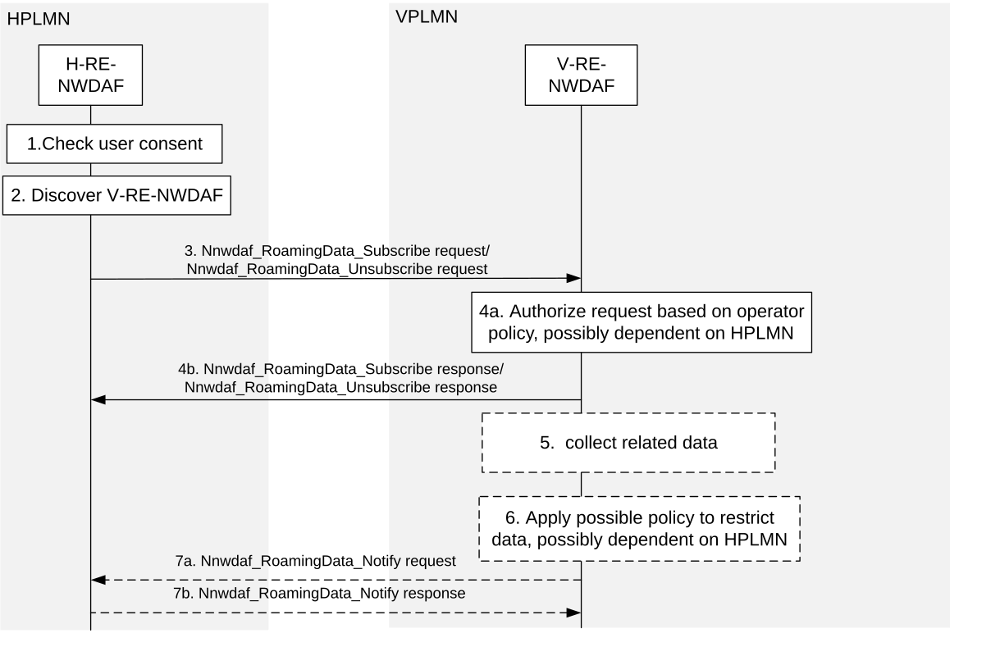
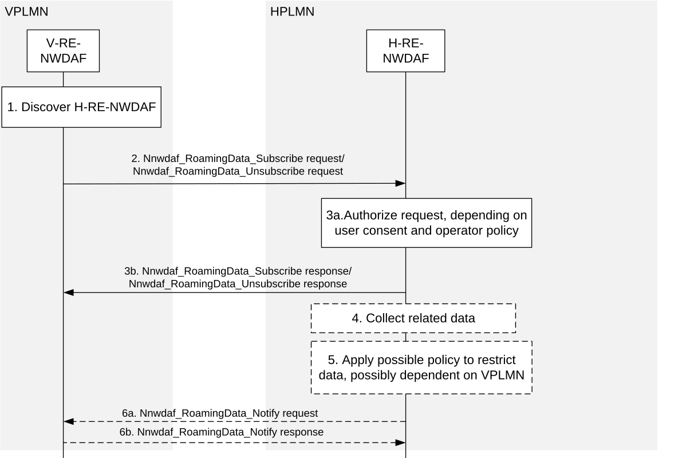

# 5.5.4 Procedure for Data Collection in Roaming Case

## 5.5.4.1 Data Collection by H-RE-NWDAF from V-RE-NWDAF for outbound roaming users

The procedure depicted in Figure 5.5.4.1-1 is used by the H-RE-NWDAF as service consumer to subscribe/unsubscribe to notifications about data event exposure from the VPLMN for outbound roaming users.

Figure 5.5.4.1-1: data collection by H-RE-NWDAF from V-RE-NWDAF for outbound roaming users

1\. For subscription to collected data related to the outbound roaming UE(s), the H-RE-NWDAF checks the user consent of related users.

2\. The H-RE-NWDAF of HPLMN discovers V-RE-NWDAF of VPLMN that supports the Nnwdaf_RoamingData service using the NRF as specified for roaming case in clause 5.8.2.3.

NOTE 1: The access to the Nnf_EventExposure services is expected to be restricted to NF service consumers within the same PLMN to prevent bypassing checks based on user consent and operator policy.

3\. The H-RE-NWDAF subscribes/unsubscribes to notifications about data event exposure by invoking the Nnwdaf_RoamingData_Subscribe / Nnwdaf_RoamingData_Unsubscribe service operation message as described in clause 4.8.2.2 and clause 4.8.2.3 of 3GPP TS 29.520 \[5\].

4a. The V-RE-NWDAF checks whether the HPLMN is authorised to request the input data based on VPLMN operator polices (that may depend on the HPLMN and may indicate permissible or restricted input data and related parameters).

4b. The V-RE-NWDAF responds to the H-RE-NWDAF with Nnwdaf_RoamingData_Subscribe / Nnwdaf_RoamingData_Unsubscribe service operation message as described in clause 4.8.2.2 and clause 4.8.2.3 of 3GPP TS 29.520 \[5\].

5\. The V-RE-NWDAF triggers new data collection from NF(s) as described in clause 5.5.1 or clause 5.5.1.

6\. The V-RE-NWDAF may restrict the exposed input data based on VPLMN operator polices (that may depend on the HPLMN) and may store them for auditing.

7a-7b. The V-RE-NWDAF notifies data to the H-RE-NWDAF as described in clause 4.8.2.4 of 3GPP TS 29.520 \[5\].

NOTE 2: For details of Nnwdaf_RoamingData_Subscribe/Unsubscribe/Notify service operations refer to 3GPP TS 29.520 \[5\].

## 5.5.4.2 Data Collection by V-RE-NWDAF from H-RE-NWDAF for inbound roaming users

The procedure depicted in Figure 5.5.4.2-1 is used by the V-RE-NWDAF as service consumer to subscribe/unsubscribe to notifications about data event exposure from the HPLMN for inbound roaming users.

Figure 5.5.4.2-1: Data Collection by V-RE-NWDAF from H-RE-NWDAF for inbound roaming users

1\. The V-RE-NWDAF of VPLMN discovers H-RE-NWDAF of HPLMN that supports the Nnwdaf_RoamingData service using the NRF as specified in clause 5.8.2.3.

NOTE 1: The access to the Nnf_EventExposure services is expected to be restricted to NF service consumers within the same PLMN to prevent bypassing checks based on user consent and operator policy.

2\. The V-RE-NWDAF subscribes/unsubscribes to data event exposure by invoking Nnwdaf_RoamingData_Subscribe / Nnwdaf_RoamingData_Unsubscribe service operation message as described in clause 4.8.2.2 and clause 4.8.2.3 of 3GPP TS 29.520 \[5\].

3a. The H-RE-NWDAF checks if the VPLMN is authorised to subscribe to the indicated input data based on HPLMN operator polices (that may depend on the VPLMN and may indicate permissible or restricted input data and related parameters) and user consent of related users.

3b. The H-RE-NWDAF responds to the V-RE-NWDAF with Nnwdaf_RoamingData_Subscribe / Nnwdaf_RoamingData_Unsubscribe service operation message as described in clause 4.8.2.2 and clause 4.8.2.3 of 3GPP TS 29.520 \[5\].

4\. The H-RE-NWDAF triggers new data collection if needed and monitors the requested input data, using procedures as described in clauses 6.2.1 to 6.2.8.

5\. The H-RE-NWDAF may restrict the exposed input data based on HPLMN operator polices (that may depend on the VPLMN) and may store them for auditing.

6a-6b. The H-RE-NWDAF notifies data event to the V-RE-NWDAF as described in clause 4.8.2.4 of 3GPP TS 29.520 \[5\].

NOTE 2: For details of Nnwdaf_RoamingData_Subscribe/Unsubscribe/Notify service operations refer to 3GPP TS 29.520 \[5\].
