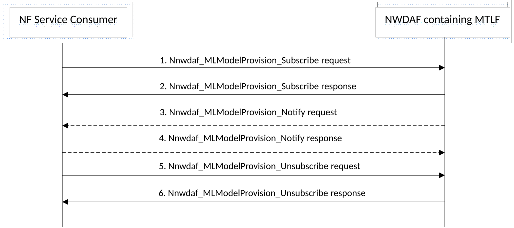

# 5.6 ML Model provisioning procedures

## 5.6.1 General

The ML Model provisioning procedures allow the NF service consumers (i.e. NWDAF (MTLF+AnLF), NWDAF (AnLF)) to obtain the ML model information on the related Analytics from another NWDAF (i.e. an NWDAF containing MTLF). The ML Model provisioning procedures also allow an NWDAF (MTLF) to subscribe/unsubscribe at another NWDAF (MTLF), i.e., an FL server NWDAF, to be notified when ML Model Information on the related Analytics becomes available.

## 5.6.2 ML Model Subscribe/Unsubscribe/Notify procedure

The procedure is used by an NF service consumer to subscribe to/unsubscribe from the ML model information on the related Analytics on NWDAF containing MTLF, and also used by the NWDAF containing MTLF to notify the ML model information to the NF service consumer if it subscribed to the ML model information previously.

Figure 5.6.2-1: ML Model Subscribe/Unsubscribe/Notify procedure

1\. In order to subscribe to ML model information, the NF service consumer invokes Nnwdaf_MLModelProvision_Subscribe service operation by sending an HTTP POST request targeting the resource "NWDAF ML Model Provision Subscriptions", as described in clause 4.5.2.2 of 3GPP TS 29.520 \[5\]. See 3GPP TS 29.520 \[5\] clause 5.4 for details.

In order to modify the existing subscription, the NF service consumer invokes Nnwdaf_MLModelProvision_Subscribe service operation by sending an HTTP PUT request with Resource URI of the resource "Individual NWDAF ML Model Provision Subscription".

2\. The NWDAF containing MTLF responds to the Nnwdaf_MLModelProvision_Subscribe service operation. Upon receipt of the HTTP POST request, if the subscription is accepted to be created, the NWDAF containing MTLF responds to the NF service consumer with "201 Created", and the URI of the created subscription is included in the Location header field.

Upon receipt of the HTTP PUT request, if the subscription is accepted to be updated, the NWDAF containing MTLF responds to the NF service consumer an HTTP "200 OK" with a response body containing a representation of the updated subscription or "204 No Content".

3\. If the NWDAF containing MTLF determines that the subscribed ML model information is available, the NWDAF containing MTLF invokes Nnwdaf_MLModelProvision_Notify service operation to report the ML model information by sending an HTTP POST request to the NF service consumer identified by the notification URI received during the creation/modification of the subscriptions, as described in clause 4.5.2.4 of 3GPP TS 29.520 \[5\].

4\. The NF service consumer responds to the NWDAF containing MTLF with an HTTP "204 No Content" message.

5\. In order to unsubscribe from the notification(s) of the ML model information, the NF service consumer invokes Nnwdaf_MLModelProvision_Unsubscribe service operation by sending an HTTP DELETE request, which targets the resource "Individual NWDAF ML Model Provision Subscription", to the NWDAF containing MTLF.

6\. If the request is accepted, the NWDAF containing MTLF deletes the subscription and responds to the NF service consumer with an HTTP "204 No Content" message.

NOTE: For details of Nnwdaf_MLModelProvision_Subscribe/Unsubscribe/Notify service operations refer to 3GPP TS 29.520 \[5\].
