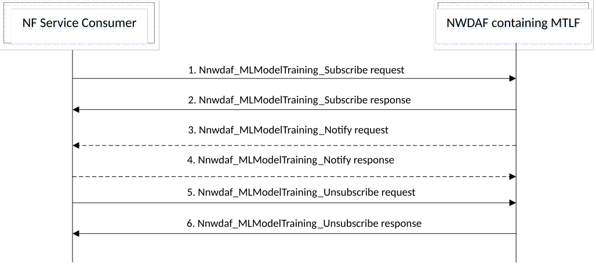

# 5.6A ML Model Training procedures

## 5.6A.1 General

The ML Model training procedures allow the NF service consumers (i.e. NWDAF containing MTLF) to subscribe to another NWDAF (i.e. an NWDAF containing MTLF) for a trained ML model and/or the information about ML model training based on the ML model file or ML Model information provided by the consumer and the data for the training.

## 5.6A.2 ML Model Training Subscribe/Unsubscribe/Notify procedure

The procedure is used by an NF service consumer to subscribe to/unsubscribe from the ML model training, and also used by the NWDAF containing MTLF to notify the ML model and/or ML model training information to the NF service consumer if it subscribed to the ML model and/or ML model training information previously.

Figure 5.6A.2-1: ML Model Training Subscribe/Unsubscribe/Notify procedure

1\. In order to subscribe to ML model and/or ML model training information, the NF service consumer invokes Nnwdaf_MLModelTraining_Subscribe service operation by sending an HTTP POST request targeting the resource "NWDAF ML Model Training Subscriptions", as described in clause 4.6.2.2 of 3GPP TS 29.520 \[5\]. See 3GPP TS 29.520 \[5\] clause 5.5 for details.

In order to modify the existing subscription, the NF service consumer invokes Nnwdaf_MLModelTraining_Subscribe service operation by sending an HTTP PUT request or an HTTP PATCH request with Resource URI of the resource "Individual NWDAF ML Model Training Subscription".

2\. The NWDAF containing MTLF responds to the Nnwdaf_MLModelTraining_Subscribe service operation. Upon receipt of the HTTP POST request, if the subscription is accepted to be created, the NWDAF containing MTLF responds to the NF service consumer with "201 Created", and the URI of the created subscription is included in the Location header field.

Upon receipt of the HTTP PUT request or the HTTP PATCH request, if the subscription is accepted to be updated, the NWDAF containing MTLF responds to the NF service consumer an HTTP "200 OK" with a response body containing a representation of the updated subscription or "204 No Content".

3\. If the NWDAF containing MTLF determines that the subscribed ML model and/or ML model training information is available, the NWDAF containing MTLF invokes Nnwdaf_MLModelTraining_Notify service operation to report the ML model and/or ML model training information by sending an HTTP POST request to the NF service consumer identified by the notification URI received during the creation/modification of the subscriptions, as described in clause 4.6.2.4 of 3GPP TS 29.520 \[5\].

4\. The NF service consumer responds to the NWDAF containing MTLF with an HTTP "204 No Content" message.

5\. In order to unsubscribe from the notification(s) of the ML model and/or ML model training information, the NF service consumer invokes Nnwdaf_MLModelTraining_Unsubscribe service operation by sending an HTTP DELETE request, which targets the resource "Individual NWDAF ML Model Training Subscription", to the NWDAF containing MTLF.

6\. If the request is accepted, the NWDAF containing MTLF deletes the subscription and responds to the NF service consumer with an HTTP "204 No Content" message.

NOTE: For details of Nnwdaf_MLModelTraining_Subscribe/Unsubscribe/Notify service operations refer to 3GPP TS 29.520 \[5\].
