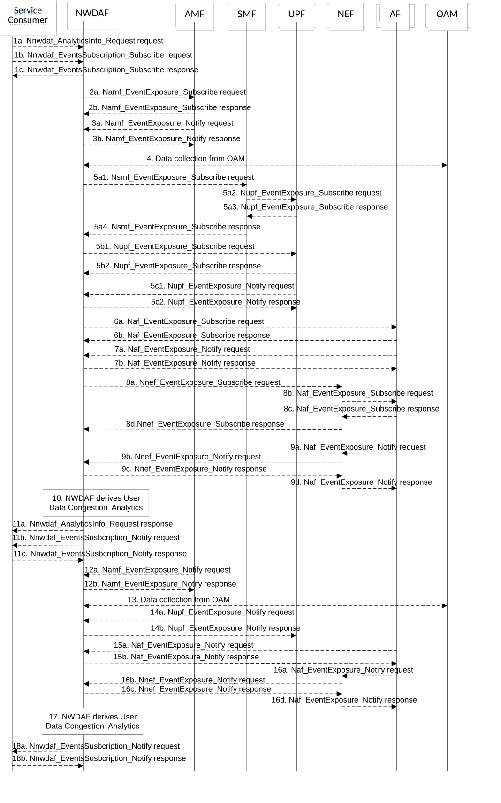

# 5.7.10 User Data Congestion Analytics

This procedure is used by the NWDAF service consumer (may be an NF e.g. NEF, AF, or PCF) to obtain the User Data Congestion analytics which are calculated by the NWDAF based on the information collected from the AMF, OAM, UPF and/or AF.

Figure 5.7.10-1: Procedure for User Data Congestion Analytics

1a. In order to obtain the User Data Congestion analytics, the NWDAF service consumer may invoke Nnwdaf_AnalyticsInfo_Request service operation as described in clause 5.2.3.1, the requested event is set to "USER_DATA_CONGESTION" with the supported feature "UserDataCongestion".

1b-1c. In order to obtain the User Data Congestion analytics, the NWDAF service consumer may invoke Nnwdaf_EventsSubscription_Subscribe service operation as described in clause 5.2.2.1, the subscribed event is set to "USER_DATA_CONGESTION" with the supported feature "UserDataCongestion".

2a-2b. The NWDAF may invoke Namf_EventExposure_Subscribe service operation as described in clause 5.3.2.2.2 of 3GPP TS 29.518 \[18\] to retrieve the UE location information. The AMF responds to the NWDAF an HTTP "201 Created" response.

3a-3b. If step 2a and step 2b are performed, the AMF may invoke Namf_EventExposure_Notify service operation as described in 3GPP TS 29.518 \[18\] clause 5.3.2.4. The NWDAF responds to the AMF an HTTP "204 No Content" response.

4\. The NWDAF may collect "Performance measurement" to the OAM to get the Performance Measurements that will be used by the NWDAF to determine congestion levels. Performance Measurements are related to information transfer over the user plane and/or the control plane (e.g. UE Throughput, DRB Setup Management, RRC Connection Number, PDU Session Management, and Radio Resource Utilization as defined in 3GPP TS 28.552 \[27\]). The NWDAF may obtain measurements by invoking management services that are defined in 3GPP TS 28.532 \[19\] and 3GPP TS 28.550 \[31\].

5\. The NWDAF may subscribe to collect data related to User Data Congestion analytics information from UPF either via the SMF (by performing steps 5a1, 5a2, 5a3, and 5a4, which are the same as steps 3a, 4a, 4b, and 3b of clause 5.7.19) or directly to the UPF (by performing steps 5b1, 5b2, which are the same as steps 5a and 5b of clause 5.7.19). Then, by performing steps 5c1 and 5c2 the UPF may invoke the Nupf_EventExposure_Notify service operation by sending an HTTP POST request to the NWDAF identified by the notification URI provided in step 5a1 or step 5b1 and the NWDAF responds to the UPF with an HTTP "204 No Content" response as described in 3GPP TS 29.564 \[40\].

6a-6b. If the AF is trusted, the NWDAF may invoke Naf_EventExposure_Subscribe service operation to the AF directly by sending an HTTP POST request targeting the resource "Application Event Subscriptions" to collect the data related to User Data Congestion analytics information. The AF responds to the NWDAF an HTTP "201 Created" response.

7a-7b. If step 6a and step 6b are performed, the AF invokes Naf_EventExposure_Notify service operation by sending an HTTP POST request to the NWDAF identified by the notification URI received in step 6a. The NWDAF responds to the AF an HTTP "204 No Content" response.

8a-8d. If the AF is untrusted, the NWDAF may invoke Nnef_EventExposure_Subscribe service operation to the NEF by sending an HTTP POST request targeting the resource "Network Exposure Event Subscriptions" and then the NEF invokes Naf_EventExposure_Subscribe service operation by sending an HTTP POST request targeting the resource "Application Event Subscriptions" to collect the data related to User Data Congestion analytics information. The AF responds to the NEF an HTTP "201 Created" response and then the NEF responds to the NWDAF an HTTP "201 Created" response.

9a-9d. If step 8a to step 8d are performed, the AF invokes Naf_EventExposure_Notify service operation by sending an HTTP POST request to the NEF identified by the notification URI received in step 8b and the NEF invokes Nnef_EventExposure_Notify service operation by sending an HTTP POST request to the NWDAF identified by the notification URI received in step 8a. The NWDAF responds to the NEF an HTTP "204 No Content" response and then the NEF responds to the AF an HTTP "204 No Content" response.

10\. The NWDAF calculates the User Data Congestion analytics based on the data collected from AMF, OAM, UPF and/or AF.

11a. If step 1a is performed, the NWDAF responds to the Nnwdaf_AnalyticsInfo_Request service operation as described in clause 5.2.3.1.

11b-11c. If step 1b and step 1c are performed, the NWDAF invokes Nnwdaf_EventsSusbcription_Notify service operation as described in clause 5.2.2.1.

12a-12b. The same as step 3a and step 3b.

13\. The same as step 4.

14a-14b. The same as step 5c1 and step 5c2.

15a-15b. The same as step 7a and step 7b.

16a-16d. The same as step 9a to step 9d.

17\. The same as step 10.

18a-18b. The same as step 11b and step 11c.

NOTE 1: For details of Naf_EventExposure_Subscribe/Notify service operations refer to 3GPP TS 29.517 \[12\].

NOTE 2: For details of Nnef_EventExposure_Subscribe/Notify service operations refer to 3GPP TS 29.591 \[11\].

NOTE 3: For details of Nnwdaf_EventsSubscription_Subscribe/Unsubscribe/Notify or Nnwdaf_AnalyticsInfo_Request service operations refer to 3GPP TS 29.520 \[5\].
