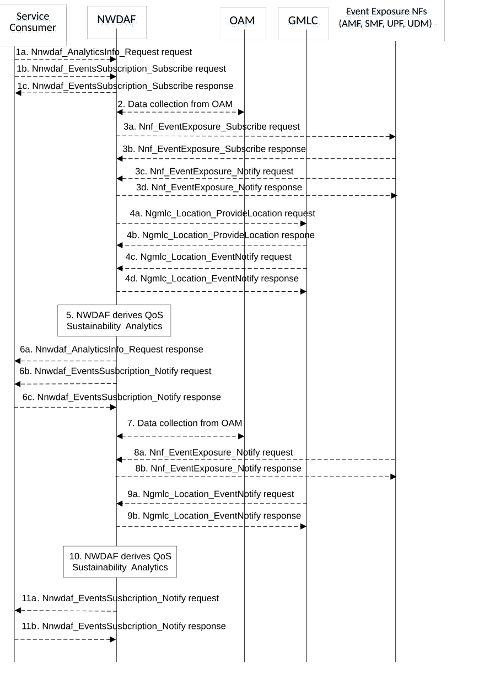

# 5.7.11 QoS Sustainability Analytics

This procedure is used by the NWDAF service consumer (maybe an NF, e.g. AF) to obtain the QoS Sustainability analytics, which are calculated by the NWDAF based on the information collected from the OAM, AMF, SMF, UPF, UDM and GMLC, for a path of interest or for an area of interest with coarse granularity (i.e. TAIs or Cell IDs) or fine granularity (e.g. smaller than a cell).

Figure 5.7.11-1: Procedure for QoS Sustainability Analytics

1a. In order to obtain the QoS sustainability analytics, the NWDAF service consumer may invoke Nnwdaf_AnalyticsInfo_Request service operation as described in clause 5.2.3.1, the requested event is sent to "QOS_SUSTAINABILITY" with the supported feature "QoSSustainability".

1b-1c. In order to obtain the QoS sustainability analytics, the NWDAF service consumer may invoke Nnwdaf_EventsSubscription_Subscribe service operation as described in clause 5.2.2.1, the subscribed event is set to "QOS_SUSTAINABILITY" with the supported feature "QoSSustainability".

2\. The NWDAF may collect "Performance measurement" to the OAM to get the RAN UE Throughput in clause 6.3.6 of 3GPP TS 28.554 \[30\], QoS flow Retainability information as described in clause 6.5.1 of 3GPP TS 28.554 \[30\]. If the "QoSSustainabilityExt_eNA" feature is supported, the NWDAF may collect the average UL/DL packet transmission delay through RAN part to the UE as described in clause 6.3.1.2 of 3GPP TS 28.554 \[30\], the UL/DL packet delay on GTP path on N3 for non-GBR traffic, the UL/DL capacity measurement from UPF to NG-RAN or from UE to UPF based on GTP path, and the UL/DL available capacity measurement from UPF to NG-RAN or from UE to UPF based on GTP path as described in clause 5.1 and clause 5.4 of 3GPP TS 28.552 \[27\].

> 3a-3b. For the fine granularity data collection, the NWDAF may invoke Nnf_EventExposure_Subscribe service operations (as described in clause 5.5.2.2 of 3GPP TS 29.503 \[22\] for the UDM, clause 5.3.2.2 of 3GPP TS 29.518 \[18\] for the AMF, clause 4.2.3 of 3GPP TS 29.508 \[6\] for the SMF, clause 5.2.2.2 of 3GPP TS 29.564 \[40\] for the UPF), to subscribe to related data collection event(s) exposure. If the QoS information collected from UPF , the NWDAF may invoke Nsmf_EventExposure_Subscribe service operation as described in 3GPP TS 29.508 \[6\] and the SMF may subscribe to the UPF on behalf of the NWDAF via N4 Session Reporting Rule as described in clause 5.2.8 of 3GPP TS 29.244 \[45\]. The NF responds to the NWDAF an HTTP "201 Created" response.
>
> 3c-3d. If step 3a and step 3b are performed, the NF invokes Nnf_EventExposure_Notify service operation (as described in clause 5.5.2.4 of 3GPP TS 29.503 \[22\] for the UDM, clause 5.3.2.4 of 3GPP TS 29.518 \[18\] for the AMF, clause 4.2.2 of 3GPP TS 29.508 \[6\] for the SMF, clause 5.2.2.3 of 3GPP TS 29.564 \[40\] for the UPF). The NWDAF responds to the NF an HTTP "204 No Content" response.

4a-4b. For the fine granularity data collection, the NWDAF may invoke Ngmlc_Location_ProvideLocation service operation by sending an HTTP POST request to the URI associated with the "provide-location" custom operation as described in 3GPP TS 29.515 \[41\] clause 5.2.2.2. The GMLC responds to the NWDAF an HTTP "200 OK" response.

4c-4d. If step 4a and step 4b are performed, the GMLC may invoke Ngmlc_Location_EventNotify service operation by sending an HTTP POST request to the NWDAF identified by the notification URI received in step 4a. The NWDAF responds to the GMLC an HTTP "204 No Content" response.

5\. The NWDAF calculates the QoS sustainability analytics based on the data collected from OAM for coarse granularity or based on the data collected from OAM, AMF, SMF, UDM and/or GMLC for fine granularity.

6a. If step 1a is performed, the NWDAF responds to the Nnwdaf_AnalyticsInfo_Request service operation as described in clause 5.2.3.1.

6b-6c. If step 1b and step 1c are performed, the NWDAF invokes Nnwdaf_EventsSusbcription_Notify service operation as described in clause 5.2.2.1.

7\. The same as step 2.

8a-8b. The same as step 3c-3d.

9a-9b. The same as step 4c-4d.

10\. The same as step 5.

11a-11b. The same as step 6b and step 6c.

NOTE 1: For details of Nnwdaf_EventsSubscription_Subscribe/Unsubscribe/Notify or Nnwdaf_AnalyticsInfo_Request service operations refer to 3GPP TS 29.520 \[5\].

NOTE 2: For details of Nsmf_EventExposure_Subscribe/Notify service operations refer to 3GPP TS 29.508 \[6\].
