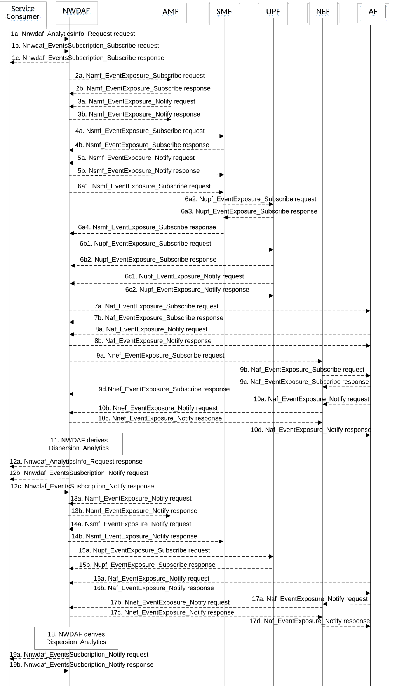

# 5.7.12 Dispersion Analytics

This procedure is used by the NWDAF service consumer to obtain the dispersion analytics which are calculated by the NWDAF based on the information collected from the AMF, SMF, UPF and/or AF.

Figure 5.7.12-1: Procedure for Dispersion Analytics

1a. In order to obtain the Dispersion analytics, the NWDAF service consumer may invoke Nnwdaf_AnalyticsInfo_Request service operation as described in clause 5.2.3.1, the requested event is set to "DISPERSION" with the supported feature "Dispersion".

1b-1c. In order to obtain the Dispersion analytics, the NWDAF service consumer may invoke Nnwdaf_EventsSubscription_Subscribe service operation as described in clause 5.2.2.1, the subscribed event is set to "DISPERSION" with the supported feature "Dispersion".

2a-2b. The NWDAF may invoke Namf_EventExposure_Subscribe service operation as described in clause 5.3.2.2.2 of 3GPP TS 29.518 \[18\] to retrieve the location and/or slice based UE transactions dispersion information. The AMF responds to the NWDAF an HTTP "201 Created" response.

3a-3b. If step 2a and step 2b are performed, the AMF may invoke Namf_EventExposure_Notify service operation as described in 3GPP TS 29.518 \[18\] clause 5.3.2.4. The NWDAF responds to the AMF an HTTP "204 No Content" response.

4a-4b. The NWDAF may invoke Nsmf_EventExposure_Subscribe service operation by sending an HTTP POST request targeting the resource "SMF Notification Subscriptions" to subscribe to the notification of UE transactions dispersion information which may be slice based. The SMF responds to the NWDAF an HTTP "201 Created" response.

5a-5b. If step 4a and step 4b are performed, the SMF may invoke Nsmf_EventExposure_Notify service operation by sending an HTTP POST request to the NWDAF identified by the notification URI received in step 4a. The NWDAF responds to the SMF an HTTP "204 No Content" response.

6a-6c. The NWDAF may subscribe to collect UE data volume dispersion information from the serving UPF either via the SMF (by performing steps 6a1, 6a2, 6a3, and 6a4, which are the same as steps 3a, 4a, 4b, and 3b of clause 5.7.19) or directly to the UPF (by performing steps 6b1, 6b2, which are the same as steps 5a and 5b of clause 5.7.19). Then, the UPF may invoke the Nupf_EventExposure_Notify service operation by sending an HTTP POST request to the NWDAF identified by the notification URI provided in step 6a1 or step 6b1 and the NWDAF responds to the UPF with an HTTP "204 No Content" response as described in 3GPP TS 29.564 \[40\].

7a-7b. If the AF is trusted, the NWDAF may invoke Naf_EventExposure_Subscribe service operation to the AF directly by sending an HTTP POST request targeting the resource "Application Event Subscriptions" to collect the UE data volume dispersion information. The AF responds to the NWDAF an HTTP "201 Created" response.

8a-8b. If step 7a and step 7b are performed, the AF invokes Naf_EventExposure_Notify service operation by sending an HTTP POST request to the NWDAF identified by the notification URI received in step 7a. The NWDAF responds to the AF an HTTP "204 No Content" response.

9a-9d. If the AF is untrusted, the NWDAF may invoke Nnef_EventExposure_Subscribe service operation to the NEF by sending an HTTP POST request targeting the resource "Network Exposure Event Subscriptions" and then the NEF invokes Naf_EventExposure_Subscribe service operation by sending an HTTP POST request targeting the resource "Application Event Subscriptions" to collect the UE data volume dispersion information. The AF responds to the NEF an HTTP "201 Created" response and then the NEF responds to the NWDAF an HTTP "201 Created" response.

10a-10d. If step 9a to step 9d are performed, the AF invokes Naf_EventExposure_Notify service operation by sending an HTTP POST request to the NEF identified by the notification URI received in step 8b and the NEF invokes Nnef_EventExposure_Notify service operation by sending an HTTP POST request to the NWDAF identified by the notification URI received in step 9a. The NWDAF responds to the NEF an HTTP "204 No Content" response and then the NEF responds to the AF an HTTP "204 No Content" response.

11\. The NWDAF calculates the Dispersion analytics based on the data collected from AMF, SMF, UPF and/or AF.

12a. If step 1a is performed, the NWDAF responds to the Nnwdaf_AnalyticsInfo_Request service operation as described in clause 5.2.3.1.

12b-12c. If step 1b and step 1c are performed, the NWDAF invokes Nnwdaf_EventsSusbcription_Notify service operation as described in clause 5.2.2.1.

13a-13b. The same as step 3a and step 3b.

14a-14b. The same as step 5a and step 5b.

15a-15b. The same as step 6c1and step 6c2.

16a-16b. The same as step 8a and step 8b.

17a-17d. The same as step 10a to step 10d.

18\. The same as step 11.

19a-19b. The same as step 12b and step 12c.

NOTE 1: For details of Nsmf_EventExposure_Subscribe/Notify service operations refer to 3GPP TS 29.508 \[6\].

NOTE 2: For details of Naf_EventExposure_Subscribe/Notify service operations refer to 3GPP TS 29.517 \[12\].

NOTE 3: For details of Nnef_EventExposure_Subscribe/Notify service operations refer to 3GPP TS 29.591 \[11\].

NOTE 4: For details of Nnwdaf_EventsSubscription_Subscribe/Unsubscribe/Notify or Nnwdaf_AnalyticsInfo_Request service operations refer to 3GPP TS 29.520 \[5\].
