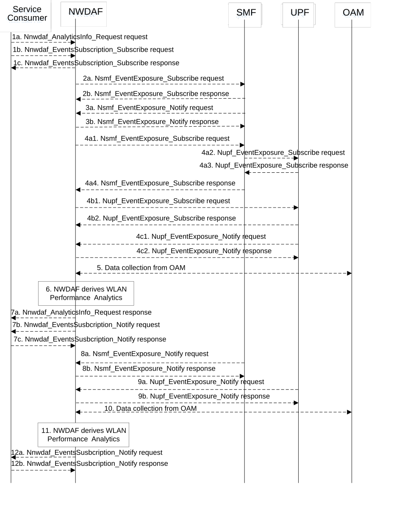

# 5.7.13 WLAN Performance Analytics

This procedure is used by the NWDAF service consumer to obtain the WLAN performance analytics which are calculated by the NWDAF based on the information collected from the SMF, UPF and/or OAM. If the NF is an AF which is untrusted, the AF will request analytics via the NEF as described in clause 5.2.3.2.

Figure 5.7.13-1: Procedure for WLAN Performance Analytics

1a. In order to obtain the WLAN performance analytics, the NWDAF service consumer may invoke Nnwdaf_AnalyticsInfo_Request service operation as described in clause 5.2.3.1, the requested event is set to "WLAN_PERFORMANCE" with the supported feature "WlanPerformance".

1b-1c. In order to obtain the WLAN performance analytics, the NWDAF service consumer may invoke Nnwdaf_EventsSubscription_Subscribe service operation as described in clause 5.2.2.1, the subscribed event is set to "WLAN_PERFORMANCE" with the supported feature "WlanPerformance".

2a-2b. The NWDAF may invoke Nsmf_EventExposure_Subscribe service operation by sending an HTTP POST request targeting the resource "SMF Notification Subscriptions" to subscribe to the notification of Information on PDU Session for WLAN. The SMF responds to the NWDAF an HTTP "201 Created" response.

3a-3b. If step 2a and step 2b are performed, the SMF may invoke Nsmf_EventExposure_Notify service operation by sending an HTTP POST request to the NWDAF identified by the notification URI received in step 2a. The NWDAF responds to the SMF an HTTP "204 No Content" response.

4\. The NWDAF may subscribe to collect UE communications information for WLAN from the UPF either via the SMF (by performing steps 4a1, 4a2, 4a3, and 4a4, which are the same as steps 3a, 4a, 4b, and 3b of clause 5.7.19) or directly to the UPF (by performing steps 4b1, 4b2, which are the same as steps 5a and 5b of clause 5.7.19). Then, the UPF may invoke the Nupf_EventExposure_Notify service operation by sending an HTTP POST request to the NWDAF identified by the notification URI provided in step 4a1 or step 4b1 and the NWDAF responds to the UPF with an HTTP "204 No Content" response as described in 3GPP TS 29.564 \[40\].

5\. The NWDAF may collect WLAN measurement results from the OAM. The WLAN measurement data from OAM is collected via MDT and aligned with the WLAN measurement reporting list described in clause 5.1.1.3.3 of TS 37.320 \[29\].

6\. The NWDAF calculates the WLAN performance analytics based on the data collected from SMF, UPF and/or OAM.

7a. If step 1a is performed, the NWDAF responds to the Nnwdaf_AnalyticsInfo_Request service operation as described in clause 5.2.3.1.

7b-7c. If step 1b and step 1c are performed, the NWDAF invokes Nnwdaf_EventsSusbcription_Notify service operation as described in clause 5.2.2.1.

8a-8b. The same as step 3a and step 3b.

9a-9b. The same as step 4c1and step 6c2.

10\. The same as step 5.

11\. The same as step 6.

12a-12b. The same as step 7b and step 7c.

NOTE 1: For details of Nsmf_EventExposure_Subscribe/Notify service operations refer to 3GPP TS 29.508 \[6\].

NOTE 2: For details of Nnwdaf_EventsSubscription_Subscribe/Unsubscribe/Notify or Nnwdaf_AnalyticsInfo_Request service operations refer to 3GPP TS 29.520 \[5\].
