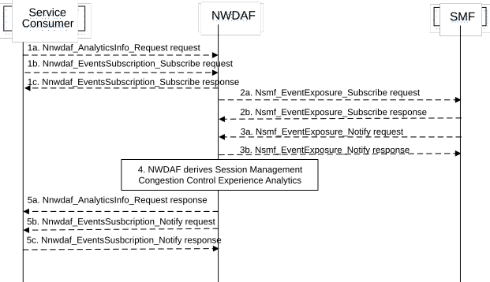

# 5.7.14 Session Management Congestion Control Experience Analytics

This procedure is used by the NWDAF service consumer e.g. SMF to obtain the Session Management Congestion Control Experience Analytics which are calculated by the NWDAF based on the information collected from the SMF.

Figure 5.7.14-1: Procedure for Session Management Congestion Control Experience Analytics

1a. In order to obtain the SMCCE (Session Management Congestion Control Experience) analytics, the NWDAF service consumer may invoke Nnwdaf_AnalyticsInfo_Request service operation as described in clause 5.2.3.1, the requested event is set to "SM_CONGESTION" with the supported feature "SMCCE".

1b-1c. In order to obtain the SMCCE (Session Management Congestion Control Experience) analytics, the NWDAF service consumer may invoke Nnwdaf_EventsSubscription_Subscribe service operation as described in clause 5.2.2.1, the subscribed event is set to "SM_CONGESTION" with the supported feature "SMCCE".

2a-2b. The NWDAF may invoke Nsmf_EventExposure_Subscribe service operation by sending an HTTP POST request targeting the resource "SMF Notification Subscriptions" to subscribe to the notification of Information on UE ID and SMCC experience for PDU Session. The SMF responds to the NWDAF an HTTP "201 Created" response.

3a-3b. If step 2a and step 2b are performed, the SMF may invoke Nsmf_EventExposure_Notify service operation by sending an HTTP POST request to the NWDAF identified by the notification URI received in step 2a. The NWDAF responds to the SMF an HTTP "204 No Content" response.

4\. The NWDAF calculates the Session Management Congestion Control Experience analytics based on the data collected from SMF.

5a. If step 1a is performed, the NWDAF responds to the Nnwdaf_AnalyticsInfo_Request service operation as described in clause 5.2.3.1.

5b-5c. If step 1b and step 1c are performed, the NWDAF invokes Nnwdaf_EventsSusbcription_Notify service operation as described in clause 5.2.2.1.

NOTE 1: For details of Nsmf_EventExposure_Subscribe/Notify service operations refer to 3GPP TS 29.508 \[6\].

NOTE 2: For details of Nnwdaf_EventsSubscription_Subscribe/Unsubscribe/Notify and Nnwdaf_AnalyticsInfo_Request service operations refer to 3GPP TS 29.520 \[5\].
