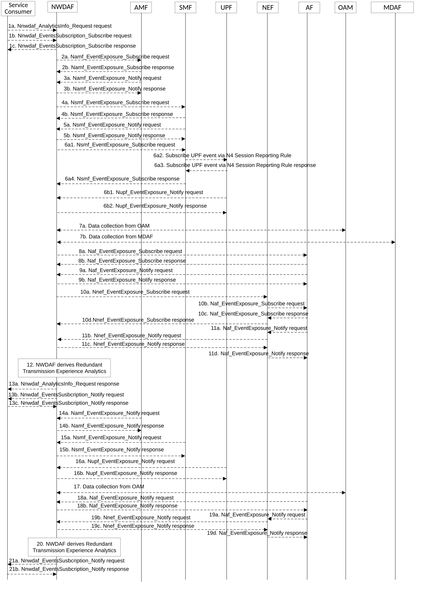

# 5.7.15 Redundant Transmission Experience Analytics

This procedure is used by the NWDAF service consumer (may be an NF e.g. SMF) to obtain the Redundant Transmission Experience Analytics which are calculated by the NWDAF based on the information collected from the AMF, AF, SMF, UPF OAM and/or MDAF.

Figure 5.7.15-1: Procedure for Redundant Transmission Experience Analytics

1a. In order to obtain the Redundant Transmission Experience Analytics, the NWDAF service consumer may invoke Nnwdaf_AnalyticsInfo_Request service operation as described in clause 5.2.3.1, the requested event is set to "RED_TRANS_EXP" with the supported feature "RedundantTransmissionExp".

1b-1c. In order to obtain the Redundant Transmission Experience Analytics, the NWDAF service consumer may invoke Nnwdaf_EventsSubscription_Subscribe service operation as described in clause 5.2.2.1, the subscribed event is set to "RED_TRANS_EXP" with the supported feature "RedundantTransmissionExp".

2a-2b. The NWDAF may invoke Namf_EventExposure_Subscribe service operation as described in clause 5.3.2.2.2 of 3GPP TS 29.518 \[18\] to retrieve the UE Mobility information. The AMF responds to the NWDAF an HTTP "201 Created" response.

3a-3b. If step 2a and step 2b are performed, the AMF may invoke Namf_EventExposure_Notify service operation as described in 3GPP TS 29.518 \[18\] clause 5.3.2.4. The NWDAF responds to the AMF an HTTP "204 No Content" response.

4a-4b. The NWDAF may invoke Nsmf_EventExposure_Subscribe service operation by sending an HTTP POST request targeting the resource "SMF Notification Subscriptions" to subscribe to the notification of Information related to PDU Session established with redundant transmission. The SMF responds to the NWDAF an HTTP "201 Created" response.

5a-5b. If step 4a and step 4b are performed, the SMF may invoke Nsmf_EventExposure_Notify service operation by sending an HTTP POST request to the NWDAF identified by the notification URI received in step 4a. The NWDAF responds to the SMF an HTTP "204 No Content" response.

6\. The NWDAF may collect data related to packet delay measurement information from UPF via the SMF by sending an HTTP POST request targeting the resource "SMF Notification Subscriptions" as described in 3GPP TS 29.508 \[6\], the SMF subscribes to the UPF on behalf of the NWDAF via N4 Session Reporting Rule as described in clause 5.2.8 of 3GPP TS 29.244 \[45\]. Then, the UPF may invoke the Nupf_EventExposure_Notify service operation by sending an HTTP POST request to the NWDAF identified by the notification URI provided in step 6a1 and the NWDAF responds to the UPF with an HTTP "204 No Content" response as described in 3GPP TS 29.564 \[40\].

7a. The NWDAF may collect "Performance measurement" to the OAM to get the UL/DL packet drop rate on GTP path on N3, UL/DL packet delay measurement on GTP path on N3 and/or UL/DL packet drop/loss rate of RAN part measurement refer to clause 5.1 of TS 28.552 \[27\] for the performance measurement in NG-RAN.

7b. The NWDAF may collect end-to-end analysis as specified in clause 8.4.2.4.3 of TS 28.104 \[38\] from MDAF. The information element of the analysis from MDAF include E2ELatencyIssueType and AffectedObjects.

8a-8b. If the AF is trusted, the NWDAF may invoke Naf_EventExposure_Subscribe service operation to the AF directly by sending an HTTP POST request targeting the resource "Application Event Subscriptions" to collect the service data related to UE mobility information. The AF responds to the NWDAF an HTTP "201 Created" response.

9a-9b. If step 8a and step 8b are performed, the AF invokes Naf_EventExposure_Notify service operation by sending an HTTP POST request to the NWDAF identified by the notification URI received in step 8a. The NWDAF responds to the AF an HTTP "204 No Content" response.

10a-10d. If the AF is untrusted, the NWDAF may invoke Nnef_EventExposure_Subscribe service operation to the NEF by sending an HTTP POST request targeting the resource "Network Exposure Event Subscriptions" and then the NEF invokes Naf_EventExposure_Subscribe service operation by sending an HTTP POST request targeting the resource "Application Event Subscriptions" to collect the service data related to UE mobility information. The AF responds to the NEF an HTTP "201 Created" response and then the NEF responds to the NWDAF an HTTP "201 Created" response.

11a-11d. If step 10a to step 10d are performed, the AF invokes Naf_EventExposure_Notify service operation by sending an HTTP POST request to the NEF identified by the notification URI received in step 10b and the NEF invokes Nnef_EventExposure_Notify service operation by sending an HTTP POST request to the NWDAF identified by the notification URI received in step 10a. The NWDAF responds to the NEF an HTTP "204 No Content" response and then the NEF responds to the AF an HTTP "204 No Content" response.

12\. The NWDAF calculates the Redundant Transmission Experience Analytics based on the data collected from AMF, AF SMF, UPF OAM and/or MDAF.

13a. If step 1a is performed, the NWDAF responds to the Nnwdaf_AnalyticsInfo_Request service operation as described in clause 5.2.3.1.

13b-13c. If step 1b and step 1c are performed, the NWDAF invokes Nnwdaf_EventsSusbcription_Notify service operation as described in clause 5.2.2.1.

14a-14b. The same as step 3a and step 3b.

15a-15b. The same as step 5a and step 5b.

16a-16b. The same as step 6c1 and step 6c2.

17\. The same as step 7.

18a-18b. The same as step 9a and step 9b.

19a-18d. The same as step 11a and step 11d.

20\. The same as step 12.

21a-21b. The same as step 13b and step 13c.

NOTE 1: For details of Naf_EventExposure_Subscribe/Notify service operations refer to 3GPP TS 29.517 \[12\].

NOTE 2: For details of Nsmf_EventExposure_Subscribe/Notify service operations refer to 3GPP TS 29.508 \[6\].

NOTE 3: For details of Nnwdaf_EventsSubscription_Subscribe/Unsubscribe/Notify or Nnwdaf_AnalyticsInfo_Request service operations refer to 3GPP TS 29.520 \[5\].
