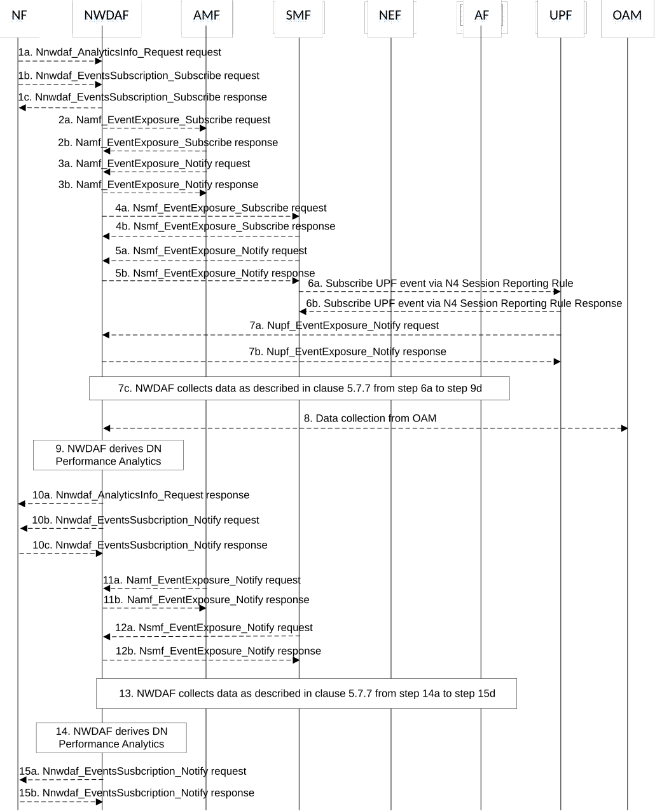

# 5.7.16 DN Performance Analytics

This procedure is used by the NF to obtain DN performance analytics, which is calculated by the NWDAF based on the information collected from the AMF, SMF, AF, UPF and/or OAM. If the NF is an AF which is untrusted, the AF will request analytics via the NEF as described in clause 5.2.3.2.

Figure 5.7.16-1: Procedure for DN Performance Analytics

1a. In order to obtain the DN performance analytics, the NF may invoke Nnwdaf_AnalyticsInfo_Request service operation as described in clause 5.2.3.1.

1b-1c. In order to obtain the DN performance analytics, the NF may invoke Nnwdaf_EventsSubscription_Subscribe service operation as described in clause 5.2.2.1.

2a-2b. The NWDAF may invoke Namf_EventExposure_Subscribe service operation as described in clause 5.3.2.2.2 of 3GPP TS 29.518 \[18\] to retrieve the UE location information and SUPI(s) from AMF. The AMF responds to the NWDAF an HTTP "201 Created" response.

3a-3b. If step 2a and step 2b are performed, the AMF may invoke Namf_EventExposure_Notify service operation as described in 3GPP TS 29.518 \[18\] clause 5.3.2.4. The NWDAF responds to the AMF an HTTP "204 No Content" response.

4a-4b. The NWDAF may invoke Nsmf_EventExposure_Subscribe service operation by sending an HTTP POST request targeting the resource "SMF Notification Subscriptions" to request DNN, S-NSSAI, application ID, UPF info, DNAI, IP filter information and QFI. The SMF responds to the NWDAF an HTTP "201 Created" response.

5a-5b. If step 4a and step 4b are performed, the SMF may invoke Nsmf_EventExposure_Notify service operation by sending an HTTP POST request to the NWDAF identified by the notification URI received in step 4a. The NWDAF responds to the SMF an HTTP "204 No Content" response.

6a-6b. To collect QoS flow bit rate, QoS flow packet delay, packet transmission and packet retransmission information from UPF, after step 5 was performed, the SMF may subscribe to the UPF on behalf of the NWDAF via N4 Session Reporting Rule as described in clause 5.2.8 of 3GPP TS 29.244 \[45\].

7a-7b. The UPF invokes Nupf_EventExposure_Notify service operation by sending an HTTP POST request to the NWDAF identified by the notification URI received in step 6a. The NWDAF responds to the UPF an HTTP "204 No Content" response.

7c. The NWDAF may collect performance data from AF as described in clause 5.7.7 from step 6a to step 9d.

8\. The NWDAF may collect Reference Signal Received Power and Reference Signal Received Quality as specified in clause 5.5 of TS 38.331 \[33\] and clause 5.5.5 of TS 36.331 \[34\], Signal-to-noise and interference ratio as specified in clause 5.1 of TS 38.215 \[35\], the mapping information between cell ID and frequency and Cell Energy Saving State data as specified in clauses 3.1 and 6.2 of TS 28.310 \[36\] from OAM.

9\. The NWDAF calculates the DN performance analytics based on the data collected from AMF, SMF, AF, UPF and/or OAM.

10a. If step 1a is performed, the NWDAF responds to the Nnwdaf_AnalyticsInfo_Request service operation as described in clause 5.2.3.1.

10b-10c. If step 1b and step 1c are performed, the NWDAF may invoke Nnwdaf_EventsSusbcription_Notify service operation as described in clause 5.2.2.1.

11a-11b. The same as step 3a and step 3b.

12a-12b. The same as step 5a and step 5b.

13\. The same as step 6.

14\. The same as step 9.

15a-15b. The same as step 10b and step 10c.

NOTE 1: For details of N4 Session Reporting Report refer to 3GPP TS 29.244 \[45\].

NOTE 2: For details of Nsmf_EventExposure_Subscribe/Notify service operations refer to 3GPP TS 29.508 \[6\].

NOTE 3: For details of Nnwdaf_EventsSubscription_Subscribe/Unsubscribe/Notify or Nnwdaf_AnalyticsInfo_Request service operations refer to 3GPP TS 29.520 \[5\].
