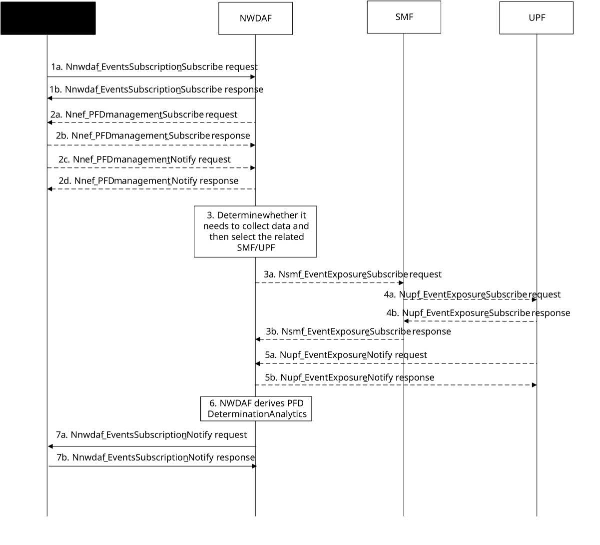

# 5.7.17 PFD Determination Analytics

This procedure is used by the NWDAF service consumer e.g. NEF(PFDF) to obtain PFD determination analytics for the know application(s), which is calculated by the NWDAF based on the information collected from the UPF and the NEF(PFDF).

Figure 5.7.17-1: Procedure for PFD Determination Analytics

1a-1b. In order to obtain the PFD determination analytics, the consumer NF may invoke Nnwdaf_EventsSubscription_Subscribe service operation as described in clause 5.2.2.1.

2a-2b. The NWDAF may invoke Nnef_PFDmanagement_Subscribe service operation as described in clause 4.2.3 of 3GPP TS 29.551 \[39\] by sending an HTTP POST request targeting the resource "PFD subscriptions" to subscribe to retrieve PFDs for an Application Identifier(s) from the NEF (PFDF). The NEF (PFDF) responds to the NWDAF an HTTP "201 Created" response.

2c-2d. The NEF (PFDF) may invoke Nnef_PFDmanagement_Notify service operation by sending an HTTP POST request to the NWDAF identified by the notification URI received in step 2a. The NWDAF responds to the NEF (PFDF) an HTTP "204 No Content" response.

3\. The NWDAF determines whether it needs to collect data.

3a-3b. The NWDAF may invoke Nsmf_EventExposure_Subscribe service operation by sending an HTTP POST request targeting the resource "SMF Notification Subscriptions" as described in 3GPP TS 29.508 \[6\] to subscribe via the SMF to UPF to retrieve the application traffic flow related information for the application. The SMF responds to the NWDAF an HTTP "201 Created" response after having received HTTP "201 Created" response from the UPF.

4a-4b. The SMF subscribes to the UPF on behalf of the NWDAF by invoking Nupf_EventExposure_Subscribe service operation as described in clause 5.2.2.2 of 3GPP TS 29.564 \[40\] to retrieve the application traffic flow related information from the UPF. The UPF responds to the SMF an HTTP "201 Created" response.

5a-5b. The UPF invokes Nupf_EventExposure_Notify service operation by sending an HTTP POST request to the NWDAF identified by the notification URI received in step 4a or step 5a. The NWDAF responds to the UPF an HTTP "204 No Content" response.

6\. The NWDAF calculates the PFD determination analytics based on the data collected from UPF and NEF (PFDF).

7a-7b. If step 1a and step 1b are performed, the NWDAF invokes Nnwdaf_EventsSusbcription_Notify service operation as described in clause 5.2.2.1 containing the PFD determination analytics information in the case that the NWDAF decides the PFD information for the existing Application ID is new or to be updated.

NOTE 1: For details of Nsmf_EventExposure_Subscribe/Notify service operations refer to 3GPP TS 29.508 \[6\].

NOTE 2: For details of Nnwdaf_EventsSubscription_Subscribe/Unsubscribe/Notify or Nnwdaf_AnalyticsInfo_Request service operations refer to 3GPP TS 29.520 \[5\].

NOTE 3: For details of Nnef_PFDManagement_Subscribe/Unsubscribe/Notify service operations refer to 3GPP TS 29.551 \[39\].

NOTE 4: For details of Nupf_EventExposure_Subscribe/Unsubscribe/Notify service operations refer to 3GPP TS 29.564 \[40\].
