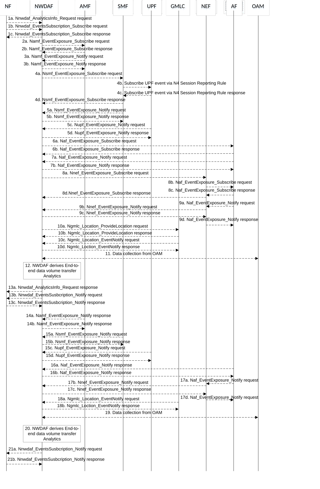

# 5.7.18 E2E data volume transfer time analytics

This procedure is used by the NWDAF service consumer (may be an NF e.g. AF or NEF) to obtain E2E (end-to-end) data volume transfer time analytics, which is calculated by the NWDAF based on the information collected from the AMF, SMF, UPF, AF, LCS via GMLC and/or OAM. If the NF is an AF which is untrusted, the AF will request analytics via the NEF as described in clause 5.2.3.2.

Figure 5.7.18-1: Procedure for E2E data volume transfer time analytics

1a. In order to obtain the E2E data volume transfer time analytics, the NWDAF service consumer may invoke Nnwdaf_AnalyticsInfo_Request service operation as described in clause 5.2.3.1.

1b-1c. In order to obtain the E2E data volume transfer time analytics, the NF may invoke Nnwdaf_EventsSubscription_Subscribe service operation as described in clause 5.2.2.1.

2a-2b. The NWDAF may invoke Namf_EventExposure_Subscribe service operation as described in clause 5.3.2.2.2 of 3GPP TS 29.518 \[18\] to retrieve the UE location information and SUPI(s) from AMF. The AMF responds to the NWDAF an HTTP "201 Created" response.

3a-3b. If step 2a and step 2b are performed, the AMF may invoke Namf_EventExposure_Notify service operation as described in 3GPP TS 29.518 \[18\] clause 5.3.2.4. The NWDAF responds to the AMF an HTTP "204 No Content" response.

4a-4d. The NWDAF may invoke Nsmf_EventExposure_Subscribe service operation by sending an HTTP POST request targeting the resource "SMF Notification Subscriptions" as described in 3GPP TS 29.508 \[6\], and the SMF may subscribe to the UPF on behalf of the NWDAF via N4 Session Reporting Rule as described in clause 5.2.8 of 3GPP TS 29.244 \[45\]. After having received the successful response from the UPF, the SMF responds to the NWDAF an HTTP "201 Created" response.

5a-5b. If step 4a and step 4d are performed, the SMF may invoke Nsmf_EventExposure_Notify service operation by sending an HTTP POST request to the NWDAF identified by the notification URI received in step 4a. The NWDAF responds to the SMF an HTTP "204 No Content" response.

5c-5d. If step 4b and step 4c are performed, the UPF may invoke Nupf_EventExposure_Notify service operation as described in 3GPP TS 29.564 \[40\] by sending an HTTP POST request to the NWDAF identified by the notification URI provided in step 4b. The NWDAF responds to the UPF an HTTP "204 No Content" response.

6a-6b. If the AF is trusted, the NWDAF may invoke Naf_EventExposure_Subscribe service operation to the AF directly by sending an HTTP POST request targeting the resource "Application Event Subscriptions" to collect the End-to-end data volume transfer time information. The AF responds to the NWDAF an HTTP "201 Created" response.

7a-7b. If step 6a and step 6b are performed, the AF invokes Naf_EventExposure_Notify service operation by sending an HTTP POST request to the NWDAF identified by the notification URI received in step 7a. The NWDAF responds to the AF an HTTP "204 No Content" response.

8a-8d. If the AF is untrusted, the NWDAF may invoke Nnef_EventExposure_Subscribe service operation to the NEF by sending an HTTP POST request targeting the resource "Network Exposure Event Subscriptions" and then the NEF invokes Naf_EventExposure_Subscribe service operation by sending an HTTP POST request targeting the resource "Application Event Subscriptions" to collect the E2E data volume transfer time information. The AF responds to the NEF an HTTP "201 Created" response and then the NEF responds to the NWDAF an HTTP "201 Created" response.

9a-9d. If step 8a to step 8d are performed, the AF invokes Naf_EventExposure_Notify service operation by sending an HTTP POST request to the NEF identified by the notification URI received in step 9b and the NEF invokes Nnef_EventExposure_Notify service operation by sending an HTTP POST request to the NWDAF identified by the notification URI received in step 9a. The NWDAF responds to the NEF an HTTP "204 No Content" response and then the NEF responds to the AF an HTTP "204 No Content" response.

10a-10b. The NWDAF may invoke Ngmlc_Location_ProvideLocation service operation to retrieve UE Location and UE Location Accuracy by sending an HTTP POST request to the URI associated with the "provide-location" custom operation as described in 3GPP TS 29.515 \[41\] clause 5.2.2.2. The GMLC responds to the NWDAF an HTTP "200 OK" response.

10c-10d. If step 10a and step 10b are performed, the GMLC may invoke Ngmlc_Location_EventNotify service operation by sending an HTTP POST request to the NWDAF identified by the notification URI received in step 4a. The NWDAF responds to the GMLC an HTTP "204 No Content" response.

11\. The NWDAF may collect RAN part delay for DL and UL per 5QI and S-NSSAI as specified in clauses 6.3.1.2 and 6.3.1.7 of 3GPP TS 28.554 \[30\], RAN Throughput for DL and UL as specified in clauses 5.2.1.1 and 5.4.1.1 of 3GPP TS 37.320 \[29\], RAN Packet delay / Packet loss rate for DL and UL per UE including per DRB per UE packet delay / Packet loss rate as specified in clauses 5.4.1.1 of 3GPP TS 37.320 \[29\], the average of UL/DL packet delay between PSA UPF and UE per S-NSSAI as specified in clauses 5.4.9.1.1 and 5.4.9.2.1 of 3GPP TS 28.552 \[27\], the average DL/UL UE throughput in the gNB per QoS level (mapped 5QI) and per S-NSSAI as specified in clauses 5.1.1.3.1 and 5.1.1.3.3 of 3GPP TS 28.552 \[27\], per UE per supported S-NSSAI and per QoS level of RAN part delay, RAN Packet loss rate and average DL/UL UE throughput in gNB as specified in clause 6.3.1 of 3GPP TS 28.558 \[45\]; per UE per supported S-NSSAI and per QoS level of average UL/DL packet delay between PSA UPF and UE, between PSA UPF and RAN as specified in clause 6.2.2.1 of 3GPP TS 28.558 \[46\] from OAM.

12\. The NWDAF calculates the End-to-end data volume transfer time analytics based on the data collected from AMF, SMF, UPF, AF, LCS via GMLC and/or OAM.

13a. If step 1a is performed, the NWDAF responds to the Nnwdaf_AnalyticsInfo_Request service operation as described in clause 5.2.3.1.

13b-13c. If step 1b and step 1c are performed, the NWDAF may invoke Nnwdaf_EventsSusbcription_Notify service operation as described in clause 5.2.2.1.

14a-14b. Follow the same as step 3a and step 3b.

15a-15d. Follow the same as step 5a to step 5d.

16a-16b. Follow the same as step 7a and step 7b.

17a-17d. Follow the same as step 9a to  9d.

18a-18b. Follow the same as step 10c and step 10d.

19\. Follow the same as step 11.

20\. Follow the same as step 12.

21a-21b. Follow the same as step 13b and step 13c.

NOTE 1: For details of Nsmf_EventExposure_Subscribe/Notify service operations refer to 3GPP TS 29.508 \[6\].

NOTE 2: For details of Naf_EventExposure_Subscribe/Notify service operations refer to 3GPP TS 29.517 \[12\].

NOTE 3: For details of Nnef_EventExposure_Subscribe/Notify service operations refer to 3GPP TS 29.591 \[11\].

NOTE 4: For details of Nnwdaf_EventsSubscription_Subscribe/Unsubscribe/Notify or Nnwdaf_AnalyticsInfo_Request service operations refer to 3GPP TS 29.520 \[5\].
