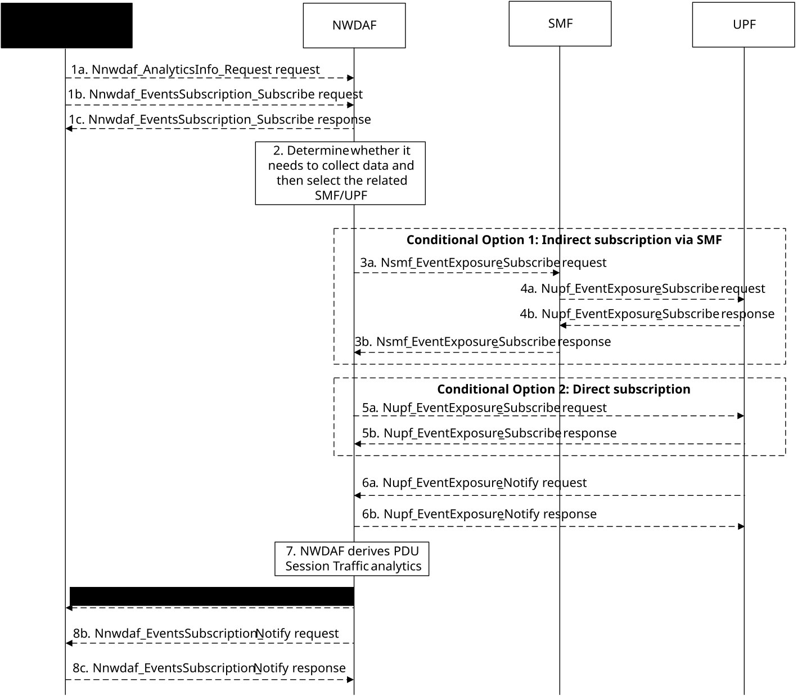

# 5.7.19 PDU Session Traffic Analytics

This procedure is used by the NWDAF service consumer (e.g. PCF) to subscribe or request PDU Session Traffic analytics statistics on whether traffic of UEs via one or multiple PDU sessions is according to the information provided by the service consumer.

Figure 5.7.19-1: Procedure for PDU Session Traffic Analytics

1a. In order to obtain the PDU Session Traffic analytics, the NWDAF service consumer (e.g. PCF) may invoke Nnwdaf_AnalyticsInfo_Request service operation as described in clause 5.2.3.1.

1b-1c. In order to obtain the PDU Session Traffic analytics, the NWDAF service consumer (e.g. PCF) may invoke Nnwdaf_EventsSubscription_Subscribe service operation as described in clause 5.2.2.1.

2\. The NWDAF determines whether it needs to collect the data and, if needed, it collects the data either directly from the UPF or indirectly via the SMF and identifies the SMF(s) and/or UPF(s) to retrieve the data.

3a-3b. \[Conditional Option 1\] The NWDAF shall invoke the Nsmf_EventExposure_Subscribe service operation by sending an HTTP POST request targeting the resource "SMF Notification Subscriptions" as described in 3GPP TS 29.508 \[6\] to subscribe via the SMF to UPF to retrieve "UserDataUsageMeasures" UPF event. The SMF responds to the NWDAF an HTTP "201 Created" response after having received HTTP "201 Created" response from the UPF.

4a-4b. The SMF subscribes to the UPF on behalf of the NWDAF by invoking Nupf_EventExposure_Subscribe service operation as described in clause 5.2.2.2 of 3GPP TS 29.564 \[40\] to retrieve "UserDataUsageMeasures" UPF event from the UPF. The UPF responds to the SMF an HTTP "201 Created" response.

5a-5b. \[Conditional Option 2\] The NWDAF may directly invoke the Nupf_EventExposure_Subscribe service operation as described in clause 5.2.2.2 of 3GPP TS 29.564 \[40\] to retrieve "UserDataUsageMeasures" UPF event from the UPF. The UPF responds to the NWDAF an HTTP "201 Created" response.

NOTE 1: The conditions for subscribing to UPF events directly at the UPF or via the SMF, i.e., the conditions for invoking step 3 or step 5 are described in 3GPP TS 29.564 \[40\].

6a-6b. The UPF invokes Nupf_EventExposure_Notify service operation by sending an HTTP POST request to the NWDAF identified by the notification URI received in step 4a or step 5a. The NWDAF responds to the UPF an HTTP "204 No Content" response.

7\. The NWDAF derives analytics indicating a list of UEs and the traffic they route according to the provided information provided by the consumer (i.e. Traffic Descriptor, S-NSSAI and DNN), including its volume and the traffic they route and a list of UEs which route traffic that it is not expected according to the information provided by the consumer (i.e. Traffic Descriptor, S-NSSAI and DNN) including its volume.).

8a. If step 1a is performed, the NWDAF sends the Nnwdaf_AnalyticsInfo_Request response containing the PDU Session Traffic analytics as described in clause 5.2.3.1.

8b-8c. If step 1b and step 1c are performed, the NWDAF invokes Nnwdaf_EventsSusbcription_Notify service operation containing the PDU Session Traffic analytics as described in clause 5.2.2.1.

NOTE 2: For details of Nnwdaf_EventsSubscription_Subscribe/Unsubscribe/Notify or Nnwdaf_AnalyticsInfo_Request service operations refer to 3GPP TS 29.520 \[5\].

NOTE 3: For details of Nsmf_EventExposure_Subscribe/Notify service operations refer to 3GPP TS 29.508 \[6\].
