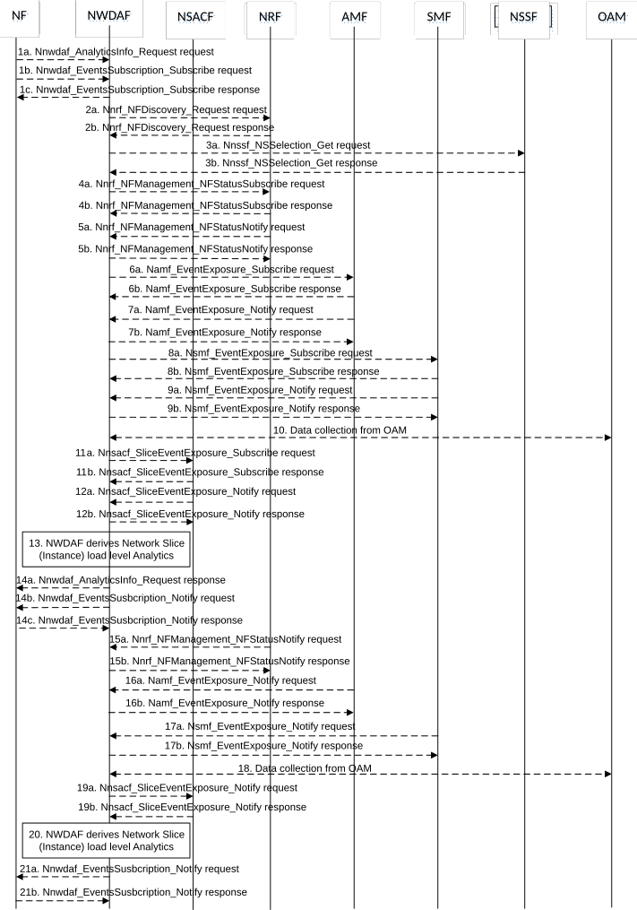

# 5.7.2 Network Slice (Instance) load level Analytics

This procedure is used by the NF to obtain the network slice (instance) load level analytics which are calculated by the NWDAF based on the information collected from the NSACF, NRF, AMF, SMF and/or OAM. If the NF is an AF which is untrusted, the AF will request analytics via the NEF as described in clause 5.2.3.2.

Figure 5.7.2-1: Procedure for Network Slice (Instance) load level Analytics

1a. In order to obtain the network slice (instance) load level analytics, the NF may invoke Nnwdaf_AnalyticsInfo_Request service operation as described in clause 5.2.3.1.

1b-1c. In order to obtain the network slice (instance) load level analytics, the NF may invoke Nnwdaf_EventsSubscription_Subscribe service operation as described in clause 5.2.2.1.

2a-2b. If the event is set to "LOAD_LEVEL_INFORMATION" or "NSI_LOAD_LEVEL", the NWDAF invokes Nnrf_NFDiscovery_Request service operation as described in clause 5.3.2.2 of 3GPP TS 29.510 \[26\] to discover the AMF, SMF and NSSF instance(s) relevant to the analytics filters provided in the subscription request. The NRF responds to the NWDAF an HTTP "201 Created" response.

3a-3b. (Only for "NSI_LOAD_LEVEL")The NWDAF may invoke Nnssf_NSSelection_Get service operation as described in clause 5.2.2.2 of 3GPP TS 29.531 \[21\] to obtain the NSI ID(s) corresponding to the S-NSSAI in the subscription request. The NRF responds to the NWDAF an HTTP "201 Created" response.

4a-4b. (Only for "NSI_LOAD_LEVEL")The NWDAF may invoke Nnrf_NFManagement_NFStatusSubscribe service operation as described in clause 5.2.2.5 of 3GPP TS 29.510 \[26\] to subscribe to the resource usage information of a network slice instance obtained from its constituent NF instances. The NRF responds to the NWDAF an HTTP "201 Created" response.

5a-5b. (Only for "NSI_LOAD_LEVEL") If step 4a and step 4b are performed, the NRF may invoke Nnrf_NFManagement_NFStatusNotify service operation as described in clause 5.2.2.6 of 3GPP TS 29.510 \[26\]. The NWDAF responds to the NRF an HTTP "204 No Content" response.

6a-6b. The NWDAF may invoke Namf_EventExposure_Subscribe service operation as described in clause 5.3.2.2.2 of 3GPP TS 29.518 \[18\] to subscribe to the notification of individual UE registration/deregistration registered to an S-NSSAI or to an S-NSSAI and NSI ID, or request the total number of UEs served by the AMF per S-NSSAI or per S-NSSAI and NSI ID. The AMF responds to the NWDAF an HTTP "201 Created" response.

7a-7b. If step 6a and step 6b are performed, the AMF invokes Namf_EventExposure_Notify service operation as described in 3GPP TS 29.518 \[18\] clause 5.3.2.4. The NWDAF responds to the AMF an HTTP "204 No Content" response.

8a-8b. The NWDAF may invoke Nsmf_EventExposure_Subscribe service operation by sending an HTTP POST request targeting the resource "SMF Notification Subscriptions" to subscribe to the notification of individual PDU session established or PDU session released in an S-NSSAI or request the total number of PDU Sessions established in an S-NSSAI. The SMF responds to the NWDAF an HTTP "201 Created" response.

9a-9b. If step 8a and step 8b are performed, the SMF may invoke Nsmf_EventExposure_Notify service operation by sending an HTTP POST request to the NWDAF identified by the notification URI received in step 8a. The NWDAF responds to the SMF an HTTP "204 No Content" response.

10\. The NWDAF may collect "Performance measurement" to the OAM to get the mean number of UEs registered as described in clause 5.2.1 of TS 28.552 \[27\], mean number of PDU sessions established as described in clause 5.3.1 of TS 28.552 \[27\] and/or the resource usage information of a network slice instance obtained from its constituent NF instances as described in clause 6.2 of TS 28.552 \[27\]. (Obtaining the resource usage information of a network slice instance is only applicable for "NSI_LOAD_LEVEL" event).

11a-11b. The NWDAF may invoke Nnsacf_SliceEventExposure_Subscribe service operation as described in clause 5.3.2.2 of 3GPP TS 29.536 \[20\] to request the number of UEs registered to the network slice and/or the number of PDU sessions established to the network slice.

12a-12b. The NSACF may invoke Nnsacf_SliceEventExposure_Notify service operation as described in clause 5.3.2.4 of 3GPP TS 29.536 \[20\]. The NWDAF responds to the NSACF an HTTP "204 No Content" response.

13\. The NWDAF calculates the network slice (instance) load level analytics based on the data collected from AMF, SMF, NRF, NSACF and/or OAM.

14a. If step 1a is performed, the NWDAF responds to the Nnwdaf_AnalyticsInfo_Request service operation as described in clause 5.2.3.1.

14b-14c. If step 1b and step 1c are performed, the NWDAF invokes Nnwdaf_EventsSusbcription_Notify service operation as described in clause 5.2.2.1.

15a-15b. The same as step 5a and step 5b.

16a-16b. The same as step 7a and step 7b.

17a-17b. The same as step 9a and step 9b.

18\. The same as step 10.

19a-19b. The same as step 12a and step 12b.

20\. The same as step 13.

21a-21b. The same as step 14b and step 14c.

NOTE 1: For details of Nsmf_EventExposure_Subscribe/Notify service operations refer to 3GPP TS 29.508 \[6\].

NOTE 2: For details of Nnwdaf_EventsSubscription_Subscribe/Unsubscribe/Notify or Nnwdaf_AnalyticsInfo_Request service operations refer to 3GPP TS 29.520 \[5\].
