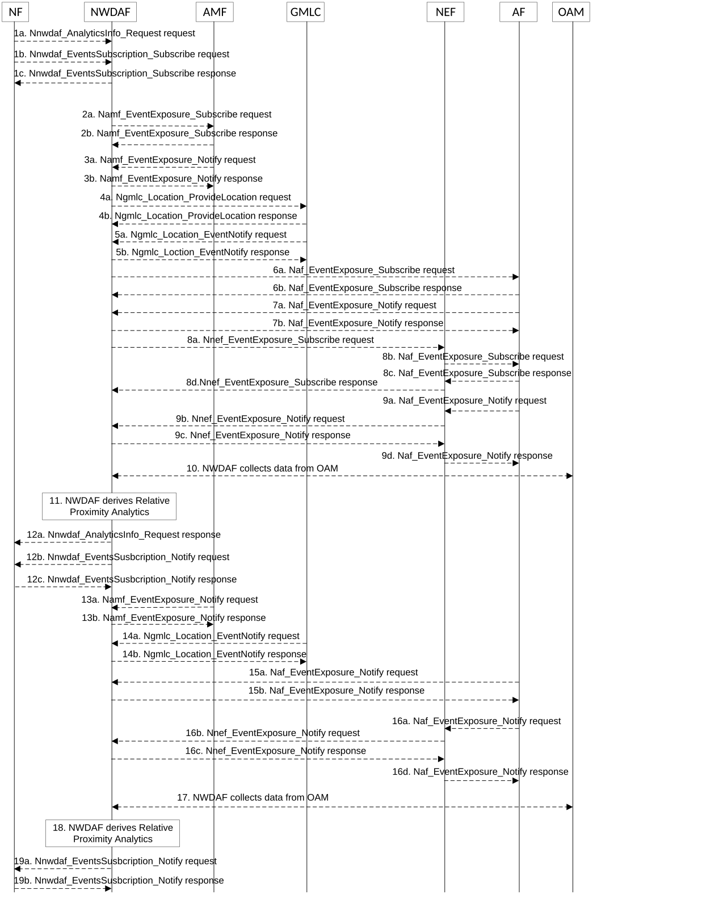

# 5.7.20 Relative Proximity Analytics

This procedure is used by the NWDAF service consumer e.g. NEF or AF to obtain Relative Proximity Analytics among UEs provided by NWDAF to assist more accurately localize a cluster (or a set) of UEs via provisioning statistics and/or prediction information related to their relative proximity.

Figure 5.7.20-1: Procedure for Relative Proximity Analytics

1a. In order to obtain the Relative Proximity Analytics, the NF may invoke Nnwdaf_AnalyticsInfo_Request service operation as described in clause 5.2.3.1.

1b-1c. In order to subscribe to the Relative Proximity Analytics, the NF may invoke Nnwdaf_EventsSubscription_Subscribe service operation as described in clause 5.2.2.1.

2a-2b. If the event is set to "RELATIVE_PROXIMITY" and the subscription/request is authorized, the NWDAF may invoke Namf_EventExposure_Subscribe service operation as described in clause 5.3.2.2.2 of 3GPP TS 29.518 \[18\] to subscribe to the notification of UE ID and UE location. The AMF responds to the NWDAF an HTTP "201 Created" response.

3a-3b. If step 2a and step 2b are performed, the AMF invokes Namf_EventExposure_Notify service operation as described in 3GPP TS 29.518 \[18\] clause 5.3.2.4. The NWDAF responds to the AMF an HTTP "204 No Content" response.

4a-4b. The NWDAF may invoke Ngmlc_Location_ProvideLocation service operation to retrieve UE Location and UE Location Accuracy by sending an HTTP POST request to the URI associated with the "provide-location" custom operation as described in 3GPP TS 29.515 \[41\] clause 5.2.2.2. The GMLC responds to the NWDAF an HTTP "200 OK" response.

5a-5b. If step 4a and step 4b are performed, the GMLC may invoke Ngmlc_Location_EventNotify service operation by sending an HTTP POST request to the NWDAF identified by the notification URI received in step 4a. The NWDAF responds to the GMLC an HTTP "204 No Content" response.

6a-6b. If the AF is trusted, the NWDAF may invoke Naf_EventExposure_Subscribe service operation by sending an HTTP POST request targeting the resource "Application Event Subscriptions" to subscribe the Proximity attributes and/or Proximity related input data of UE(s) from AF directly. The AF responds to the NWDAF an HTTP "201 Created" response.

7a-7b. If step 6a and step 6b are performed, the AF may invoke Naf_EventExposure_Notify service operation by sending an HTTP POST request to the NWDAF identified by the notification URI received in step 6a. The NWDAF responds to the AF an HTTP "204 No Content" response.

8a-8d. If the AF is untrusted, the NWDAF may invoke Nnef_EventExposure_Subscribe service operation to the NEF by sending an HTTP POST request targeting the resource "Network Exposure Event Subscriptions" and then the NEF invokes Naf_EventExposure_Subscribe service operation by sending an HTTP POST request targeting the resource "Application Event Subscriptions". The AF responds to the NEF an HTTP "201 Created" response and then the NEF responds to the NWDAF an HTTP "201 Created" response.

9a-9d. If step 8a to step 8d are performed, the AF may invoke Naf_EventExposure_Notify service operation by sending an HTTP POST request to the NEF identified by the notification URI received in step 8b and the NEF invokes Nnef_EventExposure_Notify service operation by sending an HTTP POST request to the NWDAF identified by the notification URI received in step 8a. The NWDAF responds to the NEF an HTTP "204 No Content" response and then the NEF responds to the AF an HTTP "204 No Content" response.

10\. The NWDAF may collect Per UE information of Speed and Orientation related input data as specified in clause 4.3.30 of TS 28.622 \[42\], clause 11.1 of TS 28.532 \[19\] and clause 5.10.29 of TS 32.422 \[43\].

11\. The NWDAF derives the Relative Proximity Analytics based on the data collected from AMF, GMLC, (DC)AF, and/or OAM.

12a. If step 1a is performed, the NWDAF responds to the Nnwdaf_AnalyticsInfo_Request service operation as described in clause 5.2.3.1.

12b-12c. If step 1b and step 1c are performed, the NWDAF invokes Nnwdaf_EventsSusbcription_Notify service operation as described in clause 5.2.2.1.

13a-13b. The same as step 3a and step 3b.

14a-14b. The same as step 5a and step 5b.

15a-15b. The same as step 7a and step 7b.

16a-16d. The same as step 9a and step 9b.

17\. The same as step 10.

18\. The same as step 11.

19a-19b. The same as step 12b and step 12c.

NOTE 1: For details of Nnwdaf_EventsSubscription_Subscribe/Unsubscribe/Notify or Nnwdaf_AnalyticsInfo_Request service operations refer to 3GPP TS 29.520 \[5\].

NOTE 2: For details of Nnef_EventExposure_Subscribe/Notify service operations refer to 3GPP TS 29.591 \[11\].

NOTE 3: For details of Naf_EventExposure_Subscribe/Notify service operations refer to 3GPP TS 29.517 \[12\].
