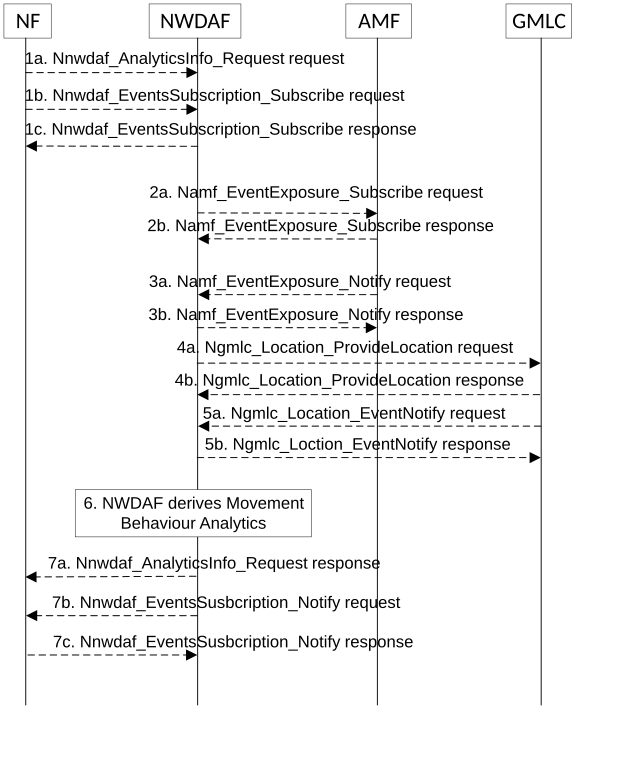

# 5.7.21 Movement Behaviour Analytics

This procedure is used by the NWDAF service consumer e.g. NEF or AF to obtain Movement Behaviour Analytics provided by NWDAF regarding the location, direction and velocity of UEs during an analytics target period in a target area.

Figure 5.7.21-1: Procedure for Movement Behaviour Analytics

1a. In order to obtain the Movement Behaviour Analytics, the NF may invoke Nnwdaf_AnalyticsInfo_Request service operation as described in clause 5.2.3.1.

1b-1c. In order to subscribe to the Movement Behaviour Analytics, the NF may invoke Nnwdaf_EventsSubscription_Subscribe service operation as described in clause 5.2.2.1.

2a-2b. If the event is set to "MOVEMENT_BEHAVIOUR" and the subscription/request is authorized, the NWDAF may invoke Namf_EventExposure_Subscribe service operation as described in clause 5.3.2.2.2 of 3GPP TS 29.518 \[18\] to subscribe to the notification of UE ID and UE positions. The AMF responds to the NWDAF an HTTP "201 Created" response.

3a-3b. If step 2a and step 2b are performed, the AMF invokes Namf_EventExposure_Notify service operation as described in 3GPP TS 29.518 \[18\] clause 5.3.2.4. The NWDAF responds to the AMF an HTTP "204 No Content" response.

4a-4b. The NWDAF may invoke Ngmlc_Location_ProvideLocation service operation to retrieve UE Fine granularity locations by sending an HTTP POST request to the URI associated with the "provide-location" custom operation as described in 3GPP TS 29.515 \[41\] clause 5.2.2.2. The GMLC responds to the NWDAF an HTTP "200 OK" response.

5a-5b. If step 4a and step 4b are performed, the GMLC may invoke Ngmlc_Location_EventNotify service operation by sending an HTTP POST request to the NWDAF identified by the notification URI received in step 4a. The NWDAF responds to the GMLC an HTTP "204 No Content" response.

6\. The NWDAF derives the Movement Behaviour Analytics based on the data collected from AMF and/or GMLC.

7a. If step 1a is performed, the NWDAF responds to the Nnwdaf_AnalyticsInfo_Request service operation as described in clause 5.2.3.1.

7b-7c. If step 1b and step 1c are performed, the NWDAF invokes Nnwdaf_EventsSusbcription_Notify service operation as described in clause 5.2.2.1.

NOTE: For details of Nnwdaf_EventsSubscription_Subscribe/Unsubscribe/Notify or Nnwdaf_AnalyticsInfo_Request service operations refer to 3GPP TS 29.520 \[5\].
