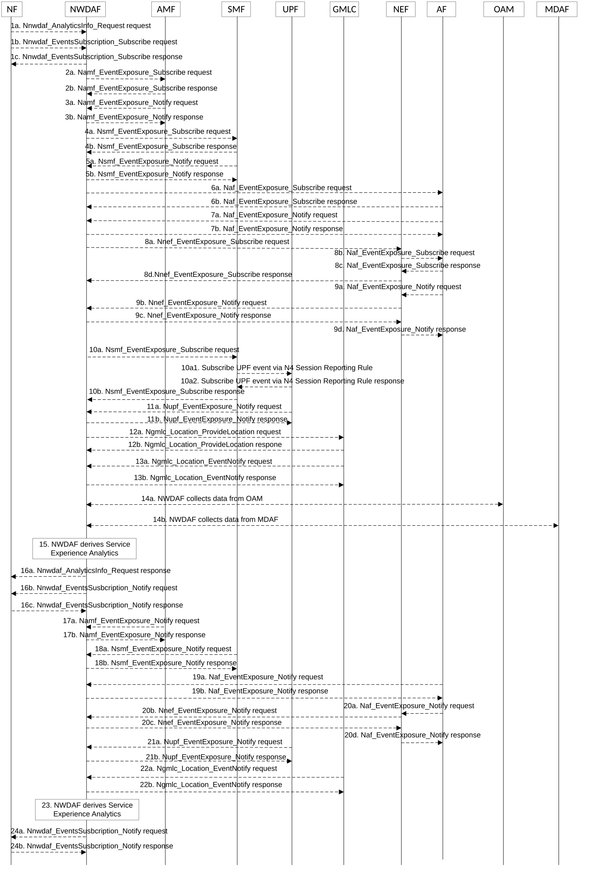

# 5.7.3 Observed Service Experience Analytics

This procedure is used by the NF to obtain the Service Experience analytics which are calculated by the NWDAF based on the information collected from the AMF, SMF, UPF, GMLC, AF, OAM and/or MDAF. If the NF is an AF which is untrusted, the AF will request analytics via the NEF as described in clause 5.2.3.2.

Figure 5.7.3-1: Procedure for Service Experience Analytics

1a. In order to obtain the Service Experience analytics, the NF may invoke Nnwdaf_AnalyticsInfo_Request service operation as described in clause 5.2.3.1.

1b-1c. In order to obtain the Service Experience analytics, the NF may invoke Nnwdaf_EventsSubscription_Subscribe service operation as described in clause 5.2.2.1.

2a-2b. If the event is set to "SERVICE_EXPERIENCE", the NWDAF may invoke Namf_EventExposure_Subscribe service operation as described in clause 5.3.2.2.2 of 3GPP TS 29.518 \[18\] to subscribe to the notification of UE ID and UE location. The AMF responds to the NWDAF an HTTP "201 Created" response.

3a-3b. If step 2a and step 2b are performed, the AMF invokes Namf_EventExposure_Notify service operation as described in 3GPP TS 29.518 \[18\] clause 5.3.2.4. The NWDAF responds to the AMF an HTTP "204 No Content" response.

4a-4b. The NWDAF may invoke Nsmf_EventExposure_Subscribe service operation by sending an HTTP POST request targeting the resource "SMF Notification Subscriptions" to subscribe to the notification of QFI, IP filter information, DNAI, UPF information, Application ID, DNN and S-NSSAI. The SMF responds to the NWDAF an HTTP "201 Created" response.

5a-5b. If step 4a and step 4b are performed, the SMF may invoke Nsmf_EventExposure_Notify service operation by sending an HTTP POST request to the NWDAF identified by the notification URI received in step 4a. The NWDAF responds to the SMF an HTTP "204 No Content" response.

6a-6b. If the AF is trusted, the NWDAF may invoke Naf_EventExposure_Subscribe service operation by sending an HTTP POST request targeting the resource "Application Event Subscriptions" to request the service data and performance data from AF directly. The AF responds to the NWDAF an HTTP "201 Created" response.

7a-7b. If step 6a and step 6b are performed, the AF may invoke Naf_EventExposure_Notify service operation by sending an HTTP POST request to the NWDAF identified by the notification URI received in step 6a. The NWDAF responds to the AF an HTTP "204 No Content" response.

8a-8d. If the AF is untrusted, the NWDAF may invoke Nnef_EventExposure_Subscribe service operation to the NEF by sending an HTTP POST request targeting the resource "Network Exposure Event Subscriptions" and then the NEF invokes Naf_EventExposure_Subscribe service operation by sending an HTTP POST request targeting the resource "Application Event Subscriptions". The AF responds to the NEF an HTTP "201 Created" response and then the NEF responds to the NWDAF an HTTP "201 Created" response.

9a-9d. If step 8a to step 8d are performed, the AF may invoke Naf_EventExposure_Notify service operation by sending an HTTP POST request to the NEF identified by the notification URI received in step 8b and the NEF invokes Nnef_EventExposure_Notify service operation by sending an HTTP POST request to the NWDAF identified by the notification URI received in step 8a. The NWDAF responds to the NEF an HTTP "204 No Content" response and then the NEF responds to the AF an HTTP "204 No Content" response.

10a-10b. The NWDAF may invoke Nsmf_EventExposure_Subscribe service operation by sending an HTTP POST request targeting the resource "SMF Notification Subscriptions" as described in 3GPP TS 29.508 \[6\] to subscribe via the SMF to UPF information for a specific UE. The SMF subscribes to the UPF on behalf of the NWDAF via N4 Session Reporting Rule as described in clause 5.2.8 of 3GPP TS 29.244 \[45\] and, after having received the successful response from the UPF, it responds to the NWDAF with an HTTP "201 Created" response.

11a-11b. If step 10a and step 10b are performed, the UPF may invoke Nupf_EventExposure_Notify service operation as described in 3GPP TS 29.564 \[40\] by sending an HTTP POST request to the NWDAF identified by the notification URI provided in step 6a. The NWDAF responds to the UPF an HTTP "204 No Content" response.

12a-12b. If the NF requestes fine granularity location analytics information, the NWDAF may invoke Ngmlc_Location_ProvideLocation service operation to retrieve UE Location and UE Location Accuracy by sending an HTTP POST request to the URI associated with the "provide-location" custom operation as described in 3GPP TS 29.515 \[41\] clause 5.2.2.2. The GMLC responds to the NWDAF an HTTP "200 OK" response.

13a-13b. If step 12a and step 12b are performed, the GMLC may invoke Ngmlc_Location_EventNotify service operation by sending an HTTP POST request to the NWDAF identified by the notification URI received in step 4a. The NWDAF responds to the GMLC an HTTP "204 No Content" response.

14a. The NWDAF may collect Reference Signal Received Power and Reference Signal Received Quality as specified in clause 5.5 of TS 38.331 \[33\] and clause 5.5.5 of TS 36.331 \[34\], Signal-to-noise and interference ratio as specified in clause 5.1 of TS 38.215 \[35\], the mapping information between cell ID and frequency and/or Cell Energy Saving State data as specified in clauses 3.1 and 6.2 of TS 28.310 \[36\] from OAM. If the NF is AF or NEF requesting per application analytics with UE granularity, the NWDAF may collect the average UL/DL RAN throughput, the UL/DL RAN packet delay and the UL/DL RAN Packet loss rate as described in clause 5.2.1.1 and 5.4.1.1 of TS 37.320 \[29\].

14b. The NWDAF may collect service experience and energy saving state analysis as specified in clause 8.4.2.1.3 and clause 8.4.4.3 of TS 28.104 \[38\] from MDAF. The information element of the analysis from MDAF include ServiceExperienceIssueType, AffectedObjects, ServiceExperienceStatistics, ServiceExperiencePredictions, and StatisticsOfCellsEsState.

15\. The NWDAF calculates the Service Experience analytics based on the data collected from AMF, SMF, UPF, GMLC, AF, OAM and/or MDAF.

16a. If step 1a is performed, the NWDAF responds to the Nnwdaf_AnalyticsInfo_Request service operation as described in clause 5.2.3.1.

16b-16c. If step 1b and step 1c are performed, the NWDAF invokes Nnwdaf_EventsSusbcription_Notify service operation as described in clause 5.2.2.1.

17a-17b. The same as step 3a and step 3b.

18a-18b. The same as step 5a and step 5b.

19a-19d. The same as step 7a and step 7b.

20a-20d. The same as step 9a and step 9b.

21a-21b. The same as step 11a and step 11b.

22a-22b. The same as step 13a and step 13b.

23\. The same as step 15.

24a-24b. The same as step 16b and step 16c.

NOTE 1: For details of Nsmf_EventExposure_Subscribe/Notify service operations refer to 3GPP TS 29.508 \[6\].

NOTE 2: For details of Nnef_EventExposure_Subscribe/Notify service operations refer to 3GPP TS 29.591 \[11\].

NOTE 3: For details of Naf_EventExposure_Subscribe/Notify service operations refer to 3GPP TS 29.517 \[12\].
