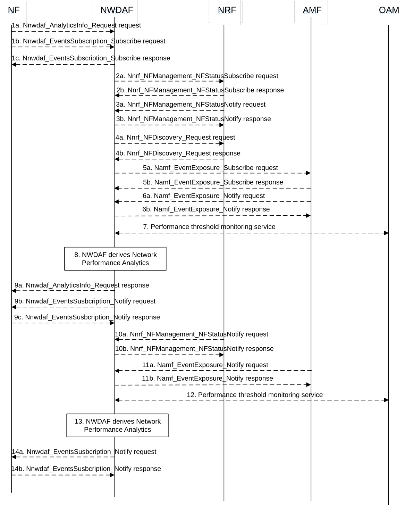

# 5.7.5 Network Performance Analytics

This procedure is used by the NF to obtain the network performance analytics which are calculated by the NWDAF based on the information collected from the AMF, NRF and/or OAM. If the NF is an AF which is untrusted, the AF will request analytics via the NEF as described in clause 5.2.3.2.

Figure 5.7.5-1: Procedure for Network Performance Analytics

1a. In order to obtain the network performance analytics, the NF may invoke Nnwdaf_AnalyticsInfo_Request service operation as described in clause 5.2.3.1.

1b-1c. In order to obtain the network performance analytics, the NF may invoke Nnwdaf_EventsSubscription_Subscribe service operation as described in clause 5.2.2.1.

2a-2b. If the event is set to "NETWORK_PERFORMANCE", the NWDAF may invoke Nnrf_NFManagement_NFStatusSubscribe service operation as described in clause 5.2.2.5 of 3GPP TS 29.510 \[26\] to subscribe to NF (e.g. SMF, UPF) load and status information. The NRF responds to the NWDAF an HTTP "201 Created" response.

3a-3b. If step 2a and step 2b are performed, the NRF may invoke Nnrf_NFManagement_NFStatusNotify service operation as described in clause 5.2.2.6 of 3GPP TS 29.510 \[26\]. The NWDAF responds to the NRF an HTTP "204 No Content" response.

4a-4b. If the event is set to "NETWORK_PERFORMANCE" and the type of network performance is set to "NUM_OF_UE", the NWDAF invokes Nnrf_NFDiscovery_Request service operation as described in clause 5.3.2.2 of 3GPP TS 29.510 \[26\] to discover the AMF(s) belonging to the AMF Region(s) that include(s) the Area of Interest. The NRF responds to the NWDAF an HTTP "201 Created" response.

5a-5b. The NWDAF may invoke Namf_EventExposure_Subscribe service operation as described in clause 5.3.2.2.2 of 3GPP TS 29.518 \[18\] to collect the number of UEs located in the Area of Interest from AMF. The AMF responds to the NWDAF an HTTP "201 Created" response.

6a-6b. If step 5a and step 5b are performed, the AMF invokes Namf_EventExposure_Notify service operation as described in 3GPP TS 29.518 \[18\] clause 5.3.2.4. The NWDAF responds to the AMF an HTTP "204 No Content" response.

7\. The NWDAF may collect "Performance measurement" to the OAM to get the status and load information and the performance per Cell Id in the Area of Interest as described in clause 5.1 of TS 28.552 \[27\].

8\. The NWDAF calculates the network performance analytics based on the data collected from AMF, NRF and/or OAM.

9a. If step 1a is performed, the NWDAF responds to the Nnwdaf_AnalyticsInfo_Request service operation as described in clause 5.2.3.1.

9b-9c. If step 1b and step 1c are performed, the NWDAF invokes Nnwdaf_EventsSusbcription_Notify service operation as described in clause 5.2.2.1.

10a-10b. The same as step 3a and step 3b.

11a-11b. The same as step 6a and step 6b.

12\. The same as step 7.

13\. The same as step 8.

14a-14b. The same as step 9b and step 9c.

NOTE: For details of Nnwdaf_EventsSubscription_Subscribe/Unsubscribe/Notify or Nnwdaf_AnalyticsInfo_Request service operations refer to 3GPP TS 29.520 \[5\].
