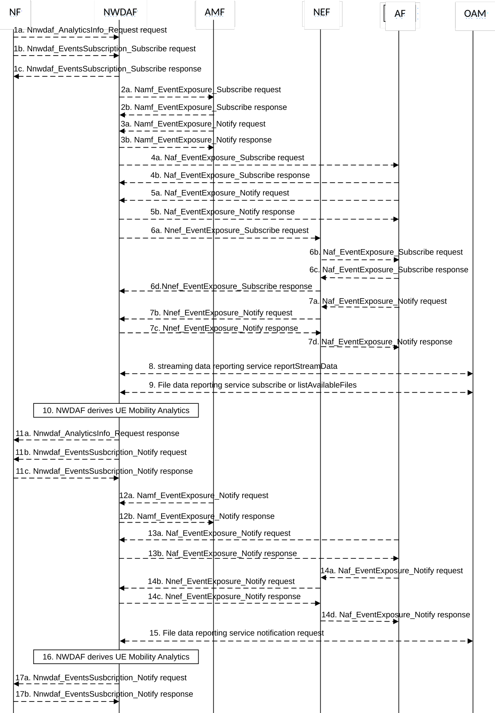

# 5.7.6 UE Mobility Analytics

This procedure is used by the NF to obtain UE mobility analytics, which is calculated by the NWDAF based on the information collected from the AMF, AF and/or OAM. If the NF is an AF which is untrusted, the AF will request analytics via the NEF as described in clause 5.2.3.2.

Figure 5.7.6-1: Procedure for UE Mobility analytics

1a. In order to obtain the UE mobility analytics, the NF may invoke Nnwdaf_AnalyticsInfo_Request service operation as described in clause 5.2.3.1.

1b-1c. In order to obtain the UE mobility analytics, the NF may invoke Nnwdaf_EventsSubscription_Subscribe service operation as described in clause 5.2.2.1.

2a-2b. The NWDAF may invoke Namf_EventExposure_Subscribe service operation as described in clause 5.3.2.2.2 of 3GPP TS 29.518 \[18\]. This step may be skipped when e.g. the UE mobility information is available. The AMF responds to the NWDAF an HTTP "201 Created" response.

3a-3b. If step 2a and step 2b are performed, the AMF invokes Namf_EventExposure_Notify service operation as described in clause 5.3.2.4 of 3GPP TS 29.518 \[18\]. The NWDAF responds to the AMF an HTTP "204 No Content" response.

4a-4b. If the AF is trusted, the NWDAF may invoke Naf_EventExposure_Subscribe service operation to the AF directly by sending an HTTP POST request targeting the resource "Application Event Subscriptions". The AF responds to the NWDAF an HTTP "201 Created" response.

5a-5b. If step 4a and step 4b are performed, the AF invokes Naf_EventExposure_Notify service operation by sending an HTTP POST request to the NWDAF identified by the notification URI received in step 4a. The NWDAF responds to the AF an HTTP "204 No Content" response.

6a-6d. If the AF is untrusted, the NWDAF may invoke Nnef_EventExposure_Subscribe service operation to the NEF by sending an HTTP POST request targeting the resource "Network Exposure Event Subscriptions" and then the NEF invokes Naf_EventExposure_Subscribe service operation by sending an HTTP POST request targeting the resource "Application Event Subscriptions". The AF responds to the NEF an HTTP "201 Created" response and then the NEF responds to the NWDAF an HTTP "201 Created" response.

7a-7d. If step 6a to step 6d are performed, the AF invokes Naf_EventExposure_Notify service operation by sending an HTTP POST request to the NEF identified by the notification URI received in step 6b and the NEF invokes Nnef_EventExposure_Notify service operation by sending an HTTP POST request to the NWDAF identified by the notification URI received in step 6a. The NWDAF responds to the NEF an HTTP "204 No Content" response and then the NEF responds to the AF an HTTP "204 No Content" response.

8\. The NWDAF may invoke "streaming data reporting service reportStreamData" service operation to the OAM as described in clause 12.5.1.1.5 of 3GPP TS 28.532 \[19\].

9\. The NWDAF may invoke the "File data reporting service subscribe" service operation to the OAM as described in clause 12.6.1.1.3 of 3GPP TS 28.532 \[19\] or invoke "File data reporting service listAvailableFiles" service operation to the OAM as described in clause 12.6.1.1.2 of 3GPP TS 28.532 \[19\].

10\. The NWDAF calculates the requested UE mobility analytics based on the data collected from AMF, AF and/or OAM.

11a. If step 1a is performed, the NWDAF responds to the Nnwdaf_AnalyticsInfo_Request service operation as described in clause 5.2.3.1.

11b-11c. If step 1b and step 1c are performed, the NWDAF invokes Nnwdaf_EventsSusbcription_Notify service operation as described in clause 5.2.2.1.

12a-12b. The same as step 3a and step 3b.

13a-13b. The same as step 5a and step 5b.

14a-14d. The same as step 7a and step 7d.

15\. The same as step 9.

16\. The same as step 10.

17a-17b. The same as step 11b and step 11c.

NOTE 1: For details of Naf_EventExposure_Subscribe/Notify service operations refer to 3GPP TS 29.517 \[12\].

NOTE 2: For details of Nnef_EventExposure_Subscribe/Notify service operations refer to 3GPP TS 29.591 \[11\].

NOTE 3: For details of Nnwdaf_EventsSubscription_Subscribe/Unsubscribe/Notify or Nnwdaf_AnalyticsInfo_Request service operations refer to 3GPP TS 29.520 \[5\].
