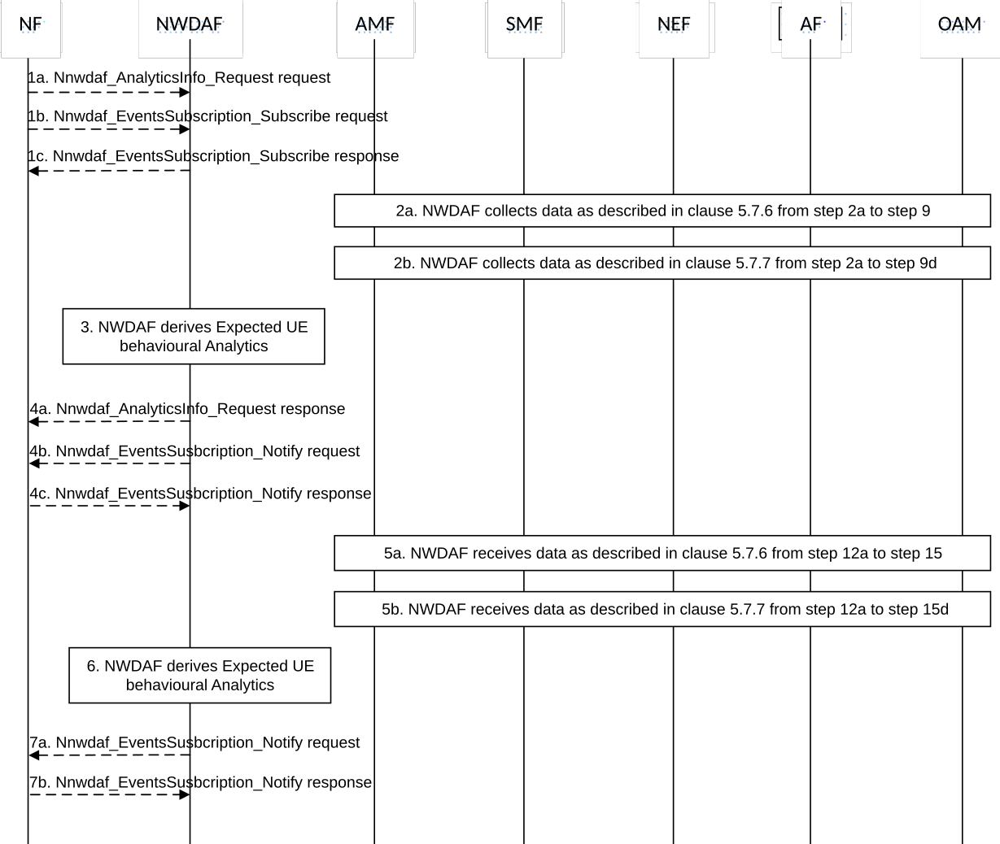

# 5.7.8 Expected UE behavioural Analytics

This procedure is used by the NF to obtain the expected UE behavioural parameters, which are calculated by the NWDAF based on the information collected from the AMF, SMF, AF and/or OAM. If the NF is an AF which is untrusted, the AF will request analytics via the NEF as described in clause 5.2.3.2.

Figure 5.7.8-1: Procedure for Expected behavioural Analytics

1a. In order to obtain the expected UE behavioural parameters, the NF may invoke Nnwdaf_AnalyticsInfo_Request service operation as described in clause 5.2.3.1.

1b-1c. In order to obtain expected UE behavioural parameters, the NF may invoke Nnwdaf_EventsSubscription_Subscribe service operation as described in clause 5.2.2.1.

2a. If the event is set to "UE_MOBILITY", the NWDAF collects data from AMF, AF and/or OAM as described in clause 5.7.6 from step 2a to step 9.

2b. If the event is set to "UE_COMM", the NWDAF collects data from AMF, SMF and/or AF as described in clause 5.7.7 from step 2a to step 9d.

3\. The NWDAF calculates the expected UE behavioural parameters based on the collected data from AMF, SMF, AF and/or OAM.

4a. If step 1a is performed, the NWDAF responds to the Nnwdaf_AnalyticsInfo_Request service operation as described in clause 5.2.3.1.

4b-4c. If step 1b and step 1c are performed, the NWDAF invokes Nnwdaf_EventsSusbcription_Notify service operation as described in clause 5.2.2.1.

5a-5b. The AMF, SMF, AF and/or OAM send the notifications to the NWDAF if it has subscribed to the related events in step 2a or step 2b.

6\. The same as step 3.

7a-7b. The same as step 4b and step 4c.

NOTE: For details of Nnwdaf_EventsSubscription_Subscribe/Unsubscribe/Notify or Nnwdaf_AnalyticsInfo_Request service operations refer to 3GPP TS 29.520 \[5\].
