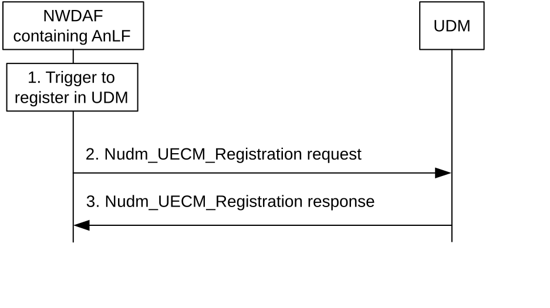
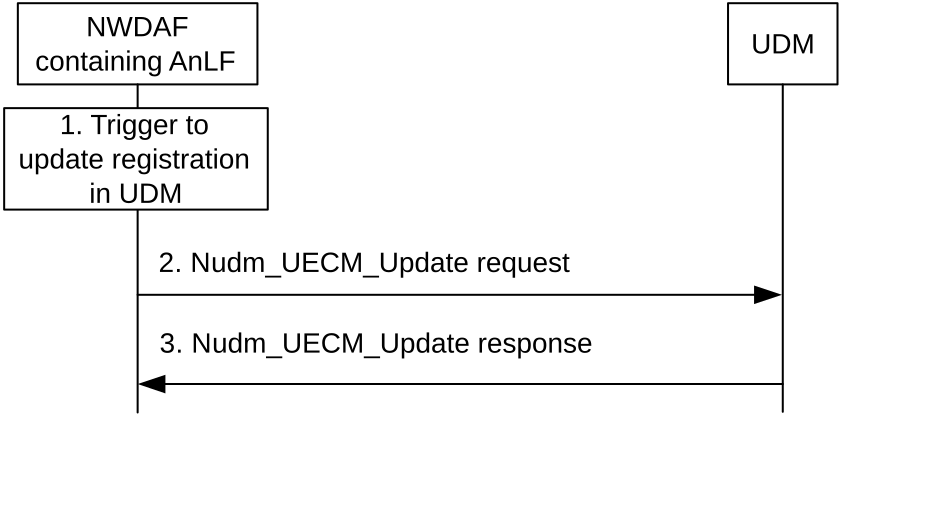
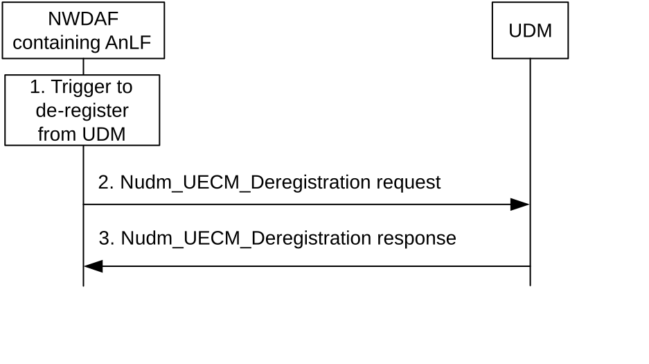
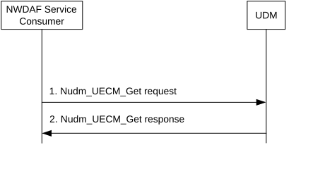
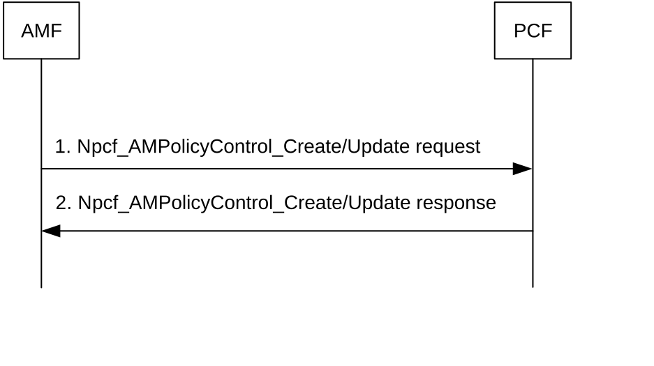

# 5.8 Procedures for NWDAF Discovery and Selection

## 5.8.1 General

NWDAF may be deployed in multiple configuration options. Not all these configurations require the same registration, discovery and selection procedures. The discovery and selection may depend on the NWDAF deployment option and the types of analytics it procedures, (i.e., whether it is related to Network Functions or to UEs) or the data that is able to collect from NFs.

## 5.8.2 Procedures related to NRF

### 5.8.2.1 General

### 5.8.2.2 NWDAF (De-)Registration in NRF

NWDAF (de-)registers in NRF as a regular network function. See TS 29.510 \[23\] for details.

### 5.8.2.3 Consumer discovery and selection of NWDAF in NRF

A consumer of analytics services may use the NRF for discovering an NWDAF containing AnLF or MTLF.

If the NWDAF service consumer needs to discover an NWDAF containing AnLF that is able to collect data from particular data sources identified by their NF Set IDs or NF types, the consumer may query NRF with the Nnrf_NFDiscovery_NFDiscover service operation, providing the NF Set IDs (serving-nf-set-id attribute) or NF types (serving-nf-type attribute) in the discovery request. See 3GPP TS 29.510 \[23\] for details.

If the NWDAF service consumer (NWDAF containing MTLF) needs to discover an NWDAF containing MTLF that support Federated Learning identified by their FL capability (i.e. FL server or FL client), the consumer may query NRF with the Nnrf_NFDiscovery_NFDiscover service operation for discovery of FL Server NWDAF (NWDAF containing MTLF) or FL Client NWDAF (NWDAF containing MTLF). See 3GPP TS 29.510 \[23\] for details.

If the NWDAF service consumer needs to discover an NWDAF containing MTLF that is able to provide ML model provisioning services with trained ML models available for one or more Analytics ID(s), the consumer may query NRF with the Nnrf_NFDiscovery_NFDiscover service operation for discovery of NWDAF containing the required trained ML model. See 3GPP TS 29.510 \[23\] for details.

In the roaming architecture, a consumer in the same PLMN as the RE-NWDAF discovers the RE-NWDAF by querying for an NWDAF where the roaming exchange capability is indicated in its NRF profile. A consumer in a peer PLMN (i.e. RE-NWDAF) discovers the RE-NWDAF by querying for an NWDAF in the target PLMN that is supporting the specific services defined for roaming. A RE-NWDAF discovers the RE-NWDAF in a different PLMN (i.e. HPLMN or VPLMN) using the procedure defined in clause 4.17.5 (if delegated discovery is not used) or clause 4.17.10 (if delegated discovery is used) of TS 23.502 \[3\], where the detailed parameters are determined based on the analytics request or subscription from the consumer 5GC NF, operator policy, user consent and/or local configuration. See 3GPP TS 29.510 \[23\] for details.

## 5.8.3 Procedures related to UDM

### 5.8.3.1 General

### 5.8.3.2 NWDAF containing AnLF Registration/Deregistration in UDM

#### 5.8.3.2.1 NWDAF containing AnLF Registration in UDM

For UE-related analytics or for analytics that involve UE-related data collection, an NWDAF containing AnLF may register in UDM using the Nudm_UECM_Register service operation (see TS 29.503 \[22\] clause 5.3.2.2.8). This is useful especially in scenarios of co-location of the NWDAF containing AnLF with other network functions (e.g., AMF, SMF) and in certain deployment models. Figure 5.8.3.2.1-1 illustrates the signalling flow.

Figure 5.8.3.2.1-1: NWDAF containing AnLF registration in UDM

1\. NWDAF containing AnLF triggers a registration in UDM, e.g. based on local configuration in the NWDAF containing AnLF, the reception of a new Analytics subscription request, start of collection of UE related data or an OAM configuration action.

2\. The NWDAF containing AnLF registers into UDM for the served UE, by sending Nudm_UECM_Registration request (UE ID of the served user, NWDAF Instance ID, NF Set ID, Analytics ID(s)).

3\. UDM sends a response to NWDAF containing AnLF. A successful response consists of a "200 OK" or "201 Created". If the operation is unsuccessful, UDM responds with proper error response code. See TS 29.503 \[22\] for details.

#### 5.8.3.2.2 NWDAF containing AnLF Update of Registration in UDM

If an NWDAF containing AnLF has previously registered in UDM for one or more analytics IDs for a given UE, the NWDAF containing AnLF may modify the registration at any time. This may be due to, e.g., the NWDAF containing AnLF adds one or more Analytic IDs for the UE, or the NWDAF containing AnLF removes one or more Analytics IDs, but keep registered in UDM for at least one Analytic ID. The NWDAF containing AnLF sends an Nudm_UECM_Update service operation (NWDAF registration ID, added or removed Analytics ID(s)), see TS 29.503 \[22\] clause 5.3.2.6.4. Figure 5.8.3.2.2-1 illustrates the signalling flow.

Figure 5.8.3.2.2-1: NWDAF containing AnLF registration update in UDM

1\. If an NWDAF containing AnLF has previously registered one or more Analytics IDs for a UE in UDM, the NWDAF containing AnLF triggers an update of the registration in UDM, e.g. based on the NWDAF containing AnLF serving the UE of one or more additional Analytic ID(s) or based on the NWDAF containing AnLF not serving the UE for one or more Analytic ID(s) but serving the UE for at least one Analytic ID.

2\. The NWDAF containing AnLF updates its registration in UDM for the served UE, by sending Nudm_UECM_Update request (NWDAF Registration Id, added or removed Analytic ID(s)).

3\. Upon success UDM sends a "204 No Content" response to the NWDAF containing AnLF. If the operation is unsuccessful, UDM responds with proper error response code. See TS 29.503 \[22\] for details.

#### 5.8.3.2.3 NWDAF containing AnLF De-Registration in UDM

If an NWDAF containing AnLF has previously registered in UDM for one or more analytics ID for a given UE, when the NWDAF containing AnLF no longer serves the UE, e.g., it does not collect data for the UE for that Analytics ID or does no keep produce analytic reports or does not keep any data related to the UE, the NWDAF containing AnLF should de-register from UDM by invoking the Nudm_UECM_Deregistration service operation (NWDAF registration ID, Analytics ID(s)), see TS 29.503 \[22\] clause 5.3.2.4.8). Figure 5.8.3.2.3-1 illustrates the signalling flow.

Figure 5.8.3.2.3-1: NWDAF containing AnLF deregistration from UDM

1\. If an NWDAF containing AnLF has previously registered one or more Analytics IDs for a UE in UDM, the NWDAF containing AnLF triggers a complete deregistration from UDM, e.g. based on the NWDAF containing AnLF not collecting data any longer for the UE, or the NWDAF containing AnLF not producing analytics reports for the UE, or the NWDAF containing AnLF not keeping analytics data for the UE.

2\. The NWDAF containing AnLF deregisters from UDM for the served UE, by sending Nudm_UECM_Deregistration request (NWDAF Registration Id).

3\. UDM sends a "204 No Content" response to the NWDAF containing AnLF. See TS 29.503 \[22\] for details.

### 5.8.3.3 Consumer discovery and selection of NWDAF containing AnLF in UDM

For UE related analytics, if the NWDAF service consumer needs to discover an NWDAF containing AnLF that is serving or holds data for a UE, the NWDAF serving consumer may query UDM with the target SUPI and the Analytics ID. If the response from UDM indicates multiple candidate NWDAFs, the NWDAF service consumer may, e.g., determine an instance of an NWDAF containing AnLF that has registered in UDM (registrationTime attribute) around the time of interest of the data or analytics, and may also query NRF, as specified in clause 5.8.2.3 in order to determine the capabilities of these NWDAFs and select the most appropriate one. Figure 5.8.3.3-1 illustrates the signalling flow.

Figure 5.8.3.3-1: Discovery of NWDAF containing AnLF in UDM

1\. The NWDAF service consumer sends an Nudm_UECM_Get request to the UDM (UE ID, Analytics ID(s), NF type = NWDAF).

2\. Upon success, UDM sends a "200 OK" response to the service consumer including the NWDAF information registered for the UE ID. If the operation is unsuccessful, UDM responds with proper error response code. See TS 29.503 \[22\] for details.

## 5.8.4 Procedures for PCF learning NWDAF IDs for served UEs

PCF may receive from AMF and SMF the IDs of the NWDAFs containing AnLF that are used by AMF, SMF, and UPF, so that the PCF may select the same NWDAF containing AnLF being used for a specific UE.

When the AMF creates or updates an Access and Mobility Policy Association for a UE, the AMF may include the IDs of the NWDAF containing AnLF that are used by the AMF, along with their Analytic ID(s), in the Npcf_AMPolicyControl_Create/Update service operations, as illustrated in Figure 5.8.4-1. See details in TS 29.507 \[24\].

Figure 5.8.4-1: PCF learning the NWDAF information from the AMF

The PCF may select those NWDAF instances discovered through the Npcf_AMPolicyControl_Create/Update request as the ones to use for their associated analytic ID(s) for the UE for which those AM Policy Associations are related to.

When the SMF creates or updates a Session Management Policy Association for a UE, the SMF may include the IDs of the NWDAF containing AnLF that are used by the SMF and UPF, along with their Analytic ID(s), in the Npcf_SMPolicyControl_Create/Update service operations, as illustrated in Figure 5.8.4-2. See details in TS 29.512 \[25\].

Figure 5.8.4-2: PCF learning the NWDAF information from the SMF and UPF

The PCF may select those NWDAF instances discovered through the Npcf_SMPoliycControl_Create/Update request as the ones to subscribe for their associated analytic ID(s) for the UE for which those SM Policy Associations are related to.
