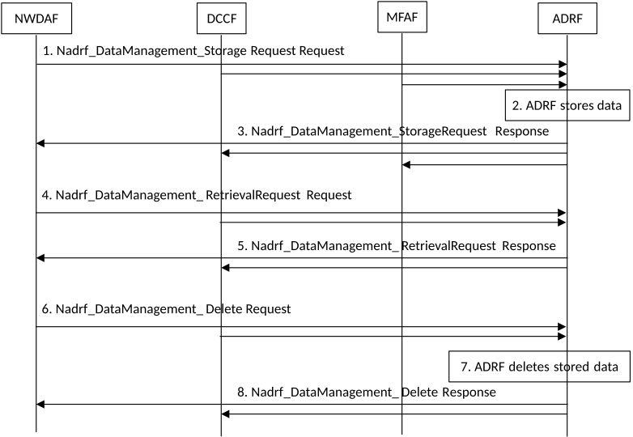
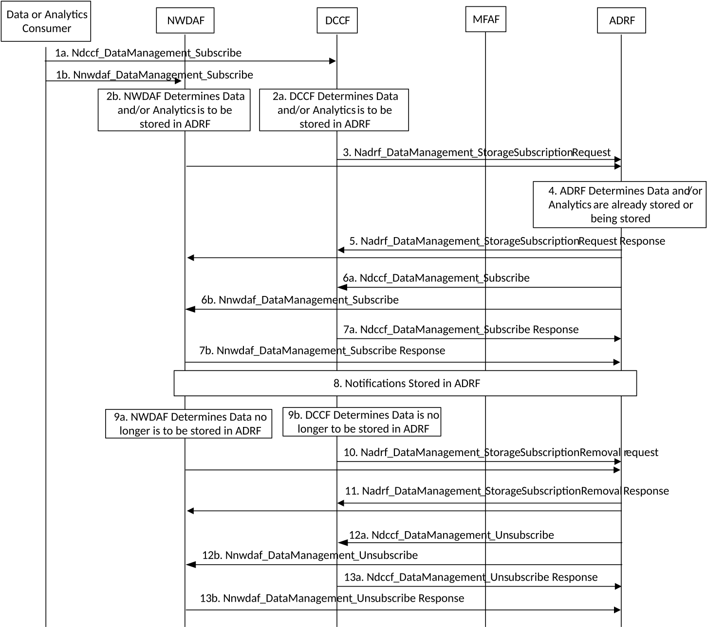

# 5.9 Analytics Data Repository procedures

## 5.9.1 General

The Analytics Data Repository procedures allow the NF service consumers (e.g. NWDAF, DCCF or MFAF) to store, retrieve or delete collected data and analytics in the ADRF.

## 5.9.2 Historical Data and Analytics Storage/Retrieval/Deletion procedure

The procedure is used by an NF service consumer (e.g. NWDAF, DCCF or MFAF) to store, retrieve or delete historical data and/or analytics, i.e. data and/or analytics related to past time period that has been obtained by the consumer.

Figure 5.9.2-1: Historical Data and Analytics storage/deletion procedure

1\. In order to store data or analytics, the NF service consumer invokes Nadrf_DataManagement_StorageRequest service operation by sending an HTTP POST request targeting the resource "ADRF Data Store Records" in clause 4.2.2.2 of 3GPP TS 29.575 \[16\].

2\. The ADRF stores the data or analytics sent by the consumer. The ADRF may, based on implementation, determines whether the same data or analytics is already stored or being stored based on the information sent in step 1 by the consumer and, if the data or analytics is already stored or being stored in the ADRF, the ADRF decides to not store again the data or analytics sent by the consumer.

3\. If the data or analytics is stored, the ADRF sends Nadrf_DataManagement_StorageRequest Response message to the consumer with HTTP "201 Created" status code including a representation of the created record.

4\. If the data is to be retrieved for specific SUPI, the user consent has not been checked by the data consumer, if the local policies and regulations require to check user consent, the NF service consumer shall check and enforce the user consent in the same way that it is described for the NWDAF in clause 5.5.1.1 step 1 and step 2. Then, in order to retrieve the stored data or analytics from the ADRF, the NF service consumer shall invoke the Nadrf_DataManagement_RetrievalRequest service operation by sending an HTTP GET request targeting the resource "ADRF Data Store Records" as described in clause 4.2.2.5 of 3GPP TS 29.575 \[16\].

5\. If the requested data is found, the ADRF sends Nadrf_DataManagement_RetrievalRequest Response message to the consumer with HTTP "200 OK" status code including a representation of the matched record.

6\. In order to deleted the specified data or analytics from the ADRF, the NF service consumer shall invoke the Nadrf_DataManagement_Delete service operation by sending an HTTP DELETE request targeting the resource "Individual ADRF Data Store Record" as described in clause 4.2.2.9 of 3GPP TS 29.575 \[16\] if the NF service consumer delete the resource including the transaction identifier, or by sending an HTTP POST request including the time window in which the data to be deleted was collected and data or analytics specification.

7\. The ADRF deletes the specified stored data or analytics requested by the consumer.

8\. If the deletion is successful processed, the ADRF sends Nadrf_DataManagement_Delete Response message to the consumer with HTTP "204 No Content" status code.

## 5.9.3 Historical Data and Analytics Storage via Notifications

The procedure is used by an NF service consumer (e.g. NWDAF, DCCF) to store received notifications in the ADRF.

Figure 5.9.3-1: Historical Data and Analytics storage/deletion procedure

1-2. Based on provisioning or based on reception of a DataManagement subscription request (e.g. see clause 5.5.3.1), the NF service consumer (e.g. DCCF or NWDAF) determines that notifications are to be stored in the ADRF.

3\. The NF service consumer invokes Nadrf_DataManagement_StorageSubscriptionRequest service operation by sending an HTTP POST request in clause 4.2.2.3 of 3GPP TS 29.575 \[16\].

4\. The ADRF may, based on implementation, determines whether the same data or analytics is already stored or being stored based on the information sent in step 3 by the consumer.

5\. If the request is successfully processed and accepted, the ADRF sends Nadrf_DataManagement_StorageSubscriptionRequest Response message to the consumer with HTTP "200 OK " status code including a transaction reference identifier. If the data and/or analytics is already stored or being stored in the ADRF, the ADRF sends Nadrf_DataManagement_StorageSubscriptionRequest Response message to the consumer indicating that data or analytics is stored.

6a. ADRF invokes Ndccf_DataManagement_Subscribe service operation to subscribe to the DCCF to receive analytics notifications by sending an HTTP POST request message targeting the resource "DCCF Analytics Subscriptions", the HTTP POST message shall include notification endpoint address and a notification correlation ID as defined in clause 4.2.2.2.2 of 3GPP TS 29.574 \[15\].

ADRF invokes Ndccf_DataManagement_Subscribe service operation to subscribe to the DCCF to receive data notifications by sending an HTTP POST request message targeting the resource "DCCF Data Subscriptions", the HTTP POST message shall include notification endpoint address and a notification correlation ID as defined in clause 4.2.2.2.4 of 3GPP TS 29.574 \[15\].

6b. ADRF invokes Nnwdaf_DataManagement_Subscribe service operation to subscribe to the NWDAF to receive notifications by sending an HTTP POST request message targeting the resource "NWDAF Data Management Subscriptions", the HTTP POST message shall include notification endpoint address and a notification correlation ID as defined in clause 4.4.2.2 of 3GPP TS 29.520 \[5\].

7a If the Subscription is successfully processed and accepted, the DCCF sends Ndccf_DataManagement_Subscribe Response message to the consumer with HTTP "201 Created" status code with the message body containing a representation of the created subscription.

7b If the Subscription is successfully processed and accepted, the NWDAF sends Nnwdaf_DataManagement_Subscribe Response message to the consumer with HTTP "201 Created" status code with the message body containing a representation of the created subscription.

8\. The NF service consumer (e.g. DCCF, MFAF or NWDAF) sends Analytics or Data notifications containing the notification correlation ID provided by the ADRF to ADRF notification endpoint address when the historical analytics data are available.

If the NWDAF is the service consumer in step 7, the NWDAF invokes Nnwdaf_DataManagement_Notify service operation as defined in clause 4.4.2.4 of 3GPP TS 29.520 \[5\]. The ADRF stores the notifications and responses to the Nnwdaf_DataManagement_Notify service operation with HTTP "204 No Content" status code.

If the DCCF is used for data collection in step 7, the DCCF invokes Ndccf_DataManagement_Notify service operation as defined in clause 4.2.2.4 of 3GPP TS 29.574 \[15\]. The ADRF stores the notifications and responses to the Ndccf_DataManagement_Notify service operation with HTTP "204 No Content" status code.

If the Messaging Framework is used for data collection in step 7, the procedure defined in clause 5.5.3.2 is applicable.

9\. The NF service consumer determines that notifications no longer need to be stored in the ADRF.

10\. In order to request the ADRF to delete the specified data or analytics subscription, the NF service consumer shall invoke the Nadrf_DataManagement_StorageSubscriptionRemoval service operation by sending an HTTP POST request as described in clause 4.2.2.4 of 3GPP TS 29.575 \[16\], including the transaction reference identifier.

11\. If the deletion is successful processed, the ADRF sends Nadrf_DataManagement_StorageSubscriptionRemoval Response message with HTTP "204 No Content" status code to the consumer.

12a. ADRF invokes Ndccf_DataManagement_Unsubscribe service operation to unsubscribe from analytics notifications by sending an HTTP DELETE request message targeting the resource "Individual DCCF Analytics Subscription" as defined in clause 4.2.2.3.2 of 3GPP TS 29.574 \[15\].

ADRF invokes Ndccf_DataManagement_Unsubscribe service operation to unsubscribe from data notifications by sending an HTTP DELETE request message targeting the resource "Individual DCCF Data Subscription" as defined in clause 4.2.2.3.3 of 3GPP TS 29.574 \[15\].

12b. ADRF invokes Nnwdaf_DataManagement_Unsubscribe service operation to unsubscribe from data notifications by sending an HTTP DELETE request message targeting the resource "Individual NWDAF Data Management Subscription" as defined in clause 4.4.2.3.2 of 3GPP TS 29.520 \[5\].

ADRF invokes Nnwdaf_EventsSubscription_Unsubscribe service operation to unsubscribe from analytics notifications by sending an HTTP DELETE request message targeting the resource "Individual NWDAF Event Subscription" as defined in clause 4.2.2.3.2 of 3GPP TS 29.520 \[5\].

13a If the removal of the corresponding subscription is successfully processed and accepted, the DCCF sends Ndccf_DataManagement_Unsubscribe Response message to the consumer with HTTP "204 No Content" status code.

13b If the removal of the corresponding subscription is successfully processed and accepted, the NWDAF sends Nnwdaf_DataManagement_Unsubscribe Response message to the consumer with HTTP "204 No Content" status code.
