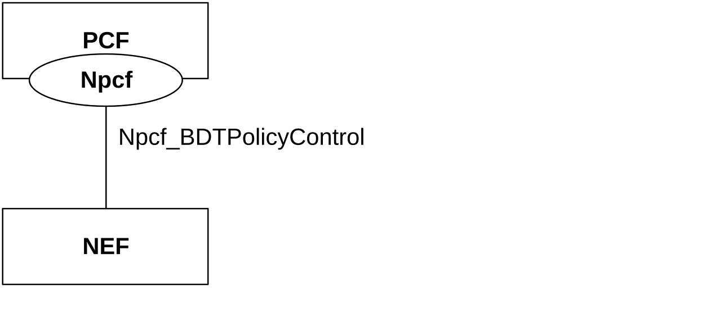
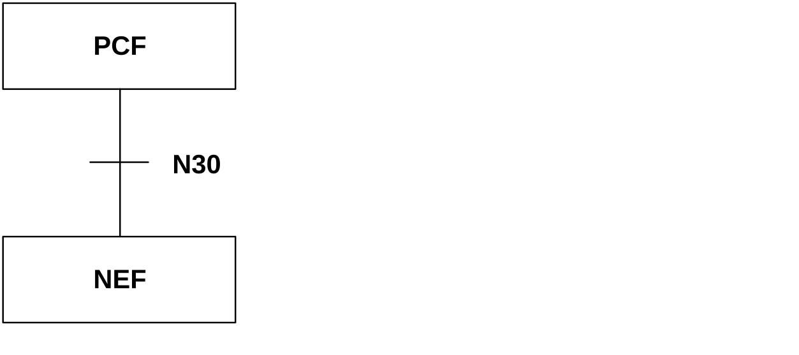
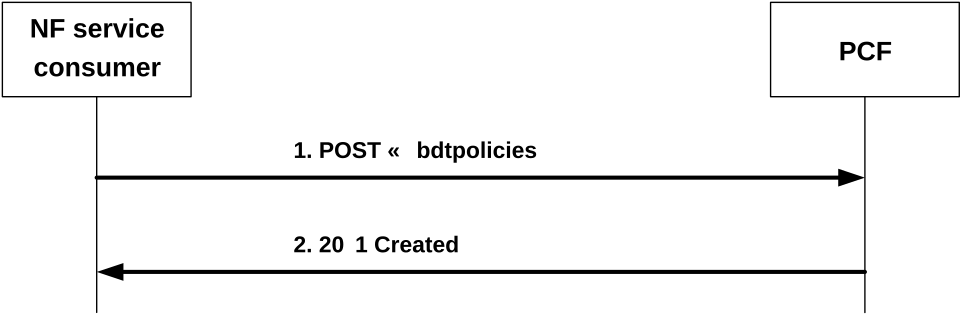
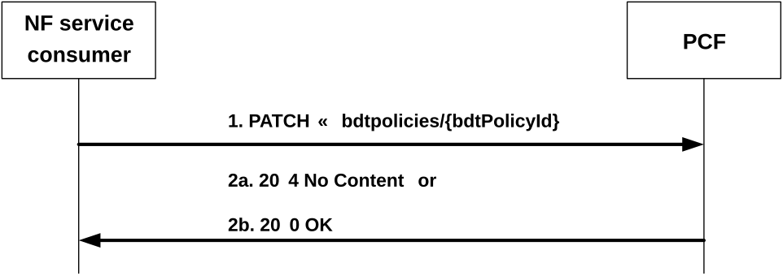
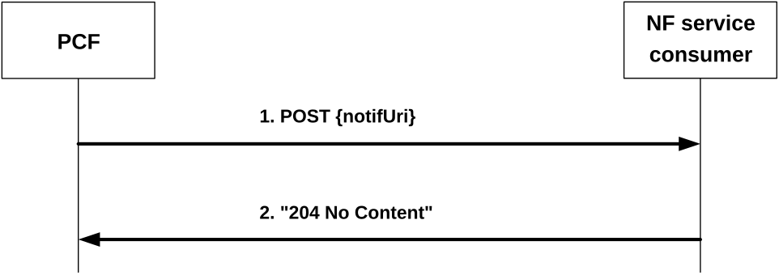

# 4 Background Data Transfer Policy Control Service

## 4.1 Service Description

### 4.1.1 Overview

The BDT Policy Control Service, as defined in 3GPP TS 23.502 \[3\] and 3GPP TS 23.503 \[4\], is provided by the Policy Control Function (PCF).

This service enables the NF service consumer to negotiate policy for a future background data transfer and offers the following functionalities:

\- get background data transfer policies based on the request from the NF service consumer;

\- update background data transfer policies based on the selection provided by the NF service consumer; and

\- provide background data transfer warning notification to trigger renegotiation of background data transfer policy.

### 4.1.2 Service Architecture

The 5G System Architecture is defined in 3GPP TS 23.501 \[2\]. The Policy and Charging related 5G architecture is also described in 3GPP TS 29.513 \[5\].

The BDT Policy Control Service (Npcf_BDTPolicyControl) is part of the Npcf service-based interface exhibited by the Policy Control Function (PCF).

The only known NF service consumer of the Npcf_BDTPolicyControl service is the Network Exposure Function (NEF).

The NEF accesses the BDT Policy Control Service at the PCF via the N30 Reference point. In the roaming scenario, the N30 reference point is located between the PCF and the NEF in the home network only.

Figure 4.1.2-1: Reference Architecture for the Npcf_BDTPolicyControl Service; SBI representation

Figure 4.1.2-2: Reference Architecture for the Npcf_BDTPolicyControl Service; reference point representation

### 4.1.3 Network Functions

#### 4.1.3.1 Policy Control Function (PCF)

The Policy Control Function (PCF):

\- Provides background data transfer policies based on the request from the NF service consumer. The PCF determines, based on information provided by the NF service consumer and other available information (e.g. network policy, load status estimation for the requested time window, network area, etc.) one or more transfer policies.

\- Updates background data transfer policy based on the selection provided by the NF service consumer.

\- Sends the background data transfer warning notification to the NF service consumer.

#### 4.1.3.2 NF Service Consumers

The Network Exposure Function (NEF):

\- requests the PCF to provide background data transfer policies;

\- provides the selected background data transfer policy to the PCF; and

\- indicates to the PCF whether to provide a BDT warning notification.

## 4.2 Service Operations

### 4.2.1 Introduction

Table 4.2.1-1: Operations of the Npcf_BDTPolicyControl Service

| Service operation name       | Description                                                                                                        | Initiated by                   |
|------------------------------|--------------------------------------------------------------------------------------------------------------------|--------------------------------|
| Npcf_BDTPolicyControl_Create | Creates a background data transfer policy based on the service requirements received from the NF service consumer. | NF service consumer (e.g. NEF) |
| Npcf_BDTPolicyControl_Update | Updates the PCF with the background data transfer policy selected by the NF service consumer.                      | NF service consumer (e.g. NEF) |
| Npcf_BDTPolicyControl_Notify | Sends the BDT notification to the NF service consumer.                                                             | PCF                            |

### 4.2.2 Npcf_BDTPolicyControl_Create service operation

#### 4.2.2.1 General

The Npcf_BDTPolicyControl_Create service operation is used by an NF service consumer to create a BDT policy at the PCF.

The following procedure using the Npcf_BDTPolicyControl_Create service operation is supported:

\- creation of a BDT policy.

#### 4.2.2.2 Creation of a BDT Policy

This procedure is used by the NF service consumer to request the creation of a BDT policy at the PCF, as defined in 3GPP TS 23.501 \[2\], 3GPP TS 23.502 \[3\] and 3GPP TS 23.503 \[4\].

Figure 4.2.2.2-1 illustrates creation of a BDT policy.

Figure 4.2.2.2-1: Creation of a BDT Policy

Upon reception of a Background Data Transfer request from the AF indicating a transfer policy request, the NF service consumer shall invoke the Npcf_BDTPolicyControl_Create service operation by sending an HTTP POST request to the URI representing a "BDT policies" collection resource of the PCF (as shown in figure 4.2.2.2-1, step 1). The NF service consumer shall include a "BdtReqData" data type in a content of the HTTP POST request. The "BdtReqData" data type shall contain:

\- an ASP identifier in the "aspId" attribute;

\- a volume of data per UE in the "volPerUe" attribute;

\- an expected number of UEs in the "numOfUes" attribute;

\- a desired time window in the "desTimeInt" attribute; and

\- if "BdtNotification_5G" feature is supported a notification URI in the "notifUri" attribute,

and may include:

\- a network area information (e.g. list of TAIs and/or NG-RAN nodes and/or cells identifiers) in the "nwAreaInfo" attribute;

\- an identification of a group of UE(s) via an "interGroupId" attribute;

\- a traffic descriptor of background data within the "trafficDes" attribute;

\- if "BdtNotification_5G" feature is supported an indication whether BDT warning notification is requested in the "warnNotifReq" attribute; and

\- a DNN and an S-NSSAI, corresponding to the ASP identifier, in the "dnn" attribute and the "snssai" attribute respectively.

If the PCF cannot successfully fulfil the received HTTP POST request due to the internal PCF error or due to the error in the HTTP POST request, the PCF shall send the HTTP error response as specified in clause 5.7.

Otherwise, upon the reception of the HTTP POST request from the NF service consumer indicating a BDT policy request, the PCF:

\- may invoke the Nudr_DataRepository_Query service operation, as described in 3GPP TS 29.504 \[11\] and 3GPP TS 29.519 \[12\], to request from the UDR all stored transfer policies;

NOTE 1: In case only one PCF is deployed in the network, transfer policies can be locally stored in the PCF and the interaction with the UDR is not required.

\- shall determine one or more acceptable transfer policies based on:

a\) information provided by the NF service consumer; and

b\) other available information (e.g. the existing transfer policies, network policy, load status estimation for the desired time window); and

\- shall create a BDT Reference ID.

The PCF shall create an "Individual BDT Policy" resource and send to the NF service consumer a "201 Created" response to the HTTP POST request, as shown in figure 4.2.2.2-1, step 2. The PCF shall include in the "201 Created" response:

\- a Location header field; and

\- a "BdtPolicy" data type in the response content containing the BDT Reference ID in the "bdtRefId" attribute and acceptable transfer policy/ies in the "transfPolicies" attribute.

The Location header field shall contain the URI of the created "Individual BDT Policy" resource i.e. "{apiRoot}/npcf-bdtpolicycontrol/v1/bdtpolicies/{bdtPolicyId}".

For each included transfer policy, the PCF shall provide:

\- a transfer policy ID in the "transPolicyId" attribute;

\- a recommended time window in the "recTimeInt" attribute; and

\- a reference to charging rate for the recommended time window in the "ratingGroup" attribute,

and may provide a maximum aggregated bitrate for the uplink direction in the "maxBitRateUl" attribute and/or a maximum aggregated bitrate for the downlink direction in the "maxBitRateDl" attribute.

If the BdtNotification_5G feature is supported the PCF shall not assign value "0" for any transfer policy ID.

NOTE 2: As specified in clause 4.2.3.2, value "0" of transfer policy ID is reserved and indicates that no transfer policy is selected.

The PCF may map the ASP identifier into a target DNN and S-NSSAI based on local configuration if the NF service consumer did not provide the DNN and S-NSAAI to the PCF.

If the PCF included in the "BdtPolicy" data type:

\- more than one transfer policy, the PCF shall wait for the transfer policy selected by the NF service consumer as described in clause 4.2.3; or

\- only one transfer policy, the PCF may invoke the Nudr_DataRepository_Update service operation, as described in 3GPP TS 29.504 \[11\] and 3GPP TS 29.519 \[12\] clause 5.2.9.3.2, to update the UDR with the selected transfer policy, the corresponding BDT Reference ID, the volume of data per UE, the expected number of UEs and, if available, a network area information, the associated DNN and S-NSSAI for the provided ASP identifier, traffic descriptor of background data and if "BdtNotification_5G" feature is supported an indication whether BDT warning notification is requested.

NOTE 3: In case only one PCF is deployed in the network, transfer policies can be locally stored in the PCF and the interaction with the UDR is not required.

### 4.2.3 Npcf_BDTPolicyControl_Update service operation

#### 4.2.3.1 General

The Npcf_BDTPolicyControl_Update service operation is used by an NF service consumer to update a BDT policy to the PCF.

The following procedure using the Npcf_BDTPolicyControl_Update service operation are supported:

\- indication about selected transfer policy; and

\- modification of a BDT warning notification request indication.

#### 4.2.3.2 Indication about selected transfer policy

When the feature "PatchCorrection" is supported, this procedure is used by the NF service consumer to inform the PCF about selected transfer policy, as defined in 3GPP TS 23.501 \[2\], 3GPP TS 23.502 \[3\] and 3GPP TS 23.503 \[4\], if the AF selected the transfer policy from the received transfer policy list after:

\- retrieval of the BDT policies as described in clause 4.2.2; or

\- reception of the BDT warning notification as described in clause 4.2.4.

Figure 4.2.3.2-1 illustrates an indication about selected transfer policy.

Figure 4.2.3.2-1: Indication about selected transfer policy

Upon reception of a Background Data Transfer request from the AF indicating transfer policy selection, the NF service consumer shall invoke the Npcf_BDTPolicyControl_Update service operation by sending an HTTP PATCH request to the PCF, as shown in figure 4.2.3.2-1, step 1. The NF service consumer shall set the request URI to "{apiRoot}/npcf-bdtpolicycontrol/v1/bdtpolicies/{bdtPolicyId}".

The NF service consumer shall include a "PatchBdtPolicy" data type in a content of the HTTP PATCH request. When the AF selects a transfer policy, the "PatchBdtPolicy" data type shall contain a "bdtPolData" attribute which shall encode the transfer policy ID of the selected transfer policy in the "selTransPolicyId" attribute. In the case of transfer policy re-negotiation and if the BdtNotification_5G feature is supported and the AF did not select any transfer policy, the NF service consumer shall set the "selTransPolicyId" attribute to value "0" to indicate no transfer policy is selected.

If the PCF cannot successfully fulfil the received HTTP PATCH request due to the internal PCF error or due to the error in the HTTP PATCH request, the PCF shall send the HTTP error response as specified in clause 5.7.

If the feature "ES3XX" is supported, and the PCF determines the received HTTP PATCH request needs to be redirected, the PCF shall send an HTTP redirect response as specified in clause 6.10.9 of 3GPP TS 29.500 \[6\].

Otherwise, upon the reception of the HTTP PATCH request from the NF service consumer, the PCF:

\- in case of the initial transfer policy negotiation may invoke the Nudr_DataRepository_Update service operation, as described in 3GPP TS 29.504 \[11\] and 3GPP TS 29.519 \[12\] clause 5.2.9.3.2, to update the UDR with the selected transfer policy, the corresponding BDT Reference ID, the volume of data per UE, the expected number of UEs and, if available, a network area information, the associated DNN and S-NSSAI for the provided ASP identifier, traffic descriptor of background data and if "BdtNotification_5G" feature is supported an indication whether BDT warning notification is requested; or

\- in case of transfer policy re-negotiation may invoke:

a\) if a transfer policy is selected the Nudr_DataRepository_Update service operation, as described in 3GPP TS 29.504 \[11\] and 3GPP TS 29.519 \[12\] clause 5.2.9.3.4, to update the UDR with the selected candidate transfer policy and set the "bdtpStatus" attribute to value "VALID" within the BdtDataPatch data type; or

b\) if no transfer policy is selected the Nudr_DataRepository_Delete service operation, as described in 3GPP TS 29.504 \[11\] and 3GPP TS 29.519 \[12\] clause 5.2.9.3.3, to remove the transfer policy from the UDR; and

NOTE: In case only one PCF is deployed in the network, transfer policies can be locally stored in the PCF and the interaction with the UDR is not required.

\- shall send:

a\) a "204 No Content" response (as shown in figure 4.2.3.2-1, step 2a); or

b\) a "200 OK" response (as shown in figure 4.2.3.2-1, step 2b) with a "BdtPolicy" data type in the content,

to the HTTP PATCH request to the NF service consumer.

#### 4.2.3.3 Modification of BDT warning notification request indication

This procedure is used by an AF to modify a BDT warning notification request indication when the feature "BdtNotification_5G" and the feature "PatchCorrection" are supported.

Upon reception of a request from the AF to modify the BDT warning notification request indication, the NF service consumer shall invoke the Npcf_BDTPolicyControl_Update service operation by sending an HTTP PATCH request to the PCF, as described in clause 4.2.3.2. The NF service consumer shall indicate whether a BDT warning notification shall be enabled or disabled by including the "warnNotifReq" attribute in the "bdtReqData" attribute of the "PatchBdtPolicy" data type.

If the BDT warning notification is not required anymore the NF service consumer shall set the value of the "warnNotifReq" attribute to "false".

If the BDT warning notification is again required the NF service consumer shall set the value of the "warnNotifReq" attribute to "true".

Upon the reception of the HTTP PATCH request from the NF service consumer indicating a modification of the BDT warning notification request indication, the PCF shall:

\- acknowledge that request by sending an HTTP response message as described in clause 4.2.3.2; and

\- if the PCF invoked the Nudr_DataRepository_Update service operation during the initial transfer policy negotiation, invoke the Nudr_DataRepository_Update service operation, as described in 3GPP TS 29.504 \[11\] and 3GPP TS 29.519 \[12\] clause 5.2.9.3.4, to update the UDR with the modified BDT warning notification request indication.

### 4.2.4 Npcf_BDTPolicyControl_Notify service operation

#### 4.2.4.1 General

The Npcf_BDTPolicyControl_Notify service operation is used by the PCF to send the BDT notification to the NF service consumer.

The following procedure using the Npcf_BDTPolicyControl_Notify service operation is supported:

\- sending the BDT warning notification to the NF service consumer.

#### 4.2.4.2 Sending the BDT warning notification

This procedure is used by the PCF to inform the NF service consumer that network performance in the area of interest goes below the criteria set by the operator, as defined in clause 6.1.2.4 of 3GPP TS 23.503 \[4\].

Figure 4.2.4.2-1 illustrates a BDT warning notification from the PCF.

Figure 4.2.4.2-1: BDT warning notification

When the PCF knows that the network performance in the area of interest goes below the criteria set by the operator from the NWDAF as described in 3GPP TS 29.520 \[22\] and if the BDT warning notification is enabled, the PCF may try to re-negotiate the affected BDT policies with the affected AFs. To do this, the PCF retrieves all the background transfer policies together with their additionally stored AF provided information for BDT policy decision (e.g. their corresponding desired time window, the number of UEs, the volume of data per UE, etc.) from the UDR, identifies the BDT policy(ies) that are not desirable anymore due to the degradation of the network performance and tries to calculate one or more new candidate BDT policies based on the AF provided information, the background transfer policies retrieved from the UDR and the current network performance as follows:

\- If the BDT policies retrieved from the UDR include the "bdtpStatus" attribute indicating the BDT policy is invalid, the PCF may calculate one or more new candidate BDT policies without considering the invalid BDT policy.

\- If the PCF does not find any new candidate BDT policies, the previously negotiated BDT policy shall be kept and no interaction with the AF shall occur.

If one or more new candidate BDT policies are calculated, the PCF shall:

\- if the PCF has not locally stored the background transfer policies, invoke the Nudr_DataRepository_Update service operation, as described in 3GPP TS 29.504 \[11\] and 3GPP TS 29.519 \[12\] clause 5.2.9.3.4, to invalidate the affected background transfer policy stored in the UDR by including the "bdtpStatus" attribute set to value "INVALID" within the BdtDataPatch data type; and

\- invoke the Npcf_BDTPolicyControl_Notify service operation by sending the HTTP POST request with the BDT warning notification to the NF service consumer so that the NF service consumer can notify the AF.

The PCF shall include a "Notification" data type in a content of the HTTP POST request.

The "Notification" data type provided in the request body:

\- shall contain the BDT Reference ID of the impacted transfer policy within the "bdtRefId" attribute;

\- may contain the time window when the network performance will go below the criteria set by the operator within the "timeWindow" attribute;

\- may contain the network area where the network performance will go below the criteria set by the operator within the "nwAreaInfo" attribute; and

\- may contain the list of candidate transfer policies in the "candPolicies" attribute.

NOTE: The AF might select a new background transfer policy or might not select any new background transfer policy from the offered candidate list when receives the BDT warning notification.

Upon the reception of the HTTP POST request from the PCF, the NF service consumer shall acknowledge that request by sending an HTTP response message with the corresponding status code.

If the HTTP POST request from the PCF is accepted, the NF service consumer shall acknowledge the receipt of the notification with a "204 No Content" response to HTTP POST request, as shown in figure 4.2.4.2-1, step 2.

If the HTTP POST request from the PCF is not accepted, the NF service consumer shall send an HTTP error response as specified in clause 5.7.

If the feature "ES3XX" is supported, and the NF service consumer determines the received HTTP POST request needs to be redirected, the NF service consumer shall send an HTTP redirect response as specified in clause 6.10.9 of 3GPP TS 29.500 \[6\].
