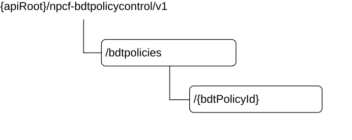

# 5.3 Resources

## 5.3.1 Resource Structure

This clause describes the structure for the Resource URIs and the resources and methods used for the service.

Figure 5.3.1-1 depicts the resource URIs structure for the Npcf_BDTPolicyControl API.

Figure 5.3.1-1: Resource URI structure of the Npcf_BDTPolicyControl API

Table 5.3.1-1 provides an overview of the resources and applicable HTTP methods.

Table 5.3.1-1: Resources and methods overview

<table>
<colgroup>
<col style="width: 20%" />
<col style="width: 30%" />
<col style="width: 17%" />
<col style="width: 30%" />
</colgroup>
<tbody>
<tr class="odd">
<td>Resource name</td>
<td>Resource URI</td>
<td>HTTP method or custom operation</td>
<td>Description</td>
</tr>
<tr class="even">
<td>BDT policies</td>
<td>/bdtpolicies</td>
<td>POST</td>
<td>Npcf_BDTPolicyControl_Create. Creates a new Individual BDT policy resource.</td>
</tr>
<tr class="odd">
<td rowspan="2">Individual BDT policy</td>
<td rowspan="2">/bdtpolicies/{bdtPolicyId}</td>
<td>GET</td>
<td>Reads an Individual BDT policy resource.</td>
</tr>
<tr class="even">
<td>PATCH</td>
<td>
Npcf_BDTPolicyControl_Update.

Modifies an existing Individual BDT policy resource by selecting or reselecting a transfer policy.
</td>
</tr>
</tbody>
</table>

## 5.3.2 Resource: BDT policies (Collection)

### 5.3.2.1 Description

The BDT policies resource represents all the transfer policies that exist in the BDT Policy Control service at a given PCF instance.

### 5.3.2.2 Resource definition

Resource URI: **{apiRoot}/npcf-bdtpolicycontrol/v1/bdtpolicies**

This resource shall support the resource URI variables defined in table 5.3.2.2-1.

Table 5.3.2.2-1: Resource URI variables for this resource

|         |           |                 |
|---------|-----------|-----------------|
| Name    | Data type | Definition      |
| apiRoot | string    | See clause 5.1. |

### 5.3.2.3 Resource Standard Methods

#### 5.3.2.3.1 POST

This method shall support the URI query parameters specified in table 5.3.2.3.1-1.

Table 5.3.2.3.1-1: URI query parameters supported by the POST method on this resource

|      |           |     |             |             |
|------|-----------|-----|-------------|-------------|
| Name | Data type | P   | Cardinality | Description |
| n/a  |           |     |             |             |

This method shall support the request data structures specified in table 5.3.2.3.1-2 and the response data structures and response codes specified in table 5.3.2.3.1-3.

Table 5.3.2.3.1-2: Data structures supported by the POST Request Body on this resource

|            |     |             |                                                                                |
|------------|-----|-------------|--------------------------------------------------------------------------------|
| Data type  | P   | Cardinality | Description                                                                    |
| BdtReqData | M   | 1           | Contains information for the creation of a new Individual BDT policy resource. |

Table 5.3.2.3.1-3: Data structures supported by the POST Response Body on this resource

<table>
<colgroup>
<col style="width: 13%" />
<col style="width: 4%" />
<col style="width: 11%" />
<col style="width: 17%" />
<col style="width: 52%" />
</colgroup>
<tbody>
<tr class="odd">
<td>Data type</td>
<td>P</td>
<td>Cardinality</td>
<td>Response Codes</td>
<td>Description</td>
</tr>
<tr class="even">
<td>BdtPolicy</td>
<td>M</td>
<td>1</td>
<td>201 Created</td>
<td>
Successful case.

The creation of an Individual BDT policy resource is confirmed and a representation of that resource is returned.
</td>
</tr>
<tr class="odd">
<td>n/a</td>
<td></td>
<td></td>
<td>303 See Other</td>
<td>The result of the HTTP POST request would be equivalent to the existing Individual BDT policy resource. The HTTP response shall contain a Location header field set to the URI of the existing individual BDT policy resource.</td>
</tr>
<tr class="even">
<td colspan="5">NOTE: In addition, the HTTP status codes which are specified as mandatory in table 5.2.7.1-1 of 3GPP TS 29.500 [6] for the POST method shall also apply.</td>
</tr>
</tbody>
</table>

Table 5.3.2.3.1-4: Headers supported by the 201 Response Code on this resource

|          |           |     |             |                                                                                                                                           |
|----------|-----------|-----|-------------|-------------------------------------------------------------------------------------------------------------------------------------------|
| Name     | Data type | P   | Cardinality | Description                                                                                                                               |
| Location | string    | M   | 1           | Contains the URI of the newly created resource, according to the structure: {apiRoot}/npcf-bdtpolicycontrol/v1/bdtpolicies/{bdtPolicyId}. |

Table 5.3.2.3.1-5: Headers supported by the 303 Response Code on this resource

|          |           |     |             |                                                                  |
|----------|-----------|-----|-------------|------------------------------------------------------------------|
| Name     | Data type | P   | Cardinality | Description                                                      |
| Location | string    | M   | 1           | Contains the URI of the existing individual BDT policy resource. |

### 5.3.2.4 Resource Custom Operations

None.

## 5.3.3 Resource: Individual BDT policy (Document)

### 5.3.3.1 Description

The Individual BDT policy resource represents the transfer policies that exist in the BDT Policy Control service at a given PCF instance.

### 5.3.3.2 Resource definition

Resource URI: **{apiRoot}/npcf-bdtpolicycontrol/v1/bdtpolicies/{bdtPolicyId}**

This resource shall support the resource URI variables defined in table 5.3.3.2-1.

Table 5.3.3.2-1: Resource URI variables for this resource

<table>
<colgroup>
<col style="width: 16%" />
<col style="width: 18%" />
<col style="width: 64%" />
</colgroup>
<tbody>
<tr class="odd">
<td>Name</td>
<td>Data type</td>
<td>Definition</td>
</tr>
<tr class="even">
<td>apiRoot</td>
<td>string</td>
<td>See clause 5.1.</td>
</tr>
<tr class="odd">
<td>bdtPolicyId</td>
<td>string</td>
<td>
Identifies the individual BDT policy resource in the PCF.

To enable the value to be used as part of a URI, the string shall only contain allowed characters according to the "lower-with-hyphen" naming convention defined in clause 5.1.3 of 3GPP TS 29.501 [7] and rules for a path segment defined in IETF RFC 3986 [16].
</td>
</tr>
</tbody>
</table>

### 5.3.3.3 Resource Standard Methods

#### 5.3.3.3.1 GET

This method shall support the URI query parameters specified in table 5.3.3.3.1-1.

Table 5.3.3.3.1-1: URI query parameters supported by the GET method on this resource

|      |           |     |             |             |
|------|-----------|-----|-------------|-------------|
| Name | Data type | P   | Cardinality | Description |
| n/a  |           |     |             |             |

This method shall support the request data structures specified in table 5.3.3.3.1-2 and the response data structures and response codes specified in table 5.3.3.3.1-3.

Table 5.3.3.3.1-2: Data structures supported by the GET Request Body on this resource

|           |     |             |             |
|-----------|-----|-------------|-------------|
| Data type | P   | Cardinality | Description |
| n/a       |     |             |             |

Table 5.3.3.3.1-3: Data structures supported by the GET Response Body on this resource

<table>
<colgroup>
<col style="width: 18%" />
<col style="width: 4%" />
<col style="width: 13%" />
<col style="width: 18%" />
<col style="width: 45%" />
</colgroup>
<tbody>
<tr class="odd">
<td>Data type</td>
<td>P</td>
<td>Cardinality</td>
<td>Response codes</td>
<td>Description</td>
</tr>
<tr class="even">
<td>BdtPolicy</td>
<td>M</td>
<td>1</td>
<td>200 OK</td>
<td>A representation of an Individual BDT policy resource is returned.</td>
</tr>
<tr class="odd">
<td>RedirectResponse</td>
<td>O</td>
<td>0..1</td>
<td>307 Temporary Redirect</td>
<td>
Temporary redirection, during resource retrieval.

Applicable if the feature "ES3XX" is supported.

(NOTE 3)
</td>
</tr>
<tr class="even">
<td>RedirectResponse</td>
<td>O</td>
<td>0..1</td>
<td>308 Permanent Redirect</td>
<td>
Permanent redirection, during resource retrieval.

Applicable if the feature "ES3XX" is supported.

(NOTE 3)
</td>
</tr>
<tr class="odd">
<td>ProblemDetails</td>
<td>O</td>
<td>0..1</td>
<td>404 Not Found</td>
<td>(NOTE 2)</td>
</tr>
<tr class="even">
<td colspan="5">
NOTE 1: In addition, the HTTP status codes which are specified as mandatory in table 5.2.7.1-1 of 3GPP TS 29.500 [6] for the GET method shall also apply.

NOTE 2: Failure cases are described in clause 5.7.

NOTE 3: The RedirectResponse data structure may be provided by an SCP (refer to clause 6.10.9.1 of 3GPP TS 29.500 [6]).
</td>
</tr>
</tbody>
</table>

Table 5.3.3.3.1-4: Headers supported by the 307 Response Code on this resource

<table>
<colgroup>
<col style="width: 20%" />
<col style="width: 13%" />
<col style="width: 4%" />
<col style="width: 11%" />
<col style="width: 50%" />
</colgroup>
<tbody>
<tr class="odd">
<td>Name</td>
<td>Data type</td>
<td>P</td>
<td>Cardinality</td>
<td>Description</td>
</tr>
<tr class="even">
<td>Location</td>
<td>string</td>
<td>M</td>
<td>1</td>
<td>
Contains an alternative URI of the resource located in an alternative PCF (service) instance towards which the request is redirected.

For the case where the request is redirected to the same target via a different SCP, refer to clause 6.10.9.1 of 3GPP TS 29.500 [6].
</td>
</tr>
<tr class="odd">
<td>3gpp-Sbi-Target-Nf-Id</td>
<td>string</td>
<td>O</td>
<td>0..1</td>
<td>Identifier of the target PCF (service) instance towards which the request is redirected.</td>
</tr>
</tbody>
</table>

Table 5.3.3.3.1-5: Headers supported by the 308 Response Code on this resource

<table>
<colgroup>
<col style="width: 20%" />
<col style="width: 13%" />
<col style="width: 4%" />
<col style="width: 11%" />
<col style="width: 50%" />
</colgroup>
<tbody>
<tr class="odd">
<td>Name</td>
<td>Data type</td>
<td>P</td>
<td>Cardinality</td>
<td>Description</td>
</tr>
<tr class="even">
<td>Location</td>
<td>string</td>
<td>M</td>
<td>1</td>
<td>
Contains an alternative URI of the resource located in an alternative PCF (service) instance towards which the request is redirected.

For the case where the request is redirected to the same target via a different SCP, refer to clause 6.10.9.1 of 3GPP TS 29.500 [6].
</td>
</tr>
<tr class="odd">
<td>3gpp-Sbi-Target-Nf-Id</td>
<td>string</td>
<td>O</td>
<td>0..1</td>
<td>Identifier of the target PCF (service) instance towards which the request is redirected.</td>
</tr>
</tbody>
</table>

#### 5.3.3.3.2 PATCH

This method shall support the URI query parameters specified in table 5.3.3.3.2-1.

Table 5.3.3.3.2-1: URI query parameters supported by the PATCH method on this resource

|      |           |     |             |             |
|------|-----------|-----|-------------|-------------|
| Name | Data type | P   | Cardinality | Description |
| n/a  |           |     |             |             |

This method shall support the request data structures specified in table 5.3.3.3.2-2 and the response data structures and response codes specified in table 5.3.3.3.2-3.

Table 5.3.3.3.2-2: Data structures supported by the PATCH Request Body on this resource

|                |     |             |                                                                                                                                                                                                           |
|----------------|-----|-------------|-----------------------------------------------------------------------------------------------------------------------------------------------------------------------------------------------------------|
| Data type      | P   | Cardinality | Description                                                                                                                                                                                               |
| PatchBdtPolicy | M   | 1           | Contains modification instructions to be performed on the BdtPolicy data structure to select a transfer policy and in addition, may indicate whether the BDT warning notification is enabled or disabled. |

Table 5.3.3.3.2-3: Data structures supported by the PATCH Response Body on this resource

<table>
<colgroup>
<col style="width: 17%" />
<col style="width: 5%" />
<col style="width: 11%" />
<col style="width: 19%" />
<col style="width: 45%" />
</colgroup>
<tbody>
<tr class="odd">
<td>Data type</td>
<td>P</td>
<td>Cardinality</td>
<td>Response Codes</td>
<td>Description</td>
</tr>
<tr class="even">
<td>BdtPolicy</td>
<td>M</td>
<td>1</td>
<td>200 OK</td>
<td>
Successful case.

The Individual BDT Policy resource is modified and a representation of that resource is returned.
</td>
</tr>
<tr class="odd">
<td>n/a</td>
<td></td>
<td></td>
<td>204 No Content</td>
<td>
Successful case.

The Individual BDT Policy resource is modified.
</td>
</tr>
<tr class="even">
<td>RedirectResponse</td>
<td>O</td>
<td>0..1</td>
<td>307 Temporary Redirect</td>
<td>
Temporary redirection, during resource modification.

Applicable if the feature "ES3XX" is supported.

(NOTE 3)
</td>
</tr>
<tr class="odd">
<td>RedirectResponse</td>
<td>O</td>
<td>0..1</td>
<td>308 Permanent Redirect</td>
<td>
Permanent redirection, during resource modification.

Applicable if the feature "ES3XX" is supported.

(NOTE 3)
</td>
</tr>
<tr class="even">
<td>ProblemDetails</td>
<td>O</td>
<td>0..1</td>
<td>404 Not Found</td>
<td>(NOTE 2)</td>
</tr>
<tr class="odd">
<td colspan="5">
NOTE 1: In addition, the HTTP status codes which are specified as mandatory in table 5.2.7.1-1 of 3GPP TS 29.500 [6] for the PATCH method shall also apply.

NOTE 2: Failure cases are described in clause 5.7.

NOTE 3: The RedirectResponse data structure may be provided by an SCP (refer to clause 6.10.9.1 of 3GPP TS 29.500 [6]).
</td>
</tr>
</tbody>
</table>

Table 5.3.3.3.2-4: Headers supported by the 307 Response Code on this resource

<table>
<colgroup>
<col style="width: 20%" />
<col style="width: 13%" />
<col style="width: 4%" />
<col style="width: 11%" />
<col style="width: 50%" />
</colgroup>
<tbody>
<tr class="odd">
<td>Name</td>
<td>Data type</td>
<td>P</td>
<td>Cardinality</td>
<td>Description</td>
</tr>
<tr class="even">
<td>Location</td>
<td>string</td>
<td>M</td>
<td>1</td>
<td>
Contains an alternative URI of the resource located in an alternative PCF (service) instance towards which the request is redirected.

For the case where the request is redirected to the same target via a different SCP, refer to clause 6.10.9.1 of 3GPP TS 29.500 [6].
</td>
</tr>
<tr class="odd">
<td>3gpp-Sbi-Target-Nf-Id</td>
<td>string</td>
<td>O</td>
<td>0..1</td>
<td>Identifier of the target PCF (service) instance towards which the request is redirected.</td>
</tr>
</tbody>
</table>

Table 5.3.3.3.2-5: Headers supported by the 308 Response Code on this resource

<table>
<colgroup>
<col style="width: 20%" />
<col style="width: 13%" />
<col style="width: 4%" />
<col style="width: 11%" />
<col style="width: 50%" />
</colgroup>
<tbody>
<tr class="odd">
<td>Name</td>
<td>Data type</td>
<td>P</td>
<td>Cardinality</td>
<td>Description</td>
</tr>
<tr class="even">
<td>Location</td>
<td>string</td>
<td>M</td>
<td>1</td>
<td>
Contains an alternative URI of the resource located in an alternative PCF (service) instance towards which the request is redirected.

For the case where the request is redirected to the same target via a different SCP, refer to clause 6.10.9.1 of 3GPP TS 29.500 [6].
</td>
</tr>
<tr class="odd">
<td>3gpp-Sbi-Target-Nf-Id</td>
<td>string</td>
<td>O</td>
<td>0..1</td>
<td>Identifier of the target PCF (service) instance towards which the request is redirected.</td>
</tr>
</tbody>
</table>
