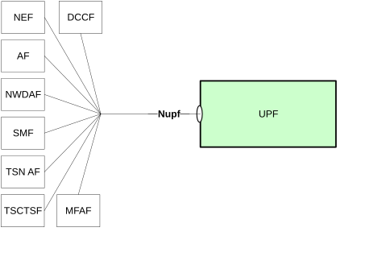

# 4 Overview

## 4.1 Introduction

Within the 5GC, the UPF offers services to the NEF, AF, SMF, NWDAF, DCCF, MFAF, TSCTSF and TSN AF via the Nupf service based interface (see 3GPP TS 23.501 \[2\], 3GPP TS 23.502 \[3\], 3GPP TS 23.288 \[17\] and 3GPP TS 23.548 \[14\]).

Figure 4.1-1 provides the reference model (in service based interface representation and in reference point representation), with focus on the UPF.

Figure 4.1-1: Reference model – UPF

The UPF supports the following functionalities which are provided via Service Based Interface:

\- Subscription to notifications of events exposed by the UPF;

\- Notification about UPF events; and

\- Translation of (NATed) Public UE IP address and port to (5GC) Private UE IP address.
