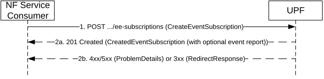
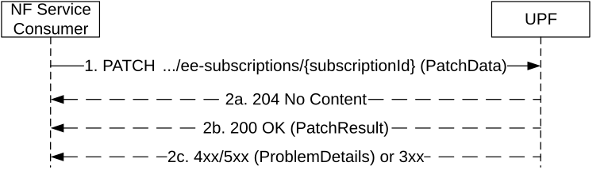
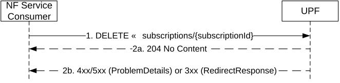
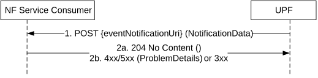

# 5.2 Nupf_EventExposure Service

## 5.2.1 Service Description

### 5.2.1.1 Service operations

The Nupf_EventExposure service enables NF service consumers to subscribe to UPF events and/or the UPF to send notifications about UPF events to NF service consumers.

The Nupf_EventExposure service supports the service operations defined in Table 5.2.1.1-1.

Table 5.2.1.1-1: Service operations supported by the Nupf_EventExposure service

<table>
<colgroup>
<col style="width: 20%" />
<col style="width: 41%" />
<col style="width: 19%" />
<col style="width: 17%" />
</colgroup>
<thead>
<tr class="header">
<th>Service Operations</th>
<th>Description</th>
<th>
Operation

Semantics
</th>
<th>Example Consumer(s)</th>
</tr>
</thead>
<tbody>
<tr class="odd">
<td>Subscribe</td>
<td>Subscribe to UPF events</td>
<td>Subscribe/Notify</td>
<td>NWDAF, SMF, DCCF</td>
</tr>
<tr class="even">
<td>Unsubscribe</td>
<td>Unsubscribe from UPF events</td>
<td>Subscribe/Notify</td>
<td>NWDAF, SMF, DCCF</td>
</tr>
<tr class="odd">
<td>Notify</td>
<td>Notification about UPF events</td>
<td>Subscribe/Notify</td>
<td>NEF, AF, NWDAF, TSCTSF, TSNAF, DCCF, MFAF</td>
</tr>
</tbody>
</table>

### 5.2.1.2 Subscription to UPF events

The UPF exposes UPF events via the Nupf_EventExposure service as defined in Table 5.2.1.2-1.

Table 5.2.1.2-1: Subscriptions to UPF events

<table>
<colgroup>
<col style="width: 20%" />
<col style="width: 20%" />
<col style="width: 58%" />
</colgroup>
<thead>
<tr class="header">
<th>Subscription</th>
<th>
Protocol used for the subscription

to UPF
</th>
<th>Description</th>
</tr>
</thead>
<tbody>
<tr class="odd">
<td rowspan="2">Subscription via SMF</td>
<td>PFCP</td>
<td>
The NF service consumer creates the subscription for the event of interest via the SMF. The SMF instructs the UPF to report the events directly to the NF service consumer via the N4 interface as specified in 3GPP TS 29.244 [15].

Upon occurrence of the event of interest, the UPF sends a notification directly to the NF service consumer using the Nupf_EventExposure Notify service operation.
</td>
</tr>
<tr class="even">
<td>Nupf_EventExposure Subscribe</td>
<td>
The NF service consumer creates the subscription for the event of interest via the SMF. The SMF subscribes to the UPF using the Nupf_EventExposure Subscribe service operation.

Upon occurrence of the event of interest, the UPF sends a notification directly to the NF Service Consumer using the Nupf_EventExposure Notify service operation.
</td>
</tr>
<tr class="odd">
<td>
Subscription

to UPF
</td>
<td>Nupf_EventExposure Subscribe</td>
<td>
The NF service consumer creates the subscription for the event of interest to the UPF using the Nupf_EventExposure Subscribe service operation.

Upon occurrence of the event of interest, the UPF sends a notification directly to the NF Service Consumer using the Nupf_EventExposure Notify service operation
</td>
</tr>
</tbody>
</table>

Clause 5.2.1.3 decribes which of the above subscriptions shall be used for each event type supported by the Nupf_EventExposure service.

### 5.2.1.3 UPF events supported by the Nupf_EventExposure service

#### 5.2.1.3.1 General

The Nupf_EventExposure service supports the events defined in this clause.

See also clauses 4.15.4.5.1 and 5.2.26.2.1 of 3GPP TS 23.502 \[3\].

#### 5.2.1.3.2 QoS Monitoring

Table 5.2.1.3.2-1: QoS Monitoring event

<table>
<colgroup>
<col style="width: 27%" />
<col style="width: 72%" />
</colgroup>
<thead>
<tr class="header">
<th><strong>Description</strong></th>
<th>
This event provides QoS flow performance information, i.e. QoS monitoring results for the QoS parameter(s) to be measured.

The following QoS parameters may be measured and/or reported:

<blockquote>

- Packet delay monitoring: DL, UL and/or Round-Trip packet delay between UE and PSA UPF of specific QoS flow(s) of the PDU session.

</blockquote>

- Data rate monitoring: UL and/or DL data rate measurement for a QoS flow.

- Congestion information of a QoS flow on the UL and/or DL directions received from the NG-RAN.
</th>
</tr>
</thead>
<tbody>
<tr class="odd">
<td><strong>Subscription type</strong></td>
<td>Subscription via SMF using PFCP</td>
</tr>
<tr class="even">
<td><strong>Subscription inputs to UPF</strong></td>
<td>
- QFI(s) of a specific PDU session

- requested QoS measurements

- UPF event consumer notification URI

- Notification correlation ID

- Reporting suggestion information (i.e. Report urgency, Reporting time information)

See clauses 5.24.4, 5.24.5 and 5.39 of 3GPP TS 29.244 [15].
</td>
</tr>
<tr class="odd">
<td><strong>Report type</strong></td>
<td>
Continuous (event triggered) Report (for Packet Delay, Data Rate and Congestion Information).

Periodic Report (for Packet Delay and Data Rate)
</td>
</tr>
</tbody>
</table>

#### 5.2.1.3.3 User Data Usage Measures

Table 5.2.1.3.3-1: User Data Usage Measures event

<table>
<colgroup>
<col style="width: 27%" />
<col style="width: 72%" />
</colgroup>
<thead>
<tr class="header">
<th><strong>Description</strong></th>
<th>
This event provides information of user data usage of a PDU session:

- Volume Measurement: measurements of data volume exchanged (UL, DL and/or overall) and/or number of packets exchanged (UL, DL and/or overall) determined for the requested Granularity of Measurements.

- Throughput Measurement: measurements of data throughput (UL and DL) determined for the requested Granularity of Measurements.

- Application related information: URL(s) and/or Domain information (domain name and protocol) detected for the target traffic. This Type of Measurement requires that Application Id(s) or Traffic Filtering Information is provided (i.e. this measurement is not possible to be applied for all traffic handled by the UPF).
</th>
</tr>
</thead>
<tbody>
<tr class="odd">
<td><strong>Subscription type</strong></td>
<td>
Subscription via SMF using Nupf_EventExposure Subscribe, if the target is:

- PDU session(s) of a specific UE or a group of UEs; or

- PDU session(s) of any UE and the subscription includes at least one of the following parameters: AoI, BSSID/SSID and DNAI.

Subscription to the UPF, if the target is PDU session(s) of any UE and the subscription does not need to include any of the following parameters: AoI, BSSID/SSID and DNAI.
</td>
</tr>
<tr class="even">
<td><strong>Subscription inputs to UPF</strong></td>
<td>
Required:

- UE IP address (for an IP PDU session type), SUPI (for a non-IP PDU session type) or "Any UE"

- Type of Measurement (i.e. Volume, Throughput, Application related information)

- UPF event consumer notification URI

- Notification correlation ID

Optional:

- DNN

- S-NSSAI

- either Application ID(s) or Traffic filters

- Granularity of Measurement (i.e. required granularity for the information reported, i.e. per PDU session, per data flow or per application)

- Reporting suggestion information (i.e. Report urgency, Reporting time information)
</td>
</tr>
<tr class="odd">
<td><strong>Report type</strong></td>
<td>
One-Time Report

Periodic Report
</td>
</tr>
</tbody>
</table>

#### 5.2.1.3.4 User Data Usage Trends

Table 5.2.1.3.4-1: User Data Usage Trends event

<table>
<colgroup>
<col style="width: 27%" />
<col style="width: 72%" />
</colgroup>
<thead>
<tr class="header">
<th><strong>Description</strong></th>
<th>
This event provides statistics related to user data usage of a PDU session:

- Throughput Statistic Measurement (average and/or peak throughput) over the measurement period determined for the requested Granularity of Measurements.
</th>
</tr>
</thead>
<tbody>
<tr class="odd">
<td><strong>Subscription type</strong></td>
<td>
Subscription via SMF using Nupf_EventExposure Subscribe, if the target is:

- PDU session(s) of a specific UE or a group of UEs; or

- PDU session(s) of any UE and the subscription includes at least one of the following parameters: AoI, BSSID/SSID and DNAI.

Subscription to the UPF, if the target is PDU session(s) of any UE and the subscription does not need to include any of the following parameters: AoI, BSSID/SSID and DNAI.
</td>
</tr>
<tr class="even">
<td><strong>Subscription inputs to UPF</strong></td>
<td>
Required:

- UE IP address (for an IP PDU session type), SUPI (for a non-IP PDU session type) or "Any UE"

- UPF event consumer notification URI

- Notification correlation ID

Optional:

- DNN

- S-NSSAI

- either Application ID(s) or Traffic filters

- Granularity of Measurement (i.e. required granularity for the information reported, i.e per PDU session, per data flow or per application)

- Reporting suggestion information (i.e. Report urgency, Reporting time information)
</td>
</tr>
<tr class="odd">
<td><strong>Report type</strong></td>
<td>
One-Time Report

Periodic Report
</td>
</tr>
</tbody>
</table>

#### 5.2.1.3.5 TSC Management Information

Table 5.2.1.3.5-1: TSC Management Information event

<table>
<colgroup>
<col style="width: 27%" />
<col style="width: 72%" />
</colgroup>
<thead>
<tr class="header">
<th><strong>Description</strong></th>
<th>This event provides TSC Management Information.</th>
</tr>
</thead>
<tbody>
<tr class="odd">
<td><strong>Subscription type</strong></td>
<td>Subscription via SMF using PFCP</td>
</tr>
<tr class="even">
<td><strong>Subscription inputs to UPF</strong></td>
<td>
- UPF event consumer notification URI

- Notification correlation ID

See clauses 5.26.3.2 of 3GPP TS 29.244 [15] and clauses 6.2.1 and 6.3.1 of 3GPP TS 24.539 [18].
</td>
</tr>
<tr class="odd">
<td><strong>Report type</strong></td>
<td>Continuous (event triggered) Report.</td>
</tr>
</tbody>
</table>

## 5.2.2 Service Operations

### 5.2.2.1 Introduction

The service operations defined for the Nupf_EventExposure service are as follows:

\- Subscribe: It enables an NF service consumer to subscribe to UPF event exposure notifications..

\- Unsubscribe: It enables an NF service consumer to unsubscribe from UPF event exposure notifications.

\- Notify: It allows the UPF to send event notifications directly to NF service consumers.

NOTE: The Subscribe and Unsubscribe service operations only apply to UPF events that can be subscribed using the Nupf service based interface (see clauses 5.2.1.2 and 5.2.1.3).

### 5.2.2.2 Subscribe

#### 5.2.2.2.1 General

The Subscribe service operation is used by a NF Service Consumer to subscribe to UPF event exposure notifications, e.g. for the purpose of UPF data collection for a specified PDU session or any UE.

NOTE: NF service consumers can only be SMF, NWDAF or DCCF in this release of the specification.

#### 5.2.2.2.2 Creation of a subscription

An NF Service Consumer shall invoke the Subscribe service operation towards the UPF to create a subscription to monitor at least one UPF event. The NF Service Consumer may subscribe to multiple events in a subscription. A subscription may be associated with one UE's PDU session or with any UE.

The NF Service Consumer shall request to create a new subscription by using the HTTP method POST with the URI of the subscriptions collection, see clause 6.1.3.2.

Figure 5.2.2.2.2-1 Subscription creation

1\. The NF Service Consumer shall send a POST request to create a subscription resource in the UPF. The content of the POST request shall contain a representation of the individual subscription resource to be created.

> The NF Service Consumer shall include the following information in the HTTP message body:

\- NF ID, indicating the identity of the network function instance creating the subscription;

\- Target of Event Reporting, indicating the target(s) to be monitored, i.e.

\- a specific PDU Session of a UE identified with a UE IP address for an IP PDU session type;

\- a specific PDU Session of a UE identified with a SUPI (and S-NSSAI/DNN) for a non-IP PDU session type; or

\- any UE (identified by the "anyUE" flag);

\- List of UPF events requested to be subscribed;

\- Type of measurement, for UPF events supporting multiple types of measurement, e.g. for a subscription to the UserDataUsageMeasures event;

\- Event Reporting Mode, indicating how the events shall be reported (One-time Report or Periodic Report); and

\- UPF event consumer notification URI, indicating the address where to send the event notifications generated by the subscription.

The NF Service Consumer may include the following information in the HTTP message body:

\- The S-NSSAI and/or the DNN of PDU sessions to which the subscription applies;

\- either one or more Application ID(s) or traffic filters identifying the traffic to be monitored by the subscription;

\- Granularity of Measurement, indicating that the granularity of the required measurements is per PDU Session, per data flow or per application;

\- Reporting period, defining the period for periodic reporting;

\- Maximum number of reports, defining the maximum number of reports after which the event subscription ceases to exist;

\- Expiry time, suggested by the NF Service Consumer representing the time up to which the subscription is desired to be kept active and the time after which the subscribed event(s) shall stop generating reports;

\- Reporting suggestion information, i.e. Report urgency indicating whether the event report can be delayed (i.e. it is delay-tolerant) and if so, the Reporting time information defining the last valid reporting time for the UPF to report the detected event;

\- Deactivate notification flag, indicating that the notification of the available events shall be muted until the event consumer NF (e.g. NWDAF or DCCF) provides the retrieval notification flag to retrieve the stored events;

\- Immediate Report Flag per event, indicating an immediate report to be generated with the current event status;

\- Notification Correlation ID, indicating the correlation identity to be signaled in the event notifications generated by the subscription;

\- Sampling ratio, defining the random subset of PDU sessions among target PDU sessions, in which case the UPF shall only report the event(s) related to the selected subset of PDU sessions;

\- partitioningCriteria, defining the criteria for partitioning PDU sessions before applying the sampling ratio; and/or

\- Muting Exception Instructions, which specify instructions to apply to the subscription and the stored events when an exception occurs at the UPF while the event is muted (e.g., the buffer of stored event reports is full, or the number of stored event reports exceeds a certain number), if the EEMM feature is supported (see clause 6.1.8).

2a. On success (i.e. if the request is accepted), the UPF shall include a HTTP Location header to provide the location of the newly created resource (subscription) together with the status code 201 in the response message indicating that the requested resource is created.  
  
If the NF Service Consumer has included more than one events in the event subscription and some of the events cannot be subscribed, the UPF shall accept the request and provide the successfully subscribed event(s) in the CreatedEventSubscription.  
  
If the NF Service Consumer has included the Immediate Report Flag with the value true in the event subscription, and if the current status of the events subscribed are available, the UPF shall include the current status of the events subscribed in the response. Otherwise, the UPF shall generate reports for the events and notify the NF service consumer using the Nupf_EventExposure_Notify service operation. If the events with the Immediate Report Flag set to true are subscribed via an SMF, the notification shall be sent to the actual NF service consumer directly, i.e. the current status of the events subscribed shall not be included in the subscription creation response.

If the NF Service Consumer has set the event reporting option to ONE_TIME and if the UPF has included the current status of the events subscribed in the response, then the UPF shall not do any subsequent event notification for the corresponding events.

The response, based on operator policy and taking into account the expiry time included in the request, may contain the expiry time, as determined by the UPF, after which the subscription becomes invalid. Once the subscription expires, if the NF Service Consumer wants to keep receiving notifications, it shall create a new subscription in the UPF. The UPF shall not provide the same expiry time for many subscriptions in order to avoid all of them expiring and recreating the subscription at the same time. If the expiry time is not included in the response, the NF Service Consumer shall consider the subscription to be valid without an expiry time.

If the sampling ratio ("sampRatio") attribute is included in the subscription without a partitioningCriteria, the UPF shall select a random subset of PDU sessions among target PDU sessions according to the sampling ratio and only report the event(s) related to the selected subset of PDU sessions. If the partitioningCriteria attribute is also included along with sampling ratio, the UPF shall apply the sampling ratio on the group of PDU sessions determined according to the partitioning criteria.

If the "notifFlag" attribute is included and set to "DEACTIVATE" in the request by e.g. the NWDAF or DCCF, the UPF shall mute the event notification and store the available events. Additionally, if the UPF supports the EEMM feature (see clause 6.1.8) and if the NF service consumer includes event muting instructions in the request, the UPF should evaluate the received event muting instructions against to local actions (if configured) and, if the subscription creation request is accepted, the UPF may indicate the following information to the NF service consumer in the response:

\- the maximum number of notifications that the UPF expects to be able to store for the subscription;

\- an estimate of the duration for which notifications can be buffered.

2b. On failure or redirection, one of the HTTP status code listed in Table 6.1.3.2.3.1-3 shall be returned. For a 4xx/5xx response, the message body shall contain a ProblemDetails structure with the "cause" attribute set to one of the application error listed in Table 6.1.3.2.3.1-3.

If the UPF supports the EEMM features (see clause 6.1.8), the NF service consumer sets the "notifFlag" attribute to "DEACTIVATE" and event muting instructions in the request, but the UPF cannot accept the received instructions, the UPF may reject the request with a 403 Forbidden response and the application error "MUTING_EXC_INSTR_NOT_ACCEPTED".

For a subscription request targeting a PDU session, if the UPF cannot find a unique PDU session due to no DNN and/or S-NSSAI being received in the request, the UPF shall reject the request with a 403 Forbidden response and the application error "REJECTION_DUE_TO_NO_DNN_SNSSAI" (see clause 4.4.1.2 of 3GPP TS 23.502 \[3\]).

#### 5.2.2.2.3 Modification of a subscription

The service operation is invoked by a NF Service Consumer, towards the UPF, when it needs to modify an existing subscription previously created at the UPF.

The NF Service Consumer shall modify the subscription by using the HTTP method PATCH with the URI of the individual subscription resource (see clause 6.1.3.3) to be modified.

Figure 5.2.2.2.3-1: Modification of a subscription

1\. The NF service consumer shall send a PATCH request to the resource representing a subscription. The modification may be for the events subscribed or for updating the event report options, or the NF Id.

2a. On success, the request is accepted, and all the modification instructions in the PATCH request have been implemented, the UPF shall respond with "204 No Content".

2b. On success, the request is accepted, but some of the modification instructions in the PATCH request have been discarded, the UPF shall respond with "200 OK" including PatchResult to indicate the failed modifications.

2c. On failure or redirection, one of the HTTP status code listed in Table 6.1.3.3.3.2-3 shall be returned. For a 4xx/5xx response, the message body may contain a ProblemDetails structure with the "cause" attribute set to one of the application errors listed in Table 6.1.3.3.3.2-3.

### 5.2.2.2A Unsubscribe

#### 5.2.2.2A.1 General

The Unsubscribe service operation is invoked by a NF Service Consumer towards the UPF to delete an existing subscription previously created at the UPF.

The NF Service Consumer shall unsubscribe from a subscription by using the HTTP method DELETE with the URI of the individual subscription resource (see clause 6.1.3.3) to be deleted.

Figure 5.2.2.2A.1-1 Unsubscribing from UPF events

1\. The NF Service Consumer shall send a DELETE request to delete an existing subscription resource in the UPF.

2a. On success (i.e. if the request is accepted), the UPF shall reply with the status code 204 in the response message to indicate that the resource identified by the subscription ID has been successfully deleted.

2b. On failure or redirection, one of the HTTP status code listed in Table 6.1.3.3.3.1-3 shall be returned. For a 4xx/5xx response, the message body shall contain a ProblemDetails structure with the "cause" attribute set to one of the application error listed in Table 6.1.3.3.3.1-3.

### 5.2.2.3 Notify

#### 5.2.2.3.1 General

The Notify service operation is invoked by the UPF, to send a notification, towards the notification URI, when certain event included in the subscription has taken place. See Figure 5.2.2.3.2-1.

For the events "USER_DATA_USAGE_MEASURES" and "USER_DATA_USAGE_TRENDS", the UPF shall use the HTTP method POST, using the notification URI received in the subscription creation as specified in clause 5.2.2.2.2, including e.g. the subscription ID, Event ID(s) for which event has happened, notification correlation ID provided by the NF service consumer at the time of event subscription, to send a notification.

If the subscription is targeting PDU sessions of any UE, i.e. the "anyUe" is set to true in the subscription creation request, the UPF shall perform the requested measurementsfor every PDU session that matches the event filter information (i.e. S-NSSAIs, DNNs, either Application ID(s) or traffic filters) and send notification(s) with multiple NotificationItem IEs within the NotificationData wherein each NotificationItem shall correspond to a report on one subscribed event per PDU session. If the subscription request included a sampling ratio, the notification may include the sampling ratio achieved by the UPF.

For the events "QOS_MONITORING" and "TSC_MNGT_INFO", the UPF shall use the HTTP method POST, using the notification URI received from the SMF via N4 interface, see clause 5.33.5 of 3GPP TS 29.244 \[15\].

For the event "USER_DATA_USAGE_MEASURES", the event notification may contain following information:

\- Volume Measurement: measurements of data volume exchanged (UL, DL and/or overall) and/or number of packets exchanged (UL, DL and/or overall) determined for the requested Granularity of Measurements.

\- Throughput Measurement: measurements of data throughput (UL and DL) determined for the requested Granularity of Measurements.

\- Application related Information: URLs and/or Domain information (Domain name and protocol) detected in the target traffic identified by the information included in the subscription request, e.g. an application id.

When the granularity of the measurement is per data flow, the notification shall include the packet filter set and the Applications Identifier if available.

For the event "USER_DATA_USAGE_TRENDS", the event notification may contain following information:

\- Throughput Statistic Measurement (average and/or peak throughput) over the measurement determined for the requested Granularity of Measurements.

When the granularity of the measurement is per data flow, the notification shall include the packet filter set and the Applications Identifier if available.

For the event "QOS_MONITORING", this service operation is used by the UPF to send the following types of event notifications:

\- Periodic notification on the downlink packet delay, uplink packet delay, and/or the round trip packet delay between the UPF (PSA) and UE;

\- Event triggered notification on the downlink packet delay, uplink packet delay, and/or the round trip packet delay between the UPF (PSA) and UE, i.e. when the packet delay exceeds a defined threshold;

\- Notification on the downlink packet delay, uplink packet delay, and/or the round trip packet delay between the UPF (PSA) and UE when the PDU session is released.

\- Event triggered notification of congestion information of the QoS flow on the UL and/or DL directions received from the NG-RAN, upon a change of the congestion information.

For the event "TSC_MNGT_INFO", the event notification may contain the following information:

\- Port Management Information Container(s) for one or more NW-TT ports and/or

\- a User Plane Node Management Information Container.

The event notification shall also contain the following information:

\- the related NW-TT port number(s), if Port Management Information Container(s) is present; and

\- the notification correlation ID received from the SMF, if any.

#### 5.2.2.3.2 UPF sends notification on subscribed events

Figure 5.2.2.3.2-1: UPF sends notification on subscribed events

1\. The UPF shall send a POST request to the eventNotificationUri as provided by the SMF during the provisioning of Session Reporting Rule (see clause 7.5.2.9 of 3GPP TS 29.244 \[15\]) or received in the subscription creation as specified in clause 5.2.2.2.2.

2a. Upon success, the NF Service Consumer responds with "204 No Content".

2b. On failure or redirection:

\- If the NF Service Consumer does not consider the "eventNotificationUri" as a valid notification URI, the NF Service Consumer shall return "404 Not Found" status code with the ProblemDetails IE providing details of the error.

\- In the case of redirection, the NF service consumer shall return 3xx status code, which shall contain a Location header with an URI pointing to the endpoint of another NF service consumer endpoint.
