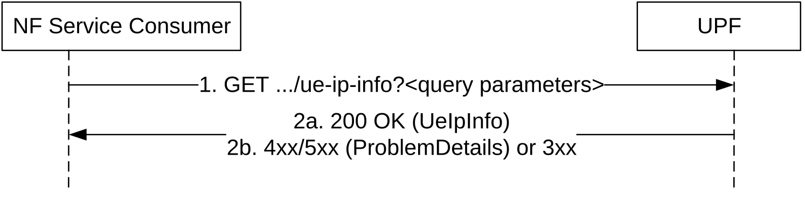

# 5.3 Nupf_GetUEPrivateIPaddrAndIdentifiers Service

## 5.3.1 Service Description

The Nupf_GetUEPrivateIPaddrAndIdentifiers Service enables the UPF to provide the UE IP address information of a PDU session and optionally UE identifiers (e.g. SUPI, GPSI), e.g. to provide the (private) UE IP address when being queried with a NATed UE IP Address, to the NF service consumer (e.g. a NEF), when the NAT functionality of the UE IP address is deployed within the UPF.

Table 5.3.1-1 lists the service operations that are supported by the Nupf_GetUEPrivateIPaddrAndIdentifiers service.

Table 5.3.1-1: Service operations supported by the Nupf_GetUEPrivateIPaddrAndIdentifiers service

<table>
<colgroup>
<col style="width: 24%" />
<col style="width: 40%" />
<col style="width: 13%" />
<col style="width: 22%" />
</colgroup>
<thead>
<tr class="header">
<th>Service Operations</th>
<th>Description</th>
<th>
Operation

Semantics
</th>
<th>Example Consumers</th>
</tr>
</thead>
<tbody>
<tr class="odd">
<td>Get</td>
<td>Retrieve the UE IP address information of a PDU session, to get e.g., UE's private IP address and optionally the associated IP domain.</td>
<td>Request / Response</td>
<td>NEF</td>
</tr>
</tbody>
</table>

## 5.3.2 Service Operations

### 5.3.2.1 Introduction

See Table 5.3.1-1 for an overview of the service operations supported by the Nupf_GetUEPrivateIPaddrAndIdentifiers service.

### 5.3.2.2 Get

#### 5.3.2.2.1 General

The Get service operation is used in the following procedure:

\- AF specific UE ID retrieval as specified in clause 4.15.10 of 3GPP TS 23.502 \[3\] ;

\- AF traffic influence request without HPLMN DNN, S-NSSAI information for a single UE, private IP address or public IP address owned by VPLMN as specified in clause 4.3.6.5.3 of 3GPP TS 23.502 \[3\];

\- AF traffic influence request without HPLMN DNN, S-NSSAI information for a single UE, UE IP address owned and assigned by HPLMN as specified in clause 4.3.6.5.4 of 3GPP TS 23.502 \[3\].

This service operation is consumed by querying the "ue-ip-info" resource. The request is sent to the UPF hosting the IP address in the query.

Figure 5.3.2.2.1-1: Retrieval of UE IP Info for a PDU session

1\. The NF Service Consumer shall send an HTTP GET request to the resource URI of "ue-ip-info". The input filter criteria for the discovery request shall be included in query parameters, e.g. the UE (public) IP address and Port Number, and optionally DNN and S-NSSAI.

2a. On success, "200 OK" shall be returned. The response body shall include a UeIpInfo object which contains relevant attributes matching the query parameters included in the request message.

2b. On failure, one of the HTTP status code listed in Table 6.2.3.2.3.1-3 shall be returned. For a 4xx/5xx response, the message body may contain a ProblemDetails structure with the "cause" attribute set to one of the application errors listed in Table 6.2.3.2.3.1-3, where applicable.  
On redirection, "307 Temporary Redirect" or "308 Permanent Redirect" shall be returned. A RedirectResponse IE may be included in the content of POST response.
