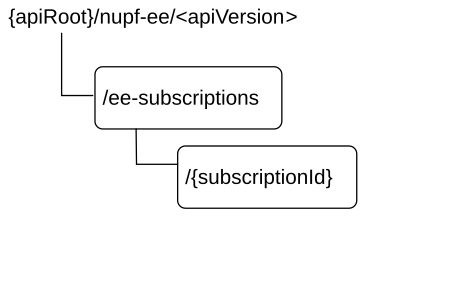

# 6.1.3 Resources

## 6.1.3.1 Overview

Figure 6.1.3.1-1: Resource URI structure of the nupf-ee API

Table 6.1.3.1-1 provides an overview of the resources and applicable HTTP methods.

Table 6.1.3.1-1: Resources and methods overview

<table>
<colgroup>
<col style="width: 26%" />
<col style="width: 29%" />
<col style="width: 10%" />
<col style="width: 33%" />
</colgroup>
<thead>
<tr class="header">
<th>Resource name</th>
<th>Resource URI</th>
<th>HTTP method or custom operation</th>
<th>
Description

(service operation)
</th>
</tr>
</thead>
<tbody>
<tr class="odd">
<td>
EventExposureSubscriptions

(Collection)
</td>
<td>/ee-subscriptions</td>
<td>POST</td>
<td>Subscribe service operation, creating a new subscription .</td>
</tr>
<tr class="even">
<td rowspan="2">
Individual subscription

(Document)
</td>
<td rowspan="2">/ee-subscriptions/{subscriptionId}</td>
<td>DELETE</td>
<td>Unsubscribe service operation</td>
</tr>
<tr class="odd">
<td>PATCH</td>
<td>Subscribe service operation, modification of a subscription</td>
</tr>
</tbody>
</table>

## 6.1.3.2 Resource: EventExposureSubscriptions

### 6.1.3.2.1 Description

This resource represents a collection of subscriptions created by NF service consumers of Nupf_EventExposure service.

This resource is modelled as the Collection resource archetype (see clause C.2 of 3GPP TS 29.501 \[5\]).

### 6.1.3.2.2 Resource Definition

Resource URI: **{apiRoot}/nupf-ee/\<apiVersion\>/ee-subscriptions**

This resource shall support the resource URI variables defined in table 6.1.3.2.2-1.

Table 6.1.3.2.2-1: Resource URI variables for this resource

| Name       | Data type | Definition       |
|------------|-----------|------------------|
| apiRoot    | string    | See clause 6.1.1 |
| apiVersion | string    | See clause 6.1.1 |

### 6.1.3.2.3 Resource Standard Methods

#### 6.1.3.2.3.1 POST

This method shall support the URI query parameters specified in table 6.1.3.2.3.1-1.

Table 6.1.3.2.3.1-1: URI query parameters supported by the POST method on this resource

|      |           |     |             |             |               |
|------|-----------|-----|-------------|-------------|---------------|
| Name | Data type | P   | Cardinality | Description | Applicability |
| n/a  |           |     |             |             |               |

This method shall support the request data structures specified in table 6.1.3.2.3.1-2 and the response data structures and response codes specified in table 6.1.3.2.3.1-3.

Table 6.1.3.2.3.1-2: Data structures supported by the POST Request Body on this resource

|                         |     |             |                                                            |
|-------------------------|-----|-------------|------------------------------------------------------------|
| Data type               | P   | Cardinality | Description                                                |
| CreateEventSubscription | M   | 1           | Content of the Subscribe request to create a subscription. |

Table 6.1.3.2.3.1-3: Data structures supported by the POST Response Body on this resource

<table>
<colgroup>
<col style="width: 16%" />
<col style="width: 4%" />
<col style="width: 12%" />
<col style="width: 11%" />
<col style="width: 54%" />
</colgroup>
<tbody>
<tr class="odd">
<td>Data type</td>
<td>P</td>
<td>Cardinality</td>
<td>
Response

codes
</td>
<td>Description</td>
</tr>
<tr class="even">
<td>CreatedEventSubscription</td>
<td>M</td>
<td>1</td>
<td>201 Created</td>
<td>Represents successful creation of an UPF Event Subscription</td>
</tr>
<tr class="odd">
<td>RedirectResponse</td>
<td>O</td>
<td>0..1</td>
<td>307 Temporary Redirect</td>
<td>
Temporary redirection.

(NOTE 2)
</td>
</tr>
<tr class="even">
<td>RedirectResponse</td>
<td>O</td>
<td>0..1</td>
<td>308 Permanent Redirect</td>
<td>
Permanent redirection.

(NOTE 2)
</td>
</tr>
<tr class="odd">
<td>ProblemDetails</td>
<td>O</td>
<td>0..1</td>
<td>403 Forbidden</td>
<td>
Indicates the creation of subscription has failed due to application error.

The "cause" attribute may be used to indicate one of the following application errors:

- PDU_SESSION_NOT_SERVED_BY_UPF

- MUTING_EXC_INSTR_NOT_ACCEPTED

- REJECTION_DUE_TO_NO_DNN_SNSSAI
</td>
</tr>
<tr class="even">
<td>ProblemDetails</td>
<td>O</td>
<td>0..1</td>
<td>501 Not Implemented</td>
<td>
The "cause" attribute may be used to indicate one of the following application errors:

- UNSUPPORTED_EVENT_TYPE
</td>
</tr>
<tr class="odd">
<td colspan="5">
NOTE 1: The mandatory HTTP error status code for the POST method listed in Table 5.2.7.1-1 of 3GPP TS 29.500 [4] also apply, with response body containing an object of ProblemDetails data type (see clause 5.2.7 of 3GPP TS 29.500 [4]).

NOTE 2: RedirectResponse may be inserted by an SCP, see clause 6.10.9.1 of 3GPP TS 29.500 [4].
</td>
</tr>
</tbody>
</table>

Table 6.1.3.2.3.1-4: Headers supported by the 201 Response Code on this resource

|          |           |     |             |                                                                                                                                                |
|----------|-----------|-----|-------------|------------------------------------------------------------------------------------------------------------------------------------------------|
| Name     | Data type | P   | Cardinality | Description                                                                                                                                    |
| Location | string    | M   | 1           | Contains the URI of the newly created resource, according to the structure: {apiRoot}/nupf-ee/\<apiVersion\>/ee-subscriptions/{subscriptionId} |

Table 6.1.3.2.3.1-5: Headers supported by the 307 Response Code on this endpoint

|                       |           |     |             |                                                                                                                                                                                                                         |
|-----------------------|-----------|-----|-------------|-------------------------------------------------------------------------------------------------------------------------------------------------------------------------------------------------------------------------|
| Name                  | Data type | P   | Cardinality | Description                                                                                                                                                                                                             |
| Location              | string    | M   | 1           | An alternative URI of the resource located on an alternative service instance. For the case, when a request is redirected to the same target resource via a different SCP, see clause 6.10.9.1 in 3GPP TS 29.500 \[4\]. |
| 3gpp-Sbi-Target-Nf-Id | string    | O   | 0..1        | Identifier of the target NF (service) instance ID towards which the request is redirected                                                                                                                               |

Table 6.1.3.2.3.1-6: Headers supported by the 308 Response Code on this endpoint

|                       |           |     |             |                                                                                                                                                                                                                         |
|-----------------------|-----------|-----|-------------|-------------------------------------------------------------------------------------------------------------------------------------------------------------------------------------------------------------------------|
| Name                  | Data type | P   | Cardinality | Description                                                                                                                                                                                                             |
| Location              | string    | M   | 1           | An alternative URI of the resource located on an alternative service instance. For the case, when a request is redirected to the same target resource via a different SCP, see clause 6.10.9.1 in 3GPP TS 29.500 \[4\]. |
| 3gpp-Sbi-Target-Nf-Id | string    | O   | 0..1        | Identifier of the target NF (service) instance ID towards which the request is redirected                                                                                                                               |

### 6.1.3.2.4 Resource Custom Operations

None.

## 6.1.3.3 Resource: Individual subscription

### 6.1.3.3.1 Description

This resource represents an individual of subscription created by NF service consumers of Nupf_EventExposure service.

This resource is modelled as the Document resource archetype (see clause C.1 of 3GPP TS 29.501 \[5\]).

### 6.1.3.3.2 Resource Definition

Resource URI: **{apiRoot}/nupf-ee/\<apiVersion\>/ee-subscriptions/{subscriptionId}**

This resource shall support the resource URI variables defined in table 6.1.3.3.2-1.

Table 6.1.3.3.2-1: Resource URI variables for this resource

| Name           | Data type | Definition                                                                     |
|----------------|-----------|--------------------------------------------------------------------------------|
| apiRoot        | string    | See clause 6.2.1                                                               |
| apiVersion     | string    | See clause 6.2.1.                                                              |
| subscriptionId | string    | String identifies an individual subscription to the UPF event exposure service |

### 6.1.3.3.3 Resource Standard Methods

#### 6.1.3.3.3.1 DELETE

This method shall support the URI query parameters specified in table 6.1.3.3.3.1-1.

Table 6.1.3.3.3.1-1: URI query parameters supported by the DELETE method on this resource

| Name | Data type | P   | Cardinality | Description |
|------|-----------|-----|-------------|-------------|
| n/a  |           |     |             |             |

This method shall support the request data structures specified in table 6.1.3.3.3.1-2 and the response data structures and response codes specified in table 6.1.3.3.3.1-3.

Table 6.1.3.3.3.1-2: Data structures supported by the DELETE Request Body on this resource

| Data type | P   | Cardinality | Description |
|-----------|-----|-------------|-------------|
| n/a       |     |             |             |

Table 6.1.3.3.3.1-3: Data structures supported by the DELETE Response Body on this resource

<table>
<colgroup>
<col style="width: 21%" />
<col style="width: 5%" />
<col style="width: 12%" />
<col style="width: 11%" />
<col style="width: 48%" />
</colgroup>
<thead>
<tr class="header">
<th>Data type</th>
<th>P</th>
<th>Cardinality</th>
<th>
Response

codes
</th>
<th>Description</th>
</tr>
</thead>
<tbody>
<tr class="odd">
<td>n/a</td>
<td></td>
<td></td>
<td>204 No Content</td>
<td></td>
</tr>
<tr class="even">
<td>RedirectResponse</td>
<td>O</td>
<td>0..1</td>
<td>307 Temporary Redirect</td>
<td>
Temporary redirection.

(NOTE 2)
</td>
</tr>
<tr class="odd">
<td>RedirectResponse</td>
<td>O</td>
<td>0..1</td>
<td>308 Permanent Redirect</td>
<td>
Permanent redirection.

(NOTE 2)
</td>
</tr>
<tr class="even">
<td>ProblemDetails</td>
<td>O</td>
<td>0..1</td>
<td>404 Not Found</td>
<td>
Indicates the modification of subscription has failed due to application error.

The "cause" attribute may be used to indicate one of the following application errors:

- SUBSCRIPTION_NOT_FOUND
</td>
</tr>
<tr class="odd">
<td colspan="5">
NOTE 1: The mandatory HTTP error status code for the DELETE method listed in Table 5.2.7.1-1 of 3GPP TS 29.500 [4] also apply, with response body containing an object of ProblemDetails data type (see clause 5.2.7 of 3GPP TS 29.500 [4]).

NOTE 2: RedirectResponse may be inserted by an SCP, see clause 6.10.9.1 of 3GPP TS 29.500 [4].
</td>
</tr>
</tbody>
</table>

Table 6.1.3.3.3.1-4: Headers supported by the 307 Response Code on this endpoint

|                       |           |     |             |                                                                                                                                                                                                                         |
|-----------------------|-----------|-----|-------------|-------------------------------------------------------------------------------------------------------------------------------------------------------------------------------------------------------------------------|
| Name                  | Data type | P   | Cardinality | Description                                                                                                                                                                                                             |
| Location              | string    | M   | 1           | An alternative URI of the resource located on an alternative service instance. For the case, when a request is redirected to the same target resource via a different SCP, see clause 6.10.9.1 in 3GPP TS 29.500 \[4\]. |
| 3gpp-Sbi-Target-Nf-Id | string    | O   | 0..1        | Identifier of the target NF (service) instance ID towards which the request is redirected                                                                                                                               |

Table 6.1.3.3.3.1-5: Headers supported by the 308 Response Code on this endpoint

|                       |           |     |             |                                                                                                                                                                                                                         |
|-----------------------|-----------|-----|-------------|-------------------------------------------------------------------------------------------------------------------------------------------------------------------------------------------------------------------------|
| Name                  | Data type | P   | Cardinality | Description                                                                                                                                                                                                             |
| Location              | string    | M   | 1           | An alternative URI of the resource located on an alternative service instance. For the case, when a request is redirected to the same target resource via a different SCP, see clause 6.10.9.1 in 3GPP TS 29.500 \[4\]. |
| 3gpp-Sbi-Target-Nf-Id | string    | O   | 0..1        | Identifier of the target NF (service) instance ID towards which the request is redirected                                                                                                                               |

#### 6.1.3.3.3.2 PATCH

This method shall support the URI query parameters specified in table 6.1.3.3.3.2-1.

Table 6.1.3.3.3.2-1: URI query parameters supported by the PATCH method on this resource

|      |           |     |             |             |
|------|-----------|-----|-------------|-------------|
| Name | Data type | P   | Cardinality | Description |
| n/a  |           |     |             |             |

This method shall support the request data structures specified in table 6.1.3.3.3.2-2 and the response data structures and response codes specified in table 6.1.3.3.3.2-3.

Table 6.1.3.3.3.2-2: Data structures supported by the PATCH Request Body on this resource

|                  |     |             |                                                            |
|------------------|-----|-------------|------------------------------------------------------------|
| Data type        | P   | Cardinality | Description                                                |
| array(PatchItem) | M   | 1..N        | Items describe the modifications to the Event Subscription |

Table 6.1.3.3.3.2-3: Data structures supported by the PATCH Response Body on this resource

<table>
<colgroup>
<col style="width: 16%" />
<col style="width: 4%" />
<col style="width: 13%" />
<col style="width: 11%" />
<col style="width: 54%" />
</colgroup>
<tbody>
<tr class="odd">
<td>Data type</td>
<td>P</td>
<td>Cardinality</td>
<td>
Response

codes
</td>
<td>Description</td>
</tr>
<tr class="even">
<td>n/a</td>
<td></td>
<td></td>
<td>204 No Content</td>
<td>Upon success, an empty response body shall be returned. (NOTE 2)</td>
</tr>
<tr class="odd">
<td>PatchResult</td>
<td>M</td>
<td>1</td>
<td>200 OK</td>
<td>Upon success, the execution report is returned. (NOTE 2)</td>
</tr>
<tr class="even">
<td>RedirectResponse</td>
<td>O</td>
<td>0..1</td>
<td>307 Temporary Redirect</td>
<td>
Temporary redirection.

(NOTE 3)
</td>
</tr>
<tr class="odd">
<td>RedirectResponse</td>
<td>O</td>
<td>0..1</td>
<td>308 Permanent Redirect</td>
<td>
Permanent redirection.

(NOTE 3)
</td>
</tr>
<tr class="even">
<td>ProblemDetails</td>
<td>O</td>
<td>0..1</td>
<td>403 Forbidden</td>
<td>
One or more attributes are not allowed to be modified.

The "cause" attribute may be used to indicate one of the following application errors:

- MODIFICATION_NOT_ALLOWED, see 3GPP TS 29.500 [4] table 5.2.7.2-1.

- MUTING_EXC_INSTR_NOT_ACCEPTED
</td>
</tr>
<tr class="odd">
<td>ProblemDetails</td>
<td>O</td>
<td>0..1</td>
<td>404 Not Found</td>
<td>
The "cause" attribute may be used to indicate one of the following application errors:

- SUBSCRIPTION_NOT_FOUND, see 3GPP TS 29.500 [4] table 5.2.7.2-1.
</td>
</tr>
<tr class="even">
<td colspan="5">
NOTE 1: The mandatory HTTP error status code for the PATCH method listed in Table 5.2.7.1-1 of 3GPP TS 29.500 [4] also apply, with response body containing an object of ProblemDetails data type (see clause 5.2.7 of 3GPP TS 29.500 [4]).

NOTE 2: If all the modification instructions in the PATCH request have been implemented, the UPF shall respond with 204 No Content response; if some of the modification instructions in the PATCH request have been discarded, the UPF shall respond with PatchResult.

NOTE 3: RedirectResponse may be inserted by an SCP, see clause 6.10.9.1 of 3GPP TS 29.500 [4].
</td>
</tr>
</tbody>
</table>

Table 6.1.3.3.3.2-4: Headers supported by the 307 Response Code on this endpoint

|                       |           |     |             |                                                                                                                                                                                                                                                                                              |
|-----------------------|-----------|-----|-------------|----------------------------------------------------------------------------------------------------------------------------------------------------------------------------------------------------------------------------------------------------------------------------------------------|
| Name                  | Data type | P   | Cardinality | Description                                                                                                                                                                                                                                                                                  |
| Location              | string    | M   | 1           | An alternative URI of the resource located on an alternative service instance. It is implementation specific how the alternative URI is determined. For the case, when a request is redirected to the same target resource via a different SCP, see clause 6.10.9.1 in 3GPP TS 29.500 \[4\]. |
| 3gpp-Sbi-Target-Nf-Id | string    | O   | 0..1        | Identifier of the target NF (service) instance ID towards which the request is redirected                                                                                                                                                                                                    |

Table 6.1.3.3.3.2-5: Headers supported by the 308 Response Code on this endpoint

|                       |           |     |             |                                                                                                                                                                                                                                                                                              |
|-----------------------|-----------|-----|-------------|----------------------------------------------------------------------------------------------------------------------------------------------------------------------------------------------------------------------------------------------------------------------------------------------|
| Name                  | Data type | P   | Cardinality | Description                                                                                                                                                                                                                                                                                  |
| Location              | string    | M   | 1           | An alternative URI of the resource located on an alternative service instance. It is implementation specific how the alternative URI is determined. For the case, when a request is redirected to the same target resource via a different SCP, see clause 6.10.9.1 in 3GPP TS 29.500 \[4\]. |
| 3gpp-Sbi-Target-Nf-Id | string    | O   | 0..1        | Identifier of the target NF (service) instance ID towards which the request is redirected                                                                                                                                                                                                    |

### 6.1.3.3.4 Resource Custom Operations

None.
