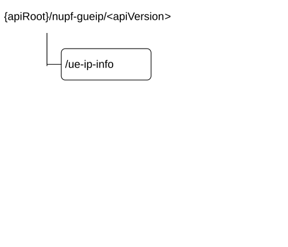

# 6.2 Nupf_GetUEPrivateIPaddrAndIdentifiers Service API

## 6.2.1 Introduction

The Nupf_GetUEPrivateIPaddrAndIdentifiers service shall use the Nupf_GetUEPrivateIPaddrAndIdentifiers API.

The API URI of the Nupf_GetUEPrivateIPaddrAndIdentifiers Service API shall be:

**{apiRoot}/\<apiName\>/\<apiVersion\>**

The request URI used in HTTP requests from the NF service consumer towards the NF service producer shall have the Resource URI structure defined in clause 4.4.1 of 3GPP TS 29.501 \[5\], i.e.:

**{apiRoot}/\<apiName\>/\<apiVersion\>/\<apiSpecificResourceUriPart\>**

with the following components:

\- The {apiRoot} shall be set as described in 3GPP TS 29.501 \[5\].

\- The \<apiName\> shall be "nupf-gueip".

\- The \<apiVersion\> shall be "v1".

\- The \<apiSpecificResourceUriPart\> shall be set as described in clause 6.2.3.

## 6.2.2 Usage of HTTP

### 6.2.2.1 General

HTTP/2, IETF RFC 9113 \[11\], shall be used as specified in clause 5 of 3GPP TS 29.500 \[4\].

HTTP/2 shall be transported as specified in clause 5.3 of 3GPP TS 29.500 \[4\].

The OpenAPI \[6\] specification of HTTP messages and content bodies for the Nupf_GetUEPrivateIPaddrAndIdentifiers API is contained in Annex A.

### 6.2.2.2 HTTP standard headers

#### 6.2.2.2.1 General

See clause 5.2.2 of 3GPP TS 29.500 \[4\] for the usage of HTTP standard headers.

#### 6.2.2.2.2 Content type

JSON, IETF RFC 8259 \[12\], shall be used as content type of the HTTP bodies specified in the present specification as specified in clause 5.4 of 3GPP TS 29.500 \[4\]. The use of the JSON format shall be signalled by the content type "application/json".

"Problem Details" JSON object shall be used to indicate additional details of the error in a HTTP response body and shall be signalled by the content type "application/problem+json", as defined in IETF RFC 9457 \[13\].

### 6.2.2.3 HTTP custom headers

The mandatory HTTP custom header fields specified in clause 5.2.3.2 of 3GPP TS 29.500 \[4\] shall be supported, and the optional HTTP custom header fields specified in clause 5.2.3.3 of 3GPP TS 29.500 \[4\] may be supported.

## 6.2.3 Resources

### 6.2.3.1 Overview

Figure 6.2.3.1-1: Resource URI structure of the Nupf_GetUEPrivateIPaddrAndIdentifiers API

Table 6.2.3.1-1 provides an overview of the resources and applicable HTTP methods.

Table 6.2.3.1-1: Resources and methods overview

<table>
<colgroup>
<col style="width: 16%" />
<col style="width: 32%" />
<col style="width: 9%" />
<col style="width: 41%" />
</colgroup>
<thead>
<tr class="header">
<th>Resource name</th>
<th>Resource URI</th>
<th>HTTP method or custom operation</th>
<th>Description</th>
</tr>
</thead>
<tbody>
<tr class="odd">
<td>
UE IP Address Info

(Document)
</td>
<td>/ue-ip-info</td>
<td>GET</td>
<td>Nupf_GetUEPrivateIPaddrAndIdentifiers_Get</td>
</tr>
</tbody>
</table>

### 6.2.3.2 Resource: UE IP Address Info

#### 6.2.3.2.1 Description

This resource represents the UE IP Address Info of all the PDU sessions served by the UPF.

This resource is modelled with the Document archetype (see clause C.1 of 3GPP TS 29.501 \[5\]).

#### 6.2.3.2.2 Resource Definition

Resource URI: **{apiRoot}/nupf-gueip/\<apiVersion\>/ue-ip-info**

This resource shall support the resource URI variables defined in table 6.2.3.2.2-1.

Table 6.2.3.2.2-1: Resource URI variables for this resource

| Name       | Definition       |
|------------|------------------|
| apiRoot    | See clause 6.2.1 |
| apiVersion | See clause 6.2.1 |

#### 6.2.3.2.3 Resource Standard Methods

##### 6.2.3.2.3.1 GET

This operation retrieves the UE IP Info of a PDU session, which contains the UE's PDU Session (private) IP address and optionally UE identifiers (e.g. SUPI, GPSI), by querying the UPF with the NATed UE's public IP address and an optional Port number, and optionally the DNN and S-NSSAI.

This method shall support the URI query parameters specified in table 6.2.3.2.3.1-1.

Table 6.2.3.2.3.1-1: URI query parameters supported by the GET method on this resource

|                                                                          |            |     |             |                            |               |
|--------------------------------------------------------------------------|------------|-----|-------------|----------------------------|---------------|
| Name                                                                     | Data type  | P   | Cardinality | Description                | Applicability |
| ue-ipv4-address                                                          | Ipv4Addr   | C   | 0..1        | UE's IPv4 address (NOTE)   |               |
| ue-ipv6-prefix                                                           | Ipv6Prefix | C   | 0..1        | UE's IPv6 Prefix (NOTE)    |               |
| port-number                                                              | integer    | O   | 0..1        | UDP or TCP Port            |               |
| dnn                                                                      | Dnn        | O   | 0..1        | DNN of the PDU session     |               |
| snssai                                                                   | Snssai     | O   | 0..1        | S-NSSAI of the PDU session |               |
| NOTE: Either the ue-ipv4-address or the ue-ipv6-prefix shall be present. |            |     |             |                            |               |

This method shall support the request data structures specified in table 6.2.3.2.3.1-2 and the response data structures and response codes specified in table 6.2.3.2.3.1-3.

Table 6.2.3.2.3.1-2: Data structures supported by the GET Request Body on this resource

|           |     |             |             |
|-----------|-----|-------------|-------------|
| Data type | P   | Cardinality | Description |
| n/a       |     |             |             |

Table 6.2.3.2.3.1-3: Data structures supported by the GET Response Body on this resource

<table>
<colgroup>
<col style="width: 16%" />
<col style="width: 4%" />
<col style="width: 12%" />
<col style="width: 11%" />
<col style="width: 54%" />
</colgroup>
<tbody>
<tr class="odd">
<td>Data type</td>
<td>P</td>
<td>Cardinality</td>
<td>
Response

codes
</td>
<td>Description</td>
</tr>
<tr class="even">
<td>UeIpInfo</td>
<td>M</td>
<td>1</td>
<td>200 OK</td>
<td>The response body contains a UeIpInfo for a PDU session which contains attributes that are matching the queryparameter.</td>
</tr>
<tr class="odd">
<td>RedirectResponse</td>
<td>O</td>
<td>0..1</td>
<td>307 Temporary Redirect</td>
<td>
Temporary redirection.

(NOTE 2)
</td>
</tr>
<tr class="even">
<td>RedirectResponse</td>
<td>O</td>
<td>0..1</td>
<td>308 Permanent Redirect</td>
<td>
Permanent redirection.

(NOTE 2)
</td>
</tr>
<tr class="odd">
<td>ProblemDetails</td>
<td>O</td>
<td>0..1</td>
<td>404 Not Found</td>
<td>
The "cause" attribute may be used to indicate the following application error:

<blockquote>

- NO_MATCHING_UE_IP_ADDRESS

</blockquote>

See table 6.2.7.3-1 for the description of this error.
</td>
</tr>
<tr class="even">
<td colspan="5">
NOTE 1: The mandatory HTTP error status code for the GET method listed in Table 5.2.7.1-1 of 3GPP TS 29.500 [4] also apply, with response body containing an object of ProblemDetails data type (see clause 5.2.7 of 3GPP TS 29.500 [4]).

NOTE 2: RedirectResponse may be inserted by an SCP, see clause 6.10.9.1 of 3GPP TS 29.500 [4].
</td>
</tr>
</tbody>
</table>

Table 6.2.3.2.3.1-4: Headers supported by the 307 Response Code on this resource

|                       |           |     |             |                                                                                                                                                                                                                         |
|-----------------------|-----------|-----|-------------|-------------------------------------------------------------------------------------------------------------------------------------------------------------------------------------------------------------------------|
| Name                  | Data type | P   | Cardinality | Description                                                                                                                                                                                                             |
| Location              | string    | M   | 1           | An alternative URI of the resource located on an alternative service instance. For the case, when a request is redirected to the same target resource via a different SCP, see clause 6.10.9.1 in 3GPP TS 29.500 \[4\]. |
| 3gpp-Sbi-Target-Nf-Id | string    | O   | 0..1        | Identifier of the target NF (service) instance ID towards which the request is redirected, see clause 6.10.9.1 in 3GPP TS 29.500 \[4\].                                                                                 |

Table 6.2.3.2.3.1-5: Headers supported by the 308 Response Code on this resource

|                       |           |     |             |                                                                                                                                                                                                                         |
|-----------------------|-----------|-----|-------------|-------------------------------------------------------------------------------------------------------------------------------------------------------------------------------------------------------------------------|
| Name                  | Data type | P   | Cardinality | Description                                                                                                                                                                                                             |
| Location              | string    | M   | 1           | An alternative URI of the resource located on an alternative service instance. For the case, when a request is redirected to the same target resource via a different SCP, see clause 6.10.9.1 in 3GPP TS 29.500 \[4\]. |
| 3gpp-Sbi-Target-Nf-Id | string    | O   | 0..1        | Identifier of the target NF (service) instance ID towards which the request is redirected.                                                                                                                              |

#### 6.2.3.2.4 Resource Custom Operations

None.

## 6.2.4 Custom Operations without associated resources

None

## 6.2.5 Notifications

### 6.2.5.1 General

None.

## 6.2.6 Data Model

### 6.2.6.1 General

This clause specifies the application data model supported by the API.

Table 6.2.6.1-1 specifies the data types defined for the Nupf_GetUEPrivateIPaddrAndIdentifiers service based interface protocol.

Table 6.2.6.1-1: Nupf_GetUEPrivateIPaddrAndIdentifiers specific Data Types

| Data type | Clause defined | Description                  | Applicability |
|-----------|----------------|------------------------------|---------------|
| UeIpInfo  | 6.2.6.2.2      | A UeIpInfo for a PDU session |               |

Table 6.2.6.1-2 specifies data types re-used by the Nupf_GetUEPrivateIPaddrAndIdentifiers service based interface protocol from other specifications, including a reference to their respective specifications and when needed, a short description of their use within the Nupf_GetUEPrivateIPaddrAndIdentifiers service based interface.

Table 6.2.6.1-2: Nupf_GetUEPrivateIPaddrAndIdentifiers re-used Data Types

| Data type  | Reference             | Comments            | Applicability |
|------------|-----------------------|---------------------|---------------|
| Dnn        | 3GPP TS 29.571 \[16\] | DNN                 |               |
| Snssai     | 3GPP TS 29.571 \[16\] | S-NSSAI             |               |
| Ipv4Addr   | 3GPP TS 29.571 \[16\] | IPv4 address        |               |
| Ipv6Prefix | 3GPP TS 29.571 \[16\] | IPv6 address prefix |               |
| Supi       | 3GPP TS 29.571 \[16\] | SUPI                |               |
| Gpsi       | 3GPP TS 29.571 \[16\] | GPSI                |               |

### 6.2.6.2 Structured data types

#### 6.2.6.2.1 Introduction

This clause defines the structures to be used in resource representations.

#### 6.2.6.2.2 Type: UeIpInfo

Table 6.2.6.2.2-1: Definition of type UeIpInfo

<table>
<colgroup>
<col style="width: 21%" />
<col style="width: 16%" />
<col style="width: 4%" />
<col style="width: 11%" />
<col style="width: 45%" />
</colgroup>
<thead>
<tr class="header">
<th>Attribute name</th>
<th>Data type</th>
<th>P</th>
<th>Cardinality</th>
<th>Description</th>
</tr>
</thead>
<tbody>
<tr class="odd">
<td>privateIpv4Address</td>
<td>Ipv4Address</td>
<td>C</td>
<td>0..1</td>
<td>
When present, this IE shall contain the Private IPv4 IP address.

(NOTE)
</td>
</tr>
<tr class="even">
<td>ipDomain</td>
<td>string</td>
<td>O</td>
<td>0..1</td>
<td>When present, this IE contains the IP domain of the private IPv4 address.</td>
</tr>
<tr class="odd">
<td>privateIpv6Prefix</td>
<td>Ipv6Prefix</td>
<td>C</td>
<td>0..1</td>
<td>
When present, this IE shall contain the Private IPv6 Prefix.

(NOTE)
</td>
</tr>
<tr class="even">
<td>publicIpv4Address</td>
<td>Ipv4Address</td>
<td>O</td>
<td>0..1</td>
<td>When present, this IE shall contain the public (NATed) IPv4 IP address.</td>
</tr>
<tr class="odd">
<td>publicIpv6Prefix</td>
<td>Ipv6Prefix</td>
<td>O</td>
<td>0..1</td>
<td>When present, this IE shall contain the public (NATed) IPv6 Prefix.</td>
</tr>
<tr class="even">
<td>portNumber</td>
<td>Uint16</td>
<td>O</td>
<td>0..1</td>
<td>When present, this IE shall contain the port number for the source UDP or TCP port when Port Address Translation is used.</td>
</tr>
<tr class="odd">
<td>dnn</td>
<td>Dnn</td>
<td>O</td>
<td>0..1</td>
<td>When present, this IE shall contain the DNN of the PDU Session.</td>
</tr>
<tr class="even">
<td>snssai</td>
<td>Snssai</td>
<td>O</td>
<td>0..1</td>
<td>When present, this IE shall contain the S-NSSAI of the PDU Session.</td>
</tr>
<tr class="odd">
<td>hplmnSnssai</td>
<td>Snssai</td>
<td>O</td>
<td>0..1</td>
<td>
This IE may be included by a V-UPF acting as (local) PSA for a HR-SBO PDU session.

When present, it shall contain the HPLMN S-NSSAI of the PDU session.
</td>
</tr>
<tr class="even">
<td>supi</td>
<td>Supi</td>
<td>O</td>
<td>0..1</td>
<td>When present, this IE shall contain the SUPI of the UE.</td>
</tr>
<tr class="odd">
<td>gpsi</td>
<td>Gpsi</td>
<td>O</td>
<td>0..1</td>
<td>When present, this IE shall contain the GPSI of the UE.</td>
</tr>
<tr class="even">
<td>hrsboInd</td>
<td>boolean</td>
<td>C</td>
<td>0..1</td>
<td>
This IE shall be included by a V-UPF and set to true if the PDU session is working in HR-SBO mode.

The presence of this IE with the value false shall be prohibited.
</td>
</tr>
<tr class="odd">
<td colspan="5">NOTE: Either the privateIpv4Address or the privateIpv6Prefix shall be present when the request is to retrieve the UE private IP address.</td>
</tr>
</tbody>
</table>

### 6.2.6.3 Simple data types and enumerations

#### 6.2.6.3.1 Introduction

This clause defines simple data types and enumerations that can be referenced from data structures defined in the previous clauses.

## 6.2.7 Error Handling

### 6.2.7.1 General

For the Nupf_GetUEPrivateIPaddrAndIdentifiers API, HTTP error responses shall be supported as specified in clause 4.8 of 3GPP TS 29.501 \[5\]. Protocol errors and application errors specified in table 5.2.7.2-1 of 3GPP TS 29.500 \[4\] shall be supported for an HTTP method if the corresponding HTTP status codes are specified as mandatory for that HTTP method in table 5.2.7.1-1 of 3GPP TS 29.500 \[4\].

In addition, the requirements in the following clauses are applicable for the Nupf_GetUEPrivateIPaddrAndIdentifiers API.

### 6.2.7.2 Protocol Errors

No specific procedures for the Nupf_GetUEPrivateIPaddrAndIdentifiers service are specified.

### 6.2.7.3 Application Errors

The application errors defined for the Nupf_GetUEPrivateIPaddrAndIdentifiers service are listed in Table 6.2.7.3-1.

Table 6.2.7.3-1: Application errors

| Application Error         | HTTP status code | Description                                              |
|---------------------------|------------------|----------------------------------------------------------|
| NO_MATCHING_UE_IP_ADDRESS | 404 Not Found    | There is no UE IP address matching the query parameters. |

## 6.2.8 Feature negotiation

The optional features in table 6.2.8-1 are defined for the Nupf_GetUEPrivateIPaddrAndIdentifiers API. They shall be negotiated using the extensibility mechanism defined in clause 6.6 of 3GPP TS 29.500 \[4\].

Table 6.2.8-1: Supported Features

| Feature number | Feature Name | Description |
|----------------|--------------|-------------|
|                |              |             |

## 6.2.9 Security

As indicated in 3GPP TS 33.501 \[8\] and 3GPP TS 29.500 \[4\], the access to the Nupf_GetUEPrivateIPaddrAndIdentifiers API may be authorized by means of the OAuth2 protocol (see IETF RFC 6749 \[9\]), based on local configuration, using the "Client Credentials" authorization grant, where the NRF (see 3GPP TS 29.510 \[10\]) plays the role of the authorization server.

If OAuth2 is used, an NF Service Consumer, prior to consuming services offered by the Nupf_GetUEPrivateIPaddrAndIdentifiers API, shall obtain a "token" from the authorization server, by invoking the Access Token Request service, as described in 3GPP TS 29.510 \[10\], clause 5.4.2.2.

NOTE: When multiple NRFs are deployed in a network, the NRF used as authorization server is the same NRF that the NF Service Consumer used for discovering the Nupf_GetUEPrivateIPaddrAndIdentifiers service.

The Nupf_GetUEPrivateIPaddrAndIdentifiers API defines a single scope "nupf-gueip" for the entire service, and it does not define any additional scopes at resource or operation level.

## 6.2.10 HTTP redirection

An HTTP request may be redirected to a different UPF service instance when using direct or indirect communications (see 3GPP TS 29.500 \[4\]).

An SCP that reselects a different UPF producer instance will return the NF Instance ID of the new UPF producer instance in the 3gpp-Sbi-Producer-Id header, as specified in clause 6.10.3.4 of 3GPP TS 29.500 \[4\].

If an UPF redirects a service request to a different UPF using an 307 Temporary Redirect or 308 Permanent Redirect status code, the identity of the new UPF towards which the service request is redirected shall be indicated in the 3gpp-Sbi-Target-Nf-Id header of the 307 Temporary Redirect or 308 Permanent Redirect response as specified in clause 6.10.9.1 of 3GPP TS 29.500 \[4\].
