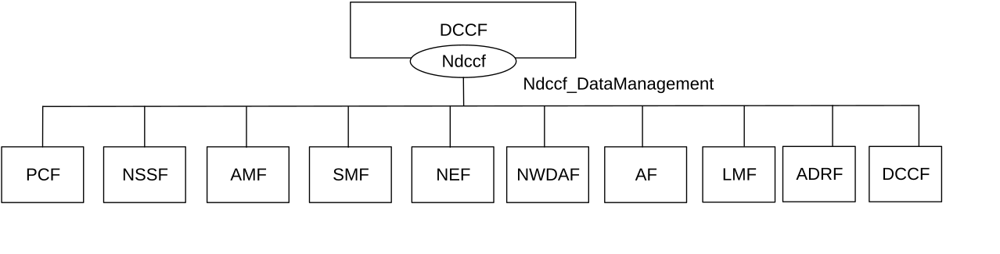
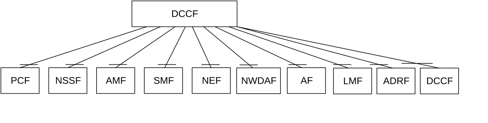

# 4.2.1 Service Description

## 4.2.1.1 Overview

The Ndccf_DataManagement service, as defined in 3GPP TS 23.288 \[14\], is provided by the Data Collection Coordination Function (DCCF).

This service:

\- allows NF service consumers to subscribe, modify and unsubscribe for analytics or data releated events;

\- notifies NF service consumers with a corresponding subscription about observed events;

\- allows NF service consumers to retrieve analytics or data according to the Fetch Instructions provided by DCCF; and

\- allows NF service consumers to transfer UE data subscription context to the target DCCF.

## 4.2.1.2 Service Architecture

The 5G System Architecture is defined in 3GPP TS 23.501 \[2\]. The Network Data Analytics Exposure architecture, including the DCCF architecture, is defined in 3GPP TS 23.288 \[14\].

Known consumers of the Ndccf_DataManagement service are:

\- Policy Control Function (PCF)

\- Network Slice Selection Function (NSSF)

\- Access and Mobility Management Function (AMF)

\- Session Management Function (SMF)

\- Network Exposure Function (NEF)

\- Application Function (AF)

\- Location Management Function (LMF)

\- Network Data Analytics Function (NWDAF)

\- Analytics Data Repository Function (ADRF)

\- Data Collection Coordination Function (DCCF)

The Ndccf_DataManagement service is provided by the DCCF and consumed by the NF service consumers as shown in figure 4.2.1.2-1 for the SBI representation model and in figure 4.2.1.2-2 for the reference point representation model.

Figure 4.2.1.2-1: Ndccf_DataManagement service architecture, SBI representation

Figure 4.2.1.2-2: Ndccf_DataManagement service architecture, reference point representation

## 4.2.1.3 Network Functions

### 4.2.1.3.1 Data Collection Coordination Function (DCCF)

The DCCF (Data Collection Coordination Function) provides the functionality to coordinate collection of analytics and/or data from one or more NFs based on requests from one or more NF service consumers.

### 4.2.1.3.2 NF Service Consumers

The NF service consumers for the Ndccf_DataManagement service are as specified in 3GPP TS 29.520 \[15\] clause 4.2.1.3.2 for the Nnwdaf_EventsSubscription service, with the following differences:

\- The NWDAF as a service consumer supports also (un)subscription to the notification of data collection events from the DCCF.

\- The CEF is not a NF service consumer of the Ndccf_DataManagement service.

\- As an NF service consumer of the Ndccf_DataManagement service, the DCCF supports requesting the transfer of a UE data subscription from source DCCF to target DCCF.
