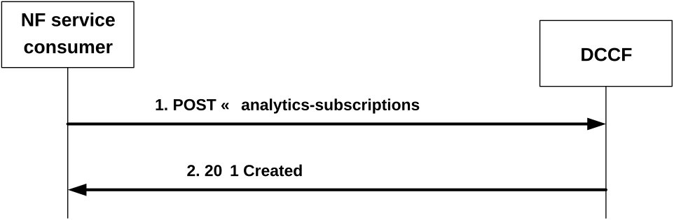

# 4.2.2.2.2 Subscription for analytics notifications

Figure 4.2.2.2.2-1 shows a scenario where the NF service consumer sends a request to the DCCF to subscribe for analytics notifications.

Figure 4.2.2.2.2-1: NF service consumer subscribes to analytics notifications

The NF service consumer shall invoke the Ndccf_DataManagement_Subscribe service operation to subscribe to analytics notification(s). The NF service consumer shall send an HTTP POST request with "{apiRoot}/ndccf-datamanagement/\<apiVersion\>/analytics-subscriptions" as Resource URI representing the "DCCF Analytics Subscriptions", as shown in figure 4.2.2.2.2-1, step 1, to create an "Individual DCCF Analytics Subscription" according to the information in the message body. The NdccfAnalyticsSubscription data structure provided in the request body shall include:

\- analytics subscription information within the "anaSub" attribute;

\- a notification target address within the "anaNotifUri" attribute; and

\- a notification correlation identifier in the "anaNotifCorrId" attribute;

and may include:

\- the notification endpoints within the "notifEndpoints" attribute, if the "DataAnaCollect" feature is supported;

\- formatting instructions within the "formatInstruct" attribute;

\- processing instructions within the "procInstructs" attribute;

\- the indication for analytics storage within the "storeInd" attribute, if the "DataAnaCollect" feature is supported;

\- a target NWDAF identifier within the "targetNfId" attribute or a target NWDAF set identifier within the "targetNfSetId" attribute;

\- an ADRF identifier within the "adrfId" attribute or an ADRF set identifier within the "ardfSetId " attribute; and/or

\- time window of performing the requested analytics within the "timePeriod" attribute.

NOTE 1: This time window, over which the requested data collection or analytics was performed or to be performed, is different from the analytics target period, over which the statistics or predictions are requested. For example, in a subscription that requests "predictions that are performed during the month of May about UE_MOBILITY analytics during the month of July", this time window is "May" while the analytics target period is "July". The DCCF can use the provided time window e.g. to determine when to (un)subscribe to the NWDAF and/or what subscription duration to indicate to it.

\- the purpose of data collection within the "dataCollectPurposes" attribute.

\- the indication that the NF service consumer has already checked the user consent within the "checkedConsentInd" attribute.

\- storage handling information within the "storeHandl" attribute, if the "EnhDataMgmt" feature is supported.

Upon the reception of an HTTP POST request with "{apiRoot}/ndccf-datamanagement/\<apiVersion\>/analytics-subscriptions" as Resource URI and NdccfAnalyticsSubscription data structure as request body, the DCCF shall use the contents of the request (e.g. "anaSub" attribute in NdccfAnalyticsSubscription data structure) to determine whether the subscription can already be served or interactions with the NWDAF and/or ADRF (e.g. creation or modification of analytics subscription for Nnwdaf_EventsSubscription service) are required. If the DCCF cannot use the contents of the request to determine this, the DCCF shall send an HTTP "400 Bad Request" error response including the "cause" attribute set to "SUBSCRIPTION_CANNOT_BE_SERVED".

NOTE 2: The "SUBSCRIPTION_CANNOT_BE_SERVED" error can occur, for example, when the request is syntactically valid and there is no DCCF internal error, but the DCCF can neither find an existing subscription to an NWDAF nor construct one based on the received subscription contents.

If the user consent has not been checked by the NF service consumer and is required for the requested analytics collection depending on local policy and regulations, then the DCCF shall check user consent for the targeted UE(s) based on the user consent subscription data that is retrieved via the Nudm_SDM service API of the UDM as described in clause 5.2.2.24 and clause 6.1.3.32 of 3GPP TS 29.503 \[20\]. If the user consent subscription data retrieved from the UDM indicate that the user consent is not granted for the impacted user(s), then the DCCF shall send an HTTP "403 Forbidden" error response including the "cause" attribute set to "USER_CONSENT_NOT_GRANTED".

NOTE 3: When the target of reporting is a SUPI or a GPSI then the subscription can be rejected, e.g. because user consent is not granted, and the error is sent to the consumer. When the target of reporting is an Internal Group Id, or a list of SUPIs/GPSI(s) or any UE, and the user consent is not granted for a subset of the impacted users, then no error is sent, but a subset of the SUPIs/GPSIs is skipped if user consent is not granted.

Otherwise, if the user consent subscription data retrieved from the UDM indicate that the user consent is granted for the impacted user(s), the DCCF shall subscribe to notification of changes of the user consent (unless it is already subscribed) by invoking the Nudm_SDM_Subscribe service operation by sending an HTTP POST request targeting the resource "SdmSubscriptions" to the UDM as described in clause 5.2.2.3 of 3GPP TS 29.503 \[20\].

If the DCCF determines that the subscription can already be served (without requiring further interactions with NWDAF and/or ADRF) or a successful response from the NWDAF and/or ADRF is received for the creation or modification of subscription(s) to serve this subscription, the DCCF shall:

\- create a new subscription;

\- assign a subscriptionId;

\- store the subscription.

If the DCCF created an "Individual DCCF Analytics Subscription" resource, the DCCF shall respond with "201 Created" with the message body containing a representation of the created subscription, as shown in figure 4.2.2.2.2-1, step 2. If not all the requested analytics events in the subscription are accepted, then the DCCF may include the "failEventReports" attribute within the "anaSub" attribute, indicating the event(s) for which the subscription failed and the associated reason(s). The DCCF shall include a Location HTTP header field. The Location header field shall contain the URI of the created subscription i.e. "{apiRoot}/ndccf-datamanagement/\<apiVersion\>/analytics-subscriptions/{subscriptionId}". If the immediate reporting indication in the "immRep" attribute within the "evtReq" attribute of the "anaSub" attribute sets to true in the event subscription, the DCCF shall include the reports of the events subscribed, if available, in the HTTP POST response within the "eventNotifications" attribute of the "anaSub" attribute, or, potentially within the "immReport" attribute, if the DataAnaCollect feature is supported.

When the "notifFlag" attribute within the "evtReq" attribute of the "anaSub" attribute is included and set to "DEACTIVATE" in the request, the DCCF shall mute the event notification and store the available events until the NF service consumer requests to retrieve them by setting the "notifFlag" attribute to "RETRIEVAL" or until a muting exception occurs (e.g. full buffer).

If the DCCF receives storage handling information in the request but determines (e.g. based on local policy) that a different storage approach shall be followed, it indicates the determined storage approach to the consumer by setting accordingly the "storeHandl" attribute (e.g. providing a different lifetime, or setting the indication about deletion alerts to "false") in the message body of the response. When more than one consumer has requested storage lifetime for the same analytics, the storage approach should be based on the longest requested storage lifetime.

NOTE 4: The default operator policy for how long analytics is to be stored can be longer or shorter than the lifetime requested by the consumer. A default operator policy can for example accept only consumer requested lifetimes that are shorter or longer than the default policy.

If an error occurs when processing the HTTP POST request, the DCCF shall send an HTTP error response as specified in clause 5.1.7.
