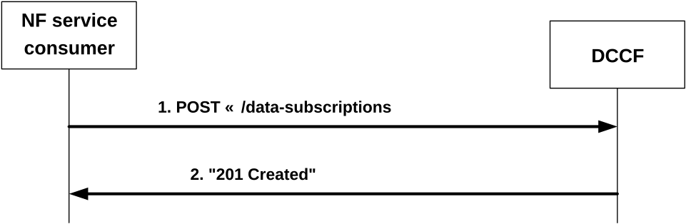

# 4.2.2.2.4 Subscription for data notifications

Figure 4.2.2.2.4-1 shows a scenario where the NF service consumer sends a request to the DCCF to subscribe for data notifications.

Figure 4.2.2.2.4-1: NF service consumer subscribes to data notifications

The NF service consumer (i.e. NWDAF) shall invoke the Ndccf_DataManagement_Subscribe service operation to subscribe to data notification(s). The NF service consumer shall send an HTTP POST request with "{apiRoot}/ndccf-datamanagement/\<apiVersion\>/data-subscriptions" as Resource URI, as shown in figure 4.2.2.2.4-1, step 1, to create a subscription for an "Individual DCCF Data Subscription" resource according to the information in message body. The NdccfDataSubscription data structure provided in the request body shall include:

\- a notification target address within the "dataNotifUri" attribute;

\- a notification correlation identifier within the "dataNotifCorrId" attribute; and

\- a data subscription within the "dataSub" attribute, which contains one of the following:

\- AMF event exposure subscription within the "amfDataSub" attribute;

\- SMF event exposure subscription within the "smfDataSub" attribute;

\- UDM event exposure subscription within the "udmDataSub" attribute;

\- NEF event exposure subscription within the "nefDataSub" attribute;

\- AF event exposure subscription within the "afDataSub" attribute;

\- NRF event exposure subscription within the "nrfDataSub" attribute;

\- NSACF event exposure subscription within the "nsacfDataSub" attribute;

\- GMLC event exposure subscription within the "gmlcDataSub" attribute;

\- UPF event exposure subscription within the "upfDataSub" attribute, if the "UpEvents" feature is supported;

and may include:

\- the notification endpoints within the "notifEndpoints" attribute, if the "DataAnaCollect" feature is supported;

\- formatting instructions within the "formatInstruct" attribute;

\- processing instructions within the "procInstructs" attribute;

\- the indication for data storage within the "storeInd" attribute, if the "DataAnaCollect" feature is supported;

\- a target NF identifier within the "targetNfId" attribute" or a target NF set identifier within the "targetNfSetId" attribute";

\- an ADRF identifier within the "adrfId" attribute or an ADRF set identifier within the "ardfSetId" attribute; and/or

\- time window of the occurrence of the requested data collection within the "timePeriod" attribute.

NOTE 1: The DCCF can use the provided time window e.g. to determine when to (un)subscribe to the data source NF and/or what subscription duration to indicate to it.

\- the purpose of data collection within the "dataCollectPurposes" attribute.

\- the indication that the NF service consumer has already checked the user consent within the "checkedConsentInd" attribute.

\- storage handling information within the "storeHandl" attribute, if the "EnhDataMgmt" feature is supported.

Upon the reception of an HTTP POST request with: "{apiRoot}/ndccf-datamanagement/\<apiVersion\>/data-subscriptions" as Resource URI and NdccfDataSubscription data structure as request body, the DCCF shall use the contents (e.g. "smfDataSub" attribute in NdccfDataSubscription data structure) of the request to determine whether the subscription can already be served or interactions with data sources (e.g. creation or modification of event exposure subscription for Nsmf_EventExposure service) are required. If the DCCF cannot use the contents of the request to determine this, the DCCF shall send an HTTP "400 Bad Request" error response including the "cause" attribute set to "SUBSCRIPTION_CANNOT_BE_SERVED".

NOTE 2: The "SUBSCRIPTION_CANNOT_BE_SERVED" error can occur, for example, when the request is syntactically valid and there is no DCCF internal error, but the DCCF can neither find an existing subscription to a data source nor construct one based on the received subscription contents.

If the user consent has not been checked by the NF service consumer and is required for the requested data collection depending on local policy and regulations, then the DCCF shall check user consent for the targeted UE(s) based on the user consent subscription data that is retrieved via the Nudm_SDM service API of the UDM as described in clause 5.2.2.24 and clause 6.1.3.32 of 3GPP TS 29.503 \[20\]. If the DCCF receive the response from the UDM that it is not granted for the impacted user(s), then the DCCF shall send an HTTP "403 Forbidden" error response including the "cause" attribute set to "USER_CONSENT_NOT_GRANTED".

NOTE 3: When the target of reporting is a SUPI or a GPSI then the subscription can be rejected, e.g. because user consent is not granted, and the error is sent to the consumer. When the target of reporting is an Internal Group Id, or a list of SUPIs/GPSI(s) or any UE, and the user consent is not granted for a subset of the impacted users, then no error is sent, but a subset of the SUPIs/GPSIs is skipped if user consent is not granted.

Otherwise, if the user consent subscription data retrieved from the UDM indicate that the user consent is granted for the impacted user(s), the DCCF shall subscribe to notification of changes of the user consent (unless it is already subscribed) by invoking the Nudm_SDM_Subscribe service operation by sending an HTTP POST request targeting the resource "SdmSubscriptions" to the UDM as described in clause 5.2.2.3 of 3GPP TS 29.503 \[20\].

If the DCCF determines that the subscription can already be served (without requiring further interactions with the data sources) or a successful response from the data source(s) is received for the creation or modification of subscription(s) to serve this subscription, the DCCF shall:

\- create a new subscription;

\- assign a subscriptionId;

\- store the subscription.

If the DCCF created an "Individual DCCF Data Subscription" resource, the DCCF shall respond with "201 Created" with the message body containing a representation of the created subscription, as shown in figure 4.2.2.2.4-1, step 2. The DCCF shall include a Location HTTP header field. The Location header field shall contain the URI of the created subscription i.e. "{apiRoot}/ndccf-datamanagement/\<apiVersion\>/data-subscriptions/{subscriptionId}". If an immediate reporting indication is provided in the subscription, the DCCF shall include the reports of the events subscribed, if available, in the HTTP POST response within the "dataSub" attribute, or, potentially within the "immReport" attribute, if the DataAnaCollect feature is supported.

When the notification flag of the "dataSub" attribute (e.g. the "notifFlag" attribute within the "eventsRepInfo" attribute in the case of AF events) is included and set to "DEACTIVATE" in the request, the DCCF shall mute the event notification and store the available events until the NF service consumer requests to retrieve them by setting the notification flag to "RETRIEVAL" or until a muting exception occurs (e.g. full buffer). When a muting exception occurs, if the EnhDataMgmt feature is supported, the DCCF may consider the contents of the muting instructions of the "dataSub" attribute (if provided; e.g. the "notifFlagInstruct" attribute within the "eventsRepInfo" attribute in the case of AF events) and/or local configuration to determine its actions.

If the EnhDataMgmt feature is supported and the DCCF accepts the provided notification flag and muting instructions, it may indicate the applied muting notification settings in the response (e.g. within the "mutingSetting" attribute in the case of AF events). If the DCCF does not accept the provided notification flag and muting instructions, it shall send an HTTP "403 Forbidden" error response including the "cause" attribute set to "MUTING_INSTR_NOT_ACCEPTED".

If the DCCF receives storage handling information in the request but determines (e.g. based on local policy) that a different storage approach shall be followed, it indicates the determined storage approach to the consumer by setting accordingly the "storeHandl" attribute (e.g. providing a different lifetime, or setting the indication about deletion alerts to "false") in the message body of the response. When more than one consumer has requested storage lifetime for the same data, the storage approach should be based on the longest requested storage lifetime.

NOTE 4: The default operator policy for how long data is to be stored can be longer or shorter than the lifetime requested by the consumer. A default operator policy can for example accept only consumer requested lifetimes that are shorter or longer than the default policy.

If an error occurs when processing the HTTP POST request, the DCCF shall send an HTTP error response as specified in clause 5.1.7.
