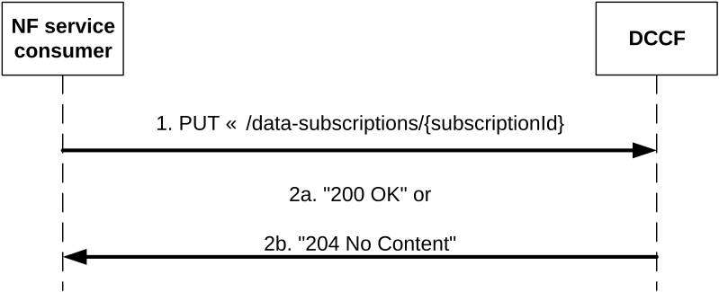

# 4.2.2.2.5 Update subscription for data notifications

Figure 4.2.2.2.5-1: NF service consumer updates subscription to data notifications

The NF service consumer (i.e. NWDAF) shall invoke the Ndccf_DataManagement_Subscribe service operation to update a subscription to data notifications. The NF service consumer shall send an HTTP PUT request with "{apiRoot}/ndccf-datamanagement/\<apiVersion\>/data-subscriptions/{subscriptionId}" as Resource URI, as shown in figure 4.2.2.2.5-1, step 1, to update the subscription for an "Individual DCCF Data Subscription" resource identified by the {subscriptionId}. The NdccfDataSubscription data structure provided in the request body shall include the same contents as described in clause 4.2.2.2.4.

Upon the reception of an HTTP PUT request with "{apiRoot}/ndccf-datamanagement/\<apiVersion\>/data-subscriptions/{subscriptionId}" as Resource URI and NdccfDataSubscription data structure as request body, the DCCF shall use the contents of the request to determine whether the updated subscription can already be served or interactions with the data sources (e.g. modification of event exposure subscriptions) are required. If the DCCF cannot use the contents of the request to determine this, the DCCF shall send an HTTP "400 Bad Request" error response including the "cause" attribute set to "SUBSCRIPTION_CANNOT_BE_SERVED".

NOTE 1: The "SUBSCRIPTION_CANNOT_BE_SERVED" error can occur, for example, when the request is syntactically valid and there is no DCCF internal error, but the DCCF can neither find an existing event exposure subscription nor construct one based on the received subscription contents.

If the user consent has not been checked by the NF service consumer and is required for the requested data collection depending on local policy and regulations, then the DCCF shall check user consent for the targeted UE(s) based on the user consent subscription data that is retrieved via the Nudm_SDM service API of the UDM as described in clause 5.2.2.24 and clause 6.1.3.32 of 3GPP TS 29.503 \[20\]. If the DCCF receive the response from the UDM that it is not granted for the impacted user(s), then the DCCF shall send an HTTP "403 Forbidden" error response including the "cause" attribute set to "USER_CONSENT_NOT_GRANTED".

NOTE 2: When the target of reporting is a SUPI or a GPSI then the subscription can be rejected, e.g. because user consent is not granted, and the error is sent to the consumer. When the target of reporting is an Internal Group Id, or a list of SUPIs/GPSI(s) or any UE, and the user consent is not granted for a subset of the impacted users, then no error is sent, but a subset of the SUPIs/GPSIs is skipped if user consent is not granted.

Otherwise, if the user consent subscription data retrieved from the UDM indicate that the user consent is granted for the impacted user(s), the DCCF shall subscribe to notification of changes of the user consent (unless it is already subscribed) by invoking the Nudm_SDM_Subscribe service operation by sending an HTTP POST request targeting the resource "SdmSubscriptions" to the UDM as described in clause 5.2.2.3 of 3GPP TS 29.503 \[20\].

If the DCCF determines that the updated subscription can already be served (without requiring further interactions with the data sources) or a successful response from the data source(s) is received for the creation or modification of subscription(s) to serve this subscription, the DCCF shall:

\- update the subscription of the corresponding subscriptionId; and

\- store the subscription.

If the DCCF successfully updated the "Individual DCCF Data Subscription" resource, the DCCF shall respond with:

a\) HTTP "200 OK" status code with the message body containing a representation of the updated subscription, as shown in figure 4.2.2.2.5-1, step 2a; If an immediate reporting indication is provided in the subscription, the DCCF shall include the reports of the events subscribed, if available, in the HTTP PUT response within the "dataSub" attribute, or, potentiallyE within the "immReport" attribute, if the DataAnaCollect feature is supported; or

b\) HTTP "204 No Content" status code, as shown in figure 4.2.2.2.5-1, step 2b.

When the notification flag of the "dataSub" attribute (e.g. the "notifFlag" attribute within the "eventsRepInfo" attribute in the case of AF events) is included in the request with the value "DEACTIVATE", the DCCF shall mute the event notification and store the available events until the NF service consumer requests to retrieve them by setting the notification flag attribute to "RETRIEVAL" or until a muting exception occurs (e.g. full buffer). When a muting exception occurs, if the EnhDataMgmt feature is supported, the DCCF may consider the contents of the muting instructions of the "dataSub" attribute (if provided; e.g. the "notifFlagInstruct" attribute within the "eventsRepInfo" attribute in the case of AF events) and/or local configuration to determine its actions; if the notification flag is set to the value "RETRIEVAL", the DCCF shall send the stored events to the NF service consumer, mute the event notification again and store available events; if the notification flag is set to the value "ACTIVATE" and the event notifications are muted (due to a previously received "DECATIVATE" value), the DCCF shall unmute the event notification, i.e. start sending again notifications for available events.

If the EnhDataMgmt feature is supported and the DCCF accepts the provided notification flag and muting instructions, it may indicate the applied muting notification settings in the response (e.g. within the "mutingSetting" attribute in the case of AF events). If the DCCF does not accept the provided notification flag and muting instructions, it shall send an HTTP "403 Forbidden" error response including the "cause" attribute set to "MUTING_INSTR_NOT_ACCEPTED".

If the DCCF receives storage handling information in the request but determines (e.g. based on local policy) that a different storage approach shall be followed, it indicates the determined storage approach to the consumer by setting accordingly the "storeHandl" attribute (e.g. providing a different lifetime, or setting the indication about deletion alerts to "false") in the message body of the response. When more than one consumer has requested storage lifetime for the same data, the storage approach should be based on the longest requested storage lifetime.

NOTE 3: The default operator policy for how long data is to be stored can be longer or shorter than the lifetime requested by the consumer. A default operator policy can for example accept only consumer requested lifetimes that are shorter or longer than the default policy.

If an error occurs when processing the HTTP PUT request, the DCCF shall send an HTTP error response as specified in clause 5.1.7.

If the DCCF determines the received HTTP PUT request needs to be redirected, the DCCF shall send an HTTP redirect response as specified in clause 6.10.9 of 3GPP TS 29.500 \[4\].
