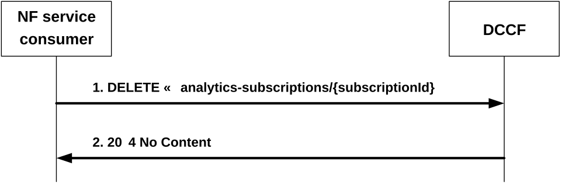
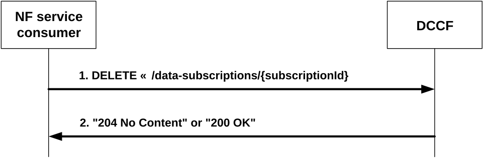

# 4.2.2.3 Ndccf_DataManagement_Unsubscribe service operation

## 4.2.2.3.1 General

The Ndccf_DataManagement_Unsubscribe service operation is used by an NF service consumer to remove a subscription for analytics or data notifications from the DCCF.

## 4.2.2.3.2 Unsubscribe from analytics notifications

Figure 4.2.2.3.2-1 shows a scenario where the NF service consumer sends a request to the DCCF to unsubscribe from analytics notifications.

Figure 4.2.2.3.2-1: NF service consumer unsubscribes from analytics notifications

The NF service consumer shall invoke the Ndccf_DataManagement_Unsubscribe service operation to unsubscribe from analytics notifications. The NF service consumer shall send an HTTP DELETE request with "{apiRoot}/ndccf-datamanagement /\<apiVersion\>/analytics-subscriptions/{subscriptionId}" as Resource URI representing an "Individual DCCF Analytics Subscription" resource, as shown in figure 4.2.2.3.2-1, step 1, where "{subscriptionId}" is the identifier of the existing analytics subscription that is to be deleted.

Upon the reception of an HTTP DELETE request with "{apiRoot}/ndccf-datamanagement/\<apiVersion\>/analytics-subscriptions /{subscriptionId}" as Resource URI, if the DCCF successfully processed and accepted the received HTTP DELETE request, the DCCF shall:

\- remove the corresponding subscription;

\- respond with HTTP "204 No Content" status.

If errors occur when processing the HTTP DELETE request, the DCCF shall send an HTTP error response as specified in clause 5.1.7.

If the DCCF determines the received HTTP DELETE request needs to be redirected, the DCCF shall send an HTTP redirect response as specified in clause 6.10.9 of 3GPP TS 29.500 \[4\].

## 4.2.2.3.3 Unsubscribe from data notifications

Figure 4.2.2.3.3-1 shows a scenario where the NF service consumer sends a request to the DCCF to unsubscribe from data notifications.

Figure 4.2.2.3.3-1: NF service consumer unsubscribes from data notifications

The NF service consumer shall invoke the Ndccf_DataManagement_Unsubscribe service operation to unsubscribe to data notifications. The NF service consumer shall send an HTTP DELETE request with "{apiRoot}/ndccf-datamanagement/\<apiVersion\>/data-subscriptions/{subscriptionId}" as Resource URI representing an "Individual DCCF Data Subscription" resource, as shown in figure 4.2.2.3.3-1, step 1, where "{subscriptionId}" is the identifier of the existing data subscription that is to be deleted.

Upon the reception of an HTTP DELETE request with "{apiRoot}/ndccf-datamanagement/\<apiVersion\>/data-subscriptions /{subscriptionId}" as Resource URI, if the DCCF successfully processed and accepted the received HTTP DELETE request, the DCCF shall:

\- remove the corresponding subscription;

\- respond to the NF service consumer:

\- with HTTP "204 No Content" status code if the "EnhDataMgmt" feature is not supported or no stored unsent data events to be included in the response; or

\- with HTTP "200 OK" status code if the "EnhDataMgmt" feature is supported and including the stored unsent data events in the NdccfDataSubscriptionNotification data type in the response.

If errors occur when processing the HTTP DELETE request, the DCCF shall send an HTTP error response as specified in clause 5.1.7.

If the DCCF determines the received HTTP DELETE request needs to be redirected, the DCCF shall send an HTTP redirect response as specified in clause 6.10.9 of 3GPP TS 29.500 \[4\].
