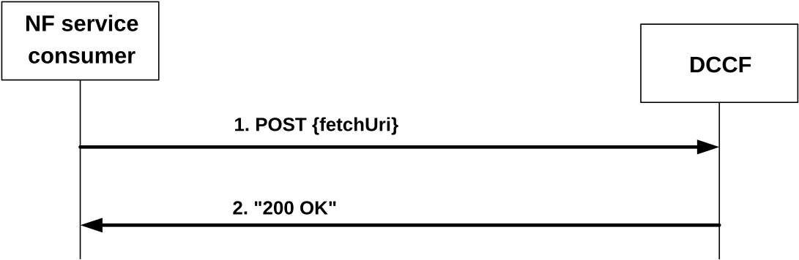

# 4.2.2.5 Ndccf_DataManagement_Fetch service operation

## 4.2.2.5.1 General

The Ndccf_DataManagement_Fetch service operation is used by an NF service consumer to retrieve analytics or data notifications indicated by fetch instructions from the DCCF.

## 4.2.2.5.2 Retrieve notified analytics and data

Figure 4.2.2.5.2-1 shows a scenario where the NF service consumer sends a request to the DCCF to retrieve notified analytics or data.

Figure 4.2.2.5.2-1: NF service consumer requesting to retrieve notified analytics or data

The NF service consumer shall invoke the Ndccf_DataManagement_Fetch service operation to retrieve notified analytics or data. The NF service consumer shall send an HTTP POST request to the URI "{fetchUri}" which was previously provided by the DCCF within a FetchInstruction data structure in a DCCF notification, as shown in figure 4.2.2.5.2-1, step 1, to request notified analytics or data from the DCCF.

The request body shall include fetch correlation identifiers, which were previously provided by the DCCF in the "fetchCorrIds" attribute within FetchInstruction data structure in the DCCF notification.

Upon the reception of the HTTP POST request, the DCCF shall:

\- find the analytics or data according to the request.

If requested analytics is found, the DCCF shall respond with "200 OK" status code with the message body containing the NdccfAnalyticsSubscriptionNotification data structure. The NdccfAnalyticsSubscriptionNotification data structure in the response body shall include the same contents as described in clause 4.2.2.4.2 with the difference that the "fetchInstruct" and "delAlert" attributes shall not be included.

If requested data is found, the DCCF shall respond with "200 OK" status code with the message body containing the NdccfDataSubscriptionNotification data structure. The NdccfDataSubscriptionNotification data structure in the response body shall include the same contents as described in clause 4.2.2.4.3 with the difference that the "fetchInstruct", "delAlert" and "newSubscriptionUri" attributes shall not be included.

If an error occurs when processing the HTTP POST request, the DCCF shall send an HTTP error response as specified in clause 5.1.7.

If the DCCF determines the received HTTP POST request needs to be redirected, the DCCF shall send an HTTP redirect response as specified in clause 6.10.9 of 3GPP TS 29.500 \[4\].
