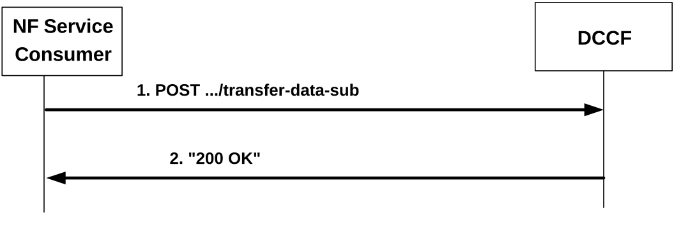

# 4.2.2.6 Ndccf_DataManagement_Transfer service operation

## 4.2.2.6.1 General

The Ndccf_DataManagement_Transfer service operation is used by NF service consumer to request the transfer of UE data subscription context to the target DCCF.

## 4.2.2.6.2 Request for UE data subscription context transfer

Figure 4.2.2.6.2-1 shows a scenario where the NF Service Consumer (i.e. DCCF) sends a request to the DCCF to request the transfer of UE data subscription context from the NF Service Consumer to the NF Service Producer.

Figure 4.2.2.6.2-1: NF service consumer requests a data subscription transfer

The NF Service Consumer shall invoke the Ndccf_DataManagement_Transfer service operation to request the transfer of UE data subscription context by sending an HTTP POST request to the "{apiRoot}/ndccf-datamanagement/\<apiVersion\>/transfer-data-sub" URI, as shown in figure 4.2.2.6.2-1, step 1. The contents of the NdccfDataSubscription data structure provided in the request body are as described in clause 4.2.2.2.4.

Upon the reception of an HTTP POST request to "{apiRoot}/ndccf-datamanagement/\<apiVersion\>/transfer-data-sub" with NdccfDataSubscription data structure as request body, in the successful case the DCCF shall create a new Individual DCCF Data Subscription resource for the transferred subscription and send an HTTP "200 OK" response with DataTransferResp data structure as the response body, as shown in figure 4.2.2.6.2-1, step 2. The DataTransferResp data structure in the response body shall include:

\- the URI of the created resource in the "newSubscriptionUri" attribute;

\- the features supported by both the data consumer and the target DCCF in the "suppFeat" attribute, if the NF service consumer included the"suppFeat" attribute in the POST request.

; The NF Service Consumer shall then notify the data consumer about the successful data subscription transfer as defined in clause 4.2.2.4.3, including the received URI of the created resource in the "newSubscriptionUri" attribute of the NdccfDataSubscriptionNotification data type and the received features supported both by the data consumer and the target DCCF in the "suppFeat" attribute.

If errors occur when processing the HTTP POST request, the DCCF shall send an HTTP error response as specified in clause 5.1.7

## 4.2.2.6.3 Void

## 4.2.2.6.4 Void
