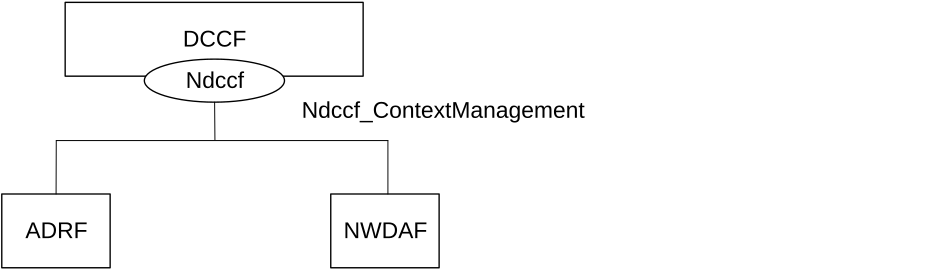
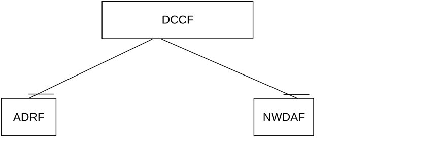
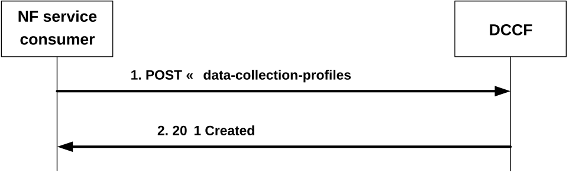
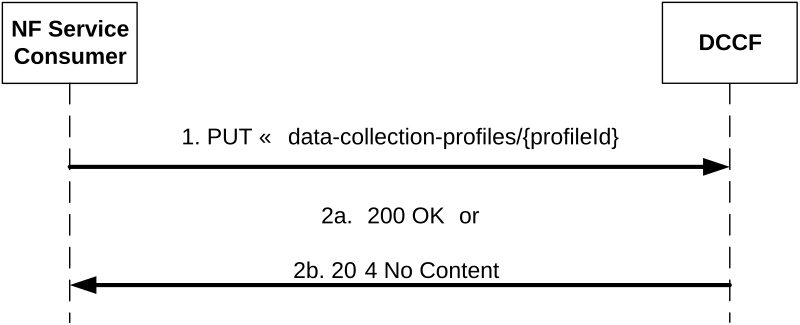
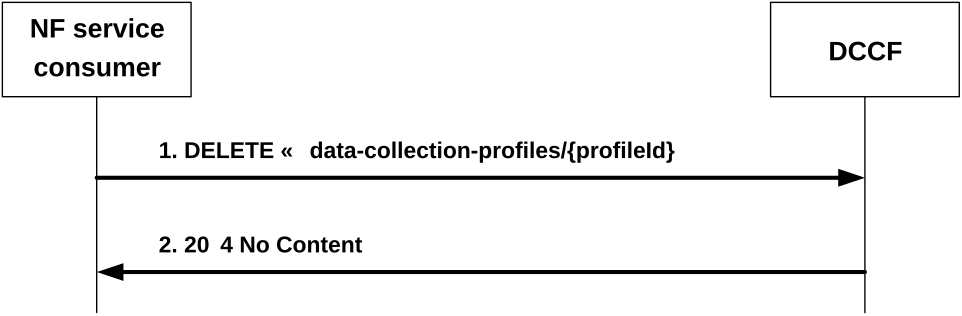

# 4.3 Ndccf_ContextManagement Service

## 4.3.1 Service Description

### 4.3.1.1 Overview

The Ndccf_ContextManagement service, as defined in 3GPP TS 23.288 \[14\], is provided by the Data Collection Coordination Function (DCCF).

This service:

\- allows NF service consumers to register, update or deregister the collected data or analytics information in the DCCF.

### 4.3.1.2 Service Architecture

The 5G System Architecture is defined in 3GPP TS 23.501 \[2\]. The Network Data Analytics Exposure architecture, including the DCCF architecture, is defined in 3GPP TS 23.288 \[14\].

Known consumers of the Ndccf_ContextManagement service are:

\- Network Data Analytics Function (NWDAF)

\- Analytics Data Repository Function (ADRF)

The Ndccf_ContextManagement service is provided by the DCCF and consumed by the NF service consumers (e.g. NWDAF, ADRF) as shown in figure 4.3.1.2-1 for the SBI representation model and in figure 4.3.1.2-2 for the reference point representation model.

Figure 4.3.1.2-1: Ndccf_ContextManagement service architecture, SBI representation

Figure 4.3.1.2-2: Ndccf_ContexManagement service architecture, reference point representation

### 4.3.1.3 Network Functions

#### 4.3.1.3.1 Data Collection Coordination Function (DCCF)

The DCCF (Data Collection Coordination Function) provides functionality to create, update, and delete data collection profiles.

#### 4.3.1.3.2 NF Service Consumers

The NWDAF and ADRF may register and/or update a data collection profile to the DCCF to enable data consumers to get the data which has been collected by NWDAF or ADRF directly (i.e. not via DCCF).

## 4.3.2 Service Operations

### 4.3.2.1 Introduction

Service operations defined for the Ndccf_ContextManagement Service are shown in table 4.3.2.1-1.

Table 4.3.2.1-1: Ndccf_ContextManagement Service Operations

| Service Operation Name             | Description                                                                                                          | Initiated by                      |
|------------------------------------|----------------------------------------------------------------------------------------------------------------------|-----------------------------------|
| Ndccf_ContextManagement_Register   | This service operation is used by an NF service consumer to register data or analytics it is collecting in the DCCF. | NF service consumer (NWDAF, ADRF) |
| Ndccf_ContextManagement_Update     | This service operation is used by an NF service consumer to update an existing data or analytics registration.       | NF service consumer (NWDAF, ADRF) |
| Ndccf_ContextManagement_Deregister | This service operation is used by an NF service consumer to delete an existing data or analytics registration.       | NF service consumer (NWDAF, ADRF) |

### 4.3.2.2 Ndccf_ContextManagement_Register service operation

#### 4.3.2.2.1 General

#### 4.3.2.2.2 Register data collection profile to DCCF

Figure 4.3.2.2.2-1 shows a scenario where the NF service consumer sends a request to the DCCF to register data or analytics it is collecting to the DCCF.

Figure 4.3.2.2.2-1: NF service consumer registers data collection profile

The NF service consumer shall invoke the Ndccf_ContextManagement_Register service operation to register data or analytics it is collecting to the DCCF. The NF service consumer shall send an HTTP POST request with "{apiRoot}/ndccf-contextmanagement/\<apiVersion\>/data-collection-profiles" as Resource URI representing the "DCCF Data Collection Profiles", as shown in figure 4.3.2.2.2-1, step 1, to create an "Individual DCCF Data Collection Profile" according to the information in the message body. The NdccfDataCollectionProfile data structure provided in the request body shall include:

\- one of the following data or analytics collection information:

\- analytics subscription information within the "anaSub" attribute;

\- data subscription information within the "dataSub" attribute, which contains one of the following:

\- AMF event exposure subscription within the "amfDataSub" attribute;

\- SMF event exposure subscription within the "smfDataSub" attribute;

\- UDM event exposure subscription within the "udmDataSub" attribute;

\- NEF event exposure subscription within the "nefDataSub" attribute;

\- AF event exposure subscription within the "afDataSub" attribute;

\- NRF event exposure subscription within the "nrfDataSub" attribute;

\- NSACF event exposure subscription within the "nsacfDataSub" attribute;

\- GMLC event exposure subscription within the "gmlcDataSub" attribute;

\- UPF event exposure subscription within the "upfDataSub" attribute, if the "UpEvents" feature is supported;

\- one of the following identifiers related to the NF service consumer:

\- NWDAF instance identifier within the "nwdafId" attribute;

\- ADRF instance identifier within the "adrfId" attribute;

\- NWDAF set identifier within the "nwdafSetId" attribute;

\- ADRF set identifier within the "adrfSetId" attribute;

Upon the reception of an HTTP POST request with "{apiRoot}/ndccf-contextmanagement/\<apiVersion\>/data-collection-profiles" as Resource URI and NdccfDataCollectionProfile data structure as request body, the DCCF shall:

\- create a new profile;

\- assign a profileId;

\- store the profile.

If the DCCF created an "Individual DCCF Data Collection Profile" resource, the DCCF shall respond with "201 Created" with the message body containing a representation of the created profile, as shown in figure 4.3.2.2.2-1, step 2. The DCCF shall include a Location HTTP header field. The Location header field shall contain the URI of the created profile, i.e. "{apiRoot}/ndccf-contextmanagement/\<apiVersion\>/data-collection-profiles/{profileId}".

If an error occurs when processing the HTTP POST request, the DCCF shall send an HTTP error response as specified in clause 5.2.7.

### 4.3.2.3 Ndccf_ContextManagement_Update service operation

#### 4.3.2.3.1 General

#### 4.3.2.3.2 Update registered data collection profile

Figure 4.3.2.3.2-1 shows a scenario where the NF service consumer sends a request to the DCCF to update a registration of a data collection profile to the DCCF.

Figure 4.3.2.3.2-1: NF service consumer updates registered data collection profile

The NF service consumer (e.g. NWDAF or ADRF) shall invoke the Ndccf_ContextManagement_Update service operation to update a registration of data or analytics collection to DCCF. The NF service consumer shall send an HTTP PUT request with "{apiRoot}/ndccf-contextmanagement/\<apiVersion\>/data-collection-profiles/{profileId}" as Resource URI, as shown in figure 4.3.2.3.2-1, step 1, to update the registration of data or analytics for an "Individual DCCF Data Collection Profile" resource identified by the {profileId}. The NdccfDataCollectionProfile data structure provided in the request body shall include the same contents as described in clause 4.3.2.2.

Upon the reception of an HTTP PUT request with "{apiRoot}/ndccf-contextmanagement/\<apiVersion\>/data-collection-profiles/{profileId}" as Resource URI and NdccfDataCollectionProfile data structure as request body, the DCCF shall:

\- update the profile of the corresponding profileId; and

\- store the profile.

If the DCCF successfully processed and accepted the received HTTP PUT request, the DCCF shall update an "Individual DCCF Data Collection Profile" resource, and shall respond with:

a\) HTTP "200 OK" status code with the message body containing a representation of the updated profile, as shown in figure 4.3.2.3.2-1, step 2a; or

b\) HTTP "204 No Content" status code, as shown in figure 4.3.2.3.2-1, step 2b.

If an error occurs when processing the HTTP PUT request, the DCCF shall send an HTTP error response as specified in clause 5.2.7.

If the DCCF determines the received HTTP PUT request needs to be redirected, the DCCF shall send an HTTP redirect response as specified in clause 6.10.9 of 3GPP TS 29.500 \[4\].

### 4.3.2.4 Ndccf_ContextManagement_Deregister service operation

#### 4.3.2.4.1 General

#### 4.3.2.4.2 Deregister Data collection profile

Figure 4.3.2.4.2-1 shows a scenario where the NF service consumer sends a request to the DCCF to delete a registration of data collection profile.

Figure 4.3.2.4.2-1: NF service consumer deregisters data collection profile

The NF service consumer shall invoke the Ndccf_ContextManagement_Deregister service operation to delete a registration of data or analytics collection profile to the DCCF. The NF service consumer shall send an HTTP DELETE request with "{apiRoot}/ndccf-contextmanagement/\<apiVersion\>/data-collection-profiles/{profileId}" as Resource URI representing an "Individual DCCF Data Collection Profile" resource, as shown in figure 4.3.2.4.2-1, step 1, where "{profileId}" is the identifier of the existing Data Collection Profile that is to be deleted.

Upon the reception of an HTTP DELETE request with "{apiRoot}/ndccf-contextmanagement/\<apiVersion\>/data-collection-profiles/{profileId}" as Resource URI, if the DCCF successfully processed and accepted the received HTTP DELETE request, the DCCF shall:

\- remove the corresponding registered profile;

\- respond with HTTP "204 No Content" status.

If errors occur when processing the HTTP DELETE request, the DCCF shall send an HTTP error response as specified in clause 5.2.7.

If the DCCF determines the received HTTP DELETE request needs to be redirected, the DCCF shall send an HTTP redirect response as specified in clause 6.10.9 of 3GPP TS 29.500 \[4\].
