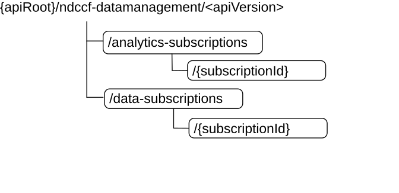

# 5.1.3 Resources

## 5.1.3.1 Overview

This clause describes the structure for the Resource URIs and the resources and methods used for the service.

Figure 5.1.3.1-1 depicts the resource URIs structure for the Ndccf_DataManagement API.

Figure 5.1.3.1-1: Resource URI structure of the Ndccf_DataManagement API

Table 5.1.3.1-1 provides an overview of the resources and applicable HTTP methods.

Table 5.1.3.1-1: Resources and methods overview

| Resource name                          | Resource URI                              | HTTP method or custom operation | Description                                                                       |
|----------------------------------------|-------------------------------------------|---------------------------------|-----------------------------------------------------------------------------------|
| DCCF Analytics Subscriptions           | /analytics-subscriptions                  | POST                            | Creates a new Individual DCCF Analytics Subscription resource.                    |
| Individual DCCF Analytics Subscription | /analytics-subscriptions/{subscriptionId} | PUT                             | Modifies an existing Individual DCCF Analytics Subscription resource.             |
|                                        |                                           | DELETE                          | Deletes an Individual DCCF Analytics Subscription identified by {subscriptionId}. |
| DCCF Data Subscriptions                | /data-subscriptions                       | POST                            | Creates a new Individual DCCF Data Subscription resource.                         |
| Individual DCCF Data Subscription      | /data-subscriptions/{subscriptionId}      | PUT                             | Modifies an existing DCCF Data Subscription resource.                             |
|                                        |                                           | DELETE                          | Deletes an Individual DCCF Data Subscription identified by {subscriptionId}.      |

## 5.1.3.2 Resource: DCCF Analytics Subscriptions

### 5.1.3.2.1 Description

The DCCF Analytics Subscriptions resource represents all Analytics subscriptions to the Ndccf_DataManagement Service at a given DCCF. The resource allows an NF service consumer to create a new Individual DCCF Analytics Subscription resource.

### 5.1.3.2.2 Resource Definition

Resource URI: **{apiRoot}/ndccf-datamanagement/\<apiVersion\>/analytics-subscriptions**

This resource shall support the resource URI variables defined in table 5.1.3.2.2-1.

Table 5.1.3.2.2-1: Resource URI variables for this resource

| Name    | Data type | Definition       |
|---------|-----------|------------------|
| apiRoot | string    | See clause 5.1.1 |

### 5.1.3.2.3 Resource Standard Methods

#### 5.1.3.2.3.1 POST

This method shall support the URI query parameters specified in table 5.1.3.2.3.1-1.

Table 5.1.3.2.3.1-1: URI query parameters supported by the POST method on this resource

|      |           |     |             |             |               |
|------|-----------|-----|-------------|-------------|---------------|
| Name | Data type | P   | Cardinality | Description | Applicability |
| n/a  |           |     |             |             |               |

This method shall support the request data structures specified in table 5.1.3.2.3.1-2 and the response data structures and response codes specified in table 5.1.3.2.3.1-3.

Table 5.1.3.2.3.1-2: Data structures supported by the POST Request Body on this resource

|                            |     |             |                                                                    |
|----------------------------|-----|-------------|--------------------------------------------------------------------|
| Data type                  | P   | Cardinality | Description                                                        |
| NdccfAnalyticsSubscription | M   | 1           | New Individual DCCF Analytics Subscription resource to be created. |

Table 5.1.3.2.3.1-3: Data structures supported by the POST Response Body on this resource

<table>
<colgroup>
<col style="width: 16%" />
<col style="width: 4%" />
<col style="width: 12%" />
<col style="width: 11%" />
<col style="width: 54%" />
</colgroup>
<tbody>
<tr class="odd">
<td>Data type</td>
<td>P</td>
<td>Cardinality</td>
<td>
Response

codes
</td>
<td>Description</td>
</tr>
<tr class="even">
<td>NdccfAnalyticsSubscription</td>
<td>M</td>
<td>1</td>
<td>201 Created</td>
<td>The creation of an Individual DCCF Analytics Subscription resource is confirmed and a representation of that resource is returned.</td>
</tr>
<tr class="odd">
<td>ProblemDetails</td>
<td>O</td>
<td>0..1</td>
<td>400 Bad Request</td>
<td>(NOTE 2)</td>
</tr>
<tr class="even">
<td>ProblemDetails</td>
<td>O</td>
<td>0..1</td>
<td>403 Forbidden</td>
<td>(NOTE 2)</td>
</tr>
<tr class="odd">
<td colspan="5">
NOTE 1: The mandatory HTTP error status code for the POST method listed in Table 5.2.7.1-1 of 3GPP TS 29.500 [4] also apply.

NOTE 2: Failure cases are described in clause 5.1.7.
</td>
</tr>
</tbody>
</table>

Table 5.1.3.2.3.1-4: Headers supported by the 201 response code on this resource

|          |           |     |             |                                                                                                                                                                    |
|----------|-----------|-----|-------------|--------------------------------------------------------------------------------------------------------------------------------------------------------------------|
| Name     | Data type | P   | Cardinality | Description                                                                                                                                                        |
| Location | string    | M   | 1           | Contains the URI of the newly created resource, according to the structure: {apiRoot}/ndccf-datamanagement/\<apiVersion\>/analytics-subscriptions/{subscriptionId} |

### 5.1.3.2.4 Resource Custom Operations

None in this release of the specification.

## 5.1.3.3 Resource: Individual DCCF Analytics Subscription

### 5.1.3.3.1 Description

The Individual DCCF Analytics Subscription resource represents a single Analytics Subscription to the Ndccf_DataManagement Service at a given DCCF.

### 5.1.3.3.2 Resource Definition

Resource URI: **{apiRoot}/ndccf-datamanagement/\<apiVersion\>/analytics-subscriptions/{subscriptionId}**

This resource shall support the resource URI variables defined in table 5.1.3.3.2-1.

Table 5.1.3.3.2-1: Resource URI variables for this resource

| Name           | Data type | Definition                                                               |
|----------------|-----------|--------------------------------------------------------------------------|
| apiRoot        | string    | See clause 5.1.1                                                         |
| subscriptionId | string    | Identifies an analytics subscription to the Ndccf_DataManagement Service |

### 5.1.3.3.3 Resource Standard Methods

#### 5.1.3.3.3.1 PUT

This method shall support the URI query parameters specified in table 5.1.3.3.3.1-1.

Table 5.1.3.3.3.1-1: URI query parameters supported by the PUT method on this resource

|      |           |     |             |             |               |
|------|-----------|-----|-------------|-------------|---------------|
| Name | Data type | P   | Cardinality | Description | Applicability |
| n/a  |           |     |             |             |               |

This method shall support the request data structures specified in table 5.1.3.3.3.1-2 and the response data structures and response codes specified in table 5.1.3.3.3.1-3.

Table 5.1.3.3.3.1-2: Data structures supported by the PUT Request Body on this resource

| Data type                  | P   | Cardinality | Description                                                                   |
|----------------------------|-----|-------------|-------------------------------------------------------------------------------|
| NdccfAnalyticsSubscription | M   | 1           | Parameters to replace a subscription to DCCF Analytics Subscription resource. |

Table 5.1.3.3.3.1-3: Data structures supported by the PUT Response Body on this resource

<table>
<colgroup>
<col style="width: 16%" />
<col style="width: 4%" />
<col style="width: 12%" />
<col style="width: 11%" />
<col style="width: 54%" />
</colgroup>
<tbody>
<tr class="odd">
<td>Data type</td>
<td>P</td>
<td>Cardinality</td>
<td>
Response

codes
</td>
<td>Description</td>
</tr>
<tr class="even">
<td>NdccfAnalyticsSubscription</td>
<td>M</td>
<td>1</td>
<td>200 OK</td>
<td>The Individual DCCF Analytics Subscription resource was modified successfully and a representation of that resource is returned.</td>
</tr>
<tr class="odd">
<td>n/a</td>
<td></td>
<td></td>
<td>204 No Content</td>
<td>The Individual DCCF Analytics Subscription resource was modified successfully.</td>
</tr>
<tr class="even">
<td>RedirectResponse</td>
<td>O</td>
<td>0..1</td>
<td>307 Temporary Redirect</td>
<td>
Temporary redirection, during Individual DCCF Analytics Subscription modification. .

(NOTE 3)
</td>
</tr>
<tr class="odd">
<td>RedirectResponse</td>
<td>O</td>
<td>0..1</td>
<td>308 Permanent Redirect</td>
<td>
Permanent redirection, during Individual DCCF Analytics Subscription modification.

(NOTE 3)
</td>
</tr>
<tr class="even">
<td>ProblemDetails</td>
<td>O</td>
<td>0..1</td>
<td>400 Bad Request</td>
<td>(NOTE 2)</td>
</tr>
<tr class="odd">
<td>ProblemDetails</td>
<td>O</td>
<td>0..1</td>
<td>403 Forbidden</td>
<td>(NOTE 2)</td>
</tr>
<tr class="even">
<td colspan="5">
NOTE 1: The mandatory HTTP error status code for the PUT method listed in Table 5.2.7.1-1 of 3GPP TS 29.500 [4] also apply.

NOTE 2: Failure cases are described in clause 5.1.7.

NOTE 3: The RedirectResponse data structure may be provided by an SCP (cf. clause 6.10.9.1 of 3GPP TS 29.500 [4]).
</td>
</tr>
</tbody>
</table>

Table 5.1.3.3.3.1-4: Headers supported by the 307 Response Code on this resource

<table>
<colgroup>
<col style="width: 16%" />
<col style="width: 14%" />
<col style="width: 4%" />
<col style="width: 11%" />
<col style="width: 52%" />
</colgroup>
<tbody>
<tr class="odd">
<td>Name</td>
<td>Data type</td>
<td>P</td>
<td>Cardinality</td>
<td>Description</td>
</tr>
<tr class="even">
<td>Location</td>
<td>string</td>
<td>M</td>
<td>1</td>
<td>
Contains an alternative URI of the resource located in an alternative DCCF (service) instance towards which the request is redirected.

For the case where the request is redirected to the same target via a different SCP, refer to clause 6.10.9.1 of 3GPP TS 29.500 [4].
</td>
</tr>
<tr class="odd">
<td>3gpp-Sbi-Target-Nf-Id</td>
<td>string</td>
<td>O</td>
<td>0..1</td>
<td>Identifier of the target DCCF (service) instance towards which the request is redirected.</td>
</tr>
</tbody>
</table>

Table 5.1.3.3.3.1-5: Headers supported by the 308 Response Code on this resource

<table>
<colgroup>
<col style="width: 16%" />
<col style="width: 14%" />
<col style="width: 4%" />
<col style="width: 11%" />
<col style="width: 52%" />
</colgroup>
<tbody>
<tr class="odd">
<td>Name</td>
<td>Data type</td>
<td>P</td>
<td>Cardinality</td>
<td>Description</td>
</tr>
<tr class="even">
<td>Location</td>
<td>string</td>
<td>M</td>
<td>1</td>
<td>
Contains an alternative URI of the resource located in an alternative DCCF (service) instance towards which the request is redirected.

For the case where the request is redirected to the same target via a different SCP, refer to clause 6.10.9.1 of 3GPP TS 29.500 [4].
</td>
</tr>
<tr class="odd">
<td>3gpp-Sbi-Target-Nf-Id</td>
<td>string</td>
<td>O</td>
<td>0..1</td>
<td>Identifier of the target DCCF (service) instance towards which the request is redirected.</td>
</tr>
</tbody>
</table>

#### 5.1.3.3.3.2 DELETE

This method shall support the URI query parameters specified in table 5.1.3.3.3.2-1.

Table 5.1.3.3.3.2-1: URI query parameters supported by the DELETE method on this resource

|      |           |     |             |             |               |
|------|-----------|-----|-------------|-------------|---------------|
| Name | Data type | P   | Cardinality | Description | Applicability |
| n/a  |           |     |             |             |               |

This method shall support the request data structures specified in table 5.1.3.3.3.2-2 and the response data structures and response codes specified in table 5.1.3.3.3.2-3.

Table 5.1.3.3.3.2-2: Data structures supported by the DELETE Request Body on this resource

| Data type | P   | Cardinality | Description |
|-----------|-----|-------------|-------------|
| n/a       |     |             |             |

Table 5.1.3.3.3.2-3: Data structures supported by the DELETE Response Body on this resource

<table>
<colgroup>
<col style="width: 16%" />
<col style="width: 4%" />
<col style="width: 12%" />
<col style="width: 11%" />
<col style="width: 54%" />
</colgroup>
<tbody>
<tr class="odd">
<td>Data type</td>
<td>P</td>
<td>Cardinality</td>
<td>
Response

codes
</td>
<td>Description</td>
</tr>
<tr class="even">
<td>n/a</td>
<td></td>
<td></td>
<td>204 No Content</td>
<td>The Individual DCCF Analytics Subscription resource was deleted successfully.</td>
</tr>
<tr class="odd">
<td>RedirectResponse</td>
<td>O</td>
<td>0..1</td>
<td>307 Temporary Redirect</td>
<td>
Temporary redirection, during Individual DCCF Analytics Subscription deletion.

(NOTE 2).
</td>
</tr>
<tr class="even">
<td>RedirectResponse</td>
<td>O</td>
<td>0..1</td>
<td>308 Permanent Redirect</td>
<td>
Permanent redirection, during Individual DCCF Analytics Subscription deletion.

(NOTE 2)
</td>
</tr>
<tr class="odd">
<td colspan="5">
NOTE 1: The mandatory HTTP error status code for the DELETE method listed in Table 5.2.7.1-1 of 3GPP TS 29.500 [4] also apply.

NOTE 2: The RedirectResponse data structure may be provided by an SCP (cf. clause 6.10.9.1 of 3GPP TS 29.500 [4]).
</td>
</tr>
</tbody>
</table>

Table 5.1.3.3.3.2-4: Headers supported by the 307 Response Code on this resource

<table>
<colgroup>
<col style="width: 16%" />
<col style="width: 14%" />
<col style="width: 4%" />
<col style="width: 11%" />
<col style="width: 52%" />
</colgroup>
<tbody>
<tr class="odd">
<td>Name</td>
<td>Data type</td>
<td>P</td>
<td>Cardinality</td>
<td>Description</td>
</tr>
<tr class="even">
<td>Location</td>
<td>string</td>
<td>M</td>
<td>1</td>
<td>
Contains an alternative URI of the resource located in an alternative DCCF (service) instance towards which the request is redirected.

For the case where the request is redirected to the same target via a different SCP, refer to clause 6.10.9.1 of 3GPP TS 29.500 [4].
</td>
</tr>
<tr class="odd">
<td>3gpp-Sbi-Target-Nf-Id</td>
<td>string</td>
<td>O</td>
<td>0..1</td>
<td>Identifier of the target DCCF (service) instance towards which the request is redirected.</td>
</tr>
</tbody>
</table>

Table 5.1.3.3.3.2-5: Headers supported by the 308 Response Code on this resource

<table>
<colgroup>
<col style="width: 16%" />
<col style="width: 14%" />
<col style="width: 4%" />
<col style="width: 11%" />
<col style="width: 52%" />
</colgroup>
<tbody>
<tr class="odd">
<td>Name</td>
<td>Data type</td>
<td>P</td>
<td>Cardinality</td>
<td>Description</td>
</tr>
<tr class="even">
<td>Location</td>
<td>string</td>
<td>M</td>
<td>1</td>
<td>
Contains an alternative URI of the resource located in an alternative DCCF (service) instance towards which the request is redirected.

For the case where the request is redirected to the same target via a different SCP, refer to clause 6.10.9.1 of 3GPP TS 29.500 [4].
</td>
</tr>
<tr class="odd">
<td>3gpp-Sbi-Target-Nf-Id</td>
<td>string</td>
<td>O</td>
<td>0..1</td>
<td>Identifier of the target DCCF (service) instance towards which the request is redirected.</td>
</tr>
</tbody>
</table>

### 5.1.3.3.4 Resource Custom Operations

None in this release of the specification.

## 5.1.3.4 Resource: DCCF Data Subscriptions

### 5.1.3.4.1 Description

The DCCF Data Subscriptions resource represents all data subscriptions to the Ndccf_DataManagement Service at a given DCCF. The resource allows an NF service consumer to create a new Individual DCCF Data Subscription resource.

### 5.1.3.4.2 Resource Definition

Resource URI: **{apiRoot}/ndccf-datamanagement/\<apiVersion\>/data-subscriptions**

This resource shall support the resource URI variables defined in table 5.1.3.4.2-1.

Table 5.1.3.3.2-1: Resource URI variables for this resource

| Name    | Data type | Definition       |
|---------|-----------|------------------|
| apiRoot | string    | See clause 5.1.1 |

### 5.1.3.4.3 Resource Standard Methods

#### 5.1.3.4.3.1 POST

This method shall support the URI query parameters specified in table 5.1.3.4.3.1-1.

Table 5.1.3.4.3.1-1: URI query parameters supported by the POST method on this resource

|      |           |     |             |             |               |
|------|-----------|-----|-------------|-------------|---------------|
| Name | Data type | P   | Cardinality | Description | Applicability |
| n/a  |           |     |             |             |               |

This method shall support the request data structures specified in table 5.1.3.4.3.1-2 and the response data structures and response codes specified in table 5.1.3.4.3.1-3.

Table 5.1.3.4.3.1-2: Data structures supported by the POST Request Body on this resource

| Data type             | P   | Cardinality | Description                                               |
|-----------------------|-----|-------------|-----------------------------------------------------------|
| NdccfDataSubscription | M   | 1           | Individual DCCF Data Subscription resource to be created. |

Table 5.1.3.4.3.1-3: Data structures supported by the POST Response Body on this resource

<table>
<colgroup>
<col style="width: 16%" />
<col style="width: 4%" />
<col style="width: 12%" />
<col style="width: 11%" />
<col style="width: 54%" />
</colgroup>
<tbody>
<tr class="odd">
<td>Data type</td>
<td>P</td>
<td>Cardinality</td>
<td>
Response

codes
</td>
<td>Description</td>
</tr>
<tr class="even">
<td>NdccfDataSubscription</td>
<td>M</td>
<td>1</td>
<td>201 Created</td>
<td>The creation of an Individual DCCF Data Subscription resource is confirmed and a representation of that resource is returned.</td>
</tr>
<tr class="odd">
<td>ProblemDetails</td>
<td>O</td>
<td>0..1</td>
<td>400 Bad Request</td>
<td>(NOTE 2)</td>
</tr>
<tr class="even">
<td>ProblemDetails</td>
<td>O</td>
<td>0..1</td>
<td>403 Forbidden</td>
<td>(NOTE 2)</td>
</tr>
<tr class="odd">
<td colspan="5">
NOTE 1: The mandatory HTTP error status code for the POST method listed in Table 5.2.7.1-1 of 3GPP TS 29.500 [4] also apply.

NOTE 2: Failure cases are described in clause 5.1.7.
</td>
</tr>
</tbody>
</table>

Table 5.1.3.4.3.1-4: Headers supported by the 201 response code on this resource

|          |           |     |             |                                                                                                                                                               |
|----------|-----------|-----|-------------|---------------------------------------------------------------------------------------------------------------------------------------------------------------|
| Name     | Data type | P   | Cardinality | Description                                                                                                                                                   |
| Location | string    | M   | 1           | Contains the URI of the newly created resource, according to the structure: {apiRoot}/ndccf-datamanagement/\<apiVersion\>/data-subscriptions/{subscriptionId} |

### 5.1.3.4.4 Resource Custom Operations

None in this release of the specification.

## 5.1.3.5 Resource: Individual DCCF Data Subscription

### 5.1.3.5.1 Description

The Individual DCCF Data Subscription resource represents a single data subscription to the Ndccf_DataManagement Service at a given DCCF.

### 5.1.3.5.2 Resource Definition

Resource URI: **{apiRoot}/ndccf-datamanagement/\<apiVersion\>/data-subscriptions/{subscriptionId}**

This resource shall support the resource URI variables defined in table 5.1.3.5.2-1.

Table 5.1.3.5.2-1: Resource URI variables for this resource

| Name           | Data type | Definition                                                         |
|----------------|-----------|--------------------------------------------------------------------|
| apiRoot        | string    | See clause 5.1.1                                                   |
| subscriptionId | string    | Identifies a data subscription to the Ndccf_DataManagement Service |

### 5.1.3.5.3 Resource Standard Methods

#### 5.1.3.5.3.1 PUT

This method shall support the URI query parameters specified in table 5.1.3.5.3.1-1.

Table 5.1.3.5.3.1-1: URI query parameters supported by the PUT method on this resource

|      |           |     |             |             |               |
|------|-----------|-----|-------------|-------------|---------------|
| Name | Data type | P   | Cardinality | Description | Applicability |
| n/a  |           |     |             |             |               |

This method shall support the request data structures specified in table 5.1.3.5.3.1-2 and the response data structures and response codes specified in table 5.1.3.5.3.1-3.

Table 5.1.3.5.3.1-2: Data structures supported by the PUT Request Body on this resource

| Data type             | P   | Cardinality | Description                                                              |
|-----------------------|-----|-------------|--------------------------------------------------------------------------|
| NdccfDataSubscription | M   | 1           | Parameters to replace a subscription to DCCF Data Subscription resource. |

Table 5.1.3.5.3.1-3: Data structures supported by the PUT Response Body on this resource

<table>
<colgroup>
<col style="width: 16%" />
<col style="width: 4%" />
<col style="width: 12%" />
<col style="width: 11%" />
<col style="width: 54%" />
</colgroup>
<tbody>
<tr class="odd">
<td>Data type</td>
<td>P</td>
<td>Cardinality</td>
<td>
Response

codes
</td>
<td>Description</td>
</tr>
<tr class="even">
<td>NdccfDataSubscription</td>
<td>M</td>
<td>1</td>
<td>200 OK</td>
<td>The Individual DCCF Data Subscription resource was modified successfully and a representation of that resource is returned.</td>
</tr>
<tr class="odd">
<td>n/a</td>
<td></td>
<td></td>
<td>204 No Content</td>
<td>The Individual DCCF Data Subscription resource was modified successfully.</td>
</tr>
<tr class="even">
<td>RedirectResponse</td>
<td>O</td>
<td>0..1</td>
<td>307 Temporary Redirect</td>
<td>
Temporary redirection, during Individual DCCF Data Subscription modification.

(NOTE 3)
</td>
</tr>
<tr class="odd">
<td>RedirectResponse</td>
<td>O</td>
<td>0..1</td>
<td>308 Permanent Redirect</td>
<td>
Permanent redirection, during Individual DCCF Data Subscription modification.

(NOTE 3)
</td>
</tr>
<tr class="even">
<td>ProblemDetails</td>
<td>O</td>
<td>0..1</td>
<td>400 Bad Request</td>
<td>(NOTE 2)</td>
</tr>
<tr class="odd">
<td>ProblemDetails</td>
<td>O</td>
<td>0..1</td>
<td>403 Forbidden</td>
<td>(NOTE 2)</td>
</tr>
<tr class="even">
<td colspan="5">
NOTE 1: The mandatory HTTP error status code for the PUT method listed in Table 5.2.7.1-1 of 3GPP TS 29.500 [4] also apply.

NOTE 2: Failure cases are described in clause 5.1.7.

NOTE 3: The RedirectResponse data structure may be provided by an SCP (cf. clause 6.10.9.1 of 3GPP TS 29.500 [4]).
</td>
</tr>
</tbody>
</table>

Table 5.1.3.5.3.1-4: Headers supported by the 307 Response Code on this resource

<table>
<colgroup>
<col style="width: 16%" />
<col style="width: 14%" />
<col style="width: 4%" />
<col style="width: 11%" />
<col style="width: 52%" />
</colgroup>
<tbody>
<tr class="odd">
<td>Name</td>
<td>Data type</td>
<td>P</td>
<td>Cardinality</td>
<td>Description</td>
</tr>
<tr class="even">
<td>Location</td>
<td>string</td>
<td>M</td>
<td>1</td>
<td>
Contains an alternative URI of the resource located in an alternative DCCF (service) instance towards which the request is redirected.

For the case where the request is redirected to the same target via a different SCP, refer to clause 6.10.9.1 of 3GPP TS 29.500 [4].
</td>
</tr>
<tr class="odd">
<td>3gpp-Sbi-Target-Nf-Id</td>
<td>string</td>
<td>O</td>
<td>0..1</td>
<td>Identifier of the target DCCF (service) instance towards which the request is redirected.</td>
</tr>
</tbody>
</table>

Table 5.1.3.5.3.1-5: Headers supported by the 308 Response Code on this resource

<table>
<colgroup>
<col style="width: 16%" />
<col style="width: 14%" />
<col style="width: 4%" />
<col style="width: 11%" />
<col style="width: 52%" />
</colgroup>
<tbody>
<tr class="odd">
<td>Name</td>
<td>Data type</td>
<td>P</td>
<td>Cardinality</td>
<td>Description</td>
</tr>
<tr class="even">
<td>Location</td>
<td>string</td>
<td>M</td>
<td>1</td>
<td>
Contains an alternative URI of the resource located in an alternative DCCF (service) instance towards which the request is redirected.

For the case where the request is redirected to the same target via a different SCP, refer to clause 6.10.9.1 of 3GPP TS 29.500 [4].
</td>
</tr>
<tr class="odd">
<td>3gpp-Sbi-Target-Nf-Id</td>
<td>string</td>
<td>O</td>
<td>0..1</td>
<td>Identifier of the target DCCF (service) instance towards which the request is redirected.</td>
</tr>
</tbody>
</table>

#### 5.1.3.5.3.2 DELETE

This method shall support the URI query parameters specified in table 5.1.3.5.3.2-1.

Table 5.1.3.5.3.2-1: URI query parameters supported by the DELETE method on this resource

|      |           |     |             |             |               |
|------|-----------|-----|-------------|-------------|---------------|
| Name | Data type | P   | Cardinality | Description | Applicability |
| n/a  |           |     |             |             |               |

This method shall support the request data structures specified in table 5.1.3.5.3.2-2 and the response data structures and response codes specified in table 5.1.3.5.3.2-3.

Table 5.1.3.5.3.2-2: Data structures supported by the DELETE Request Body on this resource

| Data type | P   | Cardinality | Description |
|-----------|-----|-------------|-------------|
| n/a       |     |             |             |

Table 5.1.3.5.3.2-3: Data structures supported by the PUT Response Body on this resource

<table>
<colgroup>
<col style="width: 16%" />
<col style="width: 4%" />
<col style="width: 12%" />
<col style="width: 11%" />
<col style="width: 54%" />
</colgroup>
<tbody>
<tr class="odd">
<td>Data type</td>
<td>P</td>
<td>Cardinality</td>
<td>
Response

codes
</td>
<td>Description</td>
</tr>
<tr class="even">
<td>n/a</td>
<td></td>
<td></td>
<td>204 No Content</td>
<td>The Individual DCCF Data Subscription resource was deleted successfully.</td>
</tr>
<tr class="odd">
<td>NdccfDataSubscriptionNotification</td>
<td>C</td>
<td>0..1</td>
<td>200 OK</td>
<td>Successful case: The Individual NWDAF Data Management Subscription resource matching the subscriptionId was deleted and including the stored unsent data events in the response.</td>
</tr>
<tr class="even">
<td>RedirectResponse</td>
<td>O</td>
<td>0..1</td>
<td>307 Temporary Redirect</td>
<td>
Temporary redirection, during Individual DCCF Data Subscription deletion.

(NOTE 2)
</td>
</tr>
<tr class="odd">
<td>RedirectResponse</td>
<td>O</td>
<td>0..1</td>
<td>308 Permanent Redirect</td>
<td>
Permanent redirection, during Individual DCCF Data Subscription deletion.

(NOTE 2)
</td>
</tr>
<tr class="even">
<td colspan="5">
NOTE 1: The mandatory HTTP error status code for the DELETE method listed in Table 5.2.7.1-1 of 3GPP TS 29.500 [4] also apply.

NOTE 2: The RedirectResponse data structure may be provided by an SCP (cf. clause 6.10.9.1 of 3GPP TS 29.500 [4]).
</td>
</tr>
</tbody>
</table>

Table 5.1.3.5.3.2-4: Headers supported by the 307 Response Code on this resource

<table>
<colgroup>
<col style="width: 16%" />
<col style="width: 14%" />
<col style="width: 4%" />
<col style="width: 11%" />
<col style="width: 52%" />
</colgroup>
<tbody>
<tr class="odd">
<td>Name</td>
<td>Data type</td>
<td>P</td>
<td>Cardinality</td>
<td>Description</td>
</tr>
<tr class="even">
<td>Location</td>
<td>string</td>
<td>M</td>
<td>1</td>
<td>
Contains an alternative URI of the resource located in an alternative DCCF (service) instance towards which the request is redirected.

For the case where the request is redirected to the same target via a different SCP, refer to clause 6.10.9.1 of 3GPP TS 29.500 [4].
</td>
</tr>
<tr class="odd">
<td>3gpp-Sbi-Target-Nf-Id</td>
<td>string</td>
<td>O</td>
<td>0..1</td>
<td>Identifier of the target DCCF (service) instance towards which the request is redirected.</td>
</tr>
</tbody>
</table>

Table 5.1.3.5.3.2-5: Headers supported by the 308 Response Code on this resource

<table>
<colgroup>
<col style="width: 16%" />
<col style="width: 14%" />
<col style="width: 4%" />
<col style="width: 11%" />
<col style="width: 52%" />
</colgroup>
<tbody>
<tr class="odd">
<td>Name</td>
<td>Data type</td>
<td>P</td>
<td>Cardinality</td>
<td>Description</td>
</tr>
<tr class="even">
<td>Location</td>
<td>string</td>
<td>M</td>
<td>1</td>
<td>
Contains an alternative URI of the resource located in an alternative DCCF (service) instance towards which the request is redirected.

For the case where the request is redirected to the same target via a different SCP, refer to clause 6.10.9.1 of 3GPP TS 29.500 [4].
</td>
</tr>
<tr class="odd">
<td>3gpp-Sbi-Target-Nf-Id</td>
<td>string</td>
<td>O</td>
<td>0..1</td>
<td>Identifier of the target DCCF (service) instance towards which the request is redirected.</td>
</tr>
</tbody>
</table>

### 5.1.3.5.4 Resource Custom Operations

None in this release of the specification.

## 5.1.3.6 Void

## 5.1.3.7 Void
